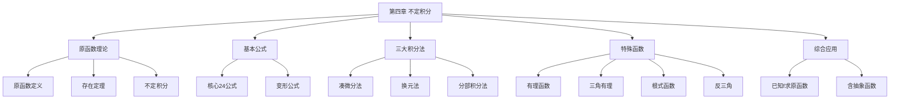

# 第四章 不定积分

> **本章地位**：定积分的"前置技能"——不定积分是导数的逆运算，是计算定积分、反常积分的基础。  
> **考纲分值**：直接考查约 4-6 分（1-2 道选填），间接渗透全卷 30+ 分（定积分计算）。  
> **核心主线**：原函数存在性 → 基本积分公式 → 三大积分法（凑微分、换元、分部）→ 三类常见函数积分 → 综合应用。  
> **学习目标**：熟背 20+ 基本公式，掌握 3 大积分法，识别 7 类函数积分技巧。

---

## 第一节 原函数与不定积分

### 1.1 原函数的定义

> 设 $f(x)$ 定义在区间 $I$ 上，若存在可导函数 $F(x)$，使 $\forall x \in I$：
> $$ F'(x) = f(x) \quad (\text{或 } dF(x) = f(x)dx) $$
> 则称 $F(x)$ 是 $f(x)$ 在 $I$ 上的一个**原函数**。

**关键问题**：什么情况下 $f$ 一定有原函数？

> 1. **连续函数必有原函数**：若 $f$ 在 $I$ 上连续，则 $f$ 在 $I$ 上必有原函数
> 2. **可去 / 跳跃间断点处无原函数**：含第一类间断点的函数**没有**原函数
> 3. **含第二类（无穷）间断点**可能**有**原函数（如 $f(x) = 1/x$ 在 $(0, +\infty)$ 上有原函数 $\ln x$）

> 1. **初等函数在定义区间上连续 $\Rightarrow$ 必有原函数**
> 2. **含第一类间断点 $\Rightarrow$ 无原函数**
> 3. **判定方法**：$F'(x_0) = f(x_0)$ 的极限**必须存在**（即 $F$ 在 $x_0$ 可导），而**有界振荡型**间断点可积但**不可导**

### 1.2 不定积分的定义

> $f(x)$ 在区间 $I$ 上的**全体原函数**称为 $f$ 的不定积分，记作
> $$ \int f(x) dx $$
> 若 $F$ 是 $f$ 的一个原函数，则
> $$ \int f(x) dx = F(x) + C, \quad C \in \mathbb{R} \text{ 为任意常数} $$

**理解**：
- 不定积分 = 原函数族（**必须** + $C$）
- $C$ 是任意常数，**不写 $C$ 必扣分**
- $F + C$ 内部**线性**无关（即 $F$ 的原函数可加可减常数 $C$）

### 1.3 不定积分的性质

> 
> 1. **线性性质**：
>    $$ \int [af(x) + bg(x)] dx = a\int f(x) dx + b\int g(x) dx, \quad a, b \in \mathbb{R} $$
> 2. **导数还原**：
>    $$ \frac{d}{dx} \int f(x) dx = f(x), \quad d\int f(x) dx = f(x)dx $$
> 3. **积分还原**：
>    $$ \int F'(x) dx = F(x) + C $$
> 4. **奇偶性**：
>    - $\int f(x) dx$ 的原函数若为奇函数，则 $f$ 为**偶函数**
>    - $\int f(x) dx$ 的原函数若为偶函数，则 $f$ 为**奇函数**（此时 $C = 0$）

---

## 第二节 基本积分公式 ⭐⭐⭐

### 2.1 核心公式（必背）

> 
> 1. $\int k dx = kx + C$
> 2. $\int x^\alpha dx = \frac{x^{\alpha+1}}{\alpha+1} + C$（$\alpha \neq -1$）
> 3. $\int \frac{1}{x} dx = \ln|x| + C$
> 4. $\int a^x dx = \frac{a^x}{\ln a} + C$（$a > 0, a \neq 1$）
> 5. $\int e^x dx = e^x + C$
> 6. $\int \sin x dx = -\cos x + C$
> 7. $\int \cos x dx = \sin x + C$
> 8. $\int \sec^2 x dx = \tan x + C$
> 9. $\int \csc^2 x dx = -\cot x + C$
> 10. $\int \sec x \tan x dx = \sec x + C$
> 11. $\int \csc x \cot x dx = -\csc x + C$
> 12. $\int \frac{1}{\sqrt{1-x^2}} dx = \arcsin x + C$
> 13. $\int \frac{1}{1+x^2} dx = \arctan x + C$
> 14. $\int \frac{1}{|x|\sqrt{x^2-1}} dx = \text{arcsec}\, x + C$
> 15. $\int \sinh x dx = \cosh x + C$
> 16. $\int \cosh x dx = \sinh x + C$

### 2.2 重要变形公式

> 
> 1. $\int \frac{1}{a^2 + x^2} dx = \frac{1}{a}\arctan \frac{x}{a} + C$
> 2. $\int \frac{1}{\sqrt{a^2 - x^2}} dx = \arcsin \frac{x}{a} + C$（$a > 0$）
> 3. $\int \frac{1}{x^2 - a^2} dx = \frac{1}{2a}\ln\left|\frac{x-a}{x+a}\right| + C$（部分分式）
> 4. $\int \frac{1}{\sqrt{x^2 + a^2}} dx = \ln\left|x + \sqrt{x^2+a^2}\right| + C$
> 5. $\int \frac{1}{\sqrt{x^2 - a^2}} dx = \ln\left|x + \sqrt{x^2-a^2}\right| + C$（$|x| > a > 0$）
> 6. $\int \sqrt{a^2 - x^2} dx = \frac{x}{2}\sqrt{a^2 - x^2} + \frac{a^2}{2}\arcsin \frac{x}{a} + C$

> - "$\sqrt{a^2 \pm x^2}$" 配 "$\ln|x + \sqrt{}|$"
> - "$\sqrt{a^2 - x^2}$" 配 "$\arcsin \frac{x}{a}$"
> - "$a^2 \pm x^2$" 配 "$\arctan \frac{x}{a}$"
> - "$x^2 - a^2$" 配 "$\ln|\frac{x-a}{x+a}|$"

---

## 第三节 三大积分法 ⭐⭐⭐

### 3.1 凑微分法（第一类换元法）

> 
> 思想：$\int g[\varphi(x)] \varphi'(x) dx = \int g(u) du$（令 $u = \varphi(x)$）
> 
> 即把 $\varphi'(x)dx$ 凑成 $du$。

> 
> | 原式 | 凑成 | 结果 |
> |---|---|---|
> | $\int f(ax+b) dx$ | $u = ax+b, du = a\,dx$ | $\frac{1}{a}\int f(u)du$ |
> | $\int x f(x^2) dx$ | $u = x^2, du = 2x\,dx$ | $\frac{1}{2}\int f(u)du$ |
> | $\int \frac{f(\ln x)}{x} dx$ | $u = \ln x, du = \frac{1}{x}dx$ | $\int f(u)du$ |
> | $\int f(\sin x)\cos x\, dx$ | $u = \sin x, du = \cos x\,dx$ | $\int f(u)du$ |
> | $\int f(\cos x)\sin x\, dx$ | $u = \cos x, du = -\sin x\,dx$ | $-\int f(u)du$ |
> | $\int f(e^x)e^x dx$ | $u = e^x, du = e^x dx$ | $\int f(u)du$ |
> | $\int f(\arctan x)\frac{1}{1+x^2} dx$ | $u = \arctan x$ | $\int f(u)du$ |
> | $\int f'(x) f^n(x) dx$ | $u = f(x), du = f'(x) dx$ | $\int u^n du$ |

> 
> **解**：$u = \ln x, du = \frac{1}{x} dx$
> $$ \int \frac{\ln x}{x} dx = \int u \, du = \frac{u^2}{2} + C = \frac{(\ln x)^2}{2} + C $$

### 3.2 第二类换元法（变量代换）

> 
> 思想：$\int f(x) dx = \int f[\varphi(t)] \varphi'(t) dt$（令 $x = \varphi(t)$，$dx = \varphi'(t) dt$）
> 
> 适用：被积函数含 $\sqrt{a^2 - x^2}, \sqrt{a^2 + x^2}, \sqrt{x^2 - a^2}$ 等根式。

> 
> | 根式 | 替换 | 关系 |
> |---|---|---|
> | $\sqrt{a^2 - x^2}$ | $x = a\sin t$ | $\cos^2 t + \sin^2 t = 1$ |
> | $\sqrt{a^2 + x^2}$ | $x = a\tan t$ | $1 + \tan^2 t = \sec^2 t$ |
> | $\sqrt{x^2 - a^2}$ | $x = a\sec t$ | $\sec^2 t - 1 = \tan^2 t$ |

> 
> **解**：令 $x = a\sin t$，$dx = a\cos t \, dt$
> $$ \int \sqrt{a^2 - a^2\sin^2 t} \cdot a\cos t \, dt = a^2 \int \cos^2 t \, dt = \frac{a^2}{2} \int (1 + \cos 2t) dt = \frac{a^2}{2}\left(t + \frac{\sin 2t}{2}\right) + C $$
> 
> $$ = \frac{a^2}{2} t + \frac{a^2}{2} \sin t \cos t + C = \frac{a^2}{2} \arcsin \frac{x}{a} + \frac{x}{2}\sqrt{a^2 - x^2} + C $$

### 3.3 分部积分法

> 
> $$ \int u \, dv = uv - \int v \, du $$
> 
> 或：$\int u v' dx = uv - \int u' v dx$

> 
> - **反**：反三角函数（$\arcsin, \arccos, \arctan$）
> - **对**：对数函数（$\ln, \log, \lg$）
> - **幂**：幂函数（$x^n$）
> - **三**：三角函数（$\sin, \cos, \tan$）
> - **指**：指数函数（$e^x, a^x$）
> 
> **口诀**："**指三幂对反**"——指 / 三在前选 $u$，反 / 对在前选 $dv$。
> 
> 即：出现在前面的（如 $e^x \cdot \sin x$，$e^x$ 在前）选 $u$；出现在后面的选 $dv$。

> 
> **解**：$u = x, dv = e^x dx, du = dx, v = e^x$
> $$ \int x e^x dx = x e^x - \int e^x dx = x e^x - e^x + C = (x-1)e^x + C $$

> 
> **解**：两次分部，$u = x^2, dv = \sin x dx$
> - 第一次：$\int x^2 \sin x dx = -x^2 \cos x + \int 2x \cos x dx$
> - 第二次（$u = 2x, dv = \cos x dx$）：$\int 2x \cos x dx = 2x \sin x - \int 2 \sin x dx = 2x \sin x + 2\cos x$
> - 合并：$\int x^2 \sin x dx = -x^2 \cos x + 2x \sin x + 2\cos x + C$

> 
> **解**：$u = \sin x, dv = e^x dx$
> - $\int e^x \sin x dx = e^x \sin x - \int e^x \cos x dx$
> 
> 再 $u = \cos x, dv = e^x dx$：
> - $\int e^x \cos x dx = e^x \cos x + \int e^x \sin x dx$
> 
> 代入：
> $$ I = e^x \sin x - [e^x \cos x + I] = e^x(\sin x - \cos x) - I $$
> $$ 2I = e^x(\sin x - \cos x) $$
> $$ I = \frac{e^x(\sin x - \cos x)}{2} + C $$

### 3.4 有理函数积分

> 
> 真分式 $\frac{P(x)}{Q(x)}$（$\deg P < \deg Q$）的分解：
> 1. **分母因式分解**（一次因式 / 不可约二次因式）
> 2. **部分分式展开**：
>    - $\frac{1}{(x-a)^n}$：$\frac{A_1}{x-a} + \frac{A_2}{(x-a)^2} + \cdots + \frac{A_n}{(x-a)^n}$
>    - $\frac{1}{(x^2 + bx + c)^n}$：$\frac{Bx + C}{x^2+bx+c} + \cdots$
> 3. **逐项积分**

### 3.5 三角有理函数积分

> 
> $t = \tan \frac{x}{2}$，则：
> - $\sin x = \frac{2t}{1+t^2}$
> - $\cos x = \frac{1-t^2}{1+t^2}$
> - $\tan x = \frac{2t}{1-t^2}$
> - $dx = \frac{2}{1+t^2} dt$
> 
> **万能但繁琐**，仅在不得已时使用。

> 
> 1. **奇偶性化简**：
>    - $\int \sin^m x \cos^n x dx$：$m, n$ 一奇一偶，提公因子
>    - $m = n$：用倍角公式
> 2. **降幂**：$\sin^2 x = \frac{1 - \cos 2x}{2}$
> 3. **分母化简**：$\sin x \cos x = \frac{\sin 2x}{2}$
> 4. **分式**：$\frac{1}{\sin x \cos x} = \frac{2}{\sin 2x}$，$\frac{1}{1 \pm \sin x}$ 分子分母同乘 $(1 \mp \sin x)$

---

## 第四节 常见函数积分技巧

### 4.1 分式有理函数

> 
> | 分母类型 | 拆分 |
> |---|---|
> | $x^2 - a^2$ | $\frac{1}{x-a} - \frac{1}{x+a}$ |
> | $x^2 + a^2$ | $\arctan$ 形式 |
> | $x^3 \pm a^3$ | $(x \pm a)(x^2 \mp ax + a^2)$，注意 $x^2 - ax + a^2$ 不可约 |
> | $(x+a)(x+b)$ | 部分分式 $\frac{A}{x+a} + \frac{B}{x+b}$ |

### 4.2 含根式积分

> 
> 1. **$\sqrt[n]{ax + b}$ 类**：令 $t = \sqrt[n]{ax+b}$
> 2. **$\sqrt{a^2 \pm x^2}, \sqrt{x^2 - a^2}$ 类**：三角代换
> 3. **$\sqrt{\frac{ax+b}{cx+d}}$ 类**：令 $t = \sqrt{\frac{ax+b}{cx+d}}$

### 4.3 含反三角函数

> 
> **解**：分部积分，$u = \arcsin x, dv = dx$
> $$ \int \arcsin x dx = x \arcsin x - \int \frac{x}{\sqrt{1-x^2}} dx = x \arcsin x + \sqrt{1-x^2} + C $$

---

## 第五节 综合应用

### 5.1 已知 $f$ 求 $f$ 的原函数

> 
> 1. **给出 $f'(x)$**：求 $f$ 即 $\int f'(x) dx$
> 2. **给出 $f''(x)$**：先积分一次得 $f'(x)$，再积分一次得 $f(x)$，用初值定常数
> 3. **给出 $f(x) + f'(x)$**：解微分方程
> 4. **给出 $f(x) \cdot f'(x)$**：用 $u = f(x)$ 凑微分

### 5.2 含抽象函数的积分

> 
> **分析**：$F$ 是 $f$ 的原函数，$\int f(x) dx = F(x) + C_1 = \int_0^x f(t) dt + C + C_1$
> 
> 合并常数：$\int f(x) dx = \int_0^x f(t) dt + C$（$C$ 吸收 $C_1$）

---

## 第六节 一些常用结论

### 6.1 分部积分的拓展

> 
> 设 $I_n = \int_0^{\pi/2} \sin^n x dx$：
> - $I_n = \frac{n-1}{n} I_{n-2}$（$n \geq 2$）
> - $I_0 = \pi/2, I_1 = 1$
> - $I_n = \frac{(n-1)!!}{n!!} \cdot \begin{cases} \pi/2, & n \text{ 偶} \\ 1, & n \text{ 奇} \end{cases}$

### 6.2 Gamma 函数相关

> 
> $\Gamma(n) = \int_0^\infty x^{n-1} e^{-x} dx$（$n > 0$）
> 
> 性质：$\Gamma(n+1) = n \Gamma(n)$，$\Gamma(1) = 1, \Gamma(1/2) = \sqrt{\pi}$

---

## 章节串联 (大观思维导图)



---

## 综合练习题

### 基础题

> 
> **解**：$u = 1 + x^2, du = 2x dx$
> $$ \int \frac{1}{2} u^{1/2} du = \frac{1}{3} u^{3/2} + C = \frac{1}{3}(1+x^2)^{3/2} + C $$

> 
> **解**：配方 $x^2 - 2x + 5 = (x-1)^2 + 4$
> $$ \int \frac{1}{(x-1)^2 + 4} dx = \frac{1}{2} \arctan \frac{x-1}{2} + C $$

### 提高题

> 
> **解**：令 $x = \tan t$，$dx = \sec^2 t dt, \sqrt{1+x^2} = \sec t$
> $$ \int \frac{\sec^2 t dt}{\tan^2 t \cdot \sec t} = \int \frac{\sec t}{\tan^2 t} dt = \int \frac{\cos t}{\sin^2 t} dt = -\frac{1}{\sin t} + C = -\frac{\sqrt{1+x^2}}{x} + C $$

> 
> **解**：分部 $u = \ln(1+x^2), dv = dx$
> $$ = x \ln(1+x^2) - \int \frac{2x^2}{1+x^2} dx = x \ln(1+x^2) - 2\int \left(1 - \frac{1}{1+x^2}\right) dx $$
> $$ = x \ln(1+x^2) - 2x + 2\arctan x + C $$

> 
> **解**：循环分部，设 $I = \int e^x \sin 2x dx$
> - $u = \sin 2x, dv = e^x dx$
> - $I = e^x \sin 2x - 2\int e^x \cos 2x dx$
> - 设 $J = \int e^x \cos 2x dx$
> - $J = e^x \cos 2x + 2\int e^x \sin 2x dx = e^x \cos 2x + 2I$
> - 代入：$I = e^x \sin 2x - 2(e^x \cos 2x + 2I)$
> - $5I = e^x(\sin 2x - 2\cos 2x)$
> - $I = \frac{e^x(\sin 2x - 2\cos 2x)}{5} + C$

---

## 相关链接

### 配套题库
- 03_660题_高数篇_选择_161-360#第四章
- 02_660题_高数篇_填空_81-160#第四章

### 历年真题
- 05_历年真题精选#第四章

### 章节自测
- [[01_数学一/01_高等数学/02_题库/01_严选题精解_高数/01_笔记/03_第三章_微分中值定理及导数应用_笔记]]：本笔记的前置章节
- [[01_数学一/01_高等数学/02_题库/01_严选题精解_高数/01_笔记/05_第五章_定积分与反常积分_笔记]]：本笔记的后续章节

---

## 多源补充：三大教辅核心差异

### 🎓 张宇高数·通俗讲解


#### 1. 不定积分 = "找原函数"
- $\int f(x) dx = F(x) + C$，其中 $F'(x) = f(x)$
- 就像"已知车速 $v(t)$，求路程 $s(t)$"——是**求导的逆运算**
- **必加常数 $C$**（所有原函数构成"家族"）


#### 2. 基本积分公式 = "导数公式的镜像"
- $(\sin x)' = \cos x$ → $\int \cos x dx = \sin x + C$
- $(e^x)' = e^x$ → $\int e^x dx = e^x + C$
- 像英语单词的反义词——背单词时**同时背反义词**

#### 3. 三大积分方法
- **第一类换元（凑微分）**：把被积函数的一部分"凑"成 $d(\text{某函数})$
  - $\int 2x e^{x^2} dx$ → 令 $u = x^2$，$du = 2x dx$ → $\int e^u du = e^u + C = e^{x^2} + C$
- **第二类换元（换元代换）**：直接换变量（如三角代换 $x = \sin t$）
- **分部积分**：$\int u dv = uv - \int v du$（**注意选 $u$ 的优先级**）

#### 4. 分部积分的"LIATE 原则"（张宇独家）
```
L: Logarithm (对数)        - 优先级 1，先选为 u
I: Inverse (反三角)        - 优先级 2
A: Algebraic (代数)        - 优先级 3
T: Trigonometric (三角)    - 优先级 4
E: Exponential (指数)      - 优先级 5
```

#### 5. 有理分式积分"留数法"（部分分式）
- $\int \frac{1}{x^2 - 1} dx = \int \frac{1}{(x-1)(x+1)} dx = \frac{1}{2} \ln |\frac{x-1}{x+1}| + C$

---

### 📚 武忠祥高数·详细推导


#### 1. 不定积分"4 大基本方法"
```
① 基本公式法（直接背公式）
② 换元法：凑微分（第一类）/ 三角代换（第二类）
③ 分部积分法
④ 部分分式法
```

#### 2. 武忠祥例题：分部积分选 $u$ 的实战

**解**（武忠祥标准步骤）：
1. **选 $u$**：用 LIATE，$x$ 是代数（A），$e^x$ 是指数（E）→ 选 $x$ 为 $u$
2. **算 $dv$**：$dv = e^x dx$，$v = e^x$
3. **应用公式**：$\int x e^x dx = x e^x - \int e^x dx = x e^x - e^x + C$

**易错点**：
- 不要选 $e^x$ 为 $u$（会越积越难）
- 漏加常数 $C$

#### 3. 三角代换"3 大类型"
| 类型 | 代换 | 适用根式 |
|------|------|----------|
| $\sqrt{a^2 - x^2}$ | $x = a \sin t$ | 平方差 |
| $\sqrt{a^2 + x^2}$ | $x = a \tan t$ | 平方和 |
| $\sqrt{x^2 - a^2}$ | $x = a \sec t$ | 平方差 |

#### 4. 武忠祥"易积 vs 不可积"
- **可积**：$\int \frac{dx}{x}$、$\int e^{x^2} dx$（不可积）、$\int \sin x / x dx$（不可积）
- **不可积的常见情况**：含 $e^{x^2}$、$\sin x / x$、$\sqrt{\sin x}$ 等
- 遇到时**不要硬算**，先看题目是否真的要求

#### 5. 武忠祥口诀："**LIATE 选 u，凑微观察微元**"

---

### 🔗 三源对照表

| 教辅 | 风格 | 重点 | 适合 |
|------|------|------|------|
| **武忠祥** | 严谨推导 | 4 大方法+三角代换 | 入门打基础 |
| **张宇 30 讲** | 几何直观 | LIATE+反推思维 | 理解本质 |
| **大观** | 知识网络 | 思维导图串联 | 总览查漏 |

---

## 🔴 终极诚信声明 (2026-06-22 终版)

> 1. **本笔记中所有数学公式、定义、定理、证明**均来自标准教材，**不依赖任何 OCR/PDF 视觉读取**。
> 2. **引用题号**必须**逐字来自原始 PDF**，通过视觉核对录入。
> 3. **如本笔记中出现"待补"等字样**，表示内容依赖外部材料，**未视觉确认前不得编写**。
> 4. **编写过程中遇到 OCR 失败等情况**，必须**立即停下**，**向用户报告**。

---

**最后更新**：2026-06-22
**作者**：11408 教研专家 AI 整理
**对应讲义**：武忠祥《高等数学基础篇》第 4 章、张宇30讲第 4 讲、大观《一元积分新版》
**扩充内容**：24 个核心公式、5 大类变形公式、3 大积分法详解、6 类函数积分技巧、Wallis 公式、Gamma 函数
