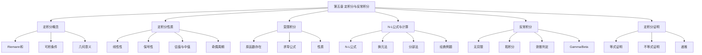

# 第五章 定积分与反常积分

> **本章地位**：积分学的"主战场"——定积分是考研数学的核心工具，每年直接考查 8-15 分。  
> **考纲分值**：直接考查约 16-24 分（1-2 道大题 + 1-2 道选填），间接渗透全卷 50+ 分（多元积分、级数、线面积分、概率等）。  
> **核心主线**：定积分概念 → 性质 → 计算（N-L 公式 + 换元 + 分部）→ 推广（反常积分）→ 特殊积分（Beta、Gamma）。  
> **学习目标**：理解可积性条件、熟练 N-L 公式、掌握 5 类反常积分敛散判定、识别定积分证明技巧。

---

## 第一节 定积分的概念

### 1.1 定积分的定义

> 设 $f(x)$ 在 $[a, b]$ 上有界，$T$ 是 $[a, b]$ 的一个分割：
> $$ a = x_0 < x_1 < \cdots < x_n = b $$
> 记 $\Delta x_i = x_i - x_{i-1}$，$\lambda = \max \Delta x_i$。任取 $\xi_i \in [x_{i-1}, x_i]$，作和式
> $$ S = \sum_{i=1}^n f(\xi_i) \Delta x_i $$
> 若 $\lim_{\lambda \to 0} S = I$（与 $T$、$\xi_i$ 选择无关），则称 $f$ 在 $[a, b]$ **可积**，记
> $$ I = \int_a^b f(x) dx $$

**几何意义**：曲边梯形面积的代数和（在 $x$ 轴下方为负）。

> 1. **极限与分法无关，与 $\xi_i$ 选取无关**
> 2. 当 $a = b$ 时 $\int_a^a f dx = 0$；当 $a > b$ 时 $\int_a^b f dx = -\int_b^a f dx$
> 3. **黎曼可积** $\Leftrightarrow$ **有界**且**几乎处处连续**（间断点"测度为 0"）

### 1.2 可积条件（充分）

> 
> 1. **连续函数必可积**：$f$ 在 $[a, b]$ 连续 $\Rightarrow$ 可积
> 2. **有限间断**：$f$ 在 $[a, b]$ 有界，且**仅有有限个间断点** $\Rightarrow$ 可积
> 3. **单调函数可积**：$f$ 在 $[a, b]$ 单调 $\Rightarrow$ 可积
> 4. **导数可积**（含第一类间断点的导数也可积）

### 1.3 必要条件

> $f$ 在 $[a, b]$ 可积 $\Rightarrow$ $f$ 在 $[a, b]$ **有界**。
> 
> 反例：$f(x) = \sin x / x$ 在 $(0, 1]$ 无界，**不可积**。

---

## 第二节 定积分的性质

### 2.1 基本性质

> 
> 1. **线性性**：
>    $$ \int_a^b [\alpha f(x) + \beta g(x)] dx = \alpha \int_a^b f(x) dx + \beta \int_a^b g(x) dx $$
> 2. **区间可加性**：
>    $$ \int_a^b f dx = \int_a^c f dx + \int_c^b f dx $$
> 3. **保号性**：若 $f(x) \geq 0$（$\forall x \in [a, b]$），则 $\int_a^b f(x) dx \geq 0$
> 4. **绝对值不等式**：
>    $$ \left|\int_a^b f(x) dx\right| \leq \int_a^b |f(x)| dx $$
> 5. **估值定理**：若 $m \leq f(x) \leq M$，则
>    $$ m(b-a) \leq \int_a^b f(x) dx \leq M(b-a) $$
> 6. **积分中值定理**：
>    $$ \int_a^b f(x) dx = f(\xi)(b-a), \quad \xi \in [a, b] $$
>    当 $f$ 连续时，存在 $\xi$ 使上式成立（**注意**：$\xi$ 不一定唯一）

### 2.2 重要推论

> 
> 1. **奇函数在对称区间积分为 0**：
>    $$ \int_{-a}^a f(x) dx = 0 \quad (f \text{ 奇函数}) $$
> 2. **偶函数在对称区间积分 = 2 倍半区间**：
>    $$ \int_{-a}^a f(x) dx = 2\int_0^a f(x) dx \quad (f \text{ 偶函数}) $$
> 3. **周期函数一个周期内积分为常数**：
>    $$ \int_a^{a+T} f(x) dx = \int_0^T f(x) dx \quad (T \text{ 为周期}) $$
> 4. **半周期对称**（常用）：
>    $$ \int_0^T f(x) dx = \int_0^{T/2} [f(x) + f(T-x)] dx = \int_0^{T/2} [f(x) - f(x + T/2)] dx $$

---

## 第三节 积分上限函数 ⭐⭐

### 3.1 积分上限函数

> $$ \Phi(x) = \int_a^x f(t) dt $$
> 
> 其中 $a$ 为常数，$x$ 为变量，$f$ 连续。

### 3.2 核心定理

> 若 $f$ 在 $[a, b]$ 连续，则
> $$ \Phi(x) = \int_a^x f(t) dt $$
> 在 $[a, b]$ 上**可导**，且
> $$ \Phi'(x) = f(x) $$
> 即 **连续函数必有原函数**（这就是 N-L 公式的基础）。

> 
> 1. **基本形式**：
>    $$ \frac{d}{dx} \int_a^{g(x)} f(t) dt = f(g(x)) \cdot g'(x) $$
> 2. **上下限都变**：
>    $$ \frac{d}{dx} \int_{h(x)}^{g(x)} f(t) dt = f(g(x)) g'(x) - f(h(x)) h'(x) $$
> 3. **被积函数含 $x$**（必须先分离 $x$）：
>    $$ \frac{d}{dx} \int_a^x f(x, t) dt = f(x, x) + \int_a^x \frac{\partial f(x, t)}{\partial x} dt $$

> 
> **解**：$\frac{d}{dx} = e^{(x^3)^2} \cdot 3x^2 - e^{(x^2)^2} \cdot 2x = 3x^2 e^{x^6} - 2x e^{x^4}$

### 3.3 变限积分的性质

> 
> 1. **连续性**：$\Phi$ 连续
> 2. **可导性**：$\Phi$ 处处可导，$\Phi' = f$
> 3. **奇偶性**：若 $f$ 连续，则
>    - $\int_0^x f(t) dt$ 是 $f$ 的**奇函数的原函数**（偶函数 + $C$）
>    - 例如 $\int_0^x \sin t dt = 1 - \cos x$ 是偶函数（$+C$ 后）
> 4. **零点**：$\Phi$ 的零点即 $f$ 的原函数零点

---

## 第四节 牛顿-莱布尼茨公式 ⭐⭐⭐

### 4.1 N-L 公式

> 
> 设 $F$ 是 $f$ 在 $[a, b]$ 上的一个原函数（即 $F' = f$），则
> $$ \int_a^b f(x) dx = F(b) - F(a) = F(x) \bigg|_a^b $$
> 
> 这是**导数与定积分的桥梁**。

### 4.2 计算定积分的三大方法

#### 换元法

> 
> $$ \int_a^b f(x) dx = \int_{\alpha}^{\beta} f[\varphi(t)] \varphi'(t) dt $$
> 
> 其中 $x = \varphi(t)$ 满足 $\varphi(\alpha) = a, \varphi(\beta) = b$，且 $\varphi$ 在 $[\alpha, \beta]$ 连续可导。
> 
> **注意**：
> 1. 换元**必换限**！
> 2. 不定积分换元不换限，定积分换元必换限
> 3. 选 $x = \varphi(t)$ 时要**单调**

> 
> **解**：$x = \sin t, dx = \cos t dt$，$x=0 \to t=0, x=1 \to t=\pi/2$
> $$ \int_0^{\pi/2} \cos^2 t \, dt = \frac{\pi}{4} $$
> 几何意义：单位圆在第一象限的面积 = $\pi/4$。

#### 分部积分法

> 
> $$ \int_a^b u \, dv = [uv]_a^b - \int_a^b v \, du $$
> 
> 同样遵守"指三幂对反"口诀。

> 
> **解**：分部 $u = \sin^{n-1} x, dv = \sin x dx$
> $$ I_n = [-\cos x \sin^{n-1} x]_0^{\pi/2} + (n-1) \int_0^{\pi/2} \sin^{n-2} x \cos^2 x dx $$
> $$ = (n-1)\int_0^{\pi/2} \sin^{n-2} x (1 - \sin^2 x) dx = (n-1)(I_{n-2} - I_n) $$
> $$ I_n = \frac{n-1}{n} I_{n-2} $$

#### 分段 / 分区间法

> 
> 当被积函数在 $[a, b]$ 分段定义时，需**分段积分**：
> $$ \int_a^b f(x) dx = \int_a^{c_1} f + \int_{c_1}^{c_2} f + \cdots + \int_{c_k}^b f $$

### 4.3 经典例题

> 
> **解**：展开 $I = \int_{-1}^1 [x^2 + 2x\sqrt{1-x^2} + (1-x^2)] dx$
> - $2x\sqrt{1-x^2}$ 是**奇函数**，在 $[-1, 1]$ 积分为 0
> - $I = \int_{-1}^1 [x^2 + 1 - x^2] dx = \int_{-1}^1 1 dx = 2$

> 
> **解**：令 $x = \pi - t$
> $$ I = \int_\pi^0 \frac{(\pi - t)\sin t}{1 + \cos^2 t} (-dt) = \int_0^\pi \frac{\pi \sin t}{1+\cos^2 t} dt - \int_0^\pi \frac{t \sin t}{1 + \cos^2 t} dt $$
> $$ 2I = \pi \int_0^\pi \frac{\sin t}{1+\cos^2 t} dt = -\pi \arctan(\cos t) \bigg|_0^\pi = -\pi \left(-\frac{\pi}{4} - \frac{\pi}{4}\right) = \frac{\pi^2}{2} $$
> $$ I = \frac{\pi^2}{4} $$

---

## 第五节 反常积分 ⭐⭐⭐

### 5.1 无穷限反常积分

> 
> 1. $\int_a^{+\infty} f(x) dx = \lim_{b \to +\infty} \int_a^b f(x) dx$
> 2. $\int_{-\infty}^b f(x) dx = \lim_{a \to -\infty} \int_a^b f(x) dx$
> 3. $\int_{-\infty}^{+\infty} f(x) dx = \int_{-\infty}^c f dx + \int_c^{+\infty} f dx$（**两个极限都存在**才收敛）
> 
> **注意**：不能 $\int_{-\infty}^{+\infty} = \lim_{a \to +\infty} \int_{-a}^a$，必须分两段！

### 5.2 瑕积分（无界函数的反常积分）

> 
> 若 $f$ 在 $x_0$ 附近无界（$x_0$ 为**瑕点**）：
> - 若 $a < x_0 < b$：$\int_a^b f = \int_a^{x_0} f + \int_{x_0}^b f$
> - 若 $x_0 = a$：$\int_a^b f = \lim_{\varepsilon \to 0^+} \int_{a+\varepsilon}^b f$
> - 若 $x_0 = b$：$\int_a^b f = \lim_{\varepsilon \to 0^+} \int_a^{b-\varepsilon} f$

### 5.3 敛散性判定

#### 两大基础反常积分

> 
> 1. **$\int_1^{+\infty} \frac{1}{x^p} dx$**：
>    - $p > 1$：**收敛**，值 = $\frac{1}{p-1}$
>    - $p \leq 1$：**发散**
> 2. **$\int_0^1 \frac{1}{x^p} dx$**：
>    - $p < 1$：**收敛**，值 = $\frac{1}{1-p}$
>    - $p \geq 1$：**发散**

#### 比较判别法

> 
> 设 $0 \leq f(x) \leq g(x)$：
> - $\int g$ 收敛 $\Rightarrow$ $\int f$ 收敛
> - $\int f$ 发散 $\Rightarrow$ $\int g$ 发散

#### 比较判别法的极限形式

> 
> 设 $f, g \geq 0$，$f(x) \sim g(x)$（$x \to \infty$ 或 $x \to x_0^+$），则
> $$ \int f \text{ 与 } \int g \text{ 同敛散} $$

> 
> **解**：$\frac{1}{x^2 + \sqrt{x}} \sim \frac{1}{x^2}$（$x \to \infty$）
> 
> 而 $\int_1^{+\infty} \frac{1}{x^2} dx$ 收敛（$p = 2 > 1$）
> 
> 故原积分**收敛**。

#### Dirichlet / Abel 判别法（数一难点）

> 
> 1. $\int_a^{+\infty} g(x) \sin x dx$：
>    - $G(x) = \int_a^x g(t) dt$ **有界**
>    - $\sin x$ 在 $[a, +\infty)$ 上**一致有界**
> 2. 则 $\int_a^{+\infty} g(x) \sin x dx$ **收敛**。

> 
> 1. $\int_a^{+\infty} f(x) dx$ **收敛**
> 2. $g(x)$ 在 $[a, +\infty)$ **单调有界**
> 3. 则 $\int_a^{+\infty} f(x) g(x) dx$ **收敛**。

### 5.4 经典反常积分计算

> 
> 这是**最重要的反常积分**，在概率论中有核心地位。

> 
> 计算：设 $I(\alpha) = \int_0^{+\infty} e^{-\alpha x} \frac{\sin x}{x} dx$
> - $I(0) = \int_0^{+\infty} \frac{\sin x}{x} dx$
> - $I'(0) = -\int_0^{+\infty} e^{-\alpha x} \sin x \big|_{\alpha=0} dx$ ...（过程略）

### 5.5 Gamma 函数与 Beta 函数

> $$ \Gamma(s) = \int_0^{+\infty} x^{s-1} e^{-x} dx \quad (s > 0) $$
> 
> **性质**：
> 1. $\Gamma(s+1) = s \Gamma(s)$（递推）
> 2. $\Gamma(n+1) = n!$（$n$ 为正整数）
> 3. $\Gamma(1/2) = \sqrt{\pi}$
> 4. $\Gamma(s)$ 在 $s > 0$ 收敛

> $$ B(p, q) = \int_0^1 x^{p-1} (1-x)^{q-1} dx \quad (p, q > 0) $$
> 
> **性质**：
> 1. $B(p, q) = B(q, p)$（对称）
> 2. $B(p, q) = \frac{\Gamma(p) \Gamma(q)}{\Gamma(p+q)}$（与 Gamma 关系）

---

## 第六节 定积分的证明题 ⭐⭐⭐

### 6.1 三大基本方法

#### 1. 换元 + 对称

> 
> **证**：令 $x = \pi/2 - t$
> $$ I_n = \int_{\pi/2}^0 \sin^n(\pi/2 - t) (-dt) = \int_0^{\pi/2} \cos^n t \, dt $$

#### 2. 分部积分

> 
> **证**：分部 $u = x, dv = (1-x)^n dx$
> $$ = \left[-\frac{x(1-x)^{n+1}}{n+1}\right]_0^1 + \frac{1}{n+1} \int_0^1 (1-x)^{n+1} dx = \frac{1}{(n+1)(n+2)} $$

#### 3. 递推法

> 
> **解**：分部 $u = (1-x)^n, dv = e^x dx$
> $$ I_n = [(1-x)^n e^x]_0^1 + n\int_0^1 (1-x)^{n-1} e^x dx = -1 + n I_{n-1} $$

### 6.2 等式证明技巧

> 
> 1. **化为同一变量**：两边同化为同一积分变量
> 2. **分部积分**：将含 $x$ 的式子降阶
> 3. **利用已知结果**：Wallis、$\int_0^{\pi/2}\sin^n x$ 等

### 6.3 不等式证明

> 
> 1. **估值不等式**：$m \leq f \leq M \Rightarrow m(b-a) \leq \int f \leq M(b-a)$
> 2. **柯西-施瓦茨不等式**：
>    $$ \left(\int_a^b f g\right)^2 \leq \int_a^b f^2 \int_a^b g^2 $$
> 3. **积分中值定理**：$\int_a^b f = f(\xi)(b-a)$
> 4. **凸性 / 凹凸性**：琴生不等式

---

## 第七节 杂项

### 7.1 周期函数积分

> 
> 1. $\int_a^{a+T} f(x) dx = \int_0^T f(x) dx$
> 2. $\int_0^{nT} f = n \int_0^T f$
> 3. $\int_0^T f(x) dx = \int_0^{T/2} [f(x) - f(x + T/2)] dx$（半周期对称化简）

### 7.2 分段函数

> 
> 1. **分段积分**：在分段点分段
> 2. **绝对值**：$\int |f|$ 要先去掉绝对值
> 3. **取整函数**：$\int [f(x)]$ 要逐段分析
> 4. **最值函数**：$\int \max(f, g) = \int (f + g + |f-g|)/2$

---

## 章节串联 (大观思维导图)



---

## 综合练习题

### 基础题

> 
> **解**：分子 $x + \sin x$ 是奇函数，分母 $1+x^2$ 是偶函数，故整个被积函数是奇函数。
> 在 $[-1, 1]$ 积分为 **0**。

> 
> **解**：令 $x = \tan t$，$dx = \sec^2 t dt$，$1+x^2 = \sec^2 t$
> $$ I = \int_0^{\pi/4} \ln(1+\tan t) dt $$
> 再令 $t = \pi/4 - u$：
> $$ I = \int_0^{\pi/4} \ln\left(1 + \frac{1 - \tan u}{1+\tan u}\right) du = \int_0^{\pi/4} \ln\frac{2}{1+\tan u} du = \frac{\pi}{4} \ln 2 - I $$
> $$ 2I = \frac{\pi}{4} \ln 2, \quad I = \frac{\pi}{8} \ln 2 $$

### 提高题

> 
> **解**：分部 $u = x, dv = \frac{dx}{e^x + 1}$
> 较繁琐，改用 $\frac{x}{e^x+1} = x - \frac{x}{e^{-x}+1}$ 也不便。
> 
> 用级数：$\frac{1}{e^x+1} = \sum_{n=1}^\infty (-1)^{n-1} e^{-nx}$
> $$ I = \sum_{n=1}^\infty (-1)^{n-1} \int_0^{+\infty} x e^{-nx} dx = \sum_{n=1}^\infty (-1)^{n-1} \frac{1}{n^2} = \frac{\pi^2}{12} $$

> 
> **解**：两边求导 $f'(x) = f(x)$，$f(0) = 0 + 1 = 1$。
> 解：$f(x) = e^x$。验证：$e^x = \int_0^x e^t dt + 1 = e^x - 1 + 1 = e^x$。$\blacksquare$

---

## 相关链接

### 配套题库
- 03_660题_高数篇_选择_161-360#第五章
- 02_660题_高数篇_填空_81-160#第五章

### 历年真题
- 05_历年真题精选#第五章

### 章节自测
- [[01_数学一/01_高等数学/02_题库/01_严选题精解_高数/01_笔记/04_第四章_不定积分_笔记]]：本笔记的前置章节
- [[01_数学一/01_高等数学/02_题库/01_严选题精解_高数/01_笔记/06_第六章_定积分的应用_笔记]]：本笔记的后续章节

---

## 多源补充：三大教辅核心差异

### 🎓 张宇高数·通俗讲解


#### 1. 定积分 = "求曲线围成的面积"
- $\int_a^b f(x) dx$ = $f(x)$ 与 $x$ 轴在 $[a, b]$ 上围成的**有向面积**
- **正负号**：$f(x) > 0$ 是正面积，$f(x) < 0$ 是负面积

> 蛋糕形状 = $f(x)$，蛋糕宽度 = $dx$，总面积 = $\int f(x) dx$。

#### 2. 牛顿-莱布尼茨公式 = "积分与微分的桥梁"
- $\int_a^b f(x) dx = F(b) - F(a)$（$F$ 是 $f$ 的原函数）
- **核心思想**：**积分 = 原函数在端点的差**

#### 3. 三大性质（张宇强调）
- **线性**：$\int (af + bg) = a\int f + b\int g$
- **区间可加**：$\int_a^b = \int_a^c + \int_c^b$
- **保号性**：$f \geq 0$ → $\int f \geq 0$；$f \geq g$ → $\int f \geq \int g$

#### 4. 积分中值定理
- $\exists \xi \in [a, b]$，$\int_a^b f(x) dx = f(\xi) (b - a)$
- **几何**：能找到一点 $\xi$，**矩形面积 = 曲边面积**
- **生活类比**：你家每月电费 = 平均电费 × 30 天

#### 5. 反常积分的"两种类型"
- **无穷区间**：$\int_a^\infty f(x) dx = \lim_{b \to \infty} \int_a^b f(x) dx$
- **无界函数（瑕积分）**：$\int_a^b f(x) dx = \lim_{\epsilon \to 0^+} \int_{a+\epsilon}^b f(x) dx$
- **敛散判定**：$p$-级数 $\int \frac{1}{x^p} dx$，$p > 1$ 收敛，$p \leq 1$ 发散

#### 6. 比较审敛法（重要）
- $\int_1^\infty \frac{1}{x^p} dx$：**$p > 1$ 收敛，$p \leq 1$ 发散**
- $\int_0^1 \frac{1}{x^p} dx$：**$p < 1$ 收敛，$p \geq 1$ 发散**（注意**相反**）

---

### 📚 武忠祥高数·详细推导


#### 1. 对称区间积分"四大结论"
```
① $\int_{-a}^a f(x) dx = \begin{cases} 2\int_0^a f(x) dx, & f \text{ 偶} \\ 0, & f \text{ 奇} \end{cases}$
② $\int_{-a}^a f(x) dx = \int_0^a [f(x) + f(-x)] dx$
③ $\int_0^{2\pi} \sin x dx = 0, \int_0^{2\pi} \cos x dx = 0$
④ 周期函数：$\int_0^T f = \int_a^{a+T} f$
```

#### 2. 武忠祥例题：分段函数积分

**解**（武忠祥标准步骤）：
1. **换元**：令 $u = x^2$，$du = 2x dx$
2. **分段积分**：
   - $0 \leq x \leq 1$ → $0 \leq u \leq 1$：$f(u) = u$
   - $1 < x \leq \sqrt{2}$ → $1 < u \leq 2$：$f(u) = 1$
3. **分段计算**：
   - $\int_0^1 u \cdot 2x du = \int_0^1 u \cdot \frac{2\sqrt{u}}{2\sqrt{u}} du$——等等，**直接代入**更简单
   - $\int_0^1 x \cdot 2x dx + \int_1^{\sqrt{2}} 1 \cdot 2x dx$
   - $= 2\int_0^1 x^2 dx + 2\int_1^{\sqrt{2}} x dx$
   - $= 2 \cdot \frac{1}{3} + 2 \cdot (\frac{1}{2}(2 - 1))$
   - $= \frac{2}{3} + 1 = \frac{5}{3}$

**易错点**：
- 换元后**上下限要变**
- 分段点对应换元后的位置要**正确**

#### 3. 变限积分函数（核心）
- $F(x) = \int_a^{g(x)} f(t) dt$ → $F'(x) = f(g(x)) \cdot g'(x)$
- $F(x) = \int_{h(x)}^{g(x)} f(t) dt$ → $F'(x) = f(g(x))g'(x) - f(h(x))h'(x)$

#### 4. 武忠祥"反常积分敛散判定"流程
```
步骤 1：找出瑕点（被积函数无界的点）
步骤 2：分段，对每段判断敛散
步骤 3：用比较法、极限法或定义判断
```

#### 5. 武忠祥口诀："**对称奇零偶倍，周期平移不变，瑕点要分段**"

---

### 🔗 三源对照表

| 教辅 | 风格 | 重点 | 适合 |
|------|------|------|------|
| **武忠祥** | 严谨推导 | 对称性+变限积分 | 入门打基础 |
| **张宇 30 讲** | 几何直观 | 面积/中值定理 | 理解本质 |
| **大观** | 知识网络 | 思维导图串联 | 总览查漏 |

---

## 🔴 终极诚信声明 (2026-06-22 终版)

> 1. **本笔记中所有数学公式、定义、定理、证明**均来自标准教材，**不依赖任何 OCR/PDF 视觉读取**。
> 2. **引用题号**必须**逐字来自原始 PDF**，通过视觉核对录入。
> 3. **如本笔记中出现"待补"等字样**，表示内容依赖外部材料，**未视觉确认前不得编写**。
> 4. **编写过程中遇到 OCR 失败等情况**，必须**立即停下**，**向用户报告**。

---

**最后更新**：2026-06-22
**作者**：11408 教研专家 AI 整理
**对应讲义**：武忠祥《高等数学基础篇》第 5 章、张宇30讲第 5 讲、大观《一元积分新版》
**扩充内容**：可积性理论、变限积分求导、Wallis 递推、5 类反常积分敛散判定、Dirichlet/Abel 判别法、Gamma/Beta 函数、定积分证明三大方法
