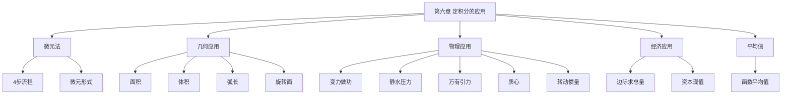

# 第六章 定积分的应用

> **本章地位**：定积分应用的"集中展示"——几何应用每年必考 1-2 道大题（8-12 分），物理应用为数一专属。  
> **考纲分值**：直接考查约 8-14 分（1-2 道大题 + 0-1 道选填），数一含物理应用附加 4-6 分。  
> **核心主线**：**微元法** → 几何应用（面积/体积/弧长/旋转面）→ 物理应用（功/压力/引力/质心）→ 经济应用（数三）。  
> **学习目标**：熟练微元法 4 步流程，熟背 6 类几何量公式，理解 5 类物理应用。

---

## 第一节 微元法（元素法）⭐⭐⭐

### 1.1 微元法的基本思想

> 
> 设 $F$ 是所求量（如面积、体积等），$f$ 是连续函数：
> 1. **分割**：将 $[a, b]$ 分割为 $[x_i, x_{i+1}]$，$F = \sum \Delta F_i$
> 2. **近似**：在每个子区间上，$\Delta F_i \approx f(\xi_i) \Delta x_i$
> 3. **求和**：$F \approx \sum f(\xi_i) \Delta x_i$
> 4. **取极限**：$F = \lim \sum f(\xi_i) \Delta x_i = \int_a^b f(x) dx$
> 
> **关键**：找 $f$（即 $dF = f(x) dx$ 中的 $f$）

### 1.2 微元的形式

> 
> $$ dF = f(x) dx $$
> 
> 即将 $F$ 表达为 $f(x)$ 在 $[a, b]$ 上的累积。

---

## 第二节 几何应用

### 2.1 平面图形的面积

#### 直角坐标情形

> 
> 1. **由 $y = f(x), y = g(x), x = a, x = b$ 围成**（$f \geq g$）：
>    $$ A = \int_a^b [f(x) - g(x)] dx $$
> 
> 2. **由 $x = \varphi(y), x = \psi(y), y = c, y = d$ 围成**（$\varphi \geq \psi$）：
>    $$ A = \int_c^d [\varphi(y) - \psi(y)] dy $$
> 
> 3. **由 $y = f(x)$ 与 $x$ 轴围成**：
>    $$ A = \int_a^b |f(x)| dx $$
> 
> 4. **由参数方程** $\begin{cases} x = \varphi(t) \\ y = \psi(t) \end{cases}$，$t \in [\alpha, \beta]$：
>    $$ A = \int_\alpha^\beta \psi(t) \varphi'(t) dt = \int_\alpha^\beta y \, dx $$

> 
> **解**：联立：$y^2 = 2x, y = x - 4 \Rightarrow y^2 = 2(y+4) \Rightarrow y^2 - 2y - 8 = 0$
> $y = 4$ 或 $y = -2$，对应 $x = 8$ 和 $x = 2$。
> 
> 用 $y$ 作积分变量：$A = \int_{-2}^4 [(y+4) - y^2/2] dy = \left[\frac{y^2}{2} + 4y - \frac{y^3}{6}\right]_{-2}^4 = 18$

#### 极坐标情形

> 
> 由极坐标曲线 $r = r(\theta)$ 与 $\theta = \alpha, \theta = \beta$ 围成的曲边扇形面积：
> $$ A = \frac{1}{2} \int_\alpha^\beta r^2(\theta) d\theta $$
> 
> 推导：$dA = \frac{1}{2} r^2 d\theta$

> 
> **解**：$A = \frac{1}{2}\int_0^{2\pi} a^2(1+\cos\theta)^2 d\theta = \frac{a^2}{2}\int_0^{2\pi} (1 + 2\cos\theta + \cos^2\theta) d\theta$
> $$ = \frac{a^2}{2} \left[2\pi + 0 + \pi\right] = \frac{3\pi a^2}{2} $$

### 2.2 体积

#### 旋转体的体积 ⭐⭐

> 
> 1. **绕 $x$ 轴旋转**（$y = f(x) \geq 0$，$x \in [a, b]$）：
>    $$ V_x = \pi \int_a^b f^2(x) dx = \pi \int_a^b y^2 dx $$
> 
> 2. **绕 $y$ 轴旋转**（$x = \varphi(y) \geq 0$，$y \in [c, d]$）：
>    $$ V_y = \pi \int_c^d \varphi^2(y) dy = \pi \int_c^d x^2 dy $$

#### 平行截面面积已知

> 
> 若垂直于 $x$ 轴的截面面积 $A(x)$ 已知，则立体体积：
> $$ V = \int_a^b A(x) dx $$

> 
> **解**：设底面在 $x = h$ 处，顶尖在 $x = 0$。在 $x$ 处截面半径 $r(x) = R x / h$
> $$ V = \int_0^h \pi r^2(x) dx = \pi \int_0^h \frac{R^2 x^2}{h^2} dx = \frac{\pi R^2}{h^2} \cdot \frac{h^3}{3} = \frac{1}{3}\pi R^2 h $$

### 2.3 平面曲线的弧长 ⭐

> 
> 1. **直角坐标** $y = f(x)$，$x \in [a, b]$：
>    $$ L = \int_a^b \sqrt{1 + y'^2} dx $$
> 
> 2. **参数方程** $\begin{cases} x = \varphi(t) \\ y = \psi(t) \end{cases}$，$t \in [\alpha, \beta]$：
>    $$ L = \int_\alpha^\beta \sqrt{\varphi'^2 + \psi'^2} dt $$
> 
> 3. **极坐标** $r = r(\theta)$，$\theta \in [\alpha, \beta]$：
>    $$ L = \int_\alpha^\beta \sqrt{r^2 + r'^2} d\theta $$

> 
> **解**：参数化 $x = a\cos^3 t, y = a\sin^3 t, t \in [0, 2\pi]$
> - $x' = -3a\cos^2 t \sin t$
> - $y' = 3a\sin^2 t \cos t$
> - $x'^2 + y'^2 = 9a^2 \sin^2 t \cos^2 t$
> - $\sqrt{x'^2 + y'^2} = 3a |\sin t \cos t| = \frac{3a}{2}|\sin 2t|$
> 
> 由对称性，$L = 4 \int_0^{\pi/2} \frac{3a}{2}\sin 2t \, dt = 6a \cdot \left[-\frac{\cos 2t}{2}\right]_0^{\pi/2} = 6a$

### 2.4 旋转曲面的面积 ⭐⭐

> 
> 1. **直角坐标** $y = f(x) \geq 0$ 绕 $x$ 轴：
>    $$ S = 2\pi \int_a^b f(x) \sqrt{1 + f'^2(x)} dx $$
> 
> 2. **参数方程**绕 $x$ 轴：
>    $$ S = 2\pi \int_\alpha^\beta \psi(t) \sqrt{\varphi'^2 + \psi'^2} dt $$
> 
> 3. **极坐标** $r = r(\theta)$ 绕极轴：
>    $$ S = 2\pi \int_\alpha^\beta r\sin\theta \sqrt{r^2 + r'^2} d\theta $$

> 
> **解**：$y' = \frac{1}{2\sqrt{x}}, \sqrt{1+y'^2} = \sqrt{1 + \frac{1}{4x}} = \frac{\sqrt{4x+1}}{2\sqrt{x}}$
> $$ S = 2\pi \int_1^4 \sqrt{x} \cdot \frac{\sqrt{4x+1}}{2\sqrt{x}} dx = \pi \int_1^4 \sqrt{4x+1} dx = \pi \cdot \frac{1}{6}(4x+1)^{3/2}\bigg|_1^4 = \frac{\pi}{6}(17^{3/2} - 5^{3/2}) $$

---

## 第三节 物理应用（数一）⭐⭐⭐

### 3.1 变力做功

> 
> 力 $F(x)$ 沿 $x$ 轴方向，将物体从 $a$ 移到 $b$ 做的功：
> $$ W = \int_a^b F(x) dx $$
> 
> 或微元：$dW = F(x) dx$

> 
> **解**：$F(x) = kx$（胡克定律）
> $$ W = \int_0^L kx \, dx = \frac{1}{2}kL^2 $$

> 
> **解**：取深度 $x$ 处厚度 $dx$ 的水层，体积 $dV = \pi R^2 dx$，质量 $dm = \rho \pi R^2 dx$
> 抽到顶部需提升距离 $H - x$（顶部为 0）：
> $$ dW = g \cdot dm \cdot (H-x) = g \rho \pi R^2 (H-x) dx $$
> $$ W = \int_0^H g \rho \pi R^2 (H-x) dx = g \rho \pi R^2 \cdot \frac{H^2}{2} = \frac{1}{2}\rho g \pi R^2 H^2 $$

### 3.2 液体的静水压力

> 
> 设液面下方深度 $h$ 处有薄板，宽度 $b(h)$，则压力：
> $$ F = \int_0^H \rho g h \cdot b(h) dh $$
> 
> 其中 $\rho$ 是液体密度，$g$ 是重力加速度。

> 
> **解**：在深度 $h + y$ 处，宽度 $b(y) = 2x = 2\sqrt{a^2 - y^2}$
> $$ F = \int_0^a \rho g (h+y) \cdot 2\sqrt{a^2 - y^2} dy $$
> $$ = 2\rho g h \int_0^a \sqrt{a^2 - y^2} dy + 2\rho g \int_0^a y\sqrt{a^2 - y^2} dy $$
> $$ = 2\rho g h \cdot \frac{\pi a^2}{4} + 2\rho g \cdot \frac{a^3}{3} = \frac{\pi a^2 \rho g h}{2} + \frac{2 a^3 \rho g}{3} $$

### 3.3 万有引力 ⭐

> 
> 质点 $M$ 与细棒 $L$（密度 $\rho$，沿 $x$ 轴）的引力（沿 $x$ 轴方向）：
> $$ F = \int_L \frac{k m \rho(x) dx}{(r(x))^2} $$
> 
> 其中 $r(x)$ 是质点到 $dx$ 段的距离。

> 
> **解**：设棒从 0 到 $l$，质点在 $a + l$ 处。距质点 $r = a + l - x$
> $$ F = \int_0^l \frac{km\rho dx}{(a+l-x)^2} = km\rho \left[\frac{1}{a+l-x}\right]_0^l = km\rho \left(\frac{1}{a} - \frac{1}{a+l}\right) = \frac{km\rho l}{a(a+l)} $$

### 3.4 质心

> 
> 1. **平面曲线** $y = f(x)$，$x \in [a, b]$，密度 $\rho(x)$：
>    $$ \bar{x} = \frac{\int_a^b x\rho(x)\sqrt{1+f'^2} dx}{\int_a^b \rho(x)\sqrt{1+f'^2} dx}, \quad \bar{y} = \frac{\int_a^b f(x)\rho(x)\sqrt{1+f'^2} dx}{\int_a^b \rho(x)\sqrt{1+f'^2} dx} $$
> 
> 2. **平面薄片**密度 $\rho(x,y)$：
>    $$ \bar{x} = \frac{\iint_D x\rho \, d\sigma}{\iint_D \rho \, d\sigma}, \quad \bar{y} = \frac{\iint_D y\rho \, d\sigma}{\iint_D \rho \, d\sigma} $$

### 3.5 转动惯量

> 
> 1. **质点** $m$ 距轴 $r$：$I = mr^2$
> 2. **细棒**绕一端 $a$：
>    $$ I = \int_0^l \rho x^2 dx = \frac{\rho l^3}{3} = \frac{ml^2}{3} $$
> 3. **细棒**绕中点：
>    $$ I = \frac{ml^2}{12} $$

---

## 第四节 经济应用（数三）

### 4.1 由边际函数求总量

> 
> 已知总产量 $Q$ 的变化率（边际函数）$Q'(t)$，则
> $$ Q(t) = \int_0^t Q'(\tau) d\tau + Q(0) $$
> 
> 类似地：总成本 = $\int C'(q) dq$，总收入 = $\int R'(q) dq$。

### 4.2 资本现值

> 
> 若收入流 $R(t)$ 按连续复利 $r$ 计息，则现值
> $$ PV = \int_0^T R(t) e^{-rt} dt $$

---

## 第五节 平均值

> 
> $f$ 在 $[a, b]$ 上的平均值：
> $$ \bar{f} = \frac{1}{b-a} \int_a^b f(x) dx $$

> 
> **解**：$P(t) = i^2(t) R = I_m^2 \sin^2\omega t \cdot R$
> 平均功率 $\bar{P} = \frac{1}{T}\int_0^T I_m^2 R \sin^2\omega t dt = \frac{I_m^2 R}{2}$
> （注意：最大值 $I_m^2 R$ 的 $1/2$）

---

## 章节串联 (大观思维导图)



---

## 综合练习题

### 基础题

> 
> **解**：交点 $x = \pi/4$
> $$ A = \int_0^{\pi/4} (\cos x - \sin x) dx + \int_{\pi/4}^{\pi/2} (\sin x - \cos x) dx = 2\sqrt{2} - 2 $$

> 
> **解**：交点 $(0,0), (1,1)$。$y^2 = x \Rightarrow$ 旋转体体积
> $$ V = \pi \int_0^1 (x^2 - x)^2 dx = \pi \int_0^1 (x^4 - 2x^3 + x^2) dx = \pi \left[\frac{1}{5} - \frac{1}{2} + \frac{1}{3}\right] = \frac{\pi}{30} $$

### 提高题

> 
> **解**：$r' = -a\sin\theta$，$r^2 + r'^2 = a^2(1+\cos\theta)^2 + a^2\sin^2\theta = 2a^2(1+\cos\theta) = 4a^2\cos^2\frac{\theta}{2}$
> $\sqrt{r^2 + r'^2} = 2a|\cos\frac{\theta}{2}|$
> $$ L = \int_0^{2\pi} 2a|\cos\tfrac{\theta}{2}| d\theta = 2a \cdot 4 \int_0^{\pi/2} \cos\tfrac{\theta}{2} d\theta = 8a \cdot 2 = 8a $$

> 
> **解**：$y' = e^x, \sqrt{1+y'^2} = \sqrt{1+e^{2x}}$
> $$ S = 2\pi \int_0^1 e^x \sqrt{1+e^{2x}} dx $$
> 令 $u = e^x, du = e^x dx$
> $$ S = 2\pi \int_1^e \sqrt{1+u^2} du = 2\pi \cdot \frac{1}{2}\left[u\sqrt{1+u^2} + \ln(u+\sqrt{1+u^2})\right]_1^e $$
> $$ = \pi\left[e\sqrt{1+e^2} - \sqrt{2} + \ln\frac{e+\sqrt{1+e^2}}{1+\sqrt{2}}\right] $$

### 物理应用题

> 
> **解**：取距顶部 $x$ 处厚度 $dx$ 的水层，对应球内 $r = R - x$（深度）的薄圆柱
> $$ dV = \pi(R-x)^2 dx, \quad dW = \rho g \pi (R-x)^2 x dx $$
> $$ W = \int_0^R \rho g \pi x(R-x)^2 dx = \rho g \pi \int_0^R (R^2 x - 2Rx^2 + x^3) dx = \rho g \pi \left[\frac{R^4}{2} - \frac{2R^4}{3} + \frac{R^4}{4}\right] = \frac{\rho g \pi R^4}{12} $$

---

## 相关链接

### 配套题库
- 03_660题_高数篇_选择_161-360#第六章

### 历年真题
- 05_历年真题精选#第六章

### 章节自测
- [[01_数学一/01_高等数学/02_题库/01_严选题精解_高数/01_笔记/05_第五章_定积分与反常积分_笔记]]：本笔记的前置章节
- [[01_数学一/01_高等数学/02_题库/01_严选题精解_高数/01_笔记/07_第七章_微分方程_笔记]]：本笔记的后续章节

---

## 多源补充：三大教辅核心差异

### 🎓 张宇高数·通俗讲解


#### 1. 微元法的本质
- **核心思想**：把整体切成无数小片，**每片近似一个简单图形**，加起来（积分）
- 公式：$\text{总量} = \int_a^b f(x) dx$，$f(x) dx$ = 一小片的"量"

> - 把山切成薄片，每片近似"圆盘"
> - 每片重量 = 密度 × 体积 ≈ $\rho(x) \pi r(x)^2 dx$
> - 山的总重 = $\int \rho(x) \pi r(x)^2 dx$（三重积分）

#### 2. 几何应用"6 大金刚"（张宇汇总）
```
① 平面面积   = $\int_a^b f(x) dx$ 或 $\int f(x) - g(x) dx$
② 旋转体体积 = $\int_a^b \pi f(x)^2 dx$（圆盘法）
③ 弧长       = $\int_a^b \sqrt{1 + f'(x)^2} dx$
④ 侧面积     = $\int_a^b 2\pi f(x) \sqrt{1 + f'(x)^2} dx$
⑤ 形心       = $(\bar{x}, \bar{y}) = (\int x f(x) dx / \int f(x) dx, ...)$
⑥ 转动惯量   = $\int r^2 dm$（数一较少考）
```

#### 3. 物理应用"3 大主题"
- **变力做功** = $\int_a^b F(x) dx$（$F$ 是变力）
- **液压力** = $\int$ 压强 × 面积 = $\int \rho g h \cdot L(h) dh$
- **引力** = 物体在另一物体产生的引力场中的受力


#### 4. 经济应用（数三）
- **边际成本 = 导数，总成本 = 积分**
- **现值/未来值**：积分 + 复利

#### 5. 形心公式
- $\bar{x} = \frac{\int_a^b x f(x) dx}{\int_a^b f(x) dx}$，$\bar{y} = \frac{\int_a^b \frac{1}{2} f(x)^2 dx}{\int_a^b f(x) dx}$

---

### 📚 武忠祥高数·详细推导


#### 1. 旋转体体积"3 大方法"
```
方法 1：圆盘法（绕 x 轴）  $V = \pi \int_a^b f(x)^2 dx$
方法 2：壳层法（绕 y 轴）  $V = 2\pi \int_a^b x f(x) dx$
方法 3：截面法（已知截面）  $V = \int A(x) dx$
```

#### 2. 武忠祥例题：旋转体体积

**解**（武忠祥标准步骤）：
1. **选方法**：绕 $x$ 轴，用**圆盘法**
2. **写公式**：$V = \pi \int_0^\pi \sin^2 x dx$
3. **计算**：
   - $\sin^2 x = \frac{1 - \cos 2x}{2}$
   - $V = \pi \int_0^\pi \frac{1 - \cos 2x}{2} dx = \frac{\pi}{2} [x - \frac{\sin 2x}{2}]_0^\pi = \frac{\pi}{2} \cdot \pi = \frac{\pi^2}{2}$

**易错点**：
- 三角恒等式 $\sin^2 x = \frac{1 - \cos 2x}{2}$ 必背
- 不要把 $f(x)^2$ 写成 $f(x^2)$

#### 3. 弧长公式
- $L = \int_a^b \sqrt{1 + [f'(x)]^2} dx$
- 参数方程：$L = \int_{\alpha}^{\beta} \sqrt{[x'(t)]^2 + [y'(t)]^2} dt$
- 极坐标：$L = \int_{\alpha}^{\beta} \sqrt{r^2 + [r'(\theta)]^2} d\theta$

#### 4. 武忠祥"形心与质心"3 大公式
```
① 平面曲线 $y = f(x)$ 形心：$\bar{x} = \frac{\int x f(x) dx}{\int f(x) dx}$
② 平面区域形心：$\bar{x} = \frac{\iint x d\sigma}{\iint d\sigma}$
③ 空间物体形心：$\bar{x} = \frac{\iiint x dv}{\iiint dv}$
```

#### 5. 武忠祥口诀："**切片求和为积分，圆盘壳层截面分**"

---

### 🔗 三源对照表

| 教辅 | 风格 | 重点 | 适合 |
|------|------|------|------|
| **武忠祥** | 严谨推导 | 标准解法+公式汇总 | 入门打基础 |
| **张宇 30 讲** | 几何直观 | 切片+生活类比 | 理解本质 |
| **大观** | 知识网络 | 思维导图串联 | 总览查漏 |

---

## 🔴 终极诚信声明 (2026-06-22 终版)

> 1. **本笔记中所有数学公式、定义、定理、证明**均来自标准教材，**不依赖任何 OCR/PDF 视觉读取**。
> 2. **引用题号**必须**逐字来自原始 PDF**，通过视觉核对录入。
> 3. **如本笔记中出现"待补"等字样**，表示内容依赖外部材料，**未视觉确认前不得编写**。
> 4. **编写过程中遇到 OCR 失败等情况**，必须**立即停下**，**向用户报告**。

---

**最后更新**：2026-06-22
**作者**：11408 教研专家 AI 整理
**对应讲义**：武忠祥《高等数学基础篇》第 6 章、张宇30讲第 6 讲、大观《一元积分新版》
**扩充内容**：微元法 4 步流程、6 类几何量公式、5 类物理应用（数一专属）、经济应用（数三专属）、函数平均值
