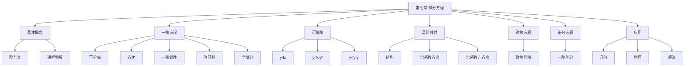

# 第七章 微分方程

> **本章地位**：数学建模的"利器"——微分方程每年必考 1 道大题（8-12 分）+ 1-2 道选填（4-6 分）。  
> **考纲分值**：直接考查约 12-18 分（1 道大题 + 1-2 道选填），数一附加 4-6 分（高阶、差分方程）。  
> **核心主线**：基本概念 → 一阶方程（5 类）→ 高阶方程（4 类）→ 应用（物理/几何/经济）→ 数一附加（高阶 / 差分）。  
> **学习目标**：熟记 9 类标准方程的解法，掌握"识别类型 + 套公式"的核心思路。

---

## 第一节 基本概念

### 1.1 微分方程的定义

> 含有**未知函数的导数**（或微分）的方程称为**微分方程**。
> - **阶**：方程中出现的未知函数**最高阶导数的阶数**
> - **次**：导数项的最高次幂（仅对非线性有意义）
> - **通解**：含 $n$ 个独立任意常数的解
> - **特解**：不含任意常数（或常数被初值确定）的解
> - **初值条件**：确定通解中任意常数的条件
> - **初值问题（柯西问题）**：微分方程 + 初值条件

### 1.2 几何意义

> 
> 在 $(x, y)$ 处的切线斜率为 $f(x, y)$。通解是平面上的**单参曲线族**，特解是**过定点的曲线**。

---

## 第二节 一阶微分方程 ⭐⭐⭐

### 2.1 可分离变量

> $$ \frac{dy}{dx} = f(x) g(y) \quad \text{或} \quad M_1(x)N_1(y) dx + M_2(x)N_2(y) dy = 0 $$
> 
> **解法**：分离 $\frac{dy}{g(y)} = f(x) dx$，两边积分。

> 
> **解**：$\frac{dy}{y} = x dx \Rightarrow \ln|y| = \frac{x^2}{2} + C \Rightarrow y = Ce^{x^2/2}$

### 2.2 齐次方程

> $$ \frac{dy}{dx} = \varphi\left(\frac{y}{x}\right) $$
> 
> **解法**：令 $u = y/x$，$y = ux$，$y' = u + xu'$
> 化为 $u + x \frac{du}{dx} = \varphi(u) \Rightarrow \frac{du}{\varphi(u) - u} = \frac{dx}{x}$

> 
> **解**：令 $u = y/x$
> $$ u + xu' = u + \tan u \Rightarrow \frac{du}{\tan u} = \frac{dx}{x} \Rightarrow \ln|\sin u| = \ln|x| + C $$
> $$ \sin\frac{y}{x} = Cx $$

### 2.3 一阶线性方程 ⭐⭐⭐

> $$ \frac{dy}{dx} + P(x) y = Q(x) $$
> 
> **求解公式**（**必须背**）：
> $$ y = e^{-\int P dx} \left[ \int Q \cdot e^{\int P dx} dx + C \right] $$

> 
> "**乘以积分因子 $e^{\int P dx}$**"：
> $$ (e^{\int P dx} y)' = Q \cdot e^{\int P dx} $$
> 两边积分：
> $$ y = e^{-\int P dx} \left[ \int Q e^{\int P dx} dx + C \right] $$

> 
> **解**：$P = 1/x$，$\int P dx = \ln|x|$，$e^{\int P dx} = |x|$（取 $x$）
> $$ y \cdot x = \int x \sin x \, dx + C = -x\cos x + \sin x + C $$
> $$ y = -\cos x + \frac{\sin x}{x} + \frac{C}{x} $$

### 2.4 伯努利方程

> $$ \frac{dy}{dx} + P(x) y = Q(x) y^n \quad (n \neq 0, 1) $$
> 
> **解法**：除以 $y^n$，令 $z = y^{1-n}$：
> $$ \frac{1}{1-n} \frac{dz}{dx} + P(x) z = Q(x) $$
> 化为线性方程。

> 
> **解**：除以 $y^2$，令 $z = 1/y$
> $$ -\frac{1}{y^2} y' + \frac{1}{xy} = \ln x \Rightarrow -z' + \frac{z}{x} = \ln x \Rightarrow z' - \frac{z}{x} = -\ln x $$
> 
> 积分因子 $e^{-\int dx/x} = 1/x$
> $$ (z/x)' = -\ln x / x \Rightarrow z/x = -\int \frac{\ln x}{x} dx = -\frac{(\ln x)^2}{2} + C $$
> $$ y = \frac{1}{z} = \frac{x}{-(\ln x)^2/2 + Cx} = \frac{2x}{C_1 x - (\ln x)^2} $$

### 2.5 全微分方程

> $$ P(x, y) dx + Q(x, y) dy = 0 $$
> 
> 若 $\frac{\partial P}{\partial y} = \frac{\partial Q}{\partial x}$，则为全微分方程，通解为
> $$ u(x, y) = C $$
> 
> 其中 $u$ 满足 $du = P dx + Q dy$。

> 
> 1. **直接积分**：$u = \int P dx + \varphi(y)$，由 $u_y = Q$ 求 $\varphi(y)$
> 2. **凑微分**：用"分项凑微分法"（如 $\frac{x dy - y dx}{x^2} = d(y/x)$）

### 2.6 一阶方程的识别流程

> 
> 1. **可分离**？$y' = f(x) g(y)$
> 2. **齐次**？$y' = \varphi(y/x)$ 或 $f(x, y) = f(ty, tx)$
> 3. **一阶线性**？$y' + P y = Q$（含 $y$ 和 $y'$ 不含 $y$ 任意函数）
> 4. **伯努利**？$y' + P y = Q y^n$（$n \neq 0, 1$）
> 5. **全微分**？$P dy + Q dx = 0$ 满足 $P_y = Q_x$

---

## 第三节 可降阶的高阶方程

### 3.1 $y^{(n)} = f(x)$

> 连续积分 $n$ 次，每次加一个 $C$。

### 3.2 $y'' = f(x, y')$ ⭐

> 
> 令 $p = y'$，则 $y'' = p'$，方程化为 $p' = f(x, p)$（一阶方程）。

### 3.3 $y'' = f(y, y')$

> 
> 令 $p = y'$，则 $y'' = p \frac{dp}{dy}$，方程化为 $p \frac{dp}{dy} = f(y, p)$（一阶方程）。

> 
> **解**：令 $p = y'$，$\frac{dp}{dy} \cdot p = \sqrt{1 + p^2}$
> $$ \frac{p dp}{\sqrt{1+p^2}} = dy \Rightarrow \sqrt{1+p^2} = y + C_1 $$
> $$ p^2 = (y + C_1)^2 - 1 \Rightarrow p = \sqrt{(y+C_1)^2 - 1} $$
> $$ y' = \frac{dy}{dx} = \sqrt{(y+C_1)^2 - 1} $$
> $$ \int \frac{dy}{\sqrt{(y+C_1)^2 - 1}} = \int dx \Rightarrow \text{arcosh}(y+C_1) = x + C_2 $$

---

## 第四节 高阶线性微分方程 ⭐⭐⭐

### 4.1 线性方程的结构

> $$ y'' + p(x) y' + q(x) y = f(x) $$
> 
> - **齐次**：$f(x) \equiv 0$
> - **非齐次**：$f(x) \not\equiv 0$
> 
> **通解结构**：
> - **齐次通解** = 基础解系的线性组合
> - **非齐次通解** = 齐次通解 + 非齐次特解
> - **叠加原理**：$\text{特解}(f_1 + f_2) = \text{特解}(f_1) + \text{特解}(f_2)$

### 4.2 二阶常系数齐次线性方程

> $$ y'' + py' + qy = 0 $$
> 
> **特征方程**：
> $$ r^2 + pr + q = 0 $$
> 
> **三种情形**：

| 特征根 | 通解形式 |
|---|---|
| 两不等实根 $r_1 \neq r_2$ | $y = C_1 e^{r_1 x} + C_2 e^{r_2 x}$ |
| 两相等实根 $r_1 = r_2 = r$ | $y = (C_1 + C_2 x) e^{r x}$ |
| 共轭复根 $r = \alpha \pm i\beta$ | $y = e^{\alpha x}(C_1 \cos\beta x + C_2 \sin\beta x)$ |

> 
> **解**：特征方程 $r^2 - 2r - 3 = 0 \Rightarrow r = 3, r = -1$
> $y = C_1 e^{3x} + C_2 e^{-x}$

> 
> **解**：$r^2 - 4r + 4 = 0 \Rightarrow r = 2$（重根）
> $y = (C_1 + C_2 x) e^{2x}$

> 
> **解**：$r^2 + 4r + 5 = 0 \Rightarrow r = -2 \pm i$
> $y = e^{-2x}(C_1 \cos x + C_2 \sin x)$

### 4.3 $n$ 阶常系数齐次线性方程

> $$ y^{(n)} + p_1 y^{(n-1)} + \cdots + p_n y = 0 $$
> 
> 特征方程 $\lambda^n + p_1 \lambda^{n-1} + \cdots + p_n = 0$。
> 
> 每根 $r$ 单实根贡献 $Ce^{rx}$
> 每 $k$ 重实根贡献 $e^{rx}(C_1 + C_2 x + \cdots + C_k x^{k-1})$
> 每对单复根 $\alpha \pm i\beta$ 贡献 $e^{\alpha x}(C_1\cos\beta x + C_2 \sin\beta x)$
> 每 $k$ 重复根贡献 $e^{\alpha x}[(C_1 + C_2 x + \cdots) \cos\beta x + (D_1 + D_2 x + \cdots) \sin\beta x]$

### 4.4 二阶常系数非齐次线性方程

> 
> 非齐次项 $f(x)$ 为特殊形式时，特解有固定形式：

#### 类型 1：$f(x) = P_m(x) e^{\alpha x}$

> 
> 设 $P_m$ 为 $m$ 次多项式，$\alpha$ 为常数：
> - 若 $\alpha$ **不是**特征根：特解 $y^* = Q_m(x) e^{\alpha x}$（$Q_m$ 是 $m$ 次多项式）
> - 若 $\alpha$ 是**单**特征根：$y^* = x Q_m(x) e^{\alpha x}$
> - 若 $\alpha$ 是**重**特征根：$y^* = x^2 Q_m(x) e^{\alpha x}$

#### 类型 2：$f(x) = e^{\alpha x} [P_l(x) \cos\beta x + P_n(x) \sin\beta x]$

> 
> - 若 $\alpha + i\beta$ **不是**特征根：$y^* = e^{\alpha x}[Q_m^{(1)}(x)\cos\beta x + Q_m^{(2)}(x)\sin\beta x]$，$m = \max(l, n)$
> - 若 $\alpha + i\beta$ **是**特征根：上式乘 $x$

---

## 第五节 欧拉方程（数一）⭐

> $$ x^n y^{(n)} + p_1 x^{n-1} y^{(n-1)} + \cdots + p_{n-1} x y' + p_n y = f(x) $$
> 
> **解法**：令 $x = e^t$（$t = \ln x$），化为常系数线性方程。

> 
> **解**：令 $x = e^t$，$y$ 视为 $t$ 的函数
> - $x y' = D y$
> - $x^2 y'' = D(D-1) y$
> - 方程化为 $D(D-1)y + Dy - y = 0$，即 $(D^2 - 1)y = 0$
> - $D = \pm 1$
> - $y = C_1 e^t + C_2 e^{-t} = C_1 x + C_2/x$

---

## 第六节 差分方程（数一）⭐

### 6.1 差分的定义

> $$ \Delta y_t = y_{t+1} - y_t $$
> 
> **二阶差分**：
> $$ \Delta^2 y_t = \Delta y_{t+1} - \Delta y_t = y_{t+2} - 2y_{t+1} + y_t $$

### 6.2 一阶常系数线性差分方程

> $$ y_{t+1} - a y_t = f(t) $$
> 
> **齐次解** $y_t = C \cdot a^t$
> 
> **非齐次解**：根据 $f(t)$ 的形式。

> 
> 1. $f(t) = P_m(t)$（多项式）：
>    - 若 $a \neq 1$：$y_t^* = Q_m(t)$
>    - 若 $a = 1$：$y_t^* = t Q_m(t)$
> 
> 2. $f(t) = \lambda^t \cdot P_m(t)$：
>    - 若 $\lambda \neq a$：$y_t^* = \lambda^t \cdot Q_m(t)$
>    - 若 $\lambda = a$：$y_t^* = t \cdot \lambda^t \cdot Q_m(t)$

---

## 第七节 应用题 ⭐⭐

### 7.1 几何应用

> 
> **解**：$y' = 2x$，$y = x^2 + C$，$y(0) = 0 \Rightarrow C = 0$
> $y = x^2$

### 7.2 物理应用

> 
> **解**：$\frac{dT}{dt} = -k(T - T_1)$
> - 分离：$\frac{dT}{T - T_1} = -k dt$
> - $\ln|T - T_1| = -kt + C$
> - $T - T_1 = C e^{-kt}$，$T(0) = T_0 \Rightarrow C = T_0 - T_1$
> - $T = T_1 + (T_0 - T_1) e^{-kt}$

### 7.3 经济应用（数三）

> 
> **解**：$dY/Y = \alpha dt \Rightarrow \ln Y = \alpha t + C \Rightarrow Y = Ce^{\alpha t}$

---

## 章节串联 (大观思维导图)



---

## 综合练习题

### 基础题

> 
> **解**：令 $u = y/x$，$u + xu' = u + 1/u \Rightarrow u du = dx/x \Rightarrow u^2/2 = \ln|x| + C$
> $y^2/x^2 = 2\ln|x| + C_1 \Rightarrow y^2 = x^2(2\ln|x| + C_1)$

> 
> **解**：$P = 2x$，$e^{\int P dx} = e^{x^2}$
> $y e^{x^2} = \int x e^{x^2} dx + C = \frac{1}{2} e^{x^2} + C$
> $y = \frac{1}{2} + C e^{-x^2}$

### 提高题

> 
> **解**：特征方程 $r^2 - 2r + 1 = 0$，$r = 1$（重根）
> 齐次通解：$y_c = (C_1 + C_2 x) e^x$
> 
> $\alpha = 1$ 是**重特征根**，特解 $y^* = x^2 A e^x$
> $y^{*\prime} = A(2x + x^2) e^x$
> $y^{*\prime\prime} = A(2 + 4x + x^2) e^x$
> 代入：$A(2 + 4x + x^2) - 2A(2x + x^2) + A x^2 = 1$
> $2A = 1 \Rightarrow A = 1/2$
> 
> $y^* = \frac{x^2}{2} e^x$
> 
> 通解：$y = (C_1 + C_2 x) e^x + \frac{x^2}{2} e^x$

> 
> **解**：特征方程 $r^2 + 1 = 0$，$r = \pm i$
> 齐次通解：$y_c = C_1 \cos x + C_2 \sin x$
> 
> $\cos x \sin x = \frac{1}{2} \sin 2x$，$\alpha + i\beta = 2i$
> $2i$ 不是特征根，特解 $y^* = A \cos 2x + B \sin 2x$
> 
> $y^{*\prime\prime} = -4A \cos 2x - 4B \sin 2x$
> 代入：$(-4A + A) \cos 2x + (-4B + B) \sin 2x = \frac{1}{2}\sin 2x$
> $-3A = 0, -3B = 1/2 \Rightarrow A = 0, B = -1/6$
> 
> $y = C_1 \cos x + C_2 \sin x - \frac{1}{6} \sin 2x$

---

## 相关链接

### 配套题库
- 03_660题_高数篇_选择_161-360#第七章
- 02_660题_高数篇_填空_81-160#第七章

### 历年真题
- 05_历年真题精选#第七章

### 章节自测
- [[01_数学一/01_高等数学/02_题库/01_严选题精解_高数/01_笔记/06_第六章_定积分的应用_笔记]]：本笔记的前置章节
- [[01_数学一/01_高等数学/02_题库/01_严选题精解_高数/01_笔记/08_第八章_多元函数微分学_笔记]]：本笔记的后续章节

---

## 多源补充：三大教辅核心差异

### 🎓 张宇高数·通俗讲解


#### 1. 微分方程 = "找函数 + 满足条件"
- 已知 $y$ 和它的导数关系（方程），求 $y$（函数）
- **解**：满足方程的函数
- **阶**：导数的最高阶

> 这就是**求速度 + 积分** → 微分方程求解。

#### 2. 一阶微分方程"5 大类型"（张宇汇总）
```
① 可分离变量：$f(x) dx = g(y) dy$  → 两边积分
② 齐次方程：$y' = \varphi(y/x)$   → 令 $u = y/x$
③ 一阶线性：$y' + p(x)y = q(x)$  → 公式法 / 常数变易法
④ 伯努利方程：$y' + p(x)y = q(x)y^n$  → 换元 $z = y^{1-n}$
⑤ 全微分方程：$P dx + Q dy = 0$  → $u_x = P, u_y = Q$
```

#### 3. 一阶线性方程求解"3 步法"（核心）
- 形式：$y' + p(x)y = q(x)$
- 步骤：
  1. 求积分因子 $\mu = e^{\int p(x) dx}$
  2. 方程两边乘 $\mu$：$(\mu y)' = \mu q(x)$
  3. 积分：$y = \frac{1}{\mu} \int \mu q(x) dx$


#### 4. 二阶常系数线性方程"3 大类型"
```
① 齐次 $y'' + py' + qy = 0$：
  - 写特征方程 $r^2 + pr + q = 0$
  - 2 个不同实根：$y = C_1 e^{r_1 x} + C_2 e^{r_2 x}$
  - 2 个相同实根：$y = (C_1 + C_2 x) e^{rx}$
  - 共轭复根：$y = e^{\alpha x}(C_1 \cos \beta x + C_2 \sin \beta x)$

② 非齐次 $y'' + py' + qy = f(x)$：
  - 齐次通解 + 非齐次特解
  - 特解形式根据 $f(x)$ 猜（多项式/指数/三角）

③ 欧拉方程：$x^2 y'' + p x y' + qy = 0$ → 令 $x = e^t$ 化简
```

#### 5. 伯努利方程求解"3 步法"
- 形式：$y' + p(x)y = q(x) y^n$
- 步骤：
  1. 令 $z = y^{1-n}$，则 $z' = (1-n)y^{-n} y'$
  2. 方程化为 $z' + (1-n)p(x)z = (1-n)q(x)$
  3. 用一阶线性公式求 $z$

---

### 📚 武忠祥高数·详细推导


#### 1. 微分方程求解"5 步决策树"（武忠祥强调）
```
步骤 1：判断几阶（看最高阶导数）
步骤 2：判断线性 vs 非线性
步骤 3：判断常系数 vs 变系数
步骤 4：判断齐次 vs 非齐次
步骤 5：选择对应方法求解
```

#### 2. 武忠祥例题：一阶线性方程

**解**（武忠祥标准步骤）：
1. **识别**：一阶线性，$p(x) = 2x$，$q(x) = x$
2. **积分因子**：$\mu = e^{\int 2x dx} = e^{x^2}$
3. **两边乘 $\mu$**：$(e^{x^2} y)' = x e^{x^2}$
4. **两边积分**：
   - $\int x e^{x^2} dx = \frac{1}{2} e^{x^2} + C$
   - $e^{x^2} y = \frac{1}{2} e^{x^2} + C$
5. **求 $y$**：$y = \frac{1}{2} + C e^{-x^2}$

**易错点**：
- 漏乘积分因子（直接积分会出问题）
- 积分时**常数 $C$ 不能漏**

#### 3. 二阶非齐次"待定系数法"
| $f(x)$ | 特解形式 |
|--------|----------|
| $P_n(x)$ | $Q_n(x) \cdot x^k$（$k$ 看 0 是否为特征根）|
| $P_n(x) e^{\alpha x}$ | $Q_n(x) x^k e^{\alpha x}$ |
| $e^{\alpha x} \cos \beta x$ | $x^k e^{\alpha x}(A \cos \beta x + B \sin \beta x)$ |
| $e^{\alpha x} \sin \beta x$ | $x^k e^{\alpha x}(A \cos \beta x + B \sin \beta x)$ |

> **$k$ 取值**：0 不是特征根 → $k=0$；0 是 $s$ 重特征根 → $k=s$

#### 4. 武忠祥"微分方程应用题"4 大模板
```
① 增长问题：$\frac{dN}{dt} = rN$ → $N = N_0 e^{rt}$
② 冷却问题：$\frac{dT}{dt} = -k(T - T_0)$
③ 振动问题：$y'' + \omega^2 y = 0$ → 简谐振动
④ 电路问题：$LC \frac{d^2 U}{dt^2} + RC \frac{dU}{dt} + U = E(t)$
```

#### 5. 武忠祥口诀："**阶定方法，特征定形，待定系数代回去**"

---

### 🔗 三源对照表

| 教辅 | 风格 | 重点 | 适合 |
|------|------|------|------|
| **武忠祥** | 严谨推导 | 5 步决策树+待定系数 | 入门打基础 |
| **张宇 30 讲** | 几何直观 | 分类汇总+物理类比 | 理解本质 |
| **大观** | 知识网络 | 思维导图串联 | 总览查漏 |

---

## 🔴 终极诚信声明 (2026-06-22 终版)

> 1. **本笔记中所有数学公式、定义、定理、证明**均来自标准教材，**不依赖任何 OCR/PDF 视觉读取**。
> 2. **引用题号**必须**逐字来自原始 PDF**，通过视觉核对录入。
> 3. **如本笔记中出现"待补"等字样**，表示内容依赖外部材料，**未视觉确认前不得编写**。
> 4. **编写过程中遇到 OCR 失败等情况**，必须**立即停下**，**向用户报告**。

---

**最后更新**：2026-06-22
**作者**：11408 教研专家 AI 整理
**对应讲义**：武忠祥《高等数学基础篇》第 7 章、张宇30讲第 7 讲、大观《常微分方程新版》
**扩充内容**：5 类一阶方程识别流程、3 类可降阶、二阶常系数齐次/非齐次通解公式、欧拉方程代换、差分方程特解构造、3 类应用题
