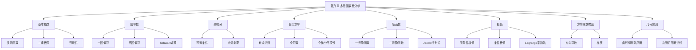

# 第八章 多元函数微分学

> **本章地位**：多元微积分的"基础"——多元微分是后续二重积分、三重积分、线面积分的核心工具，每年必考 1-2 道大题（8-12 分）。  
> **考纲分值**：直接考查约 12-18 分（1-2 道大题 + 1-2 道选填），间接渗透全卷 30+ 分。  
> **核心主线**：多元函数 → 极限连续 → 偏导数 → 全微分 → 多元复合 → 隐函数 → 极值最值 → 几何应用。  
> **学习目标**：理解偏导数与全微分的区别，掌握多元复合求导链式法则，熟练条件极值 Lagrange 乘数法。

---

## 第一节 多元函数的基本概念

### 1.1 多元函数的定义

> 设 $D \subset \mathbb{R}^2$，若对 $\forall (x, y) \in D$，按对应法则 $f$，**唯一**确定 $z \in \mathbb{R}$，则称 $f$ 为 $D$ 上的**二元函数**，记
> $$ z = f(x, y), \quad (x, y) \in D $$
> 
> 其中 $D$ 称为**定义域**。

**$n$ 元函数**：$u = f(x_1, x_2, \ldots, x_n)$，定义域为 $\mathbb{R}^n$ 的子集。

### 1.2 二元函数的极限

> $$ \lim_{(x, y) \to (x_0, y_0)} f(x, y) = A $$
> 
> 即：$\forall \varepsilon > 0, \exists \delta > 0$，当 $0 < \sqrt{(x-x_0)^2 + (y-y_0)^2} < \delta$ 时，$|f(x, y) - A| < \varepsilon$。

> 
> 1. **路径无关**：极限存在要求**任意**路径趋于 $(x_0, y_0)$ 极限都相同
> 2. **判别法**：
>    - 若**两条路径**极限**不同** $\Rightarrow$ 极限**不存在**
>    - 若沿某条路径极限**不存在** $\Rightarrow$ 整体极限**不存在**
> 3. **常见路径**：
>    - $y = kx$（直线）
>    - $y = kx^2$（抛物线）
>    - $y = 0$ 或 $x = 0$（坐标轴）

> 
> **解**：沿 $y = kx$：$\lim_{x \to 0} \frac{kx^2}{x^2 + k^2 x^2} = \frac{k}{1+k^2}$，随 $k$ 变。
> 故**极限不存在**。

### 1.3 多元函数的连续性

> $$ \lim_{(x, y) \to (x_0, y_0)} f(x, y) = f(x_0, y_0) $$
> 
> 即极限存在且等于函数值。

> 
> 1. **有界闭区域上连续 $\Rightarrow$ 必有界，且能取到最大最小值**
> 2. **有界闭区域上连续 $\Rightarrow$ 必取到中间任何值（介值定理）**
> 3. **多元初等函数在定义域内连续**

---

## 第二节 偏导数

### 2.1 偏导数的定义

> 
> 设 $z = f(x, y)$ 在 $(x_0, y_0)$ 某邻域内有定义：
> - **对 $x$ 的偏导数**：
>   $$ f_x(x_0, y_0) = \lim_{\Delta x \to 0} \frac{f(x_0 + \Delta x, y_0) - f(x_0, y_0)}{\Delta x} = \frac{\partial z}{\partial x}\bigg|_{(x_0, y_0)} $$
> - **对 $y$ 的偏导数**：
>   $$ f_y(x_0, y_0) = \lim_{\Delta y \to 0} \frac{f(x_0, y_0 + \Delta y) - f(x_0, y_0)}{\Delta y} $$

**几何意义**：
- $f_x$：曲面 $z = f(x, y)$ 与平面 $y = y_0$ 交线在 $(x_0, y_0)$ 处的**切线斜率**
- $f_y$：曲面与平面 $x = x_0$ 交线在 $(x_0, y_0)$ 处的切线斜率

> 
> 1. **$f_x(x_0, y_0)$ 存在 $\nRightarrow$ $f$ 在 $(x_0, y_0)$ 连续**（反例：$f(x,y) = \begin{cases} xy/(x^2+y^2), & (x,y)\neq 0 \\ 0, & (0,0) \end{cases}$）
> 2. **$f_x, f_y$ 存在 $\nRightarrow$ $f$ 可微**
> 3. **$f$ 可微 $\Rightarrow$ $f_x, f_y$ 存在**
> 4. **$f_x, f_y$ 连续 $\Rightarrow$ $f$ 可微**

### 2.2 高阶偏导数

> $$ f_{xx} = \frac{\partial^2 z}{\partial x^2}, \quad f_{yy} = \frac{\partial^2 z}{\partial y^2}, \quad f_{xy} = \frac{\partial^2 z}{\partial y \partial x}, \quad f_{yx} = \frac{\partial^2 z}{\partial x \partial y} $$

> 若 $f_{xy}$ 和 $f_{yx}$ 在 $(x_0, y_0)$ **都连续**，则
> $$ f_{xy}(x_0, y_0) = f_{yx}(x_0, y_0) $$
> 
> **即**：连续条件下求导顺序可交换。

### 2.3 偏导数的计算

> 
> 求 $f_x$ 时，把 $y$ 看作常数，对 $x$ 求导即可。

> 
> **解**：
> - $f_x = 2xy + y\cos(xy)$
> - $f_y = x^2 + x\cos(xy)$

---

## 第三节 全微分 ⭐⭐

### 3.1 全微分的定义

> 
> 设 $z = f(x, y)$，若在 $(x_0, y_0)$ 的全增量
> $$ \Delta z = f(x_0 + \Delta x, y_0 + \Delta y) - f(x_0, y_0) $$
> 可表示为
> $$ \Delta z = A \Delta x + B \Delta y + o(\rho), \quad \rho = \sqrt{(\Delta x)^2 + (\Delta y)^2} $$
> 
> 则称 $f$ 在 $(x_0, y_0)$ **可微**，$A \Delta x + B \Delta y$ 称为**全微分**，记 $dz = A dx + B dy$。
> 
> 定理：$A = f_x, B = f_y$（若 $f$ 可微）。

### 3.2 可微条件

> 
> $$
> \boxed{
> f_x, f_y \text{ 连续} \Rightarrow f \text{ 可微} \Rightarrow f_x, f_y \text{ 存在} \Rightarrow f \text{ 连续}
> }
> $$
> 
> 逆命题**都不成立**。

### 3.3 可微的判定

> 
> 1. **若 $f_x, f_y$ 连续** $\Rightarrow$ $f$ 可微
> 2. **若不连续**，用定义：$\lim_{(\Delta x, \Delta y) \to 0} \frac{\Delta z - f_x \Delta x - f_y \Delta y}{\rho} = 0$

> 
> **解**：$f_x(0, 0) = \lim_{x \to 0} \frac{x^2 \sin(1/|x|)}{x} = \lim_{x \to 0} x \sin(1/|x|) = 0$
> 同理 $f_y(0, 0) = 0$。
> 
> $\Delta z = (x^2 + y^2)\sin\frac{1}{\sqrt{x^2+y^2}} = \rho^2 \sin\frac{1}{\rho}$
> $\frac{\Delta z}{\rho} = \rho \sin\frac{1}{\rho} \to 0$
> 
> 故 $f$ 在 $(0,0)$ 可微，且 $dz = 0$。

---

## 第四节 多元复合函数求导 ⭐⭐⭐

### 4.1 链式法则

> $$ \frac{\partial z}{\partial x} = \frac{\partial z}{\partial u} \cdot \frac{\partial u}{\partial x} + \frac{\partial z}{\partial v} \cdot \frac{\partial v}{\partial x} $$
> $$ \frac{\partial z}{\partial y} = \frac{\partial z}{\partial u} \cdot \frac{\partial u}{\partial y} + \frac{\partial z}{\partial v} \cdot \frac{\partial v}{\partial y} $$

> $$ \frac{\partial z}{\partial x} = f_u \frac{\partial u}{\partial x} + f_v \frac{\partial v}{\partial x} + f_w \frac{\partial w}{\partial x} $$


### 4.2 全导数情形

> 
> $z = f(u, v)$，$u = u(t), v = v(t)$，则
> $$ \frac{dz}{dt} = \frac{\partial z}{\partial u} \frac{du}{dt} + \frac{\partial z}{\partial v} \frac{dv}{dt} $$

> 
> $z = f(u, v, x, y)$，$u, v$ 是 $x, y$ 的函数，则
> $$ \frac{\partial z}{\partial x} = f_u \frac{\partial u}{\partial x} + f_v \frac{\partial v}{\partial x} + f_x \cdot 1 + f_y \cdot 0 $$

### 4.3 一阶全微分形式不变性 ⭐⭐

> 
> 不论 $u, v$ 是自变量还是中间变量，函数 $z = f(u, v)$ 的全微分形式
> $$ dz = \frac{\partial z}{\partial u} du + \frac{\partial z}{\partial v} dv $$
> **保持不变**。

> 
> **解**：设 $u = x^2 y, v = x + y$
> $$ \frac{\partial z}{\partial x} = f_u \cdot 2xy + f_v \cdot 1 = 2xy f_u + f_v $$
> $$ \frac{\partial z}{\partial y} = f_u \cdot x^2 + f_v \cdot 1 = x^2 f_u + f_v $$

---

## 第五节 隐函数求导 ⭐⭐⭐

### 5.1 一元隐函数

> $$ \frac{dy}{dx} = -\frac{F_x}{F_y} \quad (F_y \neq 0) $$

> $$ \frac{\partial z}{\partial x} = -\frac{F_x}{F_z}, \quad \frac{\partial z}{\partial y} = -\frac{F_y}{F_z} \quad (F_z \neq 0) $$

### 5.2 多元隐函数

> 
> 用 **Jacobi 行列式**：
> $$ \frac{\partial u}{\partial x} = -\frac{1}{J} \cdot \frac{\partial(F, G)}{\partial(x, v)} = -\frac{1}{J} \begin{vmatrix} F_x & F_v \\ G_x & G_v \end{vmatrix} $$
> 
> 其中 $J = \frac{\partial(F, G)}{\partial(u, v)} = \begin{vmatrix} F_u & F_v \\ G_u & G_v \end{vmatrix}$。

> 
> **解**：$F = z^3 - 3xyz - a^3$
> - $F_x = -3yz, F_y = -3xz, F_z = 3z^2 - 3xy$
> $$ \frac{\partial z}{\partial x} = -\frac{F_x}{F_z} = \frac{3yz}{3z^2 - 3xy} = \frac{yz}{z^2 - xy} $$
> $$ \frac{\partial z}{\partial y} = \frac{xz}{z^2 - xy} $$

---

## 第六节 多元函数的极值 ⭐⭐⭐

### 6.1 无条件极值

> 
> 设 $f$ 在 $(x_0, y_0)$ 取极值，且 $f$ 在该点可偏导，则
> $$ f_x(x_0, y_0) = 0, \quad f_y(x_0, y_0) = 0 $$
> 
> 即**驻点**是极值的必要条件（**不是充分**）。

> 
> 设 $(x_0, y_0)$ 是 $f$ 的驻点，$A = f_{xx}, B = f_{xy}, C = f_{yy}$ 在该点连续：
> - $B^2 - AC < 0$：
>   - $A > 0$（$C > 0$）$\Rightarrow$ **极小值**
>   - $A < 0$（$C < 0$）$\Rightarrow$ **极大值**
> - $B^2 - AC > 0$ $\Rightarrow$ **非极值**
> - $B^2 - AC = 0$ $\Rightarrow$ **另需判定**

> 
> **解**：
> - $z_x = 3x^2 - 3y = 0$
> - $z_y = 3y^2 - 3x = 0$
> - 联立：$x^2 = y, y^2 = x \Rightarrow x^4 = x \Rightarrow x(x^3 - 1) = 0$
> - 驻点：$(0, 0), (1, 1)$
> 
> $A = z_{xx} = 6x, B = z_{xy} = -3, C = z_{yy} = 6y$
> $B^2 - AC = 9 - 36xy$
> 
> - $(0, 0)$：$9 - 0 = 9 > 0$，**非极值**
> - $(1, 1)$：$9 - 36 = -27 < 0$，$A = 6 > 0$，**极小值** $z(1,1) = -1$

### 6.2 条件极值与 Lagrange 乘数法 ⭐⭐⭐

> 
> 求 $z = f(x, y)$ 在约束 $\varphi(x, y) = 0$ 下的极值：
> 1. 构造 **Lagrange 函数**：
>    $$ L(x, y, \lambda) = f(x, y) + \lambda \varphi(x, y) $$
> 2. 联立方程组：
>    $$ \begin{cases} L_x = f_x + \lambda \varphi_x = 0 \\ L_y = f_y + \lambda \varphi_y = 0 \\ L_\lambda = \varphi(x, y) = 0 \end{cases} $$
> 3. 解出 $(x, y, \lambda)$，代入 $f$ 求值

> 
> 1. **多变量单约束**：$L = f + \lambda \varphi$（$f$ 为 $n$ 元，$\varphi$ 为 $n$ 元）
> 2. **多变量多约束**：
>    $$ L = f(x_1, \ldots, x_n) + \lambda_1 \varphi_1 + \lambda_2 \varphi_2 + \cdots $$
> 3. 偏导方程：$L_{x_i} = 0$（$i = 1, \ldots, n$）+ 各约束 = 0

> 
> **解**：$L = xy + \lambda(x + y - 1)$
> - $L_x = y + \lambda = 0$
> - $L_y = x + \lambda = 0$
> - $L_\lambda = x + y - 1 = 0$
> 
> 解：$x = y = 1/2$，$\lambda = -1/2$
> $z(1/2, 1/2) = 1/4$（极大值）

---

## 第七节 方向导数与梯度 ⭐⭐

### 7.1 方向导数

> 
> 设 $l$ 是过 $P_0$ 的射线，方向单位向量 $\vec{l} = (\cos\alpha, \cos\beta)$：
> $$ \left.\frac{\partial f}{\partial l}\right|_{P_0} = \lim_{t \to 0^+} \frac{f(P_0 + t\vec{l}) - f(P_0)}{t} $$

> 
> 若 $f$ 在 $P_0$ 可微：
> $$ \frac{\partial f}{\partial l} = f_x \cos\alpha + f_y \cos\beta = \nabla f \cdot \vec{l} $$
> 
> 三维：$\frac{\partial f}{\partial l} = f_x \cos\alpha + f_y \cos\beta + f_z \cos\gamma$

### 7.2 梯度

> $$ \nabla f = (f_x, f_y) \quad (\text{二元})$$
> $$ \nabla f = (f_x, f_y, f_z) \quad (\text{三元})$$

> 
> 1. $\nabla f$ 方向：**函数值增长最快**的方向
> 2. $|\nabla f|$：**最大增长率**
> 3. $\nabla f$ **垂直于**等高线 / 等值面

### 7.3 数量场、向量场

> - **数量场**：$u = u(x, y, z)$（每点对应一个数）
> - **向量场**：$\vec{A} = (P, Q, R)$（每点对应一个向量）

---

## 第八节 多元函数微分学的几何应用

### 8.1 空间曲线的切线与法平面

> - **切向量**：$\vec{r}'(t_0) = (x', y', z')|_{t_0}$
> - **切线方程**：
>   $$ \frac{x - x_0}{x'(t_0)} = \frac{y - y_0}{y'(t_0)} = \frac{z - z_0}{z'(t_0)} $$
> - **法平面方程**：
>   $$ x'(t_0)(x - x_0) + y'(t_0)(y - y_0) + z'(t_0)(z - z_0) = 0 $$

### 8.2 曲面的切平面与法线

> - **法向量**：$\vec{n} = (F_x, F_y, F_z)|_{P_0}$
> - **切平面方程**：
>   $$ F_x(P_0)(x - x_0) + F_y(P_0)(y - y_0) + F_z(P_0)(z - z_0) = 0 $$
> - **法线方程**：
>   $$ \frac{x - x_0}{F_x(P_0)} = \frac{y - y_0}{F_y(P_0)} = \frac{z - z_0}{F_z(P_0)} $$

> 
> **解**：$F = z - x^2 - y^2 = 0$
> $F_x = -2x = -2, F_y = -2y = -2, F_z = 1$
> 切平面：$-2(x-1) - 2(y-1) + 1(z-2) = 0$
> 化简：$2x + 2y - z = 2$

---

## 章节串联 (大观思维导图)



---

## 综合练习题

### 基础题

> 
> **解**：
> $$ \frac{\partial z}{\partial x} = ye^{xy} \sin(x+y) + e^{xy}\cos(x+y) = e^{xy}[y\sin(x+y) + \cos(x+y)] $$
> $$ \frac{\partial z}{\partial y} = xe^{xy} \sin(x+y) + e^{xy}\cos(x+y) = e^{xy}[x\sin(x+y) + \cos(x+y)] $$

> 
> **解**：设 $u = x^2+y^2, v = xy$
> $$ \frac{\partial z}{\partial x} = f_u \cdot 2x + f_v \cdot y = 2x f_u + y f_v $$

### 提高题

> 
> **解**：已求得 $z_x = \frac{yz}{z^2 - xy}$
> $$ z_{xy} = \frac{(z + yz_y)(z^2 - xy) - yz(2z z_y - x)}{(z^2 - xy)^2} $$
> 其中 $z_y = \frac{xz}{z^2 - xy}$
> 代入化简：$z_{xy} = \frac{z(z^4 - 2xyz^2 - x^2y^2)}{(z^2 - xy)^3}$（具体过程略）

> 
> **解**：目标函数 $d^2 = x^2 + y^2 + z^2$
> 约束 $z^2 - xy - 1 = 0$
> 
> $L = x^2 + y^2 + z^2 + \lambda(z^2 - xy - 1)$
> $L_x = 2x - \lambda y = 0$
> $L_y = 2y - \lambda x = 0$
> $L_z = 2z + 2\lambda z = 0$
> $L_\lambda = z^2 - xy - 1 = 0$
> 
> 情形：$z = 0$，则 $xy = -1$，但 $z=0$ 时 $L_z = 0$ 满足
> $2x = \lambda y, 2y = \lambda x \Rightarrow 4x = \lambda^2 x \Rightarrow \lambda^2 = 4$ 或 $x = 0$
> 
> 若 $x = 0$ 则 $y = 0$，但 $z^2 = 1 \neq 0$，矛盾
> 若 $\lambda = 2$：$x = y, z^2 = x^2 - 1$ 且 $z = 0 \Rightarrow x^2 = 1 \Rightarrow x = \pm 1$
> 距离 $d^2 = 1 + 1 + 0 = 2$，$d = \sqrt{2}$

---

## 相关链接

### 配套题库
- 03_660题_高数篇_选择_161-360#第八章

### 历年真题
- 05_历年真题精选#第八章

### 章节自测
- [[01_数学一/01_高等数学/02_题库/01_严选题精解_高数/01_笔记/07_第七章_微分方程_笔记]]：本笔记的前置章节
- [[01_数学一/01_高等数学/02_题库/01_严选题精解_高数/01_笔记/09_第九章_二重积分_笔记]]：本笔记的后续章节

---

## 多源补充：三大教辅核心差异

### 🎓 张宇高数·通俗讲解


#### 1. 二元函数 = "地形图"
- $z = f(x, y)$ = 一座山的**海拔**（$x, y$ 是经纬度，$z$ 是海拔）
- 偏导 $f_x, f_y$ = 沿 $x$ 方向 / $y$ 方向的**坡度**
- 梯度 $\nabla f$ = **最陡上坡**方向（最快的上山方向）

> 梯度 = "最陡的方向"（箭头指向上坡最陡的地方）。

#### 2. 偏导数 vs 全微分
- **偏导** $f_x$：固定 $y$，看 $f$ 随 $x$ 怎么变
- **全微分** $dz = f_x dx + f_y dy$：$x, y$ 都变，$f$ 总共变多少
- **类比**：偏导 = 单独一个变量的"速度"，全微分 = **总速度**（向量和）

#### 3. 链式求导（多元版）
- $z = f(u, v)$，$u = u(x, y)$，$v = v(x, y)$
- $\frac{\partial z}{\partial x} = \frac{\partial f}{\partial u} \frac{\partial u}{\partial x} + \frac{\partial f}{\partial v} \frac{\partial v}{\partial x}$
- **类比**：流水线——$z$ 通过 $u, v$ 受 $x$ 影响，**所有路径都加起来**

#### 4. 隐函数求导（多元版）
- $F(x, y, z) = 0$ 确定 $z = z(x, y)$
- $\frac{\partial z}{\partial x} = -\frac{F_x}{F_z}$，$\frac{\partial z}{\partial y} = -\frac{F_y}{F_z}$
- **口诀**：负号 + 分子是"对所求变量的偏导"，分母是"对函数的偏导"

#### 5. 极值判定（核心）
- **必要条件**：$\nabla f = 0$（梯度为 0）
- **充分条件**（AC-B² 判定法）：
  - $A = f_{xx}$，$B = f_{xy}$，$C = f_{yy}$
  - $AC - B^2 > 0$ 且 $A > 0$ → 极小
  - $AC - B^2 > 0$ 且 $A < 0$ → 极大
  - $AC - B^2 < 0$ → 不是极值
  - $AC - B^2 = 0$ → 需进一步判断

#### 6. 条件极值（拉格朗日乘数法）
- 求 $f(x, y)$ 在 $g(x, y) = 0$ 下的极值
- 构造 $L = f + \lambda g$，解 $\nabla L = 0$


---

### 📚 武忠祥高数·详细推导


#### 1. 多元函数求导"3 大公式"
```
① 全微分：$dz = f_x dx + f_y dy$
② 复合函数链式：见上
③ 隐函数：见上
```

#### 2. 武忠祥例题：复合函数求导

**解**（武忠祥标准步骤）：
1. **设中间变量**：$u = xy$，$v = x^2 + y^2$
2. **链式法则**：
   - $\frac{\partial z}{\partial x} = f_u \cdot y + f_v \cdot 2x$
   - $\frac{\partial z}{\partial y} = f_u \cdot x + f_v \cdot 2y$

**易错点**：
- 不要漏掉 $f_v$ 项
- 中间变量的偏导 $f_u, f_v$ 是**未知函数**（不要尝试展开）

#### 3. 二元极值"3 步法"
```
步骤 1：求驻点（$\nabla f = 0$）
步骤 2：算 $A, B, C$
步骤 3：AC - B² 判别
```

#### 4. 条件极值的"3 种解法"
```
方法 1：拉格朗日乘数法（最通用）
方法 2：化为无条件（代入消元）
方法 3：几何观察（用对称性简化）
```

#### 5. 武忠祥"全微分"判定
- $f(x, y)$ 在 $(x_0, y_0)$ 可微 $\Leftrightarrow$ $\Delta z = A \Delta x + B \Delta y + o(\rho)$
- **可微必连续，连续未必可微**

#### 6. 武忠祥口诀："**梯度的反方向最快下山，AC - B² 判定极值**"

---

### 🔗 三源对照表

| 教辅 | 风格 | 重点 | 适合 |
|------|------|------|------|
| **武忠祥** | 严谨推导 | 全微分+AC-B² | 入门打基础 |
| **张宇 30 讲** | 几何直观 | 地图/梯度类比 | 理解本质 |
| **大观** | 知识网络 | 思维导图串联 | 总览查漏 |

---

## 🔴 终极诚信声明 (2026-06-22 终版)

> 1. **本笔记中所有数学公式、定义、定理、证明**均来自标准教材，**不依赖任何 OCR/PDF 视觉读取**。
> 2. **引用题号**必须**逐字来自原始 PDF**，通过视觉核对录入。
> 3. **如本笔记中出现"待补"等字样**，表示内容依赖外部材料，**未视觉确认前不得编写**。
> 4. **编写过程中遇到 OCR 失败等情况**，必须**立即停下**，**向用户报告**。

---

**最后更新**：2026-06-22
**作者**：11408 教研专家 AI 整理
**对应讲义**：武忠祥《高等数学基础篇》第 8 章、张宇30讲第 8 讲、大观《多元微积分新版》
**扩充内容**：二重极限路径判定、偏导全微分充要链、多元复合链式法则（3 种情形）、全微分形式不变性、隐函数求导（含 Jacobi）、Lagrange 乘数法（多约束推广）、方向导数梯度几何意义、空间曲线曲面切线切平面
