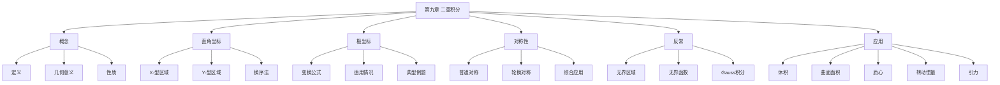

# 第九章 二重积分

> **本章地位**：多元积分的"基础"——二重积分是后续三重积分、线面积分的基础，每年必考 1 道大题（8-12 分）+ 1-2 道选填。  
> **考纲分值**：直接考查约 12-18 分（1 道大题 + 1-2 道选填），间接渗透全卷 20+ 分。  
> **核心主线**：二重积分概念 → 直角坐标计算 → 极坐标计算 → 对称性 → 反常二重积分 → 应用。  
> **学习目标**：熟练 2 大计算方法（直角 / 极坐标），掌握 4 类对称性简化技巧，识别 5 类常见积分区域。

---

## 第一节 二重积分的概念

### 1.1 定义

> 
> 设 $f(x, y)$ 在有界闭区域 $D$ 上有界，$D$ 任意分划为 $n$ 个小区域 $\Delta\sigma_i$（面积），任取 $(\xi_i, \eta_i) \in \Delta\sigma_i$，$\lambda = \max \Delta\sigma_i$ 直径，若
> $$ \lim_{\lambda \to 0} \sum_{i=1}^n f(\xi_i, \eta_i) \Delta\sigma_i $$
> 存在且与分法、$(\xi_i, \eta_i)$ 选取无关，则称 $f$ 在 $D$ **可积**，记
> $$ \iint_D f(x, y) d\sigma = \lim_{\lambda \to 0} \sum f(\xi_i, \eta_i) \Delta\sigma_i $$

> 
> 1. $f$ 在 $D$ 连续 $\Rightarrow$ 可积
> 2. $f$ 在 $D$ 有界，间断点**测度为 0**（如有限个间断点 / 有限条间断线）$\Rightarrow$ 可积

### 1.2 几何意义

> 
> - $f \geq 0$：$\iint_D f d\sigma$ = 曲顶柱体**体积**
> - $f \leq 0$：体积**取负**
> - 异号：曲顶柱体**代数和**（即净体积）

### 1.3 基本性质

> 
> 1. **线性性**：$\iint_D (\alpha f + \beta g) = \alpha \iint_D f + \beta \iint_D g$
> 2. **区域可加**：$D = D_1 \cup D_2$（$D_1 \cap D_2 = \emptyset$）$\Rightarrow$ $\iint_D = \iint_{D_1} + \iint_{D_2}$
> 3. **保号性**：$f \geq g \Rightarrow \iint f \geq \iint g$
> 4. **估值**：$m \cdot \sigma(D) \leq \iint_D f \leq M \cdot \sigma(D)$
> 5. **中值定理**：$\iint_D f d\sigma = f(\xi, \eta) \cdot \sigma(D)$，$(\xi, \eta) \in D$

---

## 第二节 二重积分的计算（核心）⭐⭐⭐

### 2.1 直角坐标系

> 
> $D: a \leq x \leq b, \varphi_1(x) \leq y \leq \varphi_2(x)$
> $$ \iint_D f(x, y) d\sigma = \int_a^b dx \int_{\varphi_1(x)}^{\varphi_2(x)} f(x, y) dy $$

> 
> $D: c \leq y \leq d, \psi_1(y) \leq x \leq \psi_2(y)$
> $$ \iint_D f(x, y) d\sigma = \int_c^d dy \int_{\psi_1(y)}^{\psi_2(y)} f(x, y) dx $$

> 
> 1. 看**区域**：被积函数先积的变量对应的边界要**单值**
> 2. 看**被积函数**：先积**简单的**（无该变量的）
> 3. 两种次序都可行时，看哪个**计算量小**

> 
> **解**：
> $$ I = \int_0^1 x dx \int_0^x y dy = \int_0^1 x \cdot \frac{x^2}{2} dx = \frac{1}{2}\int_0^1 x^3 dx = \frac{1}{8} $$

### 2.2 极坐标变换 ⭐⭐⭐

> 
> $$ \begin{cases} x = r\cos\theta \\ y = r\sin\theta \end{cases} $$
> 
> 面积元 $d\sigma = r \, dr d\theta$：
> $$ \iint_D f(x, y) d\sigma = \iint_{D'} f(r\cos\theta, r\sin\theta) r \, dr d\theta $$

> 
> 1. **区域**为圆 / 圆环 / 扇形
> 2. **被积函数**为 $x^2 + y^2$ 的函数
> 3. **被积函数**为 $\frac{y}{x}$ 等
> 4. **边界**为 $r = $ 常数

> 
> **解**：
> $$ I = \int_0^{2\pi} d\theta \int_0^1 e^{-r^2} r dr = 2\pi \cdot \left[-\frac{1}{2}e^{-r^2}\right]_0^1 = \pi(1 - e^{-1}) $$

### 2.3 一般变换（数一）

> 
> $$ \iint_D f(x, y) d\sigma = \iint_{D'} f[x(u, v), y(u, v)] |J| \, du dv $$
> 
> 其中 **Jacobi 行列式**
> $$ J = \frac{\partial(x, y)}{\partial(u, v)} = \begin{vmatrix} x_u & x_v \\ y_u & y_v \end{vmatrix} $$

> 
> 设 $x = r\cos\theta, y = r\sin\theta$，$J = r$
> $D': 0 \leq r \leq 1, 0 \leq \theta \leq 2\pi$
> $$ \iint_D f(x, y) d\sigma = \iint_{D'} f r \, dr d\theta $$

### 2.4 换序法（交换积分次序）

> 
> 1. **被积函数无法直接计算**（如 $e^{-x^2}$，对 $x$ 积不出）
> 2. **区域分割复杂**，换序后简化
> 3. **$f(x, y) = g(x) h(y)$**：可直接分离

> 
> **解**：原区域 $D: 0 \leq y \leq 1, y \leq x \leq 1$（即 $0 \leq x \leq 1, 0 \leq y \leq x$）
> $$ I = \int_0^1 dx \int_0^x e^{-x^2} dy = \int_0^1 x e^{-x^2} dx = \frac{1}{2}(1 - e^{-1}) $$

---

## 第三节 对称性 ⭐⭐⭐

### 3.1 普通对称性

> 
> 1. **$D$ 关于 $y$ 轴对称**：
>    - $f(x, y) = f(-x, y)$（偶）$\Rightarrow$ $\iint_D f = 2 \iint_{D_1} f$（$D_1$ 是 $x \geq 0$ 部分）
>    - $f(x, y) = -f(-x, y)$（奇）$\Rightarrow$ $\iint_D f = 0$
> 
> 2. **$D$ 关于 $x$ 轴对称**（类似）
> 
> 3. **$D$ 关于原点对称**：
>    - 偶 $\Rightarrow$ $= 2 \iint_{D_1}$
>    - 奇 $\Rightarrow$ $= 0$

### 3.2 轮换对称性（重要）

> 
> 若 $D$ 关于 $x = y$ 对称（即 $(x, y) \in D \Leftrightarrow (y, x) \in D$），则
> $$ \iint_D f(x, y) d\sigma = \iint_D f(y, x) d\sigma $$

> 
> 1. $\iint_D x^2 d\sigma = \iint_D y^2 d\sigma$
> 2. $\iint_D x d\sigma = \iint_D y d\sigma$
> 3. $\iint_D (x^2 + y^2) d\sigma = 2 \iint_D x^2 d\sigma$

> 
> **解**：$D$ 关于 $y$ 轴对称，$x$ 关于 $y$ 轴奇函数 $\Rightarrow$ $\iint_D x d\sigma = 0$
> 同理 $\iint_D y d\sigma = 0$
> 故 $\iint_D (x + y) d\sigma = 0$。

> 
> **解**：$D$ 关于 $y = x$ 对称（轮换）
> $$ \iint_D \frac{x^2}{x^2+y^2} d\sigma = \iint_D \frac{y^2}{x^2+y^2} d\sigma = \frac{1}{2} \iint_D \frac{x^2+y^2}{x^2+y^2} d\sigma = \frac{1}{2} \cdot \frac{\pi R^2}{4} = \frac{\pi R^2}{8} $$

---

## 第四节 反常二重积分

### 4.1 无界区域上的反常二重积分

> 
> 取一列有界闭区域 $D_n \to D$，若
> $$ \lim_{n \to \infty} \iint_{D_n} f(x, y) d\sigma = I $$
> 存在且有限，则 $\iint_D f$ **收敛**于 $I$。

### 4.2 无界函数的反常二重积分

> 
> 若 $f$ 在 $D$ 内某点 $P_0$ 附近无界，则 $P_0$ 为**瑕点**。
> 
> 挖去 $P_0$ 周围小邻域 $D_\varepsilon$，考察 $\lim_{\varepsilon \to 0} \iint_{D \setminus D_\varepsilon} f$。

### 4.3 重要结论

> 
> $$ \int_{-\infty}^{+\infty} e^{-x^2} dx = \sqrt{\pi} $$
> 
> 由此推出（**Poisson 积分**）：
> $$ \int_0^{+\infty} e^{-x^2} dx = \frac{\sqrt{\pi}}{2} $$

> 
> $$ \iint_{\mathbb{R}^2} e^{-(x^2 + y^2)} d\sigma = \pi $$
> $$ \iint_{\mathbb{R}^2} e^{-a(x^2 + y^2)} d\sigma = \frac{\pi}{a} \quad (a > 0) $$

---

## 第五节 二重积分的应用

### 5.1 几何应用

#### 体积

> $$ V = \iint_D |f(x, y)| d\sigma $$

#### 曲面面积 ⭐

> 
> 曲面 $z = f(x, y)$，$(x, y) \in D$：
> $$ S = \iint_D \sqrt{1 + z_x^2 + z_y^2} d\sigma $$
> 
> 曲面参数方程 $x = x(u, v), y = y(u, v), z = z(u, v)$：
> $$ S = \iint_{D'} \sqrt{EG - F^2} \, du dv $$
> 
> 其中 $E = x_u^2 + y_u^2 + z_u^2, F = x_u x_v + y_u y_v + z_u z_v, G = x_v^2 + y_v^2 + z_v^2$

#### 平面区域面积

> $$ S = \iint_D 1 \cdot d\sigma $$

### 5.2 物理应用

#### 质量与质心

> 
> 平面薄片密度 $\rho(x, y)$：
> - 质量 $M = \iint_D \rho(x, y) d\sigma$
> - 质心 $\bar{x} = \frac{1}{M}\iint_D x \rho d\sigma, \bar{y} = \frac{1}{M}\iint_D y \rho d\sigma$

#### 转动惯量

> 
> 1. 绕 $x$ 轴：$I_x = \iint_D y^2 \rho d\sigma$
> 2. 绕 $y$ 轴：$I_y = \iint_D x^2 \rho d\sigma$
> 3. 绕原点：$I_O = \iint_D (x^2 + y^2) \rho d\sigma$

#### 引力

> 
> 质量为 $m$ 的质点位于 $(x_0, y_0)$，薄片 $D$ 密度 $\rho$，$P = (x, y) \in D$：
> - 引力大小：$|\vec{F}| = Gm \iint_D \frac{\rho}{|r|^2} d\sigma$
> - 分量：$F_x = Gm \iint_D \frac{(x-x_0) \rho}{|r|^3} d\sigma, F_y = Gm \iint_D \frac{(y-y_0)\rho}{|r|^3} d\sigma$
> - 其中 $|r| = \sqrt{(x-x_0)^2 + (y-y_0)^2}$

> 
> **解**：$z_x = 2x, z_y = 2y$，$\sqrt{1 + z_x^2 + z_y^2} = \sqrt{1 + 4x^2 + 4y^2}$
> $D: x^2 + y^2 \leq 1$
> 极坐标：
> $$ S = \int_0^{2\pi} d\theta \int_0^1 \sqrt{1 + 4r^2} \cdot r dr = 2\pi \cdot \frac{1}{12}(1+4r^2)^{3/2}\bigg|_0^1 = \frac{\pi}{6}(5\sqrt{5} - 1) $$

---

## 第六节 复杂区域的拆分技巧

### 6.1 常见区域类型

> 
> 1. **矩形**：$\int_a^b \int_c^d$
> 2. **三角形**：单变量边界
> 3. **圆 / 圆环**：极坐标
> 4. **椭圆**：广义极坐标 $x = ar\cos\theta, y = br\sin\theta$
> 5. **抛物线围成**：$y^2 = 2px, x^2 = 2py$ 等
> 6. **两圆相交**：分块

### 6.2 椭圆区域

> 
> 椭圆 $\frac{x^2}{a^2} + \frac{y^2}{b^2} \leq 1$：
> 令 $x = ar\cos\theta, y = br\sin\theta$，$|J| = abr$
> $$ \iint_D f d\sigma = \int_0^{2\pi} d\theta \int_0^1 f(ar\cos\theta, br\sin\theta) abr \, dr $$

> 
> **解**：$D: \frac{x^2}{4} + y^2 \leq 1$，$a = 2, b = 1$
> 令 $x = 2r\cos\theta, y = r\sin\theta$，$|J| = 2r$
> $$ I = \int_0^{2\pi} d\theta \int_0^1 (4r^2\cos^2\theta + 4r^2\sin^2\theta) \cdot 2r dr = \int_0^{2\pi} d\theta \int_0^1 8r^3 dr $$
> $$ = 2\pi \cdot 2 = 4\pi $$

---

## 章节串联 (大观思维导图)



---

## 综合练习题

### 基础题

> 
> **解**：
> $$ I = \int_0^1 dx \int_0^1 (x + y) dy = \int_0^1 (x + 1/2) dx = 1/2 + 1/2 = 1 $$

> 
> **解**（极坐标）：
> $$ I = \int_0^{\pi/2} d\theta \int_0^1 r\cos\theta \cdot r\sin\theta \cdot r dr = \int_0^{\pi/2} \sin\theta\cos\theta d\theta \int_0^1 r^3 dr = \frac{1}{2} \cdot \frac{1}{4} = \frac{1}{8} $$

### 提高题

> 
> **解**：$D$ 化为极坐标：$r^2 \leq 2r\cos\theta$，即 $r \leq 2\cos\theta$（$-\pi/2 \leq \theta \leq \pi/2$）
> $$ I = \int_{-\pi/2}^{\pi/2} d\theta \int_0^{2\cos\theta} r \cdot r dr = \int_{-\pi/2}^{\pi/2} \frac{8\cos^3\theta}{3} d\theta = \frac{8}{3} \cdot 2 \int_0^{\pi/2} \cos^3\theta d\theta = \frac{16}{3} \cdot \frac{2}{3} = \frac{32}{9} $$

> 
> **解**：$D$ 是正方形，顶点 $(\pm 1, 0), (0, \pm 1)$
> 区域关于两轴对称，被积函数 $|x| + |y|$ 偶
> $$ I = 4 \iint_{D_1} (x + y) d\sigma $$
> $D_1: 0 \leq x \leq 1, 0 \leq y \leq 1 - x$
> $$ I_1 = \int_0^1 dx \int_0^{1-x} (x + y) dy = \int_0^1 \left[x(1-x) + \frac{(1-x)^2}{2}\right] dx = \int_0^1 \left[x - x^2 + \frac{1 - 2x + x^2}{2}\right] dx $$
> $$ = \int_0^1 \left[\frac{1}{2} + \frac{1}{2}x - x^2\right] dx = \frac{1}{2} \cdot 1 + \frac{1}{4} - \frac{1}{3} = \frac{5}{12} $$
> $I = 4 \cdot \frac{5}{12} = \frac{5}{3}$

> 
> **解**：换序，原区域 $D: 0 \leq x \leq 1, x \leq y \leq 1$（即 $0 \leq y \leq 1, 0 \leq x \leq y$）
> $$ I = \int_0^1 dy \int_0^y e^{-y^2} dx = \int_0^1 y e^{-y^2} dy = \frac{1}{2}(1 - e^{-1}) $$

---

## 相关链接

### 配套题库
- 03_660题_高数篇_选择_161-360#第九章
- 02_660题_高数篇_填空_81-160#第九章

### 历年真题
- 05_历年真题精选#第九章

### 章节自测
- [[01_数学一/01_高等数学/02_题库/01_严选题精解_高数/01_笔记/08_第八章_多元函数微分学_笔记]]：本笔记的前置章节
- [[01_数学一/01_高等数学/02_题库/01_严选题精解_高数/01_笔记/10_第十章_无穷级数_笔记]]：本笔记的后续章节

---

## 多源补充：三大教辅核心差异

### 🎓 张宇高数·通俗讲解


#### 1. 二重积分 = "平面区域上求体积"
- $\iint_D f(x, y) d\sigma$ = 曲顶柱体的**体积**（$z = f(x, y)$ 在 $D$ 上方）
- 当 $f = 1$ 时 = $D$ 的**面积**
- 当 $f < 0$ 时 = 体积为负（取绝对值）


#### 2. 化为二次积分"2 种顺序"
- **X-型**：$\int_a^b dx \int_{\varphi_1(x)}^{\varphi_2(x)} f(x, y) dy$
- **Y-型**：$\int_c^d dy \int_{\psi_1(y)}^{\psi_2(y)} f(x, y) dx$

> 选择原则：**积分简单的方向放外面**。

#### 3. 极坐标变换（核心）
- 适用：**圆域、扇形** 或被积函数含 $x^2 + y^2$
- 变换：$x = r \cos\theta$，$y = r \sin\theta$，$d\sigma = r \, dr d\theta$
- $\iint_D f(x, y) d\sigma = \iint f(r\cos\theta, r\sin\theta) r \, dr d\theta$


#### 4. 对称性"4 大结论"（张宇强调）
```
① $D$ 关于 $y$ 轴对称，$f(-x, y) = -f(x, y)$ → 积分为 0
② $D$ 关于 $y$ 轴对称，$f(-x, y) = f(x, y)$  → 积分为 2 倍
③ $D$ 关于 $x$ 轴对称：类似
④ $D$ 关于原点对称：$f(-x, -y) = f(x, y)$ → 积分为 2 倍
```

#### 5. 换元法（一般形式）
- $\iint_D f(x, y) dxdy = \iint_{D'} f(x(u,v), y(u,v)) |J| dudv$
- $J = \frac{\partial(x, y)}{\partial(u, v)}$（**雅可比行列式**）
- 极坐标是换元法的特例：$J = r$

---

### 📚 武忠祥高数·详细推导


#### 1. 二重积分计算"3 步法"
```
步骤 1：画出积分区域 $D$
步骤 2：选择坐标（直角 / 极坐标）
步骤 3：定限 + 计算
```

#### 2. 武忠祥例题：极坐标计算

**解**（武忠祥标准步骤）：
1. **看区域**：圆域 $x^2 + y^2 \leq 1$
2. **看被积函数**：含 $x^2 + y^2$ → 选**极坐标**
3. **变换**：$d\sigma = r dr d\theta$，$e^{x^2 + y^2} = e^{r^2}$
4. **定限**：$r: 0 \to 1$，$\theta: 0 \to 2\pi$
5. **计算**：
   $\int_0^{2\pi} d\theta \int_0^1 e^{r^2} r dr = 2\pi \cdot \frac{1}{2}(e - 1) = \pi(e - 1)$

**易错点**：
- $d\sigma = r dr d\theta$ 的 $r$ 必加（不能漏）
- 限对 $r, \theta$ 的范围要正确

#### 3. 交换积分顺序"3 步法"
```
步骤 1：根据原积分限画出 $D$
步骤 2：按新顺序重新描述 $D$
步骤 3：写出新积分
```

#### 4. 武忠祥"反常二重积分"
- 瑕点：被积函数无界或积分区域无界
- 化为**两次反常积分**

#### 5. 武忠祥口诀："**圆用极坐标，扇形用极坐标，矩形用直角**"

---

### 🔗 三源对照表

| 教辅 | 风格 | 重点 | 适合 |
|------|------|------|------|
| **武忠祥** | 严谨推导 | 3 步法+极坐标 | 入门打基础 |
| **张宇 30 讲** | 几何直观 | 体积/对称性类比 | 理解本质 |
| **大观** | 知识网络 | 思维导图串联 | 总览查漏 |

---

## 🔴 终极诚信声明 (2026-06-22 终版)

> 1. **本笔记中所有数学公式、定义、定理、证明**均来自标准教材，**不依赖任何 OCR/PDF 视觉读取**。
> 2. **引用题号**必须**逐字来自原始 PDF**，通过视觉核对录入。
> 3. **如本笔记中出现"待补"等字样**，表示内容依赖外部材料，**未视觉确认前不得编写**。
> 4. **编写过程中遇到 OCR 失败等情况**，必须**立即停下**，**向用户报告**。

---

**最后更新**：2026-06-22
**作者**：11408 教研专家 AI 整理
**对应讲义**：武忠祥《高等数学基础篇》第 9 章、张宇30讲第 9 讲、大观《多元积分新版》
**扩充内容**：二重积分定义与几何意义、直角坐标 X/Y 型区域、极坐标变换、换序法、4 类对称性、Gauss/Poisson 积分、5 类物理应用、椭圆区域广义极坐标
