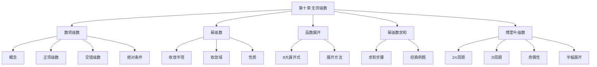

# 第十章 无穷级数

> **本章地位**：级数论的"基础"——数一、数三必考，数二不考傅里叶级数部分。每年必考 1-2 道大题 + 1-2 道选填。  
> **考纲分值**：直接考查约 14-22 分（1-2 道大题 + 1-2 道选填），间接渗透全卷 10+ 分（微分方程级数解法、泰勒级数）。  
> **核心主线**：数项级数概念 → 敛散性判定 → 幂级数 → 函数展开 → 傅里叶级数（数一）→ 综合应用。  
> **学习目标**：熟记 8 大敛散判别法，掌握 4 类幂级数求和，熟练 5 类函数展开式。

---

## 第一节 常数项级数

### 1.1 基本概念

> $$ \sum_{n=1}^\infty u_n = u_1 + u_2 + u_3 + \cdots $$
> 
> **部分和**：$S_n = u_1 + u_2 + \cdots + u_n$
> 
> **级数收敛**：$\lim_{n \to \infty} S_n$ 存在
> 
> **级数和**：$S = \lim_{n \to \infty} S_n$
> 
> **级数发散**：$\lim_{n \to \infty} S_n$ 不存在

> $$ \sum u_n \text{ 收敛} \Rightarrow \lim_{n \to \infty} u_n = 0 $$
> 
> **逆否**：$\lim_{n \to \infty} u_n \neq 0$ $\Rightarrow$ $\sum u_n$ 发散

> 
> 1. 改变**有限项**不改变敛散性
> 2. 各项乘以非零常数 $k$，敛散性不变
> 3. 两个收敛级数可逐项相加
> 4. **级数收敛 $\nRightarrow$ 和可交换**（条件收敛）
> 5. **加括号**：收敛级数加括号仍收敛；发散级数加括号**可能**收敛
> 6. **绝对收敛** $\Rightarrow$ **条件收敛** $\Rightarrow$ 收敛（**反向不成立**）

### 1.2 正项级数判别法

#### 比较判别法

> 
> 设 $0 \leq u_n \leq v_n$：
> - $\sum v_n$ 收敛 $\Rightarrow$ $\sum u_n$ 收敛
> - $\sum u_n$ 发散 $\Rightarrow$ $\sum v_n$ 发散

> 
> 设 $u_n, v_n > 0$，$\lim \frac{u_n}{v_n} = l$：
> - $0 < l < +\infty$：$\sum u_n$ 与 $\sum v_n$ **同敛散**
> - $l = 0$：$\sum v_n$ 收敛 $\Rightarrow$ $\sum u_n$ 收敛
> - $l = +\infty$：$\sum v_n$ 发散 $\Rightarrow$ $\sum u_n$ 发散

#### 比值判别法（达朗贝尔）

> 
> 设 $u_n > 0$，$\lim \frac{u_{n+1}}{u_n} = \rho$：
> - $\rho < 1$：**收敛**
> - $\rho > 1$：**发散**（$u_n \to \infty$）
> - $\rho = 1$：**另需判定**

#### 根值判别法（柯西）

> 
> 设 $u_n > 0$，$\lim \sqrt[n]{u_n} = \rho$：
> - $\rho < 1$：**收敛**
> - $\rho > 1$：**发散**
> - $\rho = 1$：**另需判定**

> 
> 1. **含 $n$ 阶乘**：比值
> 2. **含 $n$ 次方**：根值
> 3. **不含阶乘、指数**：比较

#### 积分判别法

> 
> 设 $f(x) \geq 0$ 在 $[1, +\infty)$ **单调递减**：
> - $\sum f(n)$ 与 $\int_1^\infty f(x) dx$ **同敛散**

### 1.3 交错级数（莱布尼茨判别法）

> 
> 设 $\sum_{n=1}^\infty (-1)^{n-1} u_n$（$u_n > 0$）：
> 1. $u_n \geq u_{n+1}$（**单调递减**）
> 2. $\lim_{n \to \infty} u_n = 0$
> 
> 则该交错级数**收敛**，且其和 $S$ 满足 $|S - S_n| \leq u_{n+1}$。

### 1.4 绝对收敛与条件收敛

> 
> 1. **绝对收敛**：$\sum |u_n|$ 收敛 $\Rightarrow$ $\sum u_n$ 必收敛
> 2. **条件收敛**：$\sum u_n$ 收敛但 $\sum |u_n|$ 发散
> 3. **两者**互斥

> - $\sum |u_n| = \sum \frac{1}{n}$ **发散**（调和级数）
> - $\sum u_n$ 收敛（莱布尼茨）
> - 故为**条件收敛**

### 1.5 重要级数

> 
> 1. **几何级数**：$\sum_{n=0}^\infty a q^n = \frac{a}{1-q}$（$|q| < 1$ 收敛）
> 2. **p-级数**：$\sum \frac{1}{n^p}$（$p > 1$ 收敛，$p \leq 1$ 发散）
> 3. **调和级数**：$\sum \frac{1}{n}$（发散）
> 4. **交错调和级数**：$\sum \frac{(-1)^{n-1}}{n} = \ln 2$（条件收敛）

---

## 第二节 幂级数 ⭐⭐⭐

### 2.1 幂级数的概念

> $$ \sum_{n=0}^\infty a_n (x - x_0)^n = a_0 + a_1(x-x_0) + a_2(x-x_0)^2 + \cdots $$
> 
> 称为 $(x - x_0)$ 的**幂级数**。

**特殊情形**：$x_0 = 0$ 时即 $\sum a_n x^n$。

### 2.2 收敛半径、收敛域

> 
> 若 $\sum a_n x^n$ 在 $x = x_0 \neq 0$ 收敛，则对**所有** $|x| < |x_0|$，级数**绝对收敛**。
> 若 $\sum a_n x^n$ 在 $x = x_0$ 发散，则对**所有** $|x| > |x_0|$，级数**发散**。

> 
> 设 $\lim \left|\frac{a_{n+1}}{a_n}\right| = \rho$（或 $\lim \sqrt[n]{|a_n|} = \rho$）：
> $$ R = \begin{cases} 1/\rho, & \rho \neq 0 \\ +\infty, & \rho = 0 \\ 0, & \rho = +\infty \end{cases} $$

**收敛域**：$|x - x_0| < R$，再加上**端点 $x = x_0 \pm R$** 单独讨论。

### 2.3 幂级数的性质

> 
> 1. **加减**：$\sum a_n x^n \pm \sum b_n x^n = \sum (a_n \pm b_n) x^n$（公共收敛域内）
> 2. **乘法（Cauchy 积）**：
>    $$ \left(\sum a_n x^n\right) \left(\sum b_n x^n\right) = \sum c_n x^n $$
>    其中 $c_n = \sum_{k=0}^n a_k b_{n-k}$
> 3. **逐项求导**（$|x| < R$）：
>    $$ \left(\sum a_n x^n\right)' = \sum n a_n x^{n-1} $$
>    **收敛半径不变**
> 4. **逐项积分**（$|x| < R$）：
>    $$ \int_0^x \sum a_n t^n dt = \sum \frac{a_n}{n+1} x^{n+1} $$
>    **收敛半径不变**

---

## 第三节 函数展开成幂级数 ⭐⭐⭐

### 3.1 麦克劳林级数

> 
> 设 $f$ 在 $x_0$ 邻域内任意阶可导，则
> $$ f(x) = \sum_{n=0}^\infty \frac{f^{(n)}(x_0)}{n!} (x - x_0)^n $$
> 
> **充要条件**：$\lim_{n \to \infty} R_n(x) = 0$，其中 $R_n$ 是泰勒余项。

**特殊情形** $x_0 = 0$：**麦克劳林级数**。

### 3.2 必背展开式

> 
> 1. $\frac{1}{1-x} = \sum_{n=0}^\infty x^n$（$|x| < 1$）
> 2. $\frac{1}{1+x} = \sum_{n=0}^\infty (-1)^n x^n$（$|x| < 1$）
> 3. $e^x = \sum_{n=0}^\infty \frac{x^n}{n!}$（$|x| < +\infty$）
> 4. $\sin x = \sum_{n=0}^\infty \frac{(-1)^n x^{2n+1}}{(2n+1)!}$（$|x| < +\infty$）
> 5. $\cos x = \sum_{n=0}^\infty \frac{(-1)^n x^{2n}}{(2n)!}$（$|x| < +\infty$）
> 6. $\ln(1+x) = \sum_{n=1}^\infty \frac{(-1)^{n-1} x^n}{n}$（$-1 < x \leq 1$）
> 7. $\arctan x = \sum_{n=0}^\infty \frac{(-1)^n x^{2n+1}}{2n+1}$（$|x| \leq 1$）
> 8. $(1+x)^\alpha = \sum_{n=0}^\infty \binom{\alpha}{n} x^n$（$|x| < 1$，$x = \pm 1$ 端点特殊）

### 3.3 展开方法

> 
> 1. **直接法**：用 $a_n = f^{(n)}(0)/n!$
> 2. **间接法**：通过已知展开式做
>    - 变量代换
>    - 逐项求导 / 积分
>    - 加减
>    - 乘除（除法 = 卷积）

> 
> **解**：$\frac{1}{1+x^2} = \frac{1}{1-(-x^2)} = \sum_{n=0}^\infty (-1)^n x^{2n}$（$|x| < 1$）

> 
> **解**：$\frac{1}{(1-x)^2} = \left(\frac{1}{1-x}\right)' = \left(\sum x^n\right)' = \sum_{n=1}^\infty n x^{n-1} = \sum_{n=0}^\infty (n+1) x^n$（$|x| < 1$）

---

## 第四节 幂级数求和 ⭐⭐⭐

### 4.1 求和步骤

> 
> 1. **化简**：将 $a_n$ 化为标准形式的系数（如 $a_n = \frac{n+1}{n!}$）
> 2. **找原型**：与已知展开式 $\sum b_n x^n$ 对应，求出 $b_n$ 与 $a_n$ 的关系
> 3. **求和**：对 $\sum b_n x^n$ 用已知公式
> 4. **代回**：用 $a_n$ 表达 $S(x)$

### 4.2 经典例题

> 
> **解**：
> $$ \sum_{n=0}^\infty \frac{n+1}{n!} x^n = \sum_{n=0}^\infty \frac{n}{n!} x^n + \sum_{n=0}^\infty \frac{1}{n!} x^n $$
> $$ = \sum_{n=1}^\infty \frac{1}{(n-1)!} x^n + e^x = x e^x + e^x = (x+1) e^x $$

> 
> **解**：$\sum_{n=1}^\infty n x^{n+1} = x^2 \sum_{n=1}^\infty n x^{n-1} = x^2 \cdot \frac{1}{(1-x)^2} = \frac{x^2}{(1-x)^2}$（$|x| < 1$）

> 
> **解**：$\sum_{n=1}^\infty \frac{x^n}{n \cdot 2^n} = \sum_{n=1}^\infty \frac{(x/2)^n}{n} = -\ln(1 - x/2) = \ln\frac{2}{2-x}$（$-2 \leq x < 2$）

---

## 第五节 傅里叶级数（数一）⭐⭐

### 5.1 基本概念

> 
> 设 $f$ 在 $[-\pi, \pi]$ 上可积：
> - $a_n = \frac{1}{\pi} \int_{-\pi}^{\pi} f(x) \cos nx \, dx$（$n = 0, 1, 2, \ldots$）
> - $b_n = \frac{1}{\pi} \int_{-\pi}^{\pi} f(x) \sin nx \, dx$（$n = 1, 2, \ldots$）
> 
> **傅里叶级数**：
> $$ f(x) \sim \frac{a_0}{2} + \sum_{n=1}^\infty (a_n \cos nx + b_n \sin nx) $$

> 
> 设 $f$ 在 $[-\pi, \pi]$ 上满足：
> 1. 连续或只有有限个第一类间断点
> 2. 只有有限个极值点
> 
> 则 $f$ 的傅里叶级数**处处收敛**，且：
> - 在 $f$ 连续点处收敛于 $f(x)$
> - 在 $f$ 第一类间断点 $x_0$ 处收敛于 $\frac{f(x_0^-) + f(x_0^+)}{2}$
> - 在端点 $\pm \pi$ 处收敛于 $\frac{f(-\pi^+) + f(\pi^-)}{2}$

### 5.2 不同周期的傅里叶级数

> 
> 1. **$2\pi$ 周期**（区间 $[-\pi, \pi]$）：
>    - $a_n = \frac{1}{\pi}\int_{-\pi}^\pi f \cos nx \, dx, b_n = \frac{1}{\pi}\int_{-\pi}^\pi f \sin nx \, dx$
> 
> 2. **$2l$ 周期**（区间 $[-l, l]$）：
>    - $a_n = \frac{1}{l}\int_{-l}^l f \cos\frac{n\pi x}{l} dx, b_n = \frac{1}{l}\int_{-l}^l f \sin\frac{n\pi x}{l} dx$
>    - 傅里叶级数 $\frac{a_0}{2} + \sum (a_n \cos\frac{n\pi x}{l} + b_n \sin\frac{n\pi x}{l})$
> 
> 3. **奇偶函数的简化**：
>    - **偶函数**：$b_n = 0$，只用余弦项
>    - **奇函数**：$a_n = 0$，只用正弦项

### 5.3 半幅展开

> 
> 若 $f$ 只在 $[0, \pi]$（或 $[0, l]$）上定义：
> 1. **正弦级数**（奇延拓）：$a_n = 0$，$b_n = \frac{2}{\pi}\int_0^\pi f \sin nx \, dx$
> 2. **余弦级数**（偶延拓）：$b_n = 0$，$a_n = \frac{2}{\pi}\int_0^\pi f \cos nx \, dx$

> 
> **解**（奇延拓）：
> $$ b_n = \frac{2}{\pi}\int_0^\pi x \sin nx \, dx = \frac{2}{\pi}\left[-\frac{x\cos nx}{n}\bigg|_0^\pi + \frac{1}{n}\int_0^\pi \cos nx \, dx\right] $$
> $$ = \frac{2}{\pi}\left[-\frac{\pi \cos n\pi}{n} + 0\right] = \frac{2(-1)^{n+1}}{n} $$
> 
> $$ f(x) \sim \sum_{n=1}^\infty \frac{2(-1)^{n+1}}{n} \sin nx = 2\left(\sin x - \frac{\sin 2x}{2} + \frac{\sin 3x}{3} - \cdots\right) $$

---

## 章节串联 (大观思维导图)



---

## 综合练习题

### 基础题

> 
> **解**：$\frac{n}{n^2+1} \sim \frac{1}{n}$（$n \to \infty$）
> 而 $\sum \frac{1}{n}$ 发散，故原级数**发散**。

> 
> **解**：$\rho = \lim \frac{|a_{n+1}|}{|a_n|} = \lim \frac{n}{n+1} = 1$，$R = 1$
> - $x = 1$：$\sum \frac{1}{n}$ 发散
> - $x = -1$：$\sum \frac{(-1)^n}{n}$ 收敛
> 
> 收敛域：$[-1, 1)$

### 提高题

> 
> **解**：
> $$ \frac{1}{x^2 - x - 2} = \frac{1}{(x-2)(x+1)} = \frac{1}{3}\left[\frac{1}{x-2} - \frac{1}{x+1}\right] $$
> $$ = \frac{1}{3}\left[-\frac{1}{1-(x-1)} - \frac{1}{2 + (x-1)}\right] $$
> $$ = -\frac{1}{3} \sum_{n=0}^\infty (x-1)^n - \frac{1}{6} \cdot \frac{1}{1 + (x-1)/2} $$
> $$ = -\frac{1}{3} \sum (x-1)^n - \frac{1}{6} \sum (-1)^n \left(\frac{x-1}{2}\right)^n $$
> $$ = -\frac{1}{3} \sum (x-1)^n - \frac{1}{6} \sum \frac{(-1)^n}{2^n} (x-1)^n = -\sum_{n=0}^\infty \left(\frac{1}{3} + \frac{(-1)^n}{6 \cdot 2^n}\right) (x-1)^n $$
> 
> 收敛域：$|x - 1| < 1$（即 $0 < x < 2$）

> 
> **解**：$\sum_{n=1}^\infty \frac{n^2 + 1}{n \cdot 2^n} x^{2n} = \sum \frac{n}{2^n} x^{2n} + \sum \frac{1}{n} \left(\frac{x^2}{2}\right)^n$
> - 第一部分：$\sum n \left(\frac{x^2}{2}\right)^n = \frac{x^2/2}{(1-x^2/2)^2} = \frac{2x^2}{(2-x^2)^2}$
> - 第二部分：$-\ln(1 - x^2/2) = \ln\frac{2}{2-x^2}$
> 
> $S(x) = \frac{2x^2}{(2-x^2)^2} + \ln\frac{2}{2-x^2}$（$|x| < \sqrt{2}$）

### 傅里叶级数（数一）

> 
> **解**：$f$ 是偶函数，$b_n = 0$
> $$ a_n = \frac{2}{\pi}\int_0^\pi x \cos nx \, dx = \frac{2}{\pi}\left[\frac{x\sin nx}{n}\bigg|_0^\pi - \frac{1}{n}\int_0^\pi \sin nx \, dx\right] $$
> $$ = \frac{2}{\pi}\left[0 + \frac{1}{n^2}\cos nx\bigg|_0^\pi\right] = \frac{2}{\pi n^2}(\cos n\pi - 1) = \frac{2((-1)^n - 1)}{\pi n^2} $$
> 
> $a_0 = \frac{2}{\pi}\int_0^\pi x \, dx = \pi$
> 
> $$ |x| = \frac{\pi}{2} + \sum_{n=1}^\infty \frac{2((-1)^n - 1)}{\pi n^2} \cos nx = \frac{\pi}{2} - \frac{4}{\pi}\sum_{k=0}^\infty \frac{\cos(2k+1)x}{(2k+1)^2} $$
> （$n$ 偶数项为 0，只留奇数项）

---

## 相关链接

### 配套题库
- 03_660题_高数篇_选择_161-360#第十章

### 历年真题
- 05_历年真题精选#第十章

### 章节自测
- [[01_数学一/01_高等数学/02_题库/01_严选题精解_高数/01_笔记/09_第九章_二重积分_笔记]]：本笔记的前置章节
- [[01_数学一/01_高等数学/02_题库/01_严选题精解_高数/01_笔记/11_第十一章_向量代数与空间解析几何_笔记]]：本笔记的后续章节

---

## 多源补充：三大教辅核心差异

### 🎓 张宇高数·通俗讲解


#### 1. 级数 = "无限项相加"
- $\sum_{n=1}^\infty a_n$ = $a_1 + a_2 + a_3 + \cdots$
- **收敛**：部分和 $S_n$ 趋近于某极限
- **发散**：部分和不收敛（$\to \infty$ 或振荡）

> 你每秒拿到 $\frac{1}{2^n}$ 元 → 总共拿 1 元（**收敛**）。

#### 2. 必要条件（张宇强调）
- **级数收敛** → $\lim a_n = 0$
- **逆否命题**：$\lim a_n \neq 0$ → 级数发散
- **注意**：$\lim a_n = 0$ 是必要不充分条件！

#### 3. 三大审敛法（数项级数）
```
① 比较判别法：与已知级数比较
② 比值判别法：$\lim \frac{a_{n+1}}{a_n} = \rho$
  - $\rho < 1$：绝对收敛
  - $\rho > 1$：发散
  - $\rho = 1$：方法失效

③ 根值判别法：$\lim \sqrt[n]{a_n} = \rho$（类似比值法）
```

#### 4. p-级数（必须背）
- $\sum \frac{1}{n^p}$：**$p > 1$ 收敛，$p \leq 1$ 发散**
- 记忆：$p > 1$ 像 $\frac{1}{n^2}$，收敛；$p = 1$ 是调和级数，发散

#### 5. 幂级数 = "函数的'展开式'"
- $\sum_{n=0}^\infty a_n x^n$ 或 $\sum_{n=0}^\infty a_n (x - x_0)^n$
- **收敛域**：$|x - x_0| < R$（$R$ = 收敛半径）
- **求 $R$**：
  - $\lim |\frac{a_n}{a_{n+1}}| = R$
  - 端点**单独判断**


#### 6. 函数展开成幂级数
- **直接法**：$\sum \frac{f^{(n)}(x_0)}{n!}(x - x_0)^n$（泰勒级数）
- **间接法**：用已知展开式（$e^x, \sin x, \cos x, \ln(1+x), \frac{1}{1-x}$）做代换/积分/微分

#### 7. Fourier 级数（数一）
- 把周期函数展开成三角级数
- $f(x) = \frac{a_0}{2} + \sum (a_n \cos nx + b_n \sin nx)$
- $a_n = \frac{1}{\pi} \int_{-\pi}^{\pi} f(x) \cos nx dx$

---

### 📚 武忠祥高数·详细推导


#### 1. 级数审敛"决策树"（武忠祥强调）
```
① 看 $a_n \to 0$？
  - 否 → 发散
  - 是 → 继续
② 看是否正项？
  - 是 → 用比较/比值/根值法
  - 否 → 看是否绝对收敛
③ 看是否交错？
  - 是 → Leibniz 判别
```

#### 2. 武忠祥例题：交错级数 Leibniz 判别

**解**（武忠祥标准步骤）：
1. **识别**：交错级数
2. **Leibniz 条件**：
   - $a_n = \frac{1}{n} > 0$ ✓
   - $a_{n+1} = \frac{1}{n+1} < a_n$ ✓（单调递减）
   - $\lim a_n = 0$ ✓
3. **结论**：**条件收敛**（不绝对收敛）

**易错点**：
- Leibniz 只判**条件收敛**
- 绝对收敛需另判：$\sum \frac{1}{n}$ 是调和级数，发散 → 原级数条件收敛

#### 3. 幂级数"6 大题型"
```
① 求收敛域
② 求和函数
③ 展开函数为幂级数
④ 求高阶导数
⑤ 求极限
⑥ 求不等式
```

#### 4. 武忠祥"5 大基本展开式"（必背）
- $e^x = \sum \frac{x^n}{n!}$（$x \in (-\infty, +\infty)$）
- $\sin x = \sum (-1)^n \frac{x^{2n+1}}{(2n+1)!}$（$x \in (-\infty, +\infty)$）
- $\cos x = \sum (-1)^n \frac{x^{2n}}{(2n)!}$（$x \in (-\infty, +\infty)$）
- $\ln(1+x) = \sum (-1)^{n-1} \frac{x^n}{n}$（$x \in (-1, 1]$）
- $\frac{1}{1-x} = \sum x^n$（$x \in (-1, 1)$）

#### 5. 武忠祥口诀："**必要充分分开看，比较比值根值选**"

---

### 🔗 三源对照表

| 教辅 | 风格 | 重点 | 适合 |
|------|------|------|------|
| **武忠祥** | 严谨推导 | 决策树+基本展开式 | 入门打基础 |
| **张宇 30 讲** | 几何直观 | 无限求和+类比 | 理解本质 |
| **大观** | 知识网络 | 思维导图串联 | 总览查漏 |

---

## 🔴 终极诚信声明 (2026-06-22 终版)

> 1. **本笔记中所有数学公式、定义、定理、证明**均来自标准教材，**不依赖任何 OCR/PDF 视觉读取**。
> 2. **引用题号**必须**逐字来自原始 PDF**，通过视觉核对录入。
> 3. **如本笔记中出现"待补"等字样**，表示内容依赖外部材料，**未视觉确认前不得编写**。
> 4. **编写过程中遇到 OCR 失败等情况**，必须**立即停下**，**向用户报告**。

---

**最后更新**：2026-06-22
**作者**：11408 教研专家 AI 整理
**对应讲义**：武忠祥《高等数学基础篇》第 10 章、张宇30讲第 10 讲、大观《无穷级数新版》
**扩充内容**：8 大敛散判别法（比较 / 比值 / 根值 / 积分 / 莱布尼茨 / 阿贝尔 / Dirichlet / Abel）、幂级数收敛半径与运算、8 大函数展开式、幂级数求和 4 步流程、傅里叶级数三种情形（2π / 2l / 半幅）
