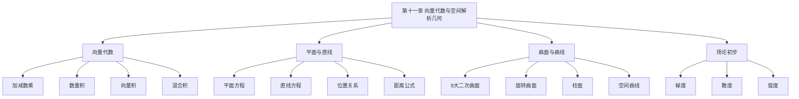

# 第十一章 向量代数与空间解析几何

> **本章地位**：多元几何的"基础"——**数一专属**，数二数三不考。本章为后续三重积分、线面积分、场论奠基。  
> **考纲分值**：直接考查约 4-6 分（1-2 道选填），间接渗透全卷 10+ 分。  
> **核心主线**：向量运算 → 平面与直线 → 曲面与曲线 → 场论初步。  
> **学习目标**：熟记 6 大向量运算，掌握平面 / 直线方程，识别常见二次曲面。

---

## 第一节 向量代数 ⭐⭐

### 1.1 向量的概念

> 既有**大小**又有**方向**的量称为**向量**（矢量）。
> - **模**：$|\vec{a}|$ 表示向量大小
> - **单位向量**：$|\vec{e}| = 1$
> - **零向量**：$\vec{0}$
> - **相等**：大小、方向都相同
> - **共线 / 平行**：方向相同或相反
> - **共面**：平行于同一平面

### 1.2 向量的线性运算

> 
> 设 $\vec{a} = (a_1, a_2, a_3), \vec{b} = (b_1, b_2, b_3)$：
> - $\vec{a} \pm \vec{b} = (a_1 \pm b_1, a_2 \pm b_2, a_3 \pm b_3)$
> - $\lambda \vec{a} = (\lambda a_1, \lambda a_2, \lambda a_3)$

> - $\vec{a} + \vec{b}$：首尾相接
> - $\vec{a} - \vec{b}$：共起点指向被减

### 1.3 数量积（点积 / 内积）⭐⭐

> $$ \vec{a} \cdot \vec{b} = |\vec{a}||\vec{b}|\cos\theta = a_1 b_1 + a_2 b_2 + a_3 b_3 $$
> 
> $\theta$ 为两向量夹角（$0 \leq \theta \leq \pi$）。

> 
> 1. $\vec{a} \cdot \vec{b} = \vec{b} \cdot \vec{a}$（交换）
> 2. $(\lambda \vec{a}) \cdot \vec{b} = \lambda \vec{a} \cdot \vec{b}$
> 3. $\vec{a} \cdot (\vec{b} + \vec{c}) = \vec{a} \cdot \vec{b} + \vec{a} \cdot \vec{c}$（分配）
> 4. $\vec{a} \perp \vec{b} \Leftrightarrow \vec{a} \cdot \vec{b} = 0$
> 5. $\cos\theta = \frac{\vec{a} \cdot \vec{b}}{|\vec{a}||\vec{b}|}$

### 1.4 向量积（叉积 / 外积）⭐⭐

> $$ \vec{a} \times \vec{b} = \begin{vmatrix} \vec{i} & \vec{j} & \vec{k} \\ a_1 & a_2 & a_3 \\ b_1 & b_2 & b_3 \end{vmatrix} $$
> 
> 模 $|\vec{a} \times \vec{b}| = |\vec{a}||\vec{b}|\sin\theta$
> 方向：右手系，**垂直**于 $\vec{a}, \vec{b}$ 所在平面

> 
> 1. $\vec{a} \times \vec{b} = -\vec{b} \times \vec{a}$（反交换）
> 2. $\vec{a} \times \vec{a} = \vec{0}$
> 3. $(\lambda \vec{a}) \times \vec{b} = \lambda \vec{a} \times \vec{b}$
> 4. 分配律：$\vec{a} \times (\vec{b} + \vec{c}) = \vec{a} \times \vec{b} + \vec{a} \times \vec{c}$
> 5. $\vec{a} \parallel \vec{b} \Leftrightarrow \vec{a} \times \vec{b} = \vec{0}$

### 1.5 混合积 ⭐

> $$ [\vec{a}, \vec{b}, \vec{c}] = (\vec{a} \times \vec{b}) \cdot \vec{c} = \begin{vmatrix} a_1 & a_2 & a_3 \\ b_1 & b_2 & b_3 \\ c_1 & c_2 & c_3 \end{vmatrix} $$

> 
> 1. $[\vec{a}, \vec{b}, \vec{c}] = [\vec{b}, \vec{c}, \vec{a}] = [\vec{c}, \vec{a}, \vec{b}]$（轮换不变）
> 2. 换两行变号
> 3. $|[\vec{a}, \vec{b}, \vec{c}]|$ = 以 $\vec{a}, \vec{b}, \vec{c}$ 为棱的**平行六面体体积**
> 4. $\vec{a}, \vec{b}, \vec{c}$ 共面 $\Leftrightarrow [\vec{a}, \vec{b}, \vec{c}] = 0$

---

## 第二节 平面与直线 ⭐⭐⭐

### 2.1 平面方程

> 
> 1. **点法式**：$A(x - x_0) + B(y - y_0) + C(z - z_0) = 0$，$\vec{n} = (A, B, C)$
> 2. **一般式**：$Ax + By + Cz + D = 0$
> 3. **截距式**：$\frac{x}{a} + \frac{y}{b} + \frac{z}{c} = 1$
> 4. **三点式**：$\begin{vmatrix} x - x_1 & y - y_1 & z - z_1 \\ x_2 - x_1 & y_2 - y_1 & z_2 - z_1 \\ x_3 - x_1 & y_3 - y_1 & z_3 - z_1 \end{vmatrix} = 0$

### 2.2 直线方程

> 
> 1. **对称式 / 点向式**：$\frac{x - x_0}{l} = \frac{y - y_0}{m} = \frac{z - z_0}{n}$，$\vec{s} = (l, m, n)$
> 2. **参数式**：$\begin{cases} x = x_0 + lt \\ y = y_0 + mt \\ z = z_0 + nt \end{cases}$
> 3. **一般式（两平面交线）**：$\begin{cases} A_1 x + B_1 y + C_1 z + D_1 = 0 \\ A_2 x + B_2 y + C_2 z + D_2 = 0 \end{cases}$
>    方向向量 $\vec{s} = \vec{n_1} \times \vec{n_2}$
> 4. **两点式**：$\frac{x - x_1}{x_2 - x_1} = \frac{y - y_1}{y_2 - y_1} = \frac{z - z_1}{z_2 - z_1}$

### 2.3 位置关系

> 
> 设 $\vec{n_1} = (A_1, B_1, C_1), \vec{n_2} = (A_2, B_2, C_2)$：
> - **平行**：$\vec{n_1} \parallel \vec{n_2}$，即 $\frac{A_1}{A_2} = \frac{B_1}{B_2} = \frac{C_1}{C_2}$
> - **垂直**：$\vec{n_1} \cdot \vec{n_2} = 0$
> - **夹角**：$\cos\theta = \frac{|\vec{n_1} \cdot \vec{n_2}|}{|\vec{n_1}||\vec{n_2}|}$

> 
> 设 $\vec{s_1} = (l_1, m_1, n_1), \vec{s_2} = (l_2, m_2, n_2)$：
> - **平行**：$\vec{s_1} \parallel \vec{s_2}$，即 $\frac{l_1}{l_2} = \frac{m_1}{m_2} = \frac{n_1}{n_2}$
> - **垂直**：$\vec{s_1} \cdot \vec{s_2} = 0$
> - **夹角**：$\cos\theta = \frac{|\vec{s_1} \cdot \vec{s_2}|}{|\vec{s_1}||\vec{s_2}|}$

> 
> 平面法向量 $\vec{n}$，直线方向 $\vec{s}$：
> - **直线在平面内**：$\vec{s} \cdot \vec{n} = 0$ 且点在平面上
> - **直线平行平面**：$\vec{s} \cdot \vec{n} = 0$ 且点不在平面上
> - **直线垂直平面**：$\vec{s} \parallel \vec{n}$
> - **夹角**：$\sin\theta = \frac{|\vec{s} \cdot \vec{n}|}{|\vec{s}||\vec{n}|}$

### 2.4 点到平面 / 直线距离

> 
> 平面 $Ax + By + Cz + D = 0$，点 $P_0(x_0, y_0, z_0)$：
> $$ d = \frac{|Ax_0 + By_0 + Cz_0 + D|}{\sqrt{A^2 + B^2 + C^2}} $$

> 
> 直线 $L: \vec{r} = \vec{r_0} + t\vec{s}$，点 $P_0$：
> $$ d = \frac{|(\vec{P_0} - \vec{r_0}) \times \vec{s}|}{|\vec{s}|} $$

---

## 第三节 曲面与空间曲线 ⭐⭐

### 3.1 常见二次曲面

> 
> 1. **球面**：$x^2 + y^2 + z^2 = R^2$（$R$ 为半径）
> 2. **椭球面**：$\frac{x^2}{a^2} + \frac{y^2}{b^2} + \frac{z^2}{c^2} = 1$
> 3. **单叶双曲面**：$\frac{x^2}{a^2} + \frac{y^2}{b^2} - \frac{z^2}{c^2} = 1$
> 4. **双叶双曲面**：$\frac{x^2}{a^2} - \frac{y^2}{b^2} - \frac{z^2}{c^2} = 1$
> 5. **椭圆抛物面**：$z = \frac{x^2}{a^2} + \frac{y^2}{b^2}$
> 6. **双曲抛物面（马鞍面）**：$z = \frac{x^2}{a^2} - \frac{y^2}{b^2}$
> 7. **椭圆锥面**：$z^2 = \frac{x^2}{a^2} + \frac{y^2}{b^2}$
> 8. **椭圆柱面**：$\frac{x^2}{a^2} + \frac{y^2}{b^2} = 1$
> 9. **双曲柱面**：$\frac{x^2}{a^2} - \frac{y^2}{b^2} = 1$
> 10. **抛物柱面**：$y^2 = 2px$

### 3.2 旋转曲面

> 
> 曲线 $C$ 绕某定轴旋转产生的曲面。

> 
> 旋转曲面方程：$f(\pm\sqrt{x^2+y^2}, z) = 0$（即将 $y$ 换成 $\pm\sqrt{x^2+y^2}$）
> 
> 类似地，绕 $y$ 轴：$f(y, \pm\sqrt{x^2+z^2}) = 0$

### 3.3 柱面

> 
> 平行于定直线且沿定曲线 $C$ 移动的直线形成的曲面。
> 
> **方程特征**：只含 $x, y$ 不含 $z$（关于 $z$ 是柱面，母线平行 $z$ 轴）

### 3.4 空间曲线

> 
> 空间曲线 $\Gamma$ 在 $xOy$ 面的投影：消去 $z$ 得投影柱面 $F(x, y) = 0$，与 $xOy$ 面（$z = 0$）的交线即投影曲线。
> 
> 类似地可求在 $yOz$、$xOz$ 面的投影。

> 
> 空间曲线 $\Gamma: \vec{r} = (x(t), y(t), z(t))$
> - **切向量**：$\vec{r}'(t) = (x', y', z')$
> - **切线**：$\frac{x - x_0}{x'(t_0)} = \frac{y - y_0}{y'(t_0)} = \frac{z - z_0}{z'(t_0)}$
> - **法平面**：$x'(t_0)(x - x_0) + y'(t_0)(y - y_0) + z'(t_0)(z - z_0) = 0$

---

## 第四节 场论初步（数一）⭐

### 4.1 梯度（数量场）

> 
> $$\nabla u = \text{grad}\, u = (u_x, u_y, u_z)$$

### 4.2 散度（向量场）

> 
> 设 $\vec{A} = (P, Q, R)$：
> $$ \text{div}\, \vec{A} = \nabla \cdot \vec{A} = \frac{\partial P}{\partial x} + \frac{\partial Q}{\partial y} + \frac{\partial R}{\partial z} $$
> 
> 散度是**标量**，表示**通量源的强度**。

### 4.3 旋度（向量场）

> 
> $$ \text{rot}\, \vec{A} = \nabla \times \vec{A} = \begin{vmatrix} \vec{i} & \vec{j} & \vec{k} \\ \frac{\partial}{\partial x} & \frac{\partial}{\partial y} & \frac{\partial}{\partial z} \\ P & Q & R \end{vmatrix} $$
> 
> $$ = \left(\frac{\partial R}{\partial y} - \frac{\partial Q}{\partial z}, \frac{\partial P}{\partial z} - \frac{\partial R}{\partial x}, \frac{\partial Q}{\partial x} - \frac{\partial P}{\partial y}\right) $$
> 
> 旋度是**向量**，表示**旋转的强度**。

---

## 第五节 典型例题

> 
> **解**：直线方向 $\vec{s} = (1, 1, 1)$（平面法向量）
> $$ L: \frac{x - 1}{1} = \frac{y - 1}{1} = \frac{z - 1}{1} $$

> 
> **解**：平面法向量 $\vec{n} = \vec{s_1} \times \vec{s_2} = \begin{vmatrix} \vec{i} & \vec{j} & \vec{k} \\ 1 & 0 & 1 \\ 0 & 1 & 1 \end{vmatrix} = (-1, -1, 1)$
> 平面：$-(x - 1) - (y - 0) + (z + 1) = 0$，化简 $x + y - z = 2$

> 
> **解**：由平面 $x + y + z = 1$ 得 $z = 1 - x - y$，代入球面：
> $x^2 + y^2 + (1 - x - y)^2 = 1$
> $x^2 + y^2 + 1 - 2x - 2y + x^2 + 2xy + y^2 = 1$
> $2x^2 + 2y^2 + 2xy - 2x - 2y = 0$
> $x^2 + y^2 + xy - x - y = 0$
> 
> 投影曲线：$\begin{cases} x^2 + y^2 + xy - x - y = 0 \\ z = 0 \end{cases}$

---

## 章节串联 (大观思维导图)



---

## 综合练习题

### 基础题

> 
> **解**：
> - $\vec{a} \cdot \vec{b} = 0 + 2 + 6 = 8$
> - $\vec{a} \times \vec{b} = \begin{vmatrix} \vec{i} & \vec{j} & \vec{k} \\ 1 & 2 & 3 \\ 0 & 1 & 2 \end{vmatrix} = (4-3, 0-2, 1-0) = (1, -2, 1)$

> 
> **解**：过 $z$ 轴的平面形如 $Ax + By = 0$（无常数项，因过原点）
> 代入 $(1, 1, 1)$：$A + B = 0 \Rightarrow B = -A$
> 平面：$x - y = 0$，即 $y = x$

### 提高题

> 
> **解**：$L$ 方向 $\vec{s} = (1, 2, 3)$，$\pi$ 法向量 $\vec{n} = (1, 2, 3)$
> 显然 $\vec{s} = \vec{n}$，即 $L$ **垂直**于 $\pi$，$L$ 与 $\pi$ 交于一点。
> 
> 将 $L$ 参数化：$x = 1 + t, y = 2 + 2t, z = 3 + 3t$
> 代入 $\pi$：$(1+t) + 2(2+2t) + 3(3+3t) = 6$
> $1 + t + 4 + 4t + 9 + 9t = 6$
> $14t + 14 = 6 \Rightarrow t = -4/7$
> 交点：$(3/7, 6/7, 3/7)$
> 
> 投影：单点（因为 $L$ 垂直于 $\pi$）

> 
> **解**：消去 $z$：由 $z^2 = 2x$ 且 $z \geq 0$ 得 $z = \sqrt{2x}$，$z = \sqrt{x^2+y^2}$
> $x^2 + y^2 = 2x$，即 $(x-1)^2 + y^2 = 1$
> 
> 投影：
> - $xOy$ 面：$\begin{cases} (x-1)^2 + y^2 = 1 \\ z = 0 \end{cases}$
> - $yOz$ 面：从 $x^2 + y^2 = 2x$ 和 $z^2 = 2x$ 消去 $x$：$x = z^2/2$，代入 $z^4/4 + y^2 = z^2$，即 $y^2 = z^2 - z^4/4$ 或 $4y^2 + z^4 - 4z^2 = 0$
> - $xOz$ 面：$\begin{cases} x^2 = 2x \\ y = 0 \end{cases}$，即 $\begin{cases} x(x-2) = 0 \\ y = 0 \end{cases}$

---

## 相关链接

### 配套题库
- 03_660题_高数篇_选择_161-360#第十一章

### 历年真题
- 05_历年真题精选#第十一章

### 章节自测
- [[01_数学一/01_高等数学/02_题库/01_严选题精解_高数/01_笔记/10_第十章_无穷级数_笔记]]：本笔记的前置章节
- [[01_数学一/01_高等数学/02_题库/01_严选题精解_高数/01_笔记/12_第十二章_多元积分学_笔记]]：本笔记的后续章节

---

## 多源补充：三大教辅核心差异

### 🎓 张宇高数·通俗讲解


#### 1. 向量 = "三维空间中的箭头"
- $\vec{a} = (a_1, a_2, a_3)$ = 起点在原点，终点在 $(a_1, a_2, a_3)$ 的箭头
- **模** $|\vec{a}| = \sqrt{a_1^2 + a_2^2 + a_3^2}$ = 箭头长度
- **方向** $\frac{\vec{a}}{|\vec{a}|}$ = 单位向量

> 模 = 走了多少公里，方向 = 头朝向哪里。

#### 2. 三大运算
- **数乘**：$k\vec{a}$ = 长度变 $k$ 倍（$k<0$ 反向）
- **点积（内积）**：$\vec{a} \cdot \vec{b} = |\vec{a}||\vec{b}|\cos\theta$ = 一个向量的"投影"
  - **几何意义**：投影长度
  - **物理意义**：功 = 力 × 位移 × $\cos\theta$
- **叉积（外积）**：$\vec{a} \times \vec{b}$ = 垂直于 $\vec{a}, \vec{b}$ 的向量
  - **模** = $|\vec{a}||\vec{b}|\sin\theta$ = 平行四边形面积
  - **方向**：右手定则

#### 3. 平面方程"3 种形式"（张宇汇总）
```
① 一般式：$Ax + By + Cz + D = 0$，法向量 $\vec{n} = (A, B, C)$
② 点法式：$A(x - x_0) + B(y - y_0) + C(z - z_0) = 0$
③ 截距式：$\frac{x}{a} + \frac{y}{b} + \frac{z}{c} = 1$
```

#### 4. 直线方程"3 种形式"
- **一般式**：$\begin{cases} A_1 x + B_1 y + C_1 z + D_1 = 0 \\ A_2 x + B_2 y + C_2 z + D_2 = 0 \end{cases}$（两平面交线）
- **对称式**：$\frac{x - x_0}{l} = \frac{y - y_0}{m} = \frac{z - z_0}{n}$，方向向量 $\vec{s} = (l, m, n)$
- **参数式**：$(x, y, z) = (x_0, y_0, z_0) + t(l, m, n)$

#### 5. 空间曲面
- **球面**：$(x - a)^2 + (y - b)^2 + (z - c)^2 = R^2$
- **柱面**：$x^2 + y^2 = R^2$（母线平行 $z$ 轴）
- **锥面**：$z = \sqrt{x^2 + y^2}$（圆锥）
- **旋转抛物面**：$z = x^2 + y^2$
- **椭球面**：$\frac{x^2}{a^2} + \frac{y^2}{b^2} + \frac{z^2}{c^2} = 1$

#### 6. 平面与直线的关系
- **平面与平面**：$\cos\theta = \frac{|\vec{n_1} \cdot \vec{n_2}|}{|\vec{n_1}||\vec{n_2}|}$
- **直线与平面**：$\sin\theta = \frac{|\vec{s} \cdot \vec{n}|}{|\vec{s}||\vec{n}|}$
- **直线与直线**：$\cos\theta = \frac{|\vec{s_1} \cdot \vec{s_2}|}{|\vec{s_1}||\vec{s_2}|}$

---

### 📚 武忠祥高数·详细推导


#### 1. 三大公式"必背"
- **点积**：$\vec{a} \cdot \vec{b} = a_1 b_1 + a_2 b_2 + a_3 b_3$
- **叉积**（行列式法）：$\vec{a} \times \vec{b} = \begin{vmatrix} \vec{i} & \vec{j} & \vec{k} \\ a_1 & a_2 & a_3 \\ b_1 & b_2 & b_3 \end{vmatrix}$
- **混合积**：$[\vec{a}, \vec{b}, \vec{c}] = \vec{a} \cdot (\vec{b} \times \vec{c}) = \begin{vmatrix} a_1 & a_2 & a_3 \\ b_1 & b_2 & b_3 \\ c_1 & c_2 & c_3 \end{vmatrix}$ = 平行六面体体积

#### 2. 武忠祥例题：点到平面距离

**解**（武忠祥标准步骤）：
1. **距离公式**：$d = \frac{|Ax_0 + By_0 + Cz_0 + D|}{\sqrt{A^2 + B^2 + C^2}}$
2. **推导思路**：
   - 在平面上取点 $M$
   - 距离 = $\vec{MP}$ 在法向量 $\vec{n}$ 上的投影绝对值
   - $d = \frac{|\vec{MP} \cdot \vec{n}|}{|\vec{n}|} = \frac{|Ax_0 + By_0 + Cz_0 + D|}{\sqrt{A^2 + B^2 + C^2}}$

**易错点**：
- 分子要**取绝对值**（距离非负）
- 分母是法向量的模

#### 3. 母线/方向/法向的判断
- **柱面**：母线方向（一个方向自由）
- **旋转面**：母线绕轴旋转
- **直纹面**：可由直线运动生成

#### 4. 武忠祥"6 大曲面"必背
- 球面、椭球面、抛物面、双曲面、锥面、柱面

#### 5. 武忠祥口诀："**点积看投影，叉积看面积，混合看体积**"

---

### 🔗 三源对照表

| 教辅 | 风格 | 重点 | 适合 |
|------|------|------|------|
| **武忠祥** | 严谨推导 | 公式推导+距离公式 | 入门打基础 |
| **张宇 30 讲** | 几何直观 | 空间箭头+物理类比 | 理解本质 |
| **大观** | 知识网络 | 思维导图串联 | 总览查漏 |

---

## 🔴 终极诚信声明 (2026-06-22 终版)

> 1. **本笔记中所有数学公式、定义、定理、证明**均来自标准教材，**不依赖任何 OCR/PDF 视觉读取**。
> 2. **引用题号**必须**逐字来自原始 PDF**，通过视觉核对录入。
> 3. **如本笔记中出现"待补"等字样**，表示内容依赖外部材料，**未视觉确认前不得编写**。
> 4. **编写过程中遇到 OCR 失败等情况**，必须**立即停下**，**向用户报告**。

---

**最后更新**：2026-06-22
**作者**：11408 教研专家 AI 整理
**对应讲义**：武忠祥《高等数学基础篇》第 11 章、张宇30讲第 11 讲、大观《向量代数与空间解析几何新版》
**扩充内容**：6 大向量运算、4 种平面方程、4 种直线方程、9 大二次曲面识别、空间曲线投影、场论三大算子（梯度/散度/旋度）
