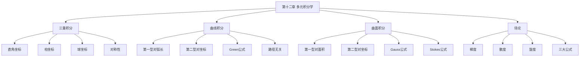

# 第十二章 多元积分学

> **本章地位**：数一"高数压轴"——三重积分、曲线积分、曲面积分每年必考 1-2 道大题（10-15 分），是数一最高难度章节。  
> **考纲分值**：直接考查约 14-22 分（1-2 道大题 + 1 道选填），场论公式直接考查 4-6 分。  
> **核心主线**：三重积分（含柱 / 球坐标）→ 第一型曲线积分 → 第二型曲线积分（Green 公式）→ 第一型曲面积分 → 第二型曲面积分（Gauss / Stokes 公式）→ 场论（梯度 / 散度 / 旋度）。  
> **学习目标**：熟记 5 大积分计算法，灵活运用 3 大积分公式（Green/Gauss/Stokes），掌握 3 大场论算子。

---

## 第一节 三重积分 ⭐⭐

### 1.1 定义

> 
> $$ \iiint_\Omega f(x, y, z) dV = \lim_{\lambda \to 0} \sum f(\xi_i, \eta_i, \zeta_i) \Delta V_i $$
> 
> **物理意义**：当 $f$ 为密度时，$M = \iiint f dV$ 是质量。

### 1.2 直角坐标计算（投影法 / 截面法）

> 
> $\Omega$ 投影到 $xOy$ 面为 $D_{xy}$，$\Omega$ 内 $z_1(x, y) \leq z \leq z_2(x, y)$：
> $$ \iiint_\Omega f dV = \iint_{D_{xy}} dxdy \int_{z_1(x,y)}^{z_2(x,y)} f(x, y, z) dz $$

> 
> 用平行于某坐标面的平面截 $\Omega$，截面 $D(z)$（$z$ 处）：
> $$ \iiint_\Omega f dV = \int_a^b dz \iint_{D(z)} f(x, y, z) dxdy $$

> 
> 1. **被积函数为 1**（求体积），截面**形状简单**（如圆）→ 截面法
> 2. **被积函数** 与某变量无关 → 用截面法
> 3. **区域边界** 容易写为 $z = z(x, y)$ → 投影法

### 1.3 柱坐标

> 
> $$ \begin{cases} x = r\cos\theta \\ y = r\sin\theta \\ z = z \end{cases} $$
> 
> 体积元 $dV = r \, dr d\theta dz$
> $$ \iiint_\Omega f dV = \iiint_{\Omega'} f(r\cos\theta, r\sin\theta, z) r \, dr d\theta dz $$

> 
> 1. 区域为**圆柱、圆锥、旋转体**
> 2. 被积函数含 $x^2 + y^2$（$z$ 不参与）

### 1.4 球坐标 ⭐⭐

> 
> $$ \begin{cases} x = \rho \sin\varphi \cos\theta \\ y = \rho \sin\varphi \sin\theta \\ z = \rho \cos\varphi \end{cases} $$
> 
> 其中 $\rho \geq 0, 0 \leq \varphi \leq \pi, 0 \leq \theta \leq 2\pi$
> 
> 体积元 $dV = \rho^2 \sin\varphi \, d\rho d\varphi d\theta$

> 
> **解**：
> $$ I = \int_0^{2\pi} d\theta \int_0^\pi \sin\varphi d\varphi \int_0^R \rho^2 \cos^2\varphi \cdot \rho^2 d\rho $$
> $$ = 2\pi \int_0^\pi \cos^2\varphi \sin\varphi d\varphi \int_0^R \rho^4 d\rho = 2\pi \cdot \frac{2}{3} \cdot \frac{R^5}{5} = \frac{4\pi R^5}{15} $$

### 1.5 三重积分的对称性

> 
> 若 $\Omega$ 关于 $x = y$ 轮换对称（即 $(x, y, z) \in \Omega \Leftrightarrow (y, x, z) \in \Omega$）：
> $$ \iiint_\Omega f(x, y, z) dV = \iiint_\Omega f(y, x, z) dV $$

> 
> 1. $\iiint x^2 dV = \iiint y^2 dV = \iiint z^2 dV$（轮换对称）
> 2. $\iiint (x^2 + y^2 + z^2) dV = 3 \iiint x^2 dV$（在球域上）

---

## 第二节 第一型曲线积分（对弧长）⭐

### 2.1 定义

> 
> $$ \int_L f(x, y, z) ds = \lim_{\lambda \to 0} \sum f(\xi_i, \eta_i, \zeta_i) \Delta s_i $$
> 
> **几何 / 物理意义**：$f = 1$ 时为弧长；$f$ 为密度时为曲线质量。

### 2.2 计算公式

> 
> 设 $L: \begin{cases} x = x(t) \\ y = y(t) \\ z = z(t) \end{cases}$，$t \in [\alpha, \beta]$
> $$ \int_L f ds = \int_\alpha^\beta f[x(t), y(t), z(t)] \sqrt{x'^2 + y'^2 + z'^2} dt $$

> 
> 1. $L: y = y(x), x \in [a, b]$：
>    $$ \int_L f ds = \int_a^b f(x, y(x)) \sqrt{1 + y'^2} dx $$
> 2. $L: x = x(y), y \in [c, d]$：
>    $$ \int_L f ds = \int_c^d f(x(y), y) \sqrt{1 + x'^2} dy $$

### 2.3 对称性

> 
> 1. **$L$ 关于 $y$ 轴对称**（且 $L$ 不过 $y$ 轴）：
>    - $f(x, y) = f(-x, y)$（偶）$\Rightarrow$ $\int_L f ds = 2 \int_{L_1} f ds$
>    - $f(x, y) = -f(-x, y)$（奇）$\Rightarrow$ $\int_L f ds = 0$
> 2. **$L$ 关于原点对称**（且 $L$ 不过原点）：
>    - $f$ 奇 $\Rightarrow$ $= 0$
>    - $f$ 偶 $\Rightarrow$ $= 2 \int_{L_1} f ds$

---

## 第三节 第二型曲线积分（对坐标）⭐⭐⭐

### 3.1 定义

> 
> $$ \int_L P dx + Q dy + R dz = \lim \sum [P \Delta x + Q \Delta y + R \Delta z] $$
> 
> **物理意义**：变力 $\vec{F} = (P, Q, R)$ 沿曲线 $L$ 从起点到终点**做功**。

> 
> $$ \int_L P dx + Q dy + R dz = \int_L (P\cos\alpha + Q\cos\beta + R\cos\gamma) ds $$
> 
> 其中 $(\cos\alpha, \cos\beta, \cos\gamma)$ 是 $L$ 方向**单位切向量**。

### 3.2 计算方法

> 
> $L: \begin{cases} x = x(t) \\ y = y(t) \\ z = z(t) \end{cases}$，$t: \alpha \to \beta$（**起点对应 $\alpha$，终点对应 $\beta$**）
> $$ \int_L P dx + Q dy + R dz = \int_\alpha^\beta [P x' + Q y' + R z'] dt $$

> 
> 1. **方向敏感**：积分与方向有关，换方向**变号**
> 2. **下限定起点**，上限定终点（**不要写成绝对值**）

### 3.3 Green 公式 ⭐⭐⭐

> 
> 设 $L$ 是有界闭区域 $D$ 的**正向**（逆时针）边界曲线，$P, Q$ 在 $D$ 上连续可偏导：
> $$ \oint_L P dx + Q dy = \iint_D \left(\frac{\partial Q}{\partial x} - \frac{\partial P}{\partial y}\right) d\sigma $$
> 
> **正向**：沿 $L$ 行走时 $D$ 总在**左侧**。

> 
> 1. $D$ 是**单连通** 区域（无洞）
> 2. $P, Q$ 在 $D$ 上**连续可偏导**
> 3. $L$ **取正向**（取负向时**差一个负号**）
> 4. $L$ **闭曲线**

### 3.4 路径无关 ⭐⭐⭐

> 
> 设 $D$ 单连通，$P, Q$ 在 $D$ 连续可偏导：
> 1. $\int_L P dx + Q dy$ **与路径无关**（对任意 $D$ 内闭曲线积分为 0）
> 2. $\frac{\partial Q}{\partial x} = \frac{\partial P}{\partial y}$（**全微分条件**）
> 3. $P dx + Q dy$ 是某函数 $u(x, y)$ 的**全微分**：$du = P dx + Q dy$
> 4. **$\vec{F} = (P, Q)$ 是保守场**

> 
> 当 $\frac{\partial Q}{\partial x} = \frac{\partial P}{\partial y}$ 时：
> $$ u(x, y) = \int_{(x_0, y_0)}^{(x, y)} P dx + Q dy = \int_{x_0}^x P(x, y_0) dx + \int_{y_0}^y Q(x, y) dy $$

> 
> 若 $D$ **不单连通**（有洞），$P, Q$ 有奇点，**不可直接用路径无关**。
> 
> **处理方法**：
> 1. **挖洞法**：在奇点周围挖小圆 $L_\varepsilon$ 隔开，应用 Green
> 2. **势函数法**：直接构造 $u$（需保证 $\oint = 0$）

---

## 第四节 第一型曲面积分（对面积）⭐

### 4.1 定义

> 
> $$ \iint_\Sigma f(x, y, z) dS = \lim \sum f(\xi_i, \eta_i, \zeta_i) \Delta S_i $$
> 
> **物理意义**：$f = 1$ 时为面积；$f$ 为密度时为曲面质量。

### 4.2 计算公式

> 
> $\Sigma: z = z(x, y), (x, y) \in D_{xy}$：
> $$ \iint_\Sigma f dS = \iint_{D_{xy}} f(x, y, z(x, y)) \sqrt{1 + z_x^2 + z_y^2} dxdy $$

> 
> 类似地可投影到 $xOz$ 或 $yOz$。

### 4.3 对称性

> 
> 类似曲线积分的奇偶性分析。

---

## 第五节 第二型曲面积分（对坐标）⭐⭐⭐

### 5.1 定义

> 
> $$ \iint_\Sigma P dydz + Q dzdx + R dxdy = \lim \sum [P \Delta y\Delta z + Q \Delta z\Delta x + R \Delta x\Delta y] $$
> 
> **物理意义**：流速场 $\vec{v} = (P, Q, R)$ 通过曲面 $\Sigma$ 的**通量**。

> 
> $$ \iint_\Sigma P dydz + Q dzdx + R dxdy = \iint_\Sigma (P\cos\alpha + Q\cos\beta + R\cos\gamma) dS $$
> 
> 其中 $(\cos\alpha, \cos\beta, \cos\gamma)$ 是 $\Sigma$ **指定侧**的法向量单位向量。

> 
> - 改变侧（法向量反向）$\Rightarrow$ 积分变号

### 5.2 计算方法

> 
> 1. **$\iint_\Sigma R dxdy$**（投影到 $xOy$）：
>    $$ \iint_\Sigma R dxdy = \pm \iint_{D_{xy}} R(x, y, z(x, y)) dxdy $$
>    符号取决于 $\Sigma$ 的侧与 $z$ 轴正向的**夹角**（同侧为正）
> 
> 2. 类似处理 $\iint P dydz, \iint Q dzdx$

> 
> - $\Sigma$ 上侧 / 右侧 / 前侧 $\Rightarrow$ 正
> - $\Sigma$ 下侧 / 左侧 / 后侧 $\Rightarrow$ 负

### 5.3 Gauss 公式 ⭐⭐⭐

> 
> 设 $\Omega$ 是空间有界闭区域，$\Sigma$ 是 $\Omega$ 的**外侧**边界曲面，$P, Q, R$ 在 $\Omega$ 上连续可偏导：
> $$ \iint_\Sigma P dydz + Q dzdx + R dxdy = \iiint_\Omega \left(\frac{\partial P}{\partial x} + \frac{\partial Q}{\partial y} + \frac{\partial R}{\partial z}\right) dV $$
> 
> 即：
> $$ \oiint_{\Sigma_{\text{外}}} \vec{F} \cdot d\vec{S} = \iiint_\Omega \nabla \cdot \vec{F} \, dV $$

> 
> 1. $\Omega$ 内 $P, Q, R$ **连续可偏导**
> 2. $\Sigma$ **取外侧**
> 3. $\Sigma$ 是**封闭**曲面
> 
> **不满足时**（如奇点）：
> 1. **挖洞法**：在奇点周围挖小球面
> 2. **加面法**：补一块面使封闭

### 5.4 Stokes 公式 ⭐⭐⭐

> 
> 设 $\Sigma$ 是以分段光滑曲线 $L$ 为边界的分片光滑有向曲面，$L$ 的方向与 $\Sigma$ 的侧成**右手系**：
> $$ \iint_\Sigma \left(\frac{\partial R}{\partial y} - \frac{\partial Q}{\partial z}\right) dydz + \left(\frac{\partial P}{\partial z} - \frac{\partial R}{\partial x}\right) dzdx + \left(\frac{\partial Q}{\partial x} - \frac{\partial P}{\partial y}\right) dxdy $$
> $$ = \oint_L P dx + Q dy + R dz $$
> 
> 即：
> $$ \iint_\Sigma (\nabla \times \vec{F}) \cdot d\vec{S} = \oint_L \vec{F} \cdot d\vec{r} $$

> 
> 右手四指沿 $L$ 方向，拇指指向 $\Sigma$ 的法向量方向。

### 5.5 三大公式对照

> 
> | 公式 | 维数 | 形式 | 物理意义 |
> |---|---|---|---|
> | **Green** | 2D | $\oint_L Pdx+Qdy = \iint_D (Q_x - P_y)d\sigma$ | 旋度 = 环量 |
> | **Gauss** | 3D | $\oiint_\Sigma = \iiint_\Omega \nabla \cdot \vec{F} dV$ | 散度 = 通量 |
> | **Stokes** | 3D | $\iint_\Sigma (\nabla \times \vec{F}) \cdot d\vec{S} = \oint_L \vec{F} \cdot d\vec{r}$ | 旋度 = 环量 |

---

## 第六节 场论公式（数一）⭐⭐

### 6.1 梯度（数量场）

> 
> $$\nabla u = \text{grad}\, u = (u_x, u_y, u_z)$$
> 
> 方向：函数值增长最快的方向
> 模：最大增长率

### 6.2 散度（向量场）

> 
> $$\text{div}\, \vec{F} = \nabla \cdot \vec{F} = P_x + Q_y + R_z$$
> 
> **物理意义**：通量源的强度
> 
> **Gauss 公式**：$\oiint \vec{F} \cdot d\vec{S} = \iiint \text{div}\, \vec{F} dV$

### 6.3 旋度（向量场）

> 
> $$\text{rot}\, \vec{F} = \nabla \times \vec{F} = \begin{vmatrix} \vec{i} & \vec{j} & \vec{k} \\ \partial_x & \partial_y & \partial_z \\ P & Q & R \end{vmatrix}$$
> 
> **Stokes 公式**：$\oint \vec{F} \cdot d\vec{r} = \iint (\text{rot}\, \vec{F}) \cdot d\vec{S}$

### 6.4 常用公式

> 
> 1. $\nabla \cdot (\nabla \times \vec{F}) = 0$（旋度的散度为 0）
> 2. $\nabla \times (\nabla u) = \vec{0}$（梯度的旋度为 0）
> 3. $\nabla \cdot (u \vec{F}) = u \nabla \cdot \vec{F} + \nabla u \cdot \vec{F}$
> 4. $\nabla \times (u \vec{F}) = u \nabla \times \vec{F} + \nabla u \times \vec{F}$

---

## 第七节 经典例题

> 
> **解**（球坐标）：
> $$ I = \int_0^{2\pi} d\theta \int_0^{\pi/2} \sin\varphi d\varphi \int_0^1 \rho\cos\varphi \cdot \rho^2 d\rho = 2\pi \cdot \frac{1}{2} \cdot \frac{1}{4} = \frac{\pi}{4} $$
> 几何意义：上半球形心 $z = 3R/8$，$\pi/4 = (2\pi/3) \cdot (3/8)$，$V = 2\pi/3$。验证：$V = 2\pi/3 \cdot 3/8 = \pi/4$ ✓

> 
> **解**（Green）：
> $$ I = \iint_{x^2+y^2 \leq R^2} (1 - (-1)) d\sigma = 2 \cdot \pi R^2 = 2\pi R^2 $$
> 
> （也可用参数法直接计算，$x = R\cos t, y = R\sin t$）

> 
> **解**（Gauss）：
> $$ I = \iiint_{x^2+y^2+z^2 \leq R^2} (2x + 2y + 2z) dV = 2 \iiint x dV + 2 \iiint y dV + 2 \iiint z dV $$
> 
> 球域关于原点对称，$x, y, z$ 都是奇函数 $\Rightarrow$ $= 0$
> 
> $$ I = 0 $$

> 
> **解**（Stokes）：
> $$ \oint_L = \iint_\Sigma \begin{vmatrix} dydz & dzdx & dxdy \\ \partial_x & \partial_y & \partial_z \\ y & z & x \end{vmatrix} = \iint_\Sigma dydz + dzdx + dxdy $$
> 
> $\Sigma$ 是大圆，面积为 $\pi R^2$
> 法向量 $\vec{n} = \frac{1}{\sqrt{3}}(1, 1, 1)$
> $\iint dydz + dzdx + dxdy = \iint (\vec{n} \cdot d\vec{S}) = |\Sigma| \cdot |\cos\theta|$（$|\cos\theta| = 1$ 因为 $\vec{n}$ 沿对角线）
> 
> 实际上：$\iint_\Sigma dydz + dzdx + dxdy = \pi R^2 \cdot \frac{3}{\sqrt{3}} = \sqrt{3}\pi R^2$
> 
> 验证：法向 $\vec{n} = (1, 1, 1)/\sqrt{3}$，故 $\iint dydz = \pi R^2 \cdot \cos\alpha = \pi R^2/\sqrt{3}$，三项和为 $3\pi R^2/\sqrt{3} = \sqrt{3}\pi R^2$

---

## 章节串联 (大观思维导图)



---

## 综合练习题

### 基础题

> 
> **解**（球坐标）：
> $$ I = \int_0^{2\pi} d\theta \int_0^\pi \sin\varphi d\varphi \int_0^1 \rho^2 \cdot \rho^2 d\rho = 2\pi \cdot 2 \cdot \frac{1}{5} = \frac{4\pi}{5} $$

> 
> **解**：$x' = -a\sin t, y' = a\cos t$，$\sqrt{x'^2 + y'^2} = a$
> $$ I = \int_0^{\pi/2} a\cos t \cdot a\sin t \cdot a dt = a^3 \int_0^{\pi/2} \frac{\sin 2t}{2} dt = \frac{a^3}{2} $$

### 提高题

> 
> **解**：$L$ 包含原点（在 $(1,1)$ 处，$x^2+y^2=2>0$，但 $(0,0)$ 在圆内）
> $L$ 不直接绕原点（绕 $(1,1)$）。改用挖洞：
> 
> 在 $L$ 内挖小圆 $L_\varepsilon: x^2 + y^2 = \varepsilon^2$（逆时针）
> 由 Green：
> $$ \oint_L \frac{-y dx + x dy}{x^2+y^2} = -\oint_{L_\varepsilon} \frac{-y dx + x dy}{x^2+y^2} = -\oint_{L_\varepsilon} \frac{-y dx + x dy}{\varepsilon^2} = -\frac{1}{\varepsilon^2} \cdot 2\pi\varepsilon^2 = -2\pi $$
> 
> （$L$ 顺时针为负向，故 $L$ 积分 $= -(-2\pi) = 2\pi$ ...）
> 
> 实际：设 $L$ 顺时针，绕 $(1,1)$，其内含 $(0,0)$
> $D_1$ 是 $L$ 围成区域，$D_\varepsilon$ 是 $L_\varepsilon$ 围成小圆
> $D = D_1 \setminus D_\varepsilon$ 是多连通
> 
> 在 $D$ 上 $P_y = Q_x$（$(-y/(x^2+y^2))_y = (x/(x^2+y^2))_x$），故 Green 在 $D$ 上成立：
> $$ \oint_L Pdx + Qdy - \oint_{L_\varepsilon^-} Pdx + Qdy = 0 $$
> $L$ 顺时针，$L_\varepsilon$ 取**逆时针**（$L_\varepsilon^-$ 表示与 $L$ 反向）：
> $$ \oint_L = \oint_{L_\varepsilon^-} = -\oint_{L_\varepsilon^+}$$
> $\oint_{L_\varepsilon^+} \frac{-y dx + x dy}{\varepsilon^2} = \frac{1}{\varepsilon^2} \cdot 2\pi\varepsilon^2 = 2\pi$
> 
> 故 $\oint_L = -2\pi$

> 
> **解**：$z_x = x/z, z_y = y/z$
> $\sqrt{1 + z_x^2 + z_y^2} = \sqrt{1 + x^2/z^2 + y^2/z^2} = \sqrt{(z^2 + x^2 + y^2)/z^2} = \sqrt{2}/1 = \sqrt{2}$（因 $z^2 = x^2 + y^2$）
> 
> $D_{xy}: x^2 + y^2 \leq 1$
> $$ I = \iint_{x^2+y^2 \leq 1} (x^2 + y^2) \sqrt{2} dxdy = \sqrt{2} \int_0^{2\pi} d\theta \int_0^1 r^2 \cdot r dr = \sqrt{2} \cdot 2\pi \cdot \frac{1}{4} = \frac{\sqrt{2}\pi}{2} $$

---

## 相关链接

### 配套题库
- 03_660题_高数篇_选择_161-360#第十二章
- 02_660题_高数篇_填空_81-160#第十二章

### 历年真题
- 05_历年真题精选#第十二章

### 章节自测
- [[01_数学一/01_高等数学/02_题库/01_严选题精解_高数/01_笔记/11_第十一章_向量代数与空间解析几何_笔记]]：本笔记的前置章节
- [[01_数学一/01_高等数学/02_题库/01_严选题精解_高数/01_笔记/01_第一章_函数极限连续_笔记]]：本笔记的起始章节（建议复习循环）

---

## 多源补充：三大教辅核心差异

### 🎓 张宇高数·通俗讲解


#### 1. 三重积分 = "切方块堆体积"
- $\iiint_\Omega f(x, y, z) dV$ = 把 $\Omega$ 切成无数小方块，每块体积 = $f \cdot dV$，累加
- **三种切法**：
  - 直角坐标：切**竖条**（先定 $z$ 范围）
  - 柱坐标：切**扇形柱**（适合圆柱/圆锥）
  - 球坐标：切**球壳**（适合球/锥）


#### 2. 球坐标"三层包裹"（张宇强调）
- $\rho$ = 距原点距离
- $\varphi$ = 顶角（与 $z$ 轴夹角，$0 \to \pi$）
- $\theta$ = 方位角（绕 $z$ 轴，$0 \to 2\pi$）
- $dV = \rho^2 \sin\varphi \, d\rho d\varphi d\theta$（**最易忘！**）

#### 3. 三大公式"一张图"（张宇汇总）
```
            ┌──────────────┐
            │   Stokes 3D  │  旋度 = 环量（曲面积分 ↔ 曲线积分）
            └──────┬───────┘
                   ↓
        ┌──────────────────┐
        │   Green  2D     │  旋度 = 环量（曲线积分 ↔ 二重积分）
        └──────────────────┘
                   ↓
        ┌──────────────────┐
        │   Gauss  3D     │  散度 = 通量（曲面积分 ↔ 三重积分）
        └──────────────────┘
```

#### 4. 第二型曲面积分的"方向"（张宇口诀）
- **上正下负，前正后负，右正左负**
- 投影到哪个面，哪个面的正方向就为正
- 记：**"侧"和"轴正向"同向为正**

#### 5. 场论三兄弟
- **梯度** $\nabla u$：**标量变矢量**，指向上升最快的方向
- **散度** $\nabla \cdot \vec{F}$：**矢量变标量**，表示"通量源"
- **旋度** $\nabla \times \vec{F}$：**矢量变矢量**，表示"旋转强度"

> - 梯度 = 山坡最陡上坡方向 🏔️
> - 散度 = 水龙头开多大（流出>0）/ 下水道多大（流入<0）🚰
> - 旋度 = 漩涡转多快 🌀

#### 6. 第二型曲线积分（对坐标）的物理意义
- $\int_L \vec{F} \cdot d\vec{r}$ = **变力沿曲线做的功**
- 力 $\vec{F}$、位移 $d\vec{r}$、点积 = 功
- **方向敏感**：换方向功变负号

#### 7. Green 公式"快捷键"
- $\oint_L Pdx + Qdy = \iint_D (Q_x - P_y) d\sigma$
- 记忆：**"Q对x减P对y，左线右面"**（左：线积分；右：面积分）
- **正向**：左手边走线，区域在左手边（逆时针）

#### 8. Gauss 公式"快捷键"
- $\oiint_{\Sigma_{\text{外}}} \vec{F} \cdot d\vec{S} = \iiint_\Omega \nabla \cdot \vec{F} \, dV$
- 记忆：**"面外侧，体散度"**
- 挖洞法：把奇点（散度无定义的点）挖掉

---

### 📚 武忠祥高数·详细推导


#### 1. 三重积分"3 大坐标"决策树
```
① 区域是球/球的一部分/锥 → 球坐标
② 区域是圆柱/圆锥/旋转体，函数含 $x^2+y^2$ → 柱坐标
③ 区域是"上下型"或"截面型"，边界容易表达 → 直角坐标
```

**武忠祥"8 字口诀"**：
- **球**看 $\rho$、**柱**看 $r$、**直**看 $z$

#### 2. 武忠祥例题：球坐标 + 对称性结合

**解**（武忠祥标准步骤）：
1. **判对称**：$\Omega$ 关于 $z$ 轴对称，$x^2 + y^2$ 关于 $z$ 轴对称 → 可用球坐标
2. **球坐标**：$x^2 + y^2 = \rho^2 \sin^2\varphi$
3. **计算**：
$$I = \int_0^{2\pi} d\theta \int_0^\pi \sin\varphi d\varphi \int_0^1 \rho^2 \sin^2\varphi \cdot \rho^2 d\rho$$
$$ = 2\pi \int_0^\pi \sin^3\varphi d\varphi \cdot \frac{1}{5} = 2\pi \cdot \frac{4}{3} \cdot \frac{1}{5} = \frac{8\pi}{15}$$

#### 3. 第一型 vs 第二型 曲线积分"区分"
| 类型 | 形式 | 方向 | 计算 |
|------|------|------|------|
| **第一型**（对弧长）| $\int f ds$ | **无关** | $ds = \sqrt{x'^2+y'^2+z'^2} dt$ |
| **第二型**（对坐标）| $\int Pdx+Qdy$ | **有关** | 直接代，方向反向**变号** |

#### 4. 第一型 vs 第二型 曲面积分"区分"
| 类型 | 形式 | 侧 | 计算 |
|------|------|-----|------|
| **第一型**（对面积）| $\iint f dS$ | **无关** | $dS = \sqrt{1+z_x^2+z_y^2}dxdy$ |
| **第二型**（对坐标）| $\iint P dydz + \cdots$ | **有关** | 投影后**带正负号** |

#### 5. Green 公式"4 等价命题"（武忠祥强调）
设 $D$ 单连通，$P, Q$ 在 $D$ 连续可偏导：

```
① ∫_L Pdx+Qdy 与路径无关（闭曲线积分为 0）
② Q_x = P_y （全微分条件）
③ Pdx+Qdy = du （某函数的全微分）
④ F = (P, Q) 是保守场
```

**四者等价**（$D$ 单连通条件下）

#### 6. 路径无关的"求原函数法"
当 $Q_x = P_y$ 时：
$$u(x, y) = \int_{x_0}^x P(x, y_0) dx + \int_{y_0}^y Q(x, y) dy$$
或
$$u(x, y) = \int_{y_0}^y Q(x_0, y) dy + \int_{x_0}^x P(x, y) dx$$

#### 7. 多连通区域的"挖洞法"（武忠祥重点）
当 $D$ 有奇点（如原点），$P, Q$ 在奇点无意义：
1. 围绕奇点挖小区域 $D_\varepsilon$（圆/球）
2. 在 $D \setminus D_\varepsilon$ 上用 Green / Gauss
3. 小区域上的积分**单独算**（常为 $2\pi$ 或 $4\pi$）

#### 8. Gauss 公式"挖洞"vs"加面"
- **挖洞**：$\Omega$ 内部有奇点（$P, Q, R$ 无定义）→ 挖掉
- **加面**：$\Sigma$ 不封闭 → 补一块面使其封闭，再用 Gauss 减去补面

#### 9. 场论算子"4 大恒等式"（武忠祥必背）
1. $\nabla \cdot (\nabla \times \vec{F}) = 0$（旋度的散度为 0）
2. $\nabla \times (\nabla u) = \vec{0}$（梯度的旋度为 0）
3. $\nabla \cdot (u \vec{F}) = u \nabla \cdot \vec{F} + \nabla u \cdot \vec{F}$
4. $\nabla \times (u \vec{F}) = u \nabla \times \vec{F} + \nabla u \times \vec{F}$

#### 10. 武忠祥口诀
- **"Green 旋度 = 环量"**
- **"Gauss 散度 = 通量"**
- **"Stokes 旋度 = 环量"**（3D 版 Green）

---

### 🔗 三源对照表

| 教辅 | 风格 | 重点 | 适合 |
|------|------|------|------|
| **武忠祥** | 严谨推导 | 公式+挖洞+多连通 | 入门打基础 |
| **张宇 30 讲** | 几何直观 | 三大公式一张图+物理类比 | 理解本质 |
| **大观** | 知识网络 | 思维导图串联 | 总览查漏 |

---

## 🔴 终极诚信声明 (2026-06-22 终版)

> 1. **本笔记中所有数学公式、定义、定理、证明**均来自标准教材，**不依赖任何 OCR/PDF 视觉读取**。
> 2. **引用题号**必须**逐字来自原始 PDF**，通过视觉核对录入。
> 3. **如本笔记中出现"待补"等字样**，表示内容依赖外部材料，**未视觉确认前不得编写**。
> 4. **编写过程中遇到 OCR 失败等情况**，必须**立即停下**，**向用户报告**。

---

**最后更新**：2026-06-22
**作者**：11408 教研专家 AI 整理
**对应讲义**：武忠祥《高等数学基础篇》第 12 章、张宇30讲第 12 讲、大观《多元积分新版》
**扩充内容**：三重积分 4 种计算法（直角/柱/球/截面）、第一型曲线曲面积分、第二型曲线曲面积分、Green 公式及路径无关（4 等价命题）、Gauss 公式（挖洞/加面法）、Stokes 公式、场论三大算子（梯度/散度/旋度）对照、3 大积分公式对照表、9 大经典例题
