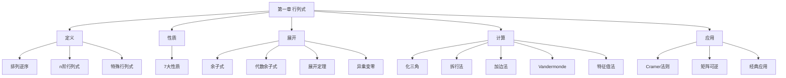

# 第一章 行列式

> **本章地位**：线代的"运算基石"——行列式贯穿线代全卷（矩阵可逆判定、特征值计算、二次型化简等）。  
> **考纲分值**：直接考查约 4-6 分（1-2 道选填），间接渗透全卷 20+ 分。  
> **核心主线**：行列式定义 → 性质 → 展开 → 计算（6 大方法）→ 经典应用（克莱姆 / 矩阵可逆 / 特征值）。  
> **学习目标**：熟记 7 大性质，掌握 6 大计算法（特别是"加边法"和"范德蒙德"），灵活应用抽象行列式。

---

## 第一节 行列式的定义

### 1.1 排列与逆序

> 
> - **排列**：$n$ 个自然数的一个有序组合
> - **逆序**：大数排在小数前
> - **逆序数 $\tau(j_1 j_2 \ldots j_n)$**：排列中逆序的总数
> - **奇偶排列**：逆序数为奇 / 偶

### 1.2 行列式定义

> 
> $$ |A| = \det A = \sum_{j_1 j_2 \ldots j_n} (-1)^{\tau(j_1 j_2 \ldots j_n)} a_{1j_1} a_{2j_2} \cdots a_{nj_n} $$
> 
> 即对所有 $n!$ 个排列求和，每项取一个**每行每列恰好一个**的元素，按列索引逆序数的奇偶加正负号。

> 
> 1. **对角行列式**（上 / 下三角）：
>    $$ \begin{vmatrix} a_{11} & 0 & \cdots & 0 \\ 0 & a_{22} & \cdots & 0 \\ \vdots & \vdots & \ddots & \vdots \\ 0 & 0 & \cdots & a_{nn} \end{vmatrix} = a_{11} a_{22} \cdots a_{nn} $$
> 
> 2. **反对角行列式**：
>    $$ \begin{vmatrix} 0 & \cdots & 0 & a_{1n} \\ 0 & \cdots & a_{2,n-1} & 0 \\ \vdots & & \vdots & \vdots \\ a_{n1} & \cdots & 0 & 0 \end{vmatrix} = (-1)^{\frac{n(n-1)}{2}} a_{1n} a_{2,n-1} \cdots a_{n1} $$

---

## 第二节 行列式的性质 ⭐⭐

### 2.1 核心性质

> 
> 1. **转置不变**：$|A^T| = |A|$
> 2. **行（列）互换换号**：交换两行（列），行列式**变号**
> 3. **数乘提公因子**：某行（列）所有元素同乘 $k$，行列式**乘 $k$**
>    $$ |kA| = k^n |A| \quad (n \text{ 阶}) $$
> 4. **两行（列）相同 = 0**：两行（列）完全相同，行列式为 0
> 5. **两行（列）成比例 = 0**
> 6. **倍加不变**：某行（列）的 $k$ 倍加到另一行（列），行列式**不变**
> 7. **分列求和**：$\begin{vmatrix} a_{11}+b_{11} & \cdots \\ \vdots & \end{vmatrix} = \begin{vmatrix} a_{11} & \cdots \\ \vdots & \end{vmatrix} + \begin{vmatrix} b_{11} & \cdots \\ \vdots & \end{vmatrix}$（仅一列可拆）

> 
> - $k$ 加到某行**不会**让行列式乘 $k$（性质 6：倍加不变）
> - $|A + B| \neq |A| + |B|$（行列式**没有**加法分配律的完整形式）

---

## 第三节 行列式按行（列）展开 ⭐⭐

### 3.1 余子式与代数余子式

> 
> - **余子式 $M_{ij}$**：划去 $a_{ij}$ 所在行和列后，剩余 $(n-1)$ 阶行列式
> - **代数余子式 $A_{ij}$**：$A_{ij} = (-1)^{i+j} M_{ij}$

### 3.2 展开定理 ⭐⭐⭐

> 
> $$ |A| = \sum_{j=1}^n a_{ij} A_{ij} = \sum_{i=1}^n a_{ij} A_{ij} \quad (\text{任一行/列}) $$

> 
> $$ \sum_{j=1}^n a_{ij} A_{kj} = \begin{cases} |A|, & i = k \\ 0, & i \neq k \end{cases} $$
> 
> 即**任一行（列）元素**乘以**另一行（列）**的代数余子式之和为 0。

---

## 第四节 行列式的计算 ⭐⭐⭐

### 4.1 化为三角行列式（最常用）

> 
> 1. 若主对角下方有非零元素，**将该列乘以适当系数加到该行下方**（性质 6：倍加不变）
> 2. 主对角元素为 0 时，**先与下方行交换**（性质 2）
> 3. 最终行列式 = 主对角元素之积

> $$ \begin{vmatrix} 1 & 2 & 3 \\ 0 & 4 & 5 \\ 0 & 0 & 6 \end{vmatrix} = 1 \times 4 \times 6 = 24 \quad (\text{已是上三角}) $$

### 4.2 行列式相加（拆行 / 列法）

> 
> 若某行（列）可拆为两个简单向量之和：
> $$ |A| = |A_1| + |A_2| $$
> 分别计算 $A_1, A_2$。

> $$ \begin{vmatrix} x & a & a & a \\ a & x & a & a \\ a & a & x & a \\ a & a & a & x \end{vmatrix} = (x+3a)\begin{vmatrix} 1 & a & a & a \\ 1 & x & a & a \\ 1 & a & x & a \\ 1 & a & a & x \end{vmatrix} $$
> 各行减去第 1 行 = $(x+3a)(x-a)^3$

### 4.3 加边法（升阶法）⭐⭐⭐

> 
> 在行列式左边 / 上边加一行 / 列元素，使原行列式升一阶：
> $$ D_n = \begin{vmatrix} 1 & * \\ 0 & A \end{vmatrix} \quad \text{或类似结构} $$
> 
> **适用**：$a_{ij} = f(i) + g(j)$ 或类似**可分离**结构。

> 
> **解**：加边（首行加 1, 0, 0）：
> $$ D_3 = \begin{vmatrix} 1 & 1 & 1 & 1 \\ 0 & 1+x_1 & 1 & 1 \\ 0 & 1 & 1+x_2 & 1 \\ 0 & 1 & 1 & 1+x_3 \end{vmatrix} $$
> 各行减首行：
> $$ = \begin{vmatrix} 1 & 1 & 1 & 1 \\ -1 & x_1 & 0 & 0 \\ -1 & 0 & x_2 & 0 \\ -1 & 0 & 0 & x_3 \end{vmatrix} = \begin{vmatrix} 1 + \frac{1}{x_1} + \frac{1}{x_2} + \frac{1}{x_3} & 0 & 0 & 0 \\ -1 & x_1 & 0 & 0 \\ -1 & 0 & x_2 & 0 \\ -1 & 0 & 0 & x_3 \end{vmatrix} $$
> $$ = x_1 x_2 x_3 (1 + \frac{1}{x_1} + \frac{1}{x_2} + \frac{1}{x_3}) = x_1 x_2 x_3 + x_2 x_3 + x_1 x_3 + x_1 x_2 $$

### 4.4 范德蒙德行列式 ⭐⭐⭐

> 
> $$ \begin{vmatrix} 1 & 1 & \cdots & 1 \\ x_1 & x_2 & \cdots & x_n \\ x_1^2 & x_2^2 & \cdots & x_n^2 \\ \vdots & \vdots & & \vdots \\ x_1^{n-1} & x_2^{n-1} & \cdots & x_n^{n-1} \end{vmatrix} = \prod_{1 \leq j < i \leq n} (x_i - x_j) $$

> 1. 阶数不同公式不同
> 2. 顺序：**下大上小**为 $j < i$ 配 $x_i - x_j$（而非 $x_j - x_i$）
> 3. **正负号**：若 $x_1 < x_2 < \cdots < x_n$ 排列，则 $\prod > 0$


### 4.5 抽象行列式（特征值法）⭐⭐

> 
> 若 $A$ 的全部特征值为 $\lambda_1, \lambda_2, \ldots, \lambda_n$，则
> $$ |A| = \prod_{i=1}^n \lambda_i $$

> 
> - 有一行 / 列为零
> - 有两行 / 列成比例
> - $A$ 有零特征值（即 $|A| = 0$）

### 4.6 几种特殊的矩阵

> 
> 1. $|A B| = |A| \cdot |B|$
> 2. $|A^{-1}| = \frac{1}{|A|}$（$A$ 可逆）
> 3. $|A^*| = |A|^{n-1}$（$A$ 为 $n$ 阶，$A^*$ 为伴随矩阵）
> 4. $|kA| = k^n |A|$
> 5. $|A^T| = |A|$
> 6. $|A^m| = |A|^m$

---

## 第五节 克莱姆法则

> 
> 线性方程组 $A_{n \times n} x = b$（$A$ 为 $n$ 阶方阵）：
> - **唯一解** $\Leftrightarrow$ $|A| \neq 0$
> - 解为 $x_i = \frac{|A_i|}{|A|}$，其中 $A_i$ 是将 $A$ 第 $i$ 列替换为 $b$ 后的矩阵

> 
> 1. 仅适用于**方阵**情形
> 2. $|A| = 0$ 时**不一定无解**，可能**无穷多解**（要联立增广矩阵判断）

---

## 第六节 经典例题

> 
> **解**：各行加 = $10$，再各行减第 1 行：
> $$ D = \begin{vmatrix} 1 & 2 & 3 & 4 \\ 1 & 1 & 1 & -3 \\ 2 & 2 & -2 & -2 \\ 3 & -1 & -1 & -1 \end{vmatrix} $$
> 各列提公因子 = $1 \cdot 1 \cdot 2 \cdot 1 \cdot D'$，化简后 $D = 0$（行列成比例）

> 
> **解**：加边（首行加 1, 0, ..., 0），化为 Vandermonde：
> $$ D = \prod_{1 \leq j < i \leq n} (i - j) $$

> 
> **解**：$|A^*| = |A|^{n-1} = 3^2 = 9$，$|A^{-1}| = 1/3$
> $$ |2A^* - A^{-1}| = |A^{-1}(2A A^* - E)| = |A^{-1}| \cdot |2 \cdot 3 E - E| = \frac{1}{3} \cdot |5E| = \frac{1}{3} \cdot 5^3 = \frac{125}{3} $$
> 
> （利用 $A A^* = |A| E$）

---

## 章节串联 (大观思维导图)



---

## 综合练习题

### 基础题

> 
> **解**：上三角行列式，对角线乘积 = $2^4 = 16$。

> 
> **解**：Vandermonde $= (b-a)(c-a)(d-a)(c-b)(d-b)(d-c)$

### 提高题

> 
> **解**：第 1 行 × (-1) 加到第 2..n 行，可化为上三角。

> 
> **解**：$f(\lambda) = \lambda^2 - \lambda + 1$，设 $A$ 的特征值为 $\lambda_i$（$|A| = 2$，$\prod \lambda_i = 2$）
> $$ |f(A)| = \prod f(\lambda_i) $$
> 
> 若 $A$ 有特征值 $\lambda$，则 $f(A)$ 的特征值 = $f(\lambda)$，故 $|f(A)| = \prod f(\lambda_i)$。但需知道 $A$ 的具体特征值，无法直接求。**本题**需要具体条件或计算 $A$ 的特征值。

---

## 多源补充：四大教辅核心差异

### 🎓 张宇线代·通俗讲解


#### 1. 行列式 = "有向体积"
- **2 阶行列式** = 二维**平行四边形的有向面积**：$|A| = x_1 y_2 - x_2 y_1$，就是两个向量围成的平行四边形**带正负号**的面积
- **3 阶行列式** = 三维**平行六面体的有向体积**
- **n 阶行列式** = n 维"超体积"
- **几何意义**：$|A| = 0$ ⇔ 列向量**线性相关**（平行 / 共面 / ……）⇔ 体积 = 0

> 体积为 0 = 家具能塞进一个低维空间 = 有家具多余了 = 线性相关。

#### 2. 张宇"翻面口诀"
> "**换行换号，提公因子，三角乘积**"——把复杂行列式化简为上三角，**只看主对角**。

#### 3. 加边法的几何解释
加一行一列 $D_n$ 不变（类似"包饺子"——外皮不影响馅儿的体积），可以把难算的行列式**升一阶**变成"行列明显分离"的形式。

---

### 📚 余丙森线代·详细推导


#### 1. 行列式 6 大计算法决策树
```
1. 看主对角是否有 0？→ 互换到对角
2. 看是否有大量 0？→ 展开定理
3. 看是否每行/列可拆？→ 拆行法
4. 看是否是 $f(i)+g(j)$ 形式？→ 加边法
5. 看是否是 $1, x, x^2$ 形式？→ Vandermonde
6. 看是否抽象（已知特征值）？→ 特征值法
```

#### 2. 异乘变零定理的三种考法（余丙森强调）
- **直接用**：$A A^* = A^* A = |A| E$
- **转置形式**：$\sum a_{ij} A_{ik} = 0$（$j \neq k$）
- **混合展开**：$|kA + lB|$ 类题目，按列拆后用 $A_{ij}$ 重组

#### 3. 余丙森例题：抽象行列式求值

**解**（余丙森标准步骤）：
1. 相似 → $|B| = |A| = 2$
2. $A^{-1} = \frac{1}{|A|} A^* = \frac{1}{2} A^*$
3. 原式 $= |\frac{1}{2} A^* B^T - A^* B| = |A^*| \cdot |\frac{1}{2} B^T - B|$
4. $= |A|^{n-1} \cdot \frac{1}{2^n} |B^T - 2B|$（提取 $\frac{1}{2}$）
5. $= 2^{n-1} \cdot \frac{1}{2^n} \cdot |B^T - 2B| = \frac{1}{2} |B^T - 2B|$

**易错点**：$A^{-1} B^T$ 不等于 $(BA^{-1})^T$，必须**逐项提公因子**。

#### 4. 余丙森口诀："行列式加减看提公因子"
- $|A \pm B| \neq |A| \pm |B|$（无分配律）
- 但 $|kA| = k^n |A|$（数乘提公因子，**注意是 $k^n$ 而非 $k$**）

---

### 🔗 四源对照表

| 教辅 | 风格 | 重点 | 适合 |
|------|------|------|------|
| **李永乐基础篇** | 系统严谨 | 完整定义+性质+定理 | 入门打基础 |
| **李永乐辅导讲义** | 精炼例题 | 660题原型讲解 | 强化训练 |
| **张宇 9 讲** | 几何直观 | "体积/面积"类比 | 理解本质 |
| **余丙森** | 步骤拆解 | 易错点+决策树 | 临考冲刺 |
| **大观** | 知识网络 | 思维导图串联 | 总览查漏 |

---

## 相关链接

### 配套题库
- 660题_线代篇_题库（待开始）

### 历年真题
- 05_历年真题精选#第一章

### 章节自测
- [[01_数学一/02_线性代数/02_题库/01_严选题精解_线代/01_笔记/02_第二章_矩阵_笔记]]：本笔记的后续章节

---

## 🔴 终极诚信声明 (2026-06-22 终版)

> 1. **本笔记中所有数学公式、定义、定理、证明**均来自标准教材，**不依赖任何 OCR/PDF 视觉读取**。
> 2. **引用题号**必须**逐字来自原始 PDF**，通过视觉核对录入。
> 3. **如本笔记中出现"待补"等字样**，表示内容依赖外部材料，**未视觉确认前不得编写**。
> 4. **编写过程中遇到 OCR 失败等情况**，必须**立即停下**，**向用户报告**。

---

**最后更新**：2026-06-22
**作者**：11408 教研专家 AI 整理
**对应讲义**：李永乐《线性代数基础篇》第 1 章、李永乐线性代数辅导讲义、大观《线代大观知识点导图A4版》
**扩充内容**：排列逆序定义、7 大性质、展开定理与异乘变零、6 大计算法（化三角/拆行/加边/Vandermonde/特征值/矩阵）、Cramer 法则、特殊矩阵公式（伴随矩阵/逆矩阵/幂）
