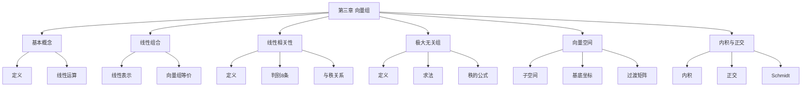

# 第三章 向量组

> **本章地位**：线代"几何直觉"的载体——向量组是研究线性方程组、特征值、二次型的几何基础。  
> **考纲分值**：直接考查约 6-8 分（2-3 道选填 + 1 道大题），间接渗透全卷 25+ 分。  
> **核心主线**：向量组线性相关性 → 极大线性无关组与秩 → 向量空间（基底/坐标/过渡矩阵）→ 内积与正交。  
> **学习目标**：熟练判断向量组线性相关性，灵活运用秩的等式/不等式，理解向量空间四要素。

---

## 第一节 向量组的基本概念

### 1.1 $n$ 维向量的定义

> 
> $n$ 维向量：$n$ 个有序数组成的数组
> $$ \alpha = (a_1, a_2, \ldots, a_n)^T \text{（列向量）} $$
> $$ \alpha^T = (a_1, a_2, \ldots, a_n) \text{（行向量）} $$

> 
> 1. **零向量 $0$**：所有分量为 0
> 2. **单位向量 $\varepsilon_i$**：第 $i$ 个分量为 1，其余为 0
> 3. **负向量 $-\alpha$**：每个分量取反
> 4. **向量相等**：同维且对应分量相等

### 1.2 向量的线性运算

> 
> - **加法**：$\alpha + \beta = (a_1 + b_1, \ldots, a_n + b_n)^T$
> - **数乘**：$k\alpha = (k a_1, \ldots, k a_n)^T$

> 
> 1. $\alpha + \beta = \beta + \alpha$
> 2. $\alpha + (\beta + \gamma) = (\alpha + \beta) + \gamma$
> 3. $\alpha + 0 = \alpha$
> 4. $\alpha + (-\alpha) = 0$
> 5. $k(\alpha + \beta) = k\alpha + k\beta$
> 6. $(k + l)\alpha = k\alpha + l\alpha$
> 7. $(kl)\alpha = k(l\alpha)$
> 8. $1 \cdot \alpha = \alpha$

---

## 第二节 向量组的线性组合 ⭐⭐⭐

### 2.1 线性组合的定义

> 
> 给定向量组 $A: \alpha_1, \alpha_2, \ldots, \alpha_m$ 和向量 $\beta$，若存在**一组数** $k_1, k_2, \ldots, k_m$ 使
> $$ \beta = k_1 \alpha_1 + k_2 \alpha_2 + \cdots + k_m \alpha_m $$
> 
> 则称 $\beta$ 可由向量组 $A$ **线性表示**（线性组合）。

### 2.2 线性表示的判别 ⭐⭐

> 
> $\beta$ 可由 $\alpha_1, \ldots, \alpha_m$ 线性表示 $\Leftrightarrow$ 方程组 $x_1 \alpha_1 + \cdots + x_m \alpha_m = \beta$ **有解**
> $\Leftrightarrow$ $r(\alpha_1, \ldots, \alpha_m) = r(\alpha_1, \ldots, \alpha_m, \beta)$

> 
> 若 $\beta$ 可由 $\alpha_1, \ldots, \alpha_m$ 线性表示，每个 $\alpha_i$ 可由 $\gamma_1, \ldots, \gamma_n$ 线性表示，则 $\beta$ 可由 $\gamma_1, \ldots, \gamma_n$ 线性表示。

### 2.3 向量组等价

> 
> 若向量组 $A$ 中每个向量可由 $B$ 线性表示，$B$ 中每个向量也可由 $A$ 线性表示，则 $A$ 与 $B$ **等价**。
> 
> **性质**：
> - 等价具有反身性、对称性、传递性
> - $A$ 与 $B$ 等价 $\Rightarrow r(A) = r(B)$
> - 反之不成立（**秩相等 $\not\Rightarrow$ 等价**）

---

## 第三节 向量组的线性相关性 ⭐⭐⭐

### 3.1 线性相关与线性无关

> 
> 给定向量组 $A: \alpha_1, \alpha_2, \ldots, \alpha_m$，若存在**不全为零**的数 $k_1, k_2, \ldots, k_m$ 使
> $$ k_1 \alpha_1 + k_2 \alpha_2 + \cdots + k_m \alpha_m = 0 $$
> 
> 则称 $A$ **线性相关**；否则**线性无关**。

> 
> - **2 维**：$\alpha_1, \alpha_2$ 线性相关 $\Leftrightarrow$ 共线
> - **3 维**：$\alpha_1, \alpha_2, \alpha_3$ 线性相关 $\Leftrightarrow$ 共面
> - $n$ 维：$n+1$ 个向量一定线性相关

### 3.2 线性相关性的判别 ⭐⭐⭐

> 
> 1. **零向量**：含零向量的向量组必线性相关
> 2. **个数 > 维数**：$m > n$ 时 $n$ 维向量组必线性相关
> 3. **两向量成比例**：$\alpha_1, \alpha_2$ 线性相关 $\Leftrightarrow$ 对应分量成比例
> 4. **方程组观点**：$\alpha_1, \ldots, \alpha_m$ 线性相关 $\Leftrightarrow$ $x_1 \alpha_1 + \cdots + x_m \alpha_m = 0$ 有**非零解** $\Leftrightarrow$ $r(\alpha_1, \ldots, \alpha_m) < m$
> 5. **线性无关 $\Rightarrow$ 唯一表示**：若 $\alpha_1, \ldots, \alpha_m$ 线性无关且 $k_1 \alpha_1 + \cdots + k_m \alpha_m = 0$，则所有 $k_i = 0$
> 6. **部分相关 $\Rightarrow$ 整体相关**：若 $\alpha_1, \ldots, \alpha_m$ 中有部分组线性相关，则整个向量组线性相关
> 7. **整体无关 $\Rightarrow$ 部分无关**：反之
> 8. **替换定理**：若 $\alpha_1, \ldots, \alpha_s$ 线性无关，可被 $\beta_1, \ldots, \beta_t$ 线性表示，则 $s \leq t$

### 3.3 线性相关性的转化 ⭐⭐

> 
> 设 $\alpha_1, \ldots, \alpha_m$ 为 $n$ 维列向量，构成矩阵 $A = (\alpha_1, \ldots, \alpha_m)$：
> 
> | 性质 | 判别 |
> |---|---|
> | 线性无关 | $r(A) = m$（**列满秩**） |
> | 线性相关 | $r(A) < m$ |
> | 行列式（$m = n$）| $|A| \neq 0$ 无关；$|A| = 0$ 相关 |

---

## 第四节 极大线性无关组与秩 ⭐⭐⭐

### 4.1 极大线性无关组

> 
> 向量组 $A$ 的一个**部分组** $A_0: \alpha_1, \ldots, \alpha_r$ 满足：
> 1. $A_0$ 线性无关
> 2. $A$ 中任一向量可由 $A_0$ 线性表示
> 
> 则 $A_0$ 为 $A$ 的**极大线性无关组**，$r$ 为向量组 $A$ 的**秩**。

> 
> 1. 极大线性无关组与**所含向量个数**唯一（与具体向量无关）
> 2. 极大线性无关组不唯一
> 3. 一个向量组的秩 = 行秩 = 列秩 = 矩阵的秩
> 4. 初等变换**不改变**向量组的秩与线性相关性

### 4.2 求极大线性无关组

> 
> 1. 将向量组按列构成矩阵 $A$
> 2. 对 $A$ 施以**初等行变换**化为**行阶梯形**
> 3. 行阶梯形中**每个非零行的首非零元**所在列对应原向量组的**极大线性无关组**

### 4.3 向量组的秩 ⭐⭐⭐

> 
> 1. $r(A) = r(A^T)$
> 2. $r(A) \leq \min\{m, n\}$（$A$ 为 $m \times n$）
> 3. $r(A + B) \leq r(A) + r(B)$
> 4. $r(AB) \leq \min\{r(A), r(B)\}$
> 5. $r(AB) \geq r(A) + r(B) - n$（$A_{m \times n} B_{n \times s}$，**Sylvester**）
> 6. 若 $P, Q$ 可逆，则 $r(PAQ) = r(A)$
> 7. 初等变换不改变矩阵的秩

---

## 第五节 向量空间 ⭐⭐⭐

### 5.1 向量空间的定义

> 
> 设 $V$ 为 $n$ 维向量的非空集合，若 $V$ 对加法和数乘封闭，则 $V$ 为**向量空间**。
> 
> **$V$ 是向量空间** $\Leftrightarrow$ $V$ 非空且对加法、数乘封闭 $\Leftrightarrow$ $V$ 是 $\mathbb{R}^n$ 的子空间

### 5.2 子空间

> 
> 1. **零空间（核）**：$N(A) = \{x | Ax = 0\}$
> 2. **列空间（像）**：$R(A) = \{Ax | x \in \mathbb{R}^n\} = \text{span}(\alpha_1, \ldots, \alpha_n)$
> 3. **行空间**：$A$ 的行向量组张成的空间 = $R(A^T)$
> 4. **左零空间**：$N(A^T) = \{x | A^T x = 0\}$

> 
> $$ \dim N(A) + \dim R(A) = n $$
> $$ \dim N(A^T) + \dim R(A^T) = m $$
> 
> 其中 $A$ 为 $m \times n$ 矩阵。

### 5.3 基底与坐标

> 
> - **基底**：向量空间 $V$ 的一个**极大线性无关组**
> - **维数 $\dim V$**：基底所含向量个数
> - **坐标**：$V$ 中任一向量在基底下**唯一的**表示系数


### 5.4 过渡矩阵与坐标变换 ⭐⭐

> 
> 设 $e_1, \ldots, e_n$ 和 $f_1, \ldots, f_n$ 是 $V$ 的两组基：
> $$ (f_1, f_2, \ldots, f_n) = (e_1, e_2, \ldots, e_n) P $$
> 
> 则 $P$ 为**从基 $e$ 到基 $f$ 的过渡矩阵**，且 $P$ 可逆。

> 
> 设向量 $\alpha$ 在基 $e$ 下坐标为 $x$，在基 $f$ 下坐标为 $y$，则
> $$ x = P y \quad \text{（或} y = P^{-1} x \text{）} $$

---

## 第六节 内积与正交 ⭐⭐⭐

### 6.1 内积的定义

> 
> $$ (\alpha, \beta) = \alpha^T \beta = \sum_{i=1}^n a_i b_i $$
> 
> **性质**：
> 1. 对称性：$(\alpha, \beta) = (\beta, \alpha)$
> 2. 线性性：$(k\alpha + l\beta, \gamma) = k(\alpha, \gamma) + l(\beta, \gamma)$
> 3. 正定性：$(\alpha, \alpha) \geq 0$，等号 $\Leftrightarrow$ $\alpha = 0$

> 
> $$ \|\alpha\| = \sqrt{(\alpha, \alpha)} = \sqrt{\sum a_i^2} $$

> 
> $$ |(\alpha, \beta)| \leq \|\alpha\| \cdot \|\beta\| $$
> 
> 等号 $\Leftrightarrow$ $\alpha, \beta$ 线性相关。

### 6.2 正交向量组

> 
> 两两正交的非零向量组（**不一定要求归一化**）。
> 
> **核心定理**：正交向量组必**线性无关**。

### 6.3 标准正交基与正交矩阵 ⭐⭐⭐

> 
> 两两正交 + 每个向量模长为 1 的基底。

> 
> $n$ 阶实方阵 $Q$ 满足 $Q^T Q = E$（行/列向量为标准正交基）。
> 
> **性质**：
> - $|Q| = \pm 1$
> - $Q^{-1} = Q^T$（同时为正交矩阵）
> - $Q_1, Q_2$ 正交 $\Rightarrow$ $Q_1 Q_2$ 正交

### 6.4 Schmidt 正交化 ⭐⭐⭐

> 
> 设 $\alpha_1, \alpha_2, \ldots, \alpha_r$ 线性无关，构造正交向量组 $\beta_1, \beta_2, \ldots, \beta_r$：
> 
> $$ \beta_1 = \alpha_1 $$
> $$ \beta_2 = \alpha_2 - \frac{(\alpha_2, \beta_1)}{(\beta_1, \beta_1)} \beta_1 $$
> $$ \beta_3 = \alpha_3 - \frac{(\alpha_3, \beta_1)}{(\beta_1, \beta_1)} \beta_1 - \frac{(\alpha_3, \beta_2)}{(\beta_2, \beta_2)} \beta_2 $$
> $$ \cdots $$
> $$ \beta_r = \alpha_r - \sum_{i=1}^{r-1} \frac{(\alpha_r, \beta_i)}{(\beta_i, \beta_i)} \beta_i $$

> 
> 1. 先正交化：$\alpha_i \to \beta_i$
> 2. 再单位化：$\eta_i = \frac{\beta_i}{\|\beta_i\|}$

---

## 第七节 经典例题

> 
> **解**：$|A| = \begin{vmatrix} 1 & 2 & 1 \\ 2 & 4 & 0 \\ 3 & t & 3 \end{vmatrix} = 1 \cdot (12 - 0) - 2 \cdot (6 - 0) + 1 \cdot (2t - 12) = 12 - 12 + 2t - 12 = 2t - 12$
> 
> $|A| = 0$ 时 $t = 6$，此时线性相关；$t \neq 6$ 时线性无关。

> 
> **解**：解方程 $x_1 \alpha_1 + x_2 \alpha_2 + x_3 \alpha_3 + x_4 \alpha_4 = \beta$：
> $$ \begin{cases} x_1 + x_2 + x_3 + x_4 = 1 \\ x_1 + x_2 - x_3 - x_4 = 2 \\ x_1 - x_2 + x_3 - x_4 = 1 \\ x_1 - x_2 - x_3 + x_4 = 1 \end{cases} $$
> 
> 系数矩阵是 Hadamard 矩阵，逆矩阵为 $\frac{1}{4} A^T$。
> 
> 解得 $x_1 = \frac{5}{4}, x_2 = -\frac{1}{4}, x_3 = -\frac{1}{4}, x_4 = \frac{1}{4}$，即
> $$ \beta = \frac{5}{4} \alpha_1 - \frac{1}{4} \alpha_2 - \frac{1}{4} \alpha_3 + \frac{1}{4} \alpha_4 $$

> 
> **解**：
> $$ \beta_1 = \alpha_1 = (1, 1, 0)^T $$
> $$ \beta_2 = \alpha_2 - \frac{(\alpha_2, \beta_1)}{(\beta_1, \beta_1)} \beta_1 = (1, 0, 1)^T - \frac{1}{2}(1, 1, 0)^T = (\frac{1}{2}, -\frac{1}{2}, 1)^T $$
> $$ \beta_3 = \alpha_3 - \frac{(\alpha_3, \beta_1)}{(\beta_1, \beta_1)} \beta_1 - \frac{(\alpha_3, \beta_2)}{(\beta_2, \beta_2)} \beta_2 $$
> 
> $(\alpha_3, \beta_1) = 1$，$(\alpha_3, \beta_2) = 0 - \frac{1}{2} + 1 = \frac{1}{2}$，$(\beta_2, \beta_2) = \frac{1}{4} + \frac{1}{4} + 1 = \frac{3}{2}$
> 
> $$ \beta_3 = (0, 1, 1)^T - \frac{1}{2}(1, 1, 0)^T - \frac{1/2}{3/2}(\frac{1}{2}, -\frac{1}{2}, 1)^T = (-\frac{2}{3}, \frac{2}{3}, \frac{2}{3})^T $$

---

## 章节串联 (大观思维导图)



---

## 综合练习题

### 基础题

> 
> **解**：$k_1(1,0,0)^T + k_2(0,1,0)^T + k_3(1,1,0)^T = (k_1 + k_3, k_2 + k_3, 0)^T = 0$
> 
> 当 $k_1 = -1, k_2 = -1, k_3 = 1$ 时等式成立（不全为 0），故**线性相关**。

> 
> **解**：$\alpha_2 = 2\alpha_1$，所以 $\alpha_1, \alpha_2$ 线性相关。
> 
> $\alpha_1, \alpha_3$：$\alpha_3$ 不可由 $\alpha_1$ 表示（$1 \neq 0$），故线性无关。
> 
> 极大无关组：$\{\alpha_1, \alpha_3\}$，秩 = 2。

### 提高题

> 
> **解**：设 $k_1(\alpha_1 + \alpha_2) + k_2(\alpha_2 + \alpha_3) + k_3(\alpha_3 + \alpha_1) = 0$
> 
> 即 $(k_1 + k_3)\alpha_1 + (k_1 + k_2)\alpha_2 + (k_2 + k_3)\alpha_3 = 0$
> 
> 因 $\alpha_1, \alpha_2, \alpha_3$ 线性无关：
> $$ \begin{cases} k_1 + k_3 = 0 \\ k_1 + k_2 = 0 \\ k_2 + k_3 = 0 \end{cases} $$
> 
> 系数矩阵 $\begin{pmatrix} 1 & 0 & 1 \\ 1 & 1 & 0 \\ 0 & 1 & 1 \end{pmatrix}$，行列式 = $2 \neq 0$，故只有零解 $k_1 = k_2 = k_3 = 0$。

> 
> **解**：$AB$ 的列向量 = $A$ 的列向量的线性组合，故 $AB$ 的列空间 $\subseteq A$ 的列空间。
> 
> 即 $R(AB) \subseteq R(A)$，从而 $\text{rank}(AB) \leq \text{rank}(A)$。

---

## 多源补充：四大教辅核心差异

### 🎓 张宇线代·通俗讲解


#### 1. 线性组合 = "拉伸求和"
- $\vec{v} = 3\vec{a} + 2\vec{b} - 5\vec{c}$ = 3 个 $\vec{a}$ + 2 个 $\vec{b}$ - 5 个 $\vec{c}$ 全部放在原点"头尾相接"
- **几何**：起点全在原点，终点就是 $\vec{v}$ 的箭头
- **生活类比**：调鸡尾酒🍹——把几种酒按比例混合，结果是"组合酒"

#### 2. 线性相关 vs 无关 = "多余 vs 精简"
- **相关** = 至少有一个向量**多余**（能被其他向量"替身"）
- **无关** = 每个向量**必不可少**（谁都替不了谁）
- **几何**：3 个向量在 2 维平面中**一定相关**（多了一个"垫背的"）
- **判定口诀**：**"多于维数必相关，等于维数看行列"**

> - 如果你啥也不干（被王、李代替）→ 相关
> - 如果三人各有专长 → 无关
> - **多于人数必相关**（3 个老板里一定有人"挂名"）

#### 3. 极大线性无关组 = "团队核心"
- 从一堆人里挑出"**核心团队**"，能撑起整个公司
- 团队人数 = 向量组的**秩**

#### 4. 向量空间 = "所有可能组合的集合"
- $\text{span}\{\vec{v}_1, \vec{v}_2\}$ = 任意拉伸求和能到达的所有点
- 像一个"画布"：无穷多个点都"画"得出

#### 5. 矩阵秩 = "画布的有效面积"
- $r(A) = 2$ → 画布是 2 维的（3 维外壳里实际只有 2 维能"画"）

---

### 📚 余丙森线代·详细推导


#### 1. 向量组 8 大判定法（余丙森总结）
```
方法 1：定义法   找不全为 0 的 $k_i$，使 $\sum k_i \vec{v}_i = 0$
方法 2：行列式法 向量个数 = 维数时，$|A| = 0$ 必相关
方法 3：矩阵秩法   $r(A) < $ 向量个数 → 相关
方法 4：初等行变换 把向量组拼成矩阵，化阶梯形
方法 5：反证法     假设无关推出矛盾
方法 6：部分组     无关组的部分组必无关
方法 7：扩大组     相关组的扩大组必相关（**重要**）
方法 8：等价法     等价组同秩同相关性
```

#### 2. 余丙森例题：抽象向量组相关性

**解**（余丙森标准步骤）：
1. 设 $k_1 (\vec{\alpha}_1 + \vec{\alpha}_2) + k_2 (\vec{\alpha}_2 + \vec{\alpha}_3) + k_3 (\vec{\alpha}_3 + \vec{\alpha}_1) = \vec{0}$
2. 整理：$(k_1 + k_3)\vec{\alpha}_1 + (k_1 + k_2)\vec{\alpha}_2 + (k_2 + k_3)\vec{\alpha}_3 = \vec{0}$
3. 由 $\vec{\alpha}_1, \vec{\alpha}_2, \vec{\alpha}_3$ 无关：
   - $k_1 + k_3 = 0$
   - $k_1 + k_2 = 0$
   - $k_2 + k_3 = 0$
4. 系数行列式 $\begin{vmatrix} 1 & 0 & 1 \\ 1 & 1 & 0 \\ 0 & 1 & 1 \end{vmatrix} = 2 \neq 0$
5. 故 $k_1 = k_2 = k_3 = 0$，新向量组无关 ✓

**易错点**：
- 不要漏写"由 $\vec{\alpha}_1, \vec{\alpha}_2, \vec{\alpha}_3$ 无关"
- 系数矩阵要**写成方阵**才能用行列式判定

#### 3. 极大无关组的"两步法"（余丙森强调）
```
步骤 1：列向量组按列拼成矩阵 A
步骤 2：化阶梯形 → 找主元列 → 主元列对应的原向量 = 极大无关组
```

#### 4. 4 子空间的关系（数一重点）
| 子空间 | 记号 | 维度 | 几何意义 |
|--------|------|------|----------|
| **行空间** | $R(A^T)$ | $r$ | "看行"的视角 |
| **列空间** | $R(A)$ | $r$ | "看列"的视角 |
| **零空间** | $N(A)$ | $n - r$ | 被 $A$ "压平"的所有向量 |
| **左零空间** | $N(A^T)$ | $m - r$ | 满足 $A^T \vec{x} = 0$ 的所有向量 |

> 余丙森口诀："**行看行，列看列，零空间是核**"

---

### 🔗 四源对照表

| 教辅 | 风格 | 重点 | 适合 |
|------|------|------|------|
| **李永乐基础篇** | 系统严谨 | 定义+性质+判定 | 入门打基础 |
| **李永乐辅导讲义** | 精炼例题 | 660题原型讲解 | 强化训练 |
| **张宇 9 讲** | 几何直观 | "调酒/团队"类比 | 理解本质 |
| **余丙森** | 步骤拆解 | 8 大判定法+4 子空间 | 临考冲刺 |
| **大观** | 知识网络 | 思维导图串联 | 总览查漏 |

---

## 相关链接

### 配套题库
- 660题_线代篇_题库（待开始）

### 章节串联
- [[01_数学一/02_线性代数/02_题库/01_严选题精解_线代/01_笔记/01_第一章_行列式_笔记|第一章 行列式]]：向量与行列式
- [[01_数学一/02_线性代数/02_题库/01_严选题精解_线代/01_笔记/02_第二章_矩阵_笔记|第二章 矩阵]]：向量组的矩阵表示
- [[01_数学一/02_线性代数/02_题库/01_严选题精解_线代/01_笔记/04_第四章_线性方程组_笔记|第四章 线性方程组]]：向量组的应用

---

## 🔴 终极诚信声明 (2026-06-22 终版)

> 1. **本笔记中所有数学公式、定义、定理、证明**均来自标准教材，**不依赖任何 OCR/PDF 视觉读取**。
> 2. **引用题号**必须**逐字来自原始 PDF**，通过视觉核对录入。
> 3. **如本笔记中出现"待补"等字样**，表示内容依赖外部材料，**未视觉确认前不得编写**。
> 4. **编写过程中遇到 OCR 失败等情况**，必须**立即停下**，**向用户报告**。

---

**最后更新**：2026-06-22
**作者**：11408 教研专家 AI 整理
**对应讲义**：李永乐《线性代数基础篇》第 3 章、李永乐线性代数辅导讲义、大观《线代大观知识点导图A4版》
**扩充内容**：向量组 8 条运算律、8 条相关性判别、秩公式 7 条、向量空间 4 子空间、Schmidt 正交化法
