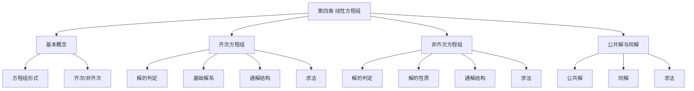

# 第四章 线性方程组

> **本章地位**：线代"理论与应用"的桥梁——线性方程组贯穿行列式、矩阵、向量组、特征值、二次型。  
> **考纲分值**：直接考查约 10-15 分（1-2 道选填 + 1 道大题必考），是**大题压轴**的常客。  
> **核心主线**：方程组解的判定 → 齐次方程组基础解系 → 非齐次方程组通解结构 → 公共解/同解。  
> **学习目标**：熟练判定解的情况（唯一/无穷/无），快速求基础解系与通解，灵活处理公共解与同解问题。

---

## 第一节 线性方程组的基本概念

### 1.1 方程组的形式

> 
> $$ \begin{cases} a_{11} x_1 + a_{12} x_2 + \cdots + a_{1n} x_n = b_1 \\ a_{21} x_1 + a_{22} x_2 + \cdots + a_{2n} x_n = b_2 \\ \vdots \\ a_{m1} x_1 + a_{m2} x_2 + \cdots + a_{mn} x_n = b_m \end{cases} $$
> 
> **矩阵形式**：$A x = b$
> - $A = (a_{ij})_{m \times n}$：**系数矩阵**
> - $x = (x_1, \ldots, x_n)^T$：**未知向量**
> - $b = (b_1, \ldots, b_m)^T$：**常数项**
> - $\bar{A} = (A | b)$：**增广矩阵**

### 1.2 方程组的分类

> 
> - **齐次方程组**：$A x = 0$（$b = 0$）
> - **非齐次方程组**：$A x = b$（$b \neq 0$）

---

## 第二节 齐次线性方程组 ⭐⭐⭐

### 2.1 齐次方程组解的判定 ⭐⭐

> 
> $A_{m \times n} x = 0$：
> - **只有零解** $\Leftrightarrow$ $r(A) = n$（**列满秩**）$\Leftrightarrow$ $A$ 的列向量组线性无关
> - **有非零解** $\Leftrightarrow$ $r(A) < n$ $\Leftrightarrow$ $A$ 的列向量组线性相关
> - **特别**：$m = n$ 时，$r(A) < n$ $\Leftrightarrow$ $|A| = 0$

> 
> 1. 若 $\xi_1, \xi_2$ 是解，则 $k_1 \xi_1 + k_2 \xi_2$ 也是解（**解的线性组合仍是解**）
> 2. 齐次方程组的**解集**构成向量空间
> 3. 基础解系 = 解空间的基底

### 2.2 基础解系 ⭐⭐⭐

> 
> 设 $\xi_1, \xi_2, \ldots, \xi_s$ 是 $A x = 0$ 的解，满足：
> 1. $\xi_1, \xi_2, \ldots, \xi_s$ **线性无关**
> 2. $A x = 0$ 的任一解可由 $\xi_1, \ldots, \xi_s$ **线性表示**
> 
> 则 $\xi_1, \ldots, \xi_s$ 为**基础解系**。

> 
> 1. 基础解系**不唯一**，但所含向量个数**唯一**
> 2. **个数** = $n - r(A)$
> 3. 基础解系是解空间的**一组基**

### 2.3 通解结构 ⭐⭐⭐

> 
> 设 $\xi_1, \xi_2, \ldots, \xi_{n-r}$ 为基础解系（$r = r(A)$），则
> $$ x = k_1 \xi_1 + k_2 \xi_2 + \cdots + k_{n-r} \xi_{n-r} $$
> 
> 其中 $k_1, k_2, \ldots, k_{n-r}$ 为**任意常数**。

### 2.4 基础解系的求法 ⭐⭐

> 
> 1. 对系数矩阵 $A$ 施以**初等行变换**化为**行最简形**（reduced row echelon form）
> 2. 识别**自由未知量**（对应列为 0）
> 3. 令自由变量为 $(1, 0, \ldots, 0)^T, (0, 1, \ldots, 0)^T, \ldots, (0, 0, \ldots, 1)^T$（共 $n - r$ 组）
> 4. 回代求出对应的 $x$，得到 $n - r$ 个基础解系向量

> 
> **解**：
> $$ A \xrightarrow{r_2 - 2r_1} \begin{pmatrix} 1 & 2 & -1 & 0 \\ 0 & 0 & 2 & 1 \end{pmatrix} \xrightarrow{r_1 + r_2/2} \begin{pmatrix} 1 & 2 & 0 & 1/2 \\ 0 & 0 & 2 & 1 \end{pmatrix} $$
> 
> $$ \xrightarrow{r_2 / 2} \begin{pmatrix} 1 & 2 & 0 & 1/2 \\ 0 & 0 & 1 & 1/2 \end{pmatrix} $$
> 
> 自由变量 $x_2, x_4$。令 $(x_2, x_4) = (1, 0)$：$x_3 = 0, x_1 = -2$，$\xi_1 = (-2, 1, 0, 0)^T$。
> 
> 令 $(x_2, x_4) = (0, 1)$：$x_3 = -1/2, x_1 = -1/4$，$\xi_2 = (-1/4, 0, -1/2, 1)^T$。

---

## 第三节 非齐次线性方程组 ⭐⭐⭐

### 3.1 非齐次方程组解的判定 ⭐⭐⭐

> 
> $A_{m \times n} x = b$（$b \neq 0$）：
> 
> | 解的情况 | 充要条件 |
> |---|---|
> | **无解** | $r(A) < r(A | b)$ |
> | **唯一解** | $r(A) = r(A | b) = n$ |
> | **无穷多解** | $r(A) = r(A | b) < n$ |

> 
> - $r(A) = n$ 时，$A x = b$ **要么唯一解，要么无解**（**不可能有无穷多解**）
> - $r(A) < n$ 时，$A x = b$ **要么无穷多解，要么无解**（**不可能有唯一解**）

### 3.2 非齐次方程组解的性质 ⭐⭐

> 
> 1. **线性性质**：若 $\eta_1, \eta_2$ 是 $A x = b$ 的解，则 $\eta_1 - \eta_2$ 是 $A x = 0$ 的解
> 2. **特解 + 齐次解**：若 $\eta^*$ 是 $A x = b$ 的特解，$\xi$ 是 $A x = 0$ 的解，则 $\eta^* + \xi$ 是 $A x = b$ 的解
> 3. **非齐次解不构成线性空间**（不含零向量，不封闭于加法）
> 4. **任意两个非齐次解之差**是齐次解

### 3.3 通解结构 ⭐⭐⭐

> 
> $$ x = \eta^* + k_1 \xi_1 + k_2 \xi_2 + \cdots + k_{n-r} \xi_{n-r} $$
> 
> 其中：
> - $\eta^*$：**任一特解**（$A \eta^* = b$）
> - $\xi_1, \ldots, \xi_{n-r}$：**齐次方程组的基础解系**
> - $k_1, \ldots, k_{n-r}$：**任意常数**

### 3.4 求通解的方法 ⭐⭐

> 
> 1. **判断解的情况**：用判定定理
> 2. **求特解 $\eta^*$**：
>    - 将增广矩阵 $\bar{A}$ 化为行最简形
>    - 自由变量赋 0，求出 $x$（最简）
> 3. **求基础解系**：对 $A$ 化行最简形（同上节）
> 4. **写出通解**：$\eta^* + k_1 \xi_1 + \cdots + k_{n-r} \xi_{n-r}$

> 
> **解**：
> $$ A = \begin{pmatrix} 1 & 1 & 1 & 1 \\ 2 & 3 & 1 & 2 \\ 3 & 5 & 1 & 3 \end{pmatrix} \xrightarrow{} \begin{pmatrix} 1 & 1 & 1 & 1 \\ 0 & 1 & -1 & 0 \\ 0 & 2 & -2 & 0 \end{pmatrix} \xrightarrow{} \begin{pmatrix} 1 & 0 & 2 & 1 \\ 0 & 1 & -1 & 0 \\ 0 & 0 & 0 & 0 \end{pmatrix} $$
> 
> 自由变量 $x_3, x_4$。$r(A) = 2$，基础解系含 $4 - 2 = 2$ 个向量。
> 
> 令 $(x_3, x_4) = (1, 0)$：$x_2 = 1, x_1 = -2$，$\xi_1 = (-2, 1, 1, 0)^T$。
> 
> 令 $(x_3, x_4) = (0, 1)$：$x_2 = 0, x_1 = -1$，$\xi_2 = (-1, 0, 0, 1)^T$。
> 
> 通解：$x = k_1(-2, 1, 1, 0)^T + k_2(-1, 0, 0, 1)^T$。

---

## 第四节 方程组的公共解与同解 ⭐⭐⭐

### 4.1 公共解

> 
> 设两个方程组 (I) 和 (II)，若向量 $\alpha$ 同时是 (I) 和 (II) 的解，则 $\alpha$ 是它们的**公共解**。

### 4.2 求公共解的方法 ⭐⭐

> 
> 将两个方程组联立成一个方程组，求解。

> 
> 若方程组 (II) 的通解已表示为 (I) 基础解系的线性组合，则可找出组合系数，得到公共解。

> 
> 若两方程组同解，则系数矩阵等价。

### 4.3 同解 ⭐⭐

> 
> $A x = 0$ 与 $B x = 0$ 同解 $\Leftrightarrow$ $A, B$ 的行向量组**等价** $\Leftrightarrow$ $r\begin{pmatrix} A \\ B \end{pmatrix} = r(A) = r(B)$

---

## 第五节 方程组解的判别方法总结 ⭐⭐⭐

> 
> ```mermaid
> graph TD
>     A[方程组 Ax=b] --> B{计算 r A, r A|b}
>     B -->|r A < r A|b| C[无解]
>     B -->|r A = r A|b = n| D[唯一解]
>     B -->|r A = r A|b < n| E[无穷多解]
>     D --> F[特解即通解]
>     E --> G[特解 + 齐次通解]
> ```

---

## 第六节 经典例题

> 
> **解**：$|A| = 0$ 表明 $r(A) < n$，故 $A x = 0$ 有非零解。
> 
> 按第一行展开：$a_{11} A_{11} + a_{12} A_{12} + \cdots + a_{1n} A_{1n} = |A| = 0$（用第一行元素和第一行代数余子式）
> 
> 即 $A_{11} A_{11} + A_{12} A_{12} + \cdots + A_{1n} A_{1n}$？不对，是：
> 
> $\sum_j a_{1j} A_{1j} = 0$（异乘变零）
> 
> 因此 $(A_{11}, A_{12}, \ldots, A_{1n})^T$ 是 $A^T x = 0$ 的解，即 $A x = 0$ 的行向量组的解。

> 
> **解**：$r(A) = 3$，自由变量个数 = $4 - 3 = 1$。
> 
> 设 $\eta^*$ 是 $A x = b$ 的任一特解，$\xi$ 是基础解系向量（只有 1 个）。
> 
> $\eta_1 - \eta_2$ 是 $A x = 0$ 的解：$\eta_1 - \eta_2 = (1, 1, 0, 2)^T - 2\eta_2 + (\eta_2 + \eta_3) - \eta_3$？复杂。
> 
> 直接：$\eta_1 - \eta_2 = (\eta_1 + \eta_2) - 2\eta_2$，但需 $\eta_2$。
> 
> 改用：$\eta_1 - \eta_3 = (\eta_1 + \eta_2) - (\eta_2 + \eta_3) = (0, 1, -1, -1)^T$，这是 $A x = 0$ 的解。
> 
> 通解：$x = k(0, 1, -1, -1)^T + \eta^*$，其中 $\eta^*$ 取 $\eta_1$ 或 $\eta_2$ 或 $\eta_3$。

> 
> **解**：设 $k_0 \eta^* + k_1 \xi_1 + \cdots + k_s \xi_s = 0$。
> 
> 左乘 $A$：$k_0 A \eta^* + k_1 A \xi_1 + \cdots + k_s A \xi_s = k_0 b = 0$
> 
> 因 $b \neq 0$，故 $k_0 = 0$。
> 
> 此时 $k_1 \xi_1 + \cdots + k_s \xi_s = 0$，由基础解系的线性无关性，$k_1 = \cdots = k_s = 0$。
> 
> 故线性无关。

---

## 章节串联 (大观思维导图)



---

## 综合练习题

### 基础题

> 
> **解**：基础解系含 $n - r = 3$ 个向量，$n = 7$，故 $r(A) = 4$。

> 
> **解**：
> $$ \bar{A} = \begin{pmatrix} 1 & 2 & -1 & | & 1 \\ 2 & 3 & 1 & | & 2 \\ 3 & 5 & 0 & | & 3 \end{pmatrix} $$
> 
> $r_2 - 2r_1 = (0, -1, 3, 0)$，$r_3 - 3r_1 = (0, -1, 3, 0)$，故 $r_3 - r_2 = 0$，$r(\bar{A}) = 2$。
> 
> 同时 $r(A) = 2$（$r_3 - r_2 = 0$ 说明 $r_3 = r_2 + r_1$ 的线性组合）。
> 
> $r(A) = r(\bar{A}) = 2 < 3$，故**无穷多解**。

### 提高题

> 
> **解**：$r(A) = 2$，基础解系含 $3 - 2 = 1$ 个向量。
> 
> $\eta_1 - \eta_2 = (\eta_1 + \eta_2) - 2\eta_2$，但缺 $\eta_2$。
> 
> 改：$\eta_1 - \eta_3 = (\eta_1 + \eta_2) - (\eta_2 + \eta_3) = (1, 1, 1)^T$（齐次解）。
> 
> 选 $\eta^* = \eta_1$（任意一个非齐次解）。通解：$x = k(1, 1, 1)^T + \eta_1$。

> 
> **解**：
> - **$\Leftarrow$**：$A x = 0 \Rightarrow A^T A x = 0$（左乘 $A^T$）。
> - **$\Rightarrow$**：$A^T A x = 0 \Rightarrow x^T A^T A x = 0 \Rightarrow (A x)^T (A x) = 0 \Rightarrow \|A x\|^2 = 0 \Rightarrow A x = 0$。
> 
> 故两方程组同解。

---

## 多源补充：四大教辅核心差异

### 🎓 张宇线代·通俗讲解


#### 1. 线性方程组 = "找交点"
- 2 元一次方程组 = 找 2 条直线的**交点**
- 3 元一次方程组 = 找 3 个平面的**公共点**
- **解的情况**：
  - 唯一解 = 2 条直线交于 1 点
  - 无穷解 = 2 条直线重合
  - 无解 = 2 条直线平行

> - 唯一路径 → 唯一解
> - 好几条路径 → 无穷解
> - 几条路都是死胡同 → 无解

#### 2. 齐次 vs 非齐次 = "白噪声 vs 有信号"
- 齐次 $Ax = 0$：**一定有零解**（最无聊的"啥也不做"的解）
- 非齐次 $Ax = b$：**可能没解**（不一定有"信号"匹配"系统"）
- **非齐次 = 齐次解 + 非齐次特解**（结构最稳）

> - 齐次解 = 歌曲的"白噪声底色"（即使没信号也有底色）
> - 非齐次特解 = "主旋律"
> - 总解 = 主旋律 + 底色（**任选一种**伴奏）

#### 3. 自由未知量 = "可随便选的数"
- 选不同的自由未知量 → 得到不同的解
- **n - r 个**自由未知量（$r$ = 矩阵秩）
- 像调酒——主旋律（特解）不变，底色（齐次解）随你调

#### 4. 公共解 vs 同解
- **公共解**：两个方程组**共有的解**（可能是部分）
- **同解**：两个方程组**解完全一样**
- 像两个人——"有共同朋友"（公共解）≠ "朋友完全相同"（同解）

---

### 📚 余丙森线代·详细推导


#### 1. 解的判定定理"三大要点"（余丙森强调）
```
齐次 $Ax = 0$：
  - 唯一零解 ⇔ $r(A) = n$（满秩）
  - 非零解 ⇔ $r(A) < n$

非齐次 $Ax = b$：
  - 无解 ⇔ $r(A) < r(A|b)$（$b$ 是"外来户"）
  - 唯一解 ⇔ $r(A) = r(A|b) = n$
  - 无穷解 ⇔ $r(A) = r(A|b) < n$
```

#### 2. 求通解"三步法"（余丙森标准）
```
步骤 1：化增广矩阵 $(A|b)$ 为行阶梯形
步骤 2：判断解的情况（看 $r(A)$ 与 $r(A|b)$）
步骤 3：写出通解 = 齐次基础解系 + 非齐次特解
```

#### 3. 余丙森例题：参数方程的通解

**解**（余丙森标准步骤）：
1. 先证"是解"：$A(\xi_1 + \xi_2 + k_1 \eta_1 + k_2 \eta_2) = b + b + 0 + 0 = 2b$ ❌

   等等——题目可能是 $A\xi = b$ 但求通解有问题，**这种题要先看齐次基础解系有几个**。
   若 $n - r = 2$，则 $\eta_1, \eta_2$ 是基础解系；齐次通解 $= k_1 \eta_1 + k_2 \eta_2$；非齐次通解 $= \xi + $ 齐次通解。

2. 易错点：**非齐次特解是任意一个**，不是特解之和。

#### 4. 公共解 / 同解的"3 大方法"
```
方法 1：联立      把两个方程组拼在一起求公共解
方法 2：代入      把方程组 1 的通解代入方程组 2
方法 3：行变换    把两个系数矩阵拼起来化成行阶梯形
```

#### 5. 余丙森口诀："**增广矩阵定有无解，自由未知量定几参**"

---

### 🔗 四源对照表

| 教辅 | 风格 | 重点 | 适合 |
|------|------|------|------|
| **李永乐基础篇** | 系统严谨 | 解的判定+结构 | 入门打基础 |
| **李永乐辅导讲义** | 精炼例题 | 660题原型讲解 | 强化训练 |
| **张宇 9 讲** | 几何直观 | "交点/歌曲"类比 | 理解本质 |
| **余丙森** | 步骤拆解 | 三大要点+三步法 | 临考冲刺 |
| **大观** | 知识网络 | 思维导图串联 | 总览查漏 |

---

## 相关链接

### 配套题库
- 660题_线代篇_题库（待开始）

### 章节串联
- [[01_数学一/02_线性代数/02_题库/01_严选题精解_线代/01_笔记/01_第一章_行列式_笔记|第一章 行列式]]：Cramer 法则
- [[01_数学一/02_线性代数/02_题库/01_严选题精解_线代/01_笔记/02_第二章_矩阵_笔记|第二章 矩阵]]：矩阵可逆与方程组
- [[01_数学一/02_线性代数/02_题库/01_严选题精解_线代/01_笔记/03_第三章_向量组_笔记|第三章 向量组]]：基础解系是向量空间
- [[01_数学一/02_线性代数/02_题库/01_严选题精解_线代/01_笔记/05_第五章_特征值与特征向量_笔记|第五章 特征值]]：特征值与方程组

---

## 🔴 终极诚信声明 (2026-06-22 终版)

> 1. **本笔记中所有数学公式、定义、定理、证明**均来自标准教材，**不依赖任何 OCR/PDF 视觉读取**。
> 2. **引用题号**必须**逐字来自原始 PDF**，通过视觉核对录入。
> 3. **如本笔记中出现"待补"等字样**，表示内容依赖外部材料，**未视觉确认前不得编写**。
> 4. **编写过程中遇到 OCR 失败等情况**，必须**立即停下**，**向用户报告**。

---

**最后更新**：2026-06-22
**作者**：11408 教研专家 AI 整理
**对应讲义**：李永乐《线性代数基础篇》第 4 章、李永乐线性代数辅导讲义、大观《线代大观知识点导图A4版》
**扩充内容**：齐次/非齐次判定定理 4 大要点、基础解系 4 性质、通解结构、3 大求法、公共解与同解 3 大方法
