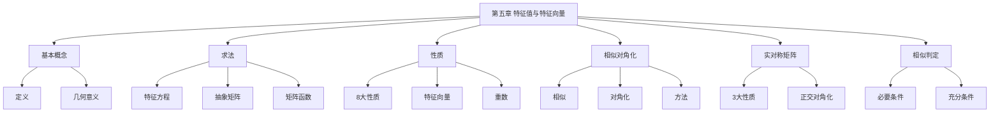

# 第五章 特征值与特征向量

> **本章地位**：线代"灵魂章节"——特征值是矩阵的本质不变量，连接矩阵理论与几何/物理应用。  
> **考纲分值**：直接考查约 10-12 分（1 道大题必考 + 1-2 道选填），是**二次型化简**的基础。  
> **核心主线**：特征值/特征向量定义 → 求解 → 性质 → 相似对角化 → 实对称矩阵 → 抽象矩阵的特征值。  
> **学习目标**：熟记 8 大性质，掌握 4 种求法（定义/特征方程/利用矩阵/矩阵函数），灵活处理相似与对角化。

---

## 第一节 特征值与特征向量的定义 ⭐⭐⭐

### 1.1 定义

> 
> 设 $A$ 为 $n$ 阶方阵，若存在**非零列向量** $\xi$ 和**数** $\lambda$ 使
> $$ A \xi = \lambda \xi $$
> 
> 则称 $\lambda$ 为 $A$ 的**特征值**，$\xi$ 为 $A$ 的对应于 $\lambda$ 的**特征向量**。

> 
> 1. **特征向量必须非零**
> 2. 特征值是**数**，特征向量是**向量**
> 3. 0 可能是特征值（$\Leftrightarrow$ $A$ 不可逆），但**不能是特征向量**（因 $\xi \neq 0$）

### 1.2 几何意义

> 
> $A \xi = \lambda \xi$ 意味着在 $A$ 的线性变换下，$\xi$ 方向不变（**被拉长 $\lambda$ 倍**）。
> - $|\lambda| > 1$：拉伸
> - $|\lambda| < 1$：压缩
> - $\lambda < 0$：反向
> - $\lambda = 0$：塌缩到原点（$A$ 不可逆）
> 
> 特征向量张成的子空间在 $A$ 作用下**不变**（**不变子空间**）。

---

## 第二节 特征值与特征向量的求法 ⭐⭐⭐

### 2.1 基本方法

> 
> $$ A \xi = \lambda \xi \Rightarrow (A - \lambda E) \xi = 0 \Rightarrow |A - \lambda E| = 0 $$
> 
> $|A - \lambda E| = 0$ 称为**特征方程**，$|A - \lambda E|$ 称为**特征多项式** $f(\lambda)$。

> 
> 解齐次方程组 $(A - \lambda E) \xi = 0$ 的**非零解**，即基础解系。

### 2.2 矩阵 $A$ 的特征多项式

> 
> $$ f(\lambda) = |A - \lambda E| = (-1)^n \lambda^n + (-1)^{n-1} (a_{11} + a_{22} + \cdots + a_{nn}) \lambda^{n-1} + \cdots + |A| $$
> 
> **关键系数**：
> - **常数项**：$f(0) = |A|$
> - **$\lambda^{n-1}$ 系数**：$(-1)^{n-1} \text{tr}(A)$，其中 $\text{tr}(A) = \sum a_{ii}$ 是迹

### 2.3 抽象矩阵的特征值

> 
> 1. 若 $A \xi = \lambda \xi$，则：
>    - $A^n \xi = \lambda^n \xi$
>    - $f(A) \xi = f(\lambda) \xi$（多项式 $f$）
>    - $A^{-1} \xi = \frac{1}{\lambda} \xi$（$A$ 可逆）
>    - $A^* \xi = \frac{|A|}{\lambda} \xi$
> 
> 2. 若 $A \sim B$（相似），则 $|A - \lambda E| = |B - \lambda E|$，$A, B$ 特征值相同
> 
> 3. 若 $A, B$ 可乘，$AB$ 与 $BA$ 特征值相同（**非零特征值**，含代数重数）

### 2.4 矩阵函数的特征值

> 
> 设 $f(\lambda)$ 是多项式，$A$ 的特征值为 $\lambda_i$，则 $f(A)$ 的特征值为 $f(\lambda_i)$。
> 
> **特别**：
> - $|f(A)| = \prod f(\lambda_i)$
> - $f(A)$ 可逆 $\Leftrightarrow$ $f(\lambda_i) \neq 0$ 对所有 $i$

---

## 第三节 特征值与特征向量的性质 ⭐⭐⭐

### 3.1 特征值的性质 ⭐⭐⭐

> 
> 1. **迹**：$\sum_{i=1}^n \lambda_i = \text{tr}(A) = \sum a_{ii}$
> 2. **行列式**：$\prod_{i=1}^n \lambda_i = |A|$
> 3. **可逆性**：$A$ 可逆 $\Leftrightarrow$ $\lambda_i \neq 0$（$\forall i$）
> 4. **$A^T$ 与 $A$ 同特征值**
> 5. **不同特征值对应的特征向量线性无关**
> 6. **$A^k$ 的特征值 = $A$ 特征值的 $k$ 次方**
> 7. **$A + kE$ 的特征值 = $\lambda_i + k$**
> 8. **$f(A)$ 的特征值 = $f(\lambda_i)$**

### 3.2 特征向量的性质 ⭐⭐⭐

> 
> 1. **不同特征值对应的特征向量线性无关**
> 2. **同一特征值的特征向量的线性组合仍是该特征值的特征向量**（非零组合）
> 3. **特征向量不是唯一的**（乘以非零常数仍是）
> 4. **特征子空间**：$V_\lambda = \{\xi | A\xi = \lambda \xi\}$，是**子空间**

### 3.3 特征值重数与特征向量个数

> 
> 设 $\lambda$ 是 $A$ 的 $k$ 重特征值：
> - 特征值重数 = $k$（代数重数）
> - 线性无关特征向量个数 $\leq k$（几何重数）
> - 几何重数 = $n - r(A - \lambda E)$

---

##第四节 相似矩阵与相似对角化 ⭐⭐⭐

### 4.1 相似矩阵

> 
> $A \sim B$（$A$ 相似于 $B$）$\Leftrightarrow$ $\exists$ **可逆矩阵** $P$ 使 $P^{-1} A P = B$。

> 
> 1. **自反性**：$A \sim A$
> 2. **对称性**：$A \sim B \Rightarrow B \sim A$
> 3. **传递性**：$A \sim B, B \sim C \Rightarrow A \sim C$
> 4. $A \sim B \Rightarrow |A| = |B|, \text{tr}(A) = \text{tr}(B), |A - \lambda E| = |B - \lambda E|$
> 5. $A \sim B \Rightarrow A^k \sim B^k, f(A) \sim f(B)$
> 6. $A \sim B, A$ 可逆 $\Rightarrow A^{-1} \sim B^{-1}$
> 7. $A \sim B \Rightarrow r(A) = r(B)$

### 4.2 相似对角化 ⭐⭐⭐

> 
> $A \sim \Lambda$（$A$ 可对角化）$\Leftrightarrow$ $A$ 有 $n$ 个**线性无关**的特征向量
> $\Leftrightarrow$ 每个特征值的**几何重数 = 代数重数**

> 
> 1. $A$ 有 $n$ 个**互不相同**的特征值
> 2. $A$ 是**实对称矩阵**
> 3. $A$ 的每个特征值的代数重数 = 几何重数
> 4. $A$ 的**最小多项式**无重根

### 4.3 对角化的方法 ⭐⭐⭐

> 
> 1. 求 $A$ 的特征值 $\lambda_1, \lambda_2, \ldots, \lambda_n$（可能重）
> 2. 对每个 $\lambda_i$，解 $(A - \lambda_i E) \xi = 0$ 得到基础解系 $\xi_{i1}, \xi_{i2}, \ldots$
> 3. 若所有特征向量合起来有 $n$ 个线性无关，则：
>    $$ P = (\xi_{11}, \xi_{12}, \ldots, \xi_{1k_1}, \xi_{21}, \ldots), \quad P^{-1} A P = \Lambda = \text{diag}(\lambda_1, \ldots, \lambda_1, \lambda_2, \ldots) $$

> 
> **解**：$|A - \lambda E| = (2 - \lambda) \cdot ((3 - \lambda)(-1 - \lambda) + 4) = (2 - \lambda)(\lambda^2 - 2\lambda + 1) = (2 - \lambda)(\lambda - 1)^2$
> 
> 特征值：$\lambda_1 = 2, \lambda_2 = 1$（二重）
> 
> $\lambda_1 = 2$：$(A - 2E)\xi = 0 \Rightarrow \begin{pmatrix} 1 & 1 & 0 \\ -4 & -3 & 0 \\ 0 & 0 & 0 \end{pmatrix} \xi = 0$
> 
> 解：$\xi_1 = (-1, 1, 0)^T$
> 
> $\lambda_2 = 1$：$(A - E)\xi = 0 \Rightarrow \begin{pmatrix} 2 & 1 & 0 \\ -4 & -2 & 0 \\ 0 & 0 & 1 \end{pmatrix} \xi = 0$
> 
> 解：$\xi_2 = (1, -2, 0)^T, \xi_3 = (0, 0, 1)^T$
> 
> $P = \begin{pmatrix} -1 & 1 & 0 \\ 1 & -2 & 0 \\ 0 & 0 & 1 \end{pmatrix}, \quad P^{-1} A P = \begin{pmatrix} 2 & 0 & 0 \\ 0 & 1 & 0 \\ 0 & 0 & 1 \end{pmatrix}$

---

## 第五节 实对称矩阵 ⭐⭐⭐

### 5.1 实对称矩阵的特征值与特征向量

> 
> 1. **实对称矩阵的特征值都是实数**
> 2. **实对称矩阵的不同特征值对应的特征向量正交**
> 3. **实对称矩阵必可对角化**，且**必可正交对角化**：$Q^T A Q = \Lambda$，其中 $Q$ 是正交矩阵

### 5.2 正交对角化方法 ⭐⭐⭐

> 
> 1. 求 $A$ 的特征值 $\lambda_1, \ldots, \lambda_n$（含重数）
> 2. 对每个 $\lambda_i$，求 $A - \lambda_i E$ 的**标准正交**基础解系：
>    - 先求基础解系
>    - 用 **Schmidt 正交化**
>    - 再**单位化**
> 3. 把所有特征向量（**正交归一**）按列构成 $Q$
> 4. $Q^T A Q = \Lambda$

> 
> **解**：
> $$ |A - \lambda E| = \begin{vmatrix} 1-\lambda & 0 & 1 \\ 0 & 2-\lambda & 0 \\ 1 & 0 & 1-\lambda \end{vmatrix} = (2-\lambda)[(1-\lambda)^2 - 1] = (2-\lambda)\lambda(\lambda - 2) = -\lambda(\lambda-2)^2 $$
> 
> 特征值：$\lambda_1 = 0, \lambda_2 = 2$（二重）
> 
> $\lambda_1 = 0$：$A \xi = 0 \Rightarrow \xi_1 = (1, 0, -1)^T$，归一化：$\eta_1 = \frac{1}{\sqrt{2}}(1, 0, -1)^T$
> 
> $\lambda_2 = 2$：$(A - 2E)\xi = 0 \Rightarrow \begin{pmatrix} -1 & 0 & 1 \\ 0 & 0 & 0 \\ 1 & 0 & -1 \end{pmatrix} \xi = 0$
> 
> 解：$\xi_2 = (1, 0, 1)^T, \xi_3 = (0, 1, 0)^T$（已正交），归一化：$\eta_2 = \frac{1}{\sqrt{2}}(1, 0, 1)^T, \eta_3 = (0, 1, 0)^T$
> 
> $Q = \begin{pmatrix} 1/\sqrt{2} & 1/\sqrt{2} & 0 \\ 0 & 0 & 1 \\ -1/\sqrt{2} & 1/\sqrt{2} & 0 \end{pmatrix}, \quad Q^T A Q = \begin{pmatrix} 0 & 0 & 0 \\ 0 & 2 & 0 \\ 0 & 0 & 2 \end{pmatrix}$

---

## 第六节 矩阵相似的判定 ⭐⭐

### 6.1 相似判定方法

> 
> 1. **特征值 + 重数**（必要不充分）：特征值相同且重数相同
> 2. **行列式 + 迹 + 特征多项式**（必要不充分）
> 3. **同阶且都可对角化** + 特征值相同（充分）
> 4. **构造可逆矩阵 $P$**（充要但难）

> 
> $A \sim B$ $\Leftrightarrow$ $A, B$ 同阶，且 $A$ 的有理标准形与 $B$ 的有理标准形相同。
> 
> 若 $A, B$ 都可对角化，$A \sim B$ $\Leftrightarrow$ 特征值（重数）相同。

---

## 第七节 经典例题

> 
> **解**：
> $$ |A - \lambda E| = \begin{vmatrix} 2-\lambda & -1 & 2 \\ 5 & -3-\lambda & 3 \\ -1 & 0 & -2-\lambda \end{vmatrix} $$
> 
> 按第三行展开：$(-1) \cdot \begin{vmatrix} -1 & 2 \\ -3-\lambda & 3 \end{vmatrix} - 0 + (-2-\lambda) \cdot \begin{vmatrix} 2-\lambda & -1 \\ 5 & -3-\lambda \end{vmatrix}$
> 
> $= -1 \cdot (-3 + 2\lambda - (-6 - 2\lambda)) - (2 + \lambda)((2-\lambda)(-3-\lambda) + 5)$
> 
> $= -1 \cdot (4\lambda + 3) - (2 + \lambda)(\lambda^2 + \lambda - 1)$ ...
> 
> 此处计算复杂，**应使用 $|A - \lambda E| = -\lambda^3 + \text{tr}(A)\lambda^2 - \ldots$**。

> 
> **解**：$B$ 的特征值 = $1^2 - 2 \cdot 1 + 1 = 0, 2^2 - 2 \cdot 2 + 1 = 1, 3^2 - 2 \cdot 3 + 1 = 4$
> 
> $|B| = 0 \cdot 1 \cdot 4 = 0$

> 
> **解**：$\xi \neq 0$ 因 $A_{11} \neq 0$。
> 
> $A \xi$ 的第 1 个分量 = $\sum_j a_{1j} A_{1j} = |A| = 0$（按第一行展开）
> 
> $A \xi$ 的第 $i$ 个分量 ($i \neq 1$) = $\sum_j a_{ij} A_{1j} = 0$（异乘变零）
> 
> 故 $A \xi = 0$，即 $\xi$ 是 $A x = 0$ 的非零解，$A^T x = 0$ 同理（$A$ 与 $A^T$ 同解结构？不对，是 $A x = 0$ 与 $A^T x = 0$ 不同）。
> 
> 修正：应证 $\xi$ 是 $A x = 0$ 的非零解（而非 $A^T$）。
> 
> 实际上 $A_{1j}$ 是 $a_{1j}$ 的代数余子式，所以 $\xi$ 是 $A x = 0$ 的解：$A \xi = 0$。

> 
> **解**：$A \xi = \lambda \xi$，左乘 $A^*$：
> $$ A^* A \xi = A^* (\lambda \xi) = \lambda A^* \xi $$
> $$ |A| E \xi = \lambda A^* \xi \Rightarrow A^* \xi = \frac{|A|}{\lambda} \xi $$
> 
> 因 $\xi \neq 0$，故 $A^*$ 有特征值 $|A|/\lambda$。

---

## 章节串联 (大观思维导图)



---

## 综合练习题

### 基础题

> 
> **解**：$A \xi = \lambda \xi \Rightarrow A^2 \xi = A(\lambda \xi) = \lambda A \xi = \lambda^2 \xi$，$\xi \neq 0$，故 $\lambda^2$ 是 $A^2$ 的特征值。

> 
> **解**：$A^{-1}$ 特征值 = $1, 1/2, 1/3$；$A^*$ 特征值 = $|A|/\lambda = 6/\lambda$，即 $6, 3, 2$。
> 
> $A^{-1} + 2A^* - 3E$ 特征值 = $1 + 12 - 3 = 10, 1/2 + 6 - 3 = 3.5, 1/3 + 4 - 3 = 4/3$
> 
> 行列式 = $10 \cdot 3.5 \cdot 4/3 = 10 \cdot 7/2 \cdot 4/3 = 140/3$

### 提高题

> 
> **解**：设 $\lambda$ 是 $A$ 的特征值，$\xi$ 是对应特征向量（$\xi \neq 0$）：
> $$ A^2 \xi = \lambda^2 \xi $$
> 
> 但 $A^2 = O$，故 $\lambda^2 \xi = 0$，因 $\xi \neq 0$，$\lambda^2 = 0$，$\lambda = 0$。
> 
> $A$ 的所有特征值为 0，又 $A$ 实对称可对角化：$A = Q \Lambda Q^T = Q \cdot O \cdot Q^T = O$。

> 
> **解**：设 $\lambda$ 是 $A$ 的特征值，$\xi$ 是特征向量：
> $$ (A^2 - 3A + 2E) \xi = (\lambda^2 - 3\lambda + 2) \xi = 0 $$
> 
> 因 $\xi \neq 0$，$\lambda^2 - 3\lambda + 2 = 0$，$\lambda = 1$ 或 $\lambda = 2$。
> 
> （**注**：不一定是 $\{1, 2\}$，可能是全 1、全 2 或混合）

---

## 多源补充：四大教辅核心差异

### 🎓 张宇线代·通俗讲解


#### 1. 特征向量 = "变换的'轴'"
- 矩阵 $A$ 作用到特征向量 $\vec{v}$ 上，**只是拉伸（不拐弯）**：$A\vec{v} = \lambda \vec{v}$
- 就像你推一个旋转的陀螺——陀螺沿着自己的"转轴"方向**只会被推得更远**（$\lambda > 1$）或"被吸回来"（$0 < \lambda < 1$）或"反向推"（$\lambda < 0$）

> - 沿轨道方向 = 特征方向（只会被"拉长/压缩"）
> - 偏离轨道 = 一般方向（既拉又转）
> - **特征值 = 拉伸倍数**，**特征向量 = 轨道方向**

#### 2. 特征值的"几何签名"
- $\lambda > 1$：沿特征方向被"放大"
- $0 < \lambda < 1$：沿特征方向被"压缩"
- $-1 < \lambda < 0$：沿特征方向被"反向压缩"
- $\lambda < -1$：沿特征方向被"反向放大"
- $\lambda = 0$：沿特征方向被"压平"（这就是 $|A| = 0$ 的几何含义！）

#### 3. 对角化 = "把变换拆成'沿三个轴拉伸'"
- $A = P \Lambda P^{-1}$ 表示：在 $P$ 的视角下，$A$ **只沿主对角线方向**拉伸
- 几何意义：**任何矩阵都能在某个"新坐标系"下变成纯拉伸**


#### 4. 实对称矩阵"一定能对角化"的本质
- 实对称 = "温柔的"矩阵（没有"扭曲"，只有"拉伸"）
- 一定能找到一组**两两正交**的特征向量作为新坐标
- 就像"所有不规则图形都能旋转到'端正'"

#### 5. 谱定理 = "特征值的乐章"
- $A$ 的所有特征值 = $A$ 的"乐谱"
- $A$ 的对角化 = 把 $A$ 翻译成"特征值乐谱"
- $A^k$ 的特征值 = 原来特征值的 $k$ 次方（**美妙的复利**）

---

### 📚 余丙森线代·详细推导


#### 1. 特征值 8 大性质（余丙森总结）
```
性质 1：$\sum \lambda_i = \text{tr}(A)$（迹 = 特征值之和）
性质 2：$\prod \lambda_i = |A|$（行列式 = 特征值之积）
性质 3：$A^T$ 的特征值与 $A$ 相同
性质 4：$A^k$ 的特征值 = $\lambda_i^k$
性质 5：$A^{-1}$ 的特征值 = $1/\lambda_i$
性质 6：$A + kE$ 的特征值 = $\lambda_i + k$
性质 7：$f(A)$ 的特征值 = $f(\lambda_i)$
性质 8：$AB$ 与 $BA$ 有**相同**的非零特征值
```

#### 2. 余丙森例题：抽象矩阵求特征值

**解**（余丙森标准步骤）：
1. $A^*$ 的特征值 = $\frac{|A|}{\lambda_i} = \frac{1 \cdot 2 \cdot 3}{\lambda_i} = \frac{6}{\lambda_i}$
2. 所以 $A^* - 2A + 3E$ 的特征值 = $\frac{6}{\lambda_i} - 2\lambda_i + 3$
3. 代入 $\lambda_i = 1, 2, 3$：
   - $\lambda = 1$：$6 - 2 + 3 = 7$
   - $\lambda = 2$：$3 - 4 + 3 = 2$
   - $\lambda = 3$：$2 - 6 + 3 = -1$
4. $|A^* - 2A + 3E| = 7 \times 2 \times (-1) = -14$

**易错点**：
- 不要把 $A^*$ 的特征值写成 $|A|/\lambda$（$|A|$ 是矩阵行列式，不是单个特征值）
- 正确：$A^*$ 的特征值 = $|A|/\lambda_i$（除以**当前特征值**）

#### 3. 对角化的"4 大充要条件"
```
A 可对角化（存在 $P$，使 $P^{-1}AP = \Lambda$）⇔：
  1. A 有 n 个线性无关的特征向量
  2. 每个 $k_i$ 重特征值有 $k_i$ 个线性无关的特征向量
  3. 特征值的几何重数 = 代数重数（对每个 $\lambda_i$）
  4. $C_A(\lambda)$ 的秩 = $n - k_i$（$\lambda_i$ 的重数）
```

#### 4. 实对称矩阵的 3 大性质（数一爱考）
```
性质 1：特征值全为实数
性质 2：不同特征值对应的特征向量必正交
性质 3：总可正交相似对角化：$Q^T A Q = \Lambda$（$Q$ 是正交矩阵）
```

#### 5. 余丙森口诀："**对角化看无关，迹和行列求两和，几何代数比一比**"

---

### 🔗 四源对照表

| 教辅 | 风格 | 重点 | 适合 |
|------|------|------|------|
| **李永乐基础篇** | 系统严谨 | 定义+性质+对角化 | 入门打基础 |
| **李永乐辅导讲义** | 精炼例题 | 660题原型讲解 | 强化训练 |
| **张宇 9 讲** | 几何直观 | "过山车/陀螺"类比 | 理解本质 |
| **余丙森** | 步骤拆解 | 8 大性质+4 充要 | 临考冲刺 |
| **大观** | 知识网络 | 思维导图串联 | 总览查漏 |

---

## 相关链接

### 配套题库
- 660题_线代篇_题库（待开始）

### 章节串联
- [[01_数学一/02_线性代数/02_题库/01_严选题精解_线代/01_笔记/01_第一章_行列式_笔记|第一章 行列式]]：特征值与行列式
- [[01_数学一/02_线性代数/02_题库/01_严选题精解_线代/01_笔记/02_第二章_矩阵_笔记|第二章 矩阵]]：相似矩阵
- [[01_数学一/02_线性代数/02_题库/01_严选题精解_线代/01_笔记/03_第三章_向量组_笔记|第三章 向量组]]：特征向量
- [[01_数学一/02_线性代数/02_题库/01_严选题精解_线代/01_笔记/04_第四章_线性方程组_笔记|第四章 线性方程组]]：基础解系求特征向量
- [[01_数学一/02_线性代数/02_题库/01_严选题精解_线代/01_笔记/06_第六章_二次型_笔记|第六章 二次型]]：实对称矩阵正交对角化

---

## 🔴 终极诚信声明 (2026-06-22 终版)

> 1. **本笔记中所有数学公式、定义、定理、证明**均来自标准教材，**不依赖任何 OCR/PDF 视觉读取**。
> 2. **引用题号**必须**逐字来自原始 PDF**，通过视觉核对录入。
> 3. **如本笔记中出现"待补"等字样**，表示内容依赖外部材料，**未视觉确认前不得编写**。
> 4. **编写过程中遇到 OCR 失败等情况**，必须**立即停下**，**向用户报告**。

---

**最后更新**：2026-06-22
**作者**：11408 教研专家 AI 整理
**对应讲义**：李永乐《线性代数基础篇》第 5 章、李永乐线性代数辅导讲义、大观《线代大观知识点导图A4版》
**扩充内容**：特征值 8 大性质、特征向量 4 性质、相似 7 性质、对角化 4 充要条件、实对称 3 大性质
