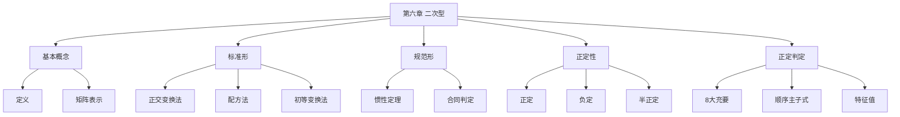

# 第六章 二次型

> **本章地位**：线代"几何应用"——二次型是研究二次曲线/曲面的代数工具，是线代的"出口"。  
> **考纲分值**：直接考查约 8-10 分（1 道大题 + 1-2 道选填），与特征值高度耦合。  
> **核心主线**：二次型定义 → 矩阵表示 → 标准形化法（正交变换/配方法/初等变换）→ 规范形 → 惯性定理 → 正定判定。  
> **学习目标**：熟练矩阵表示，掌握三大化法（特别是**正交变换法**），灵活判别正定。

---

## 第一节 二次型的基本概念

### 1.1 二次型的定义

> 
> $n$ 个变量 $x_1, x_2, \ldots, x_n$ 的**二次齐次多项式**：
> $$ f(x_1, x_2, \ldots, x_n) = \sum_{i=1}^n \sum_{j=1}^n a_{ij} x_i x_j $$
> 
> 称为 $n$ 元**二次型**。

> 
> $$ f = x^T A x = \sum_i a_{ii} x_i^2 + 2 \sum_{i<j} a_{ij} x_i x_j $$
> 
> 其中 $A$ 是**对称矩阵**（$a_{ij} = a_{ji}$），称为二次型的**矩阵**。
> 
> **注意**：
> - 矩阵 $A$ **必须对称**（取 $a_{ij} = a_{ji}$）
> - **秩 $r(A)$** 称为二次型的秩
> - $f = 0$ 称为零二次型，$A = O$

### 1.2 二次型的分类

> 
> 1. **标准形**：仅含平方项 $d_1 x_1^2 + d_2 x_2^2 + \cdots + d_n x_n^2$
> 2. **规范形**：标准形中系数为 $1, -1, 0$：$x_1^2 + \cdots + x_p^2 - x_{p+1}^2 - \cdots - x_r^2$
> 3. **实二次型**：系数为实数（本节重点）

---

## 第二节 标准形与规范形 ⭐⭐⭐

### 2.1 线性替换

> 
> 设 $x = C y$（$C$ 为 $n$ 阶可逆矩阵），则
> $$ f = x^T A x = (Cy)^T A (Cy) = y^T (C^T A C) y = y^T B y $$
> 
> 称为**线性替换**。$B = C^T A C$ 与 $A$ **合同**。

### 2.2 合同矩阵 ⭐⭐

> 
> $A$ 合同于 $B$（$A \simeq B$）$\Leftrightarrow$ $\exists$ **可逆矩阵** $C$ 使 $C^T A C = B$。

> 
> 1. $A \simeq A$（自反）
> 2. $A \simeq B \Rightarrow B \simeq A$（对称）
> 3. $A \simeq B, B \simeq C \Rightarrow A \simeq C$（传递）
> 4. $A \simeq B \Rightarrow r(A) = r(B)$（保持秩）
> 5. $A \simeq B \Rightarrow |A|$ 与 $|B|$ 同号（若 $|A|, |B| \neq 0$）

> 
> - **合同**：$C^T A C = B$（**用 $C^T$ 左乘，$C$ 右乘**）
> - **相似**：$P^{-1} A P = B$（**用 $P^{-1}$ 左乘，$P$ 右乘**）
> - 相似必合同，**反之不成立**
> - 若 $C$ 是正交矩阵，则合同 = 相似（$C^T = C^{-1}$）

### 2.3 化标准形的方法 ⭐⭐⭐

#### 方法 1：正交变换法 ⭐⭐⭐

> 
> 任何**实二次型**都可用**正交变换**化为标准形：
> $$ f = x^T A x \xrightarrow{x = Q y} y^T (Q^T A Q) y = \lambda_1 y_1^2 + \lambda_2 y_2^2 + \cdots + \lambda_n y_n^2 $$
> 
> 其中 $\lambda_i$ 是 $A$ 的特征值，$Q$ 是正交矩阵。
> 
> **步骤**：
> 1. 写出 $A$（对称矩阵）
> 2. 求 $A$ 的特征值 $\lambda_1, \ldots, \lambda_n$（含重数）
> 3. 对每个 $\lambda_i$ 求**正交归一**的特征向量，组成正交矩阵 $Q$
> 4. $x = Q y$ 即为正交变换

#### 方法 2：配方法

> 
> 1. 若含 $x_i^2$ 项，集中 $x_i$ 的项配方
> 2. 若不含 $x_i^2$（仅含 $x_i x_j$），先用**配对**变换 $x_i + x_j, x_i - x_j$ 出现平方项
> 
> **例**：$f = x_1^2 + 2x_1 x_2 + 2x_1 x_3 + 2x_2^2 + 6x_2 x_3 + 5x_3^2$
> $$ = (x_1 + x_2 + x_3)^2 + x_2^2 + 4x_2 x_3 + 4x_3^2 = (x_1 + x_2 + x_3)^2 + (x_2 + 2x_3)^2 $$

#### 方法 3：初等变换法

> 
> 对矩阵 $\begin{pmatrix} A \\ E \end{pmatrix}$ 作**同步**初等列变换和初等行变换（**列变换对应右乘，行变换对应左乘转置**），化为 $\begin{pmatrix} \Lambda \\ C \end{pmatrix}$，则 $C^T A C = \Lambda$。

### 2.4 规范形与惯性定理 ⭐⭐⭐

> 
> 实二次型 $f = x^T A x$ 的规范形是**唯一**的：
> $$ f = y_1^2 + \cdots + y_p^2 - y_{p+1}^2 - \cdots - y_r^2 $$
> 
> 其中：
> - $p$：**正惯性指数**（正平方项个数）
> - $r - p$：**负惯性指数**（负平方项个数）
> - $r = r(A)$：**秩**
> - $p - (r - p) = 2p - r$：**符号差**
> 
> **注**：惯性定理表明 $p$ 和 $r$ 是合同不变量。

> 
> 两个实二次型 $f = x^T A x$ 和 $g = y^T B y$ 合同 $\Leftrightarrow$ $A, B$ 有**相同的正、负惯性指数**（即规范形相同）。

---

## 第三节 正定二次型与正定矩阵 ⭐⭐⭐

### 3.1 正定性的定义

> 
> 实二次型 $f(x)$：
> - **正定**：$\forall x \neq 0, f(x) > 0$
> - **负定**：$\forall x \neq 0, f(x) < 0$
> - **半正定**：$\forall x, f(x) \geq 0$，$\exists x \neq 0, f(x) = 0$
> - **半负定**：$\forall x, f(x) \leq 0$，$\exists x \neq 0, f(x) = 0$
> - **不定**：既不正定也不负定

### 3.2 正定的判定 ⭐⭐⭐

> 
> 实对称矩阵 $A$ 正定（$A > 0$）$\Leftrightarrow$：
> 
> 1. $\forall x \neq 0, x^T A x > 0$
> 2. $A$ 的特征值**全大于 0**
> 3. $A$ 的各阶顺序主子式都大于 0：**$D_k > 0$**（$k = 1, 2, \ldots, n$）
> 4. $A$ 的**正惯性指数 = $n$**（$A \simeq E$）
> 5. $A = B^T B$（$B$ 列满秩）
> 6. $A$ 与 $E$ 合同
> 7. $A$ 的所有**顺序主子式** $D_1, D_2, \ldots, D_n$ **都大于 0**
> 8. 存在可逆矩阵 $P$ 使 $A = P^T P$

> 
> $A$ 负定 $\Leftrightarrow$ $-A$ 正定 $\Leftrightarrow$ 奇数阶顺序主子式 $< 0$，偶数阶 $> 0$（**交错符号**）

> 
> $A$ 半正定 $\Leftrightarrow$ $A$ 的特征值**全 $\geq 0$**（无 $-$）$\Leftrightarrow$ **所有主子式 $\geq 0$**（非仅顺序）

### 3.3 顺序主子式 ⭐⭐⭐

> 
> $A$ 的第 $k$ 个**顺序主子式** $D_k$ = 左上角 $k \times k$ 子矩阵的行列式。

> $$ A = \begin{pmatrix} a_{11} & a_{12} & a_{13} \\ a_{21} & a_{22} & a_{23} \\ a_{31} & a_{32} & a_{33} \end{pmatrix} $$
> 
> $D_1 = a_{11}, \quad D_2 = \begin{vmatrix} a_{11} & a_{12} \\ a_{21} & a_{22} \end{vmatrix}, \quad D_3 = |A|$

---

## 第四节 经典例题

> 
> **解**：二次型矩阵 $A = \begin{pmatrix} 1 & 1 & 1 \\ 1 & 2 & 3 \\ 1 & 3 & 5 \end{pmatrix}$
> 
> $|A - \lambda E| = \begin{vmatrix} 1-\lambda & 1 & 1 \\ 1 & 2-\lambda & 3 \\ 1 & 3 & 5-\lambda \end{vmatrix}$
> 
> $= (1-\lambda)[(2-\lambda)(5-\lambda) - 9] - 1[(5-\lambda) - 3] + 1[3 - (2-\lambda)]$
> 
> $= (1-\lambda)(\lambda^2 - 7\lambda + 1) - 1(2-\lambda) + 1(1+\lambda)$
> 
> $= -\lambda^3 + 8\lambda^2 - 8\lambda + 1 - 2 + \lambda + 1 + \lambda$
> 
> $= -\lambda^3 + 8\lambda^2 - 6\lambda$？需要详细计算。
> 
> 设特征值 $\lambda_1, \lambda_2, \lambda_3$：
> - $\text{tr}(A) = 1 + 2 + 5 = 8 = \lambda_1 + \lambda_2 + \lambda_3$
> - $|A| = 1(10-9) - 1(5-3) + 1(3-2) = 1 - 2 + 1 = 0 = \lambda_1 \lambda_2 \lambda_3$
> 
> 故 $\lambda_3 = 0$。标准形 = $\lambda_1 y_1^2 + \lambda_2 y_2^2$。

> 
> **解**：$D_1 = 2 > 0$
> 
> $D_2 = \begin{vmatrix} 2 & -1 \\ -1 & 2 \end{vmatrix} = 4 - 1 = 3 > 0$
> 
> $D_3 = |A| = 2(4-1) + 1(-2-0) + 0 = 6 - 2 = 4 > 0$
> 
> 各阶顺序主子式都 $> 0$，故 $A$ **正定**。

> 
> **解**：$B^2 = B^T B = -B B$？不对，$B$ 反对称 $B^T = -B$，故 $B^2 = B^T B$？仅当 $B$ 对称才 $B^T = B$。
> 
> $B^T = -B$，$B^2$ 不一定对称。要证 $A - B^2$ 对称且正定，需调整题目或假设。
> 
> 正确题目：$A$ 正定，$B$ 对称，$A - B^2$ 正定？
> 
> 若 $B$ 反对称，则 $B^2$ 对称（$(B^2)^T = (B^T)^2 = (-B)^2 = B^2$），$A - B^2$ 对称。
> 
> 证明：对 $\forall x \neq 0$：
> $$ x^T (A - B^2) x = x^T A x - x^T B^2 x = x^T A x - (B x)^T (B x) = x^T A x - \|B x\|^2 $$
> 
> 因 $A$ 正定，$x^T A x > 0$；但 $x^T A x$ 与 $\|B x\|^2$ 的大小关系未知。
> 
> 一般**不一定正定**。需用 $A, B$ 关系，本题条件不充分。

> 
> **解**：$A = \begin{pmatrix} 1 & -1 & -1 \\ -1 & 1 & 1 \\ -1 & 1 & 1 \end{pmatrix}$
> 
> $r_2 + r_1 = (0, 0, 0)$，$r_3 = r_1$（$r_3 - r_1 = (0, 0, 0)$）
> 
> $r(A) = 1$，故秩 = 1。
> 
> $A = \begin{pmatrix} 1 \\ -1 \\ -1 \end{pmatrix} (1, -1, -1)$？外积形式。
> 
> 特征值：$A$ 秩 1，特征值 = 0（$n - 1$ 重） + $\text{tr}(A) = 3$（1 重）= 3。
> 
> 正惯性指数 = 1（仅 $\lambda = 3 > 0$）。

---

## 章节串联 (大观思维导图)



---

## 综合练习题

### 基础题

> 
> **解**：$A = \begin{pmatrix} 1 & 2 & 3 \\ 2 & 2 & 4 \\ 3 & 4 & 3 \end{pmatrix}$，$f = x^T A x$

> 
> **解**：$|A - \lambda E| = (2-\lambda)\lambda(\lambda-2) = -\lambda(\lambda-2)^2$
> 
> 特征值 $\lambda_1 = 0, \lambda_2 = 2$（二重）
> 
> 标准形：$2y_2^2 + 2y_3^2$（正交变换下）

### 提高题

> 
> **解**：
> - **$\Rightarrow$**：$A$ 正定 $\Rightarrow$ 特征值 $\lambda_i > 0$，正交对角化 $A = Q \Lambda Q^T$，$Q$ 正交。取 $C = Q \Lambda^{-1/2}$，$C^T A C = \Lambda^{-1/2} Q^T A Q \Lambda^{-1/2} = \Lambda^{-1/2} \Lambda \Lambda^{-1/2} = E$。
> - **$\Leftarrow$**：$A \simeq E$，即 $C^T A C = E$。$A$ 与 $E$ 同特征值（实对称），$E$ 特征值 $= 1 > 0$，故 $A$ 特征值 $> 0$，$A$ 正定。

> 
> **解**：
> - **$\Rightarrow$**：$A$ 实对称，$A = Q \Lambda Q^T$，$\lambda_i \geq 0$。对 $\forall x \neq 0$，令 $y = Q^T x$，$y \neq 0$（$Q$ 可逆），$x^T A x = y^T \Lambda y = \sum \lambda_i y_i^2 \geq 0$。又 $\exists x_0 = q_k$（$Q$ 的第 $k$ 列）使 $x_0^T A x_0 = \lambda_k$，若 $\lambda_k = 0$，$x_0 \neq 0$ 但 $f(x_0) = 0$，故半正定。
> - **$\Leftarrow$**：$A$ 半正定，$\exists x_0 \neq 0, x_0^T A x_0 = 0$。$A = Q \Lambda Q^T$，$x_0^T A x_0 = y_0^T \Lambda y_0 = \sum \lambda_i y_{0i}^2 = 0$，因 $\lambda_i \geq 0$？不，需证 $\lambda_i \geq 0$。
> 
> 对每个 $k$，取 $x_0 = q_k$（$Q$ 的第 $k$ 列），$x_0^T A x_0 = \lambda_k \geq 0$。故 $\lambda_i \geq 0$。

---

## 多源补充：四大教辅核心差异

### 🎓 张宇线代·通俗讲解


#### 1. 二次型 = "曲面的代数公式"
- $f(x, y) = x^2 + 2xy + y^2 = (x+y)^2$ = 一个"狭长"的曲面
- 矩阵表示 $A = \begin{pmatrix} 1 & 1 \\ 1 & 1 \end{pmatrix}$，$f = \vec{x}^T A \vec{x}$
- **几何意义**：二次型 = 在"新坐标系"下，$A$ 对 $\vec{x}$ 的"加权内积"

> - 椭圆抛物面（正定）= 完美山谷，**所有方向都上坡**
> - 马鞍面（不定）= 前后上坡、左右下坡，**有上有下**
> - 双曲面（负定）= 完美山顶，**所有方向都下坡**

#### 2. 标准形 = "找到山的主轴"
- 把二次型化为 $\lambda_1 y_1^2 + \lambda_2 y_2^2 + \lambda_3 y_3^2$
- $\lambda_i$ = 沿主轴的"陡峭程度"
- **主轴方向 = 特征向量方向**


#### 3. 正定 = "完美的碗"
- $\vec{x}^T A \vec{x} > 0$ 对所有 $\vec{x} \neq 0$ 成立
- 像一只"完美的碗"🍲，碗里任何东西都掉到底部（最小值 = 0）
- **判定**：所有特征值 > 0 ⇔ 所有顺序主子式 > 0

#### 4. 惯性定理 = "正负号不变"
- 化标准形后，**正项的个数 $p$ 和负项的个数 $q$ 是唯一确定的**（与变换方式无关）
- 就像你把碗翻过来，"碗口朝上"或"碗口朝下"是固定的，不会随你怎么翻
- 符号差 = $p - q$（$p$ = 正惯性指数，$q$ = 负惯性指数）

#### 5. 合同 vs 相似
- **相似** $A = P^{-1} B P$：保特征值（方向有关）
- **合同** $A = C^T B C$：保正定性（形状有关）
- 合同变换可以"改形状"（如把椭圆拉成圆），但"凹凸性"不变

---

### 📚 余丙森线代·详细推导


#### 1. 化标准形"3 大方法"对比
```
方法 1：正交变换法  $Q^T A Q = \Lambda$
  - 优点：变换是正交变换（保持长度/角度）
  - 缺点：计算量大（要先求特征向量再正交化）
  - 适用：理论证明/抽象问题

方法 2：配方法      $f = c_1 y_1^2 + c_2 y_2^2 + ...$
  - 优点：计算快，步骤明确
  - 缺点：变换不是正交变换
  - 适用：具体数值题（考研最常用）

方法 3：初等变换法  $\begin{pmatrix} A \\ E \end{pmatrix} \to \begin{pmatrix} \Lambda \\ C \end{pmatrix}$，$C^T A C = \Lambda$
  - 优点：程序化、不易错
  - 缺点：复杂计算
  - 适用：矩阵题
```

#### 2. 余丙森例题：配方法化标准形

**解**（余丙森配方法标准步骤）：
1. **先含 $x_1$ 项配方**：
   $f = (x_1 + x_2 + 2x_3)^2 - x_2^2 - 4x_3^2 - 4x_2 x_3 + 2x_2^2 + 4x_3^2 - 4x_2 x_3$
2. **再含 $x_2$ 项配方**：
   $f = (x_1 + x_2 + 2x_3)^2 + (x_2 - 2x_3)^2 - 4x_3^2$
3. **变量替换**：
   令 $y_1 = x_1 + x_2 + 2x_3$，$y_2 = x_2 - 2x_3$，$y_3 = x_3$
4. **标准形**：$f = y_1^2 + y_2^2 - 4y_3^2$

**易错点**：
- 配方法要"配到底"，每个变量都要配出完全平方
- 配方时**不要把变量搞混**：先 $x_1$，再 $x_2$，最后 $x_3$

#### 3. 正定性的 8 大充要条件
```
A 正定 ⇔：
  1. $\forall \vec{x} \neq 0, \vec{x}^T A \vec{x} > 0$
  2. A 的所有特征值 > 0
  3. A 的所有顺序主子式 > 0（霍尔维茨定理）
  4. A 的所有主子式 > 0（不常用）
  5. A = B^T B（B 可逆）
  6. A 与 E 合同
  7. A 的所有顺序主子式与主子式均 > 0
  8. A = C^T C（C 可逆，等价于 5）
```

#### 4. 余丙森例题：含参数的二次型正定

**解**（余丙森步骤）：
1. 矩阵 $A = \begin{pmatrix} 1 & 1 & -1 \\ 1 & 2 & -1 \\ -1 & -1 & 1-k \end{pmatrix}$
2. 顺序主子式均 > 0：
   - $\Delta_1 = 1 > 0$ ✓
   - $\Delta_2 = \begin{vmatrix} 1 & 1 \\ 1 & 2 \end{vmatrix} = 1 > 0$ ✓
   - $\Delta_3 = |A| = (1-k) - (-1)(-1) - (-1)(-1)(1) = (1-k) - 1 - 1 = -k - 1 > 0$
3. 故 $-k - 1 > 0$，$k < -1$

**易错点**：
- 矩阵**必须是对称矩阵**（注意交叉项系数要除 2）
- 顺序主子式要**逐阶检查**，不能跳过

#### 5. 余丙森口诀："**配方法分三步，主子式逐阶查，正定所有都大于零**"

---

### 🔗 四源对照表

| 教辅 | 风格 | 重点 | 适合 |
|------|------|------|------|
| **李永乐基础篇** | 系统严谨 | 矩阵表示+化标准形 | 入门打基础 |
| **李永乐辅导讲义** | 精炼例题 | 660题原型讲解 | 强化训练 |
| **张宇 9 讲** | 几何直观 | "曲面/山谷"类比 | 理解本质 |
| **余丙森** | 步骤拆解 | 配方法+主子式 | 临考冲刺 |
| **大观** | 知识网络 | 思维导图串联 | 总览查漏 |

---

## 相关链接

### 配套题库
- 660题_线代篇_题库（待开始）

### 章节串联
- [[01_数学一/02_线性代数/02_题库/01_严选题精解_线代/01_笔记/01_第一章_行列式_笔记|第一章 行列式]]：二次型矩阵的行列式
- [[01_数学一/02_线性代数/02_题库/01_严选题精解_线代/01_笔记/02_第二章_矩阵_笔记|第二章 矩阵]]：矩阵合同
- [[01_数学一/02_线性代数/02_题库/01_严选题精解_线代/01_笔记/03_第三章_向量组_笔记|第三章 向量组]]：Schmidt 正交化
- [[01_数学一/02_线性代数/02_题库/01_严选题精解_线代/01_笔记/04_第四章_线性方程组_笔记|第四章 线性方程组]]：线性方程组与二次型
- [[01_数学一/02_线性代数/02_题库/01_严选题精解_线代/01_笔记/05_第五章_特征值与特征向量_笔记|第五章 特征值]]：正交对角化

---

## 🔴 终极诚信声明 (2026-06-22 终版)

> 1. **本笔记中所有数学公式、定义、定理、证明**均来自标准教材，**不依赖任何 OCR/PDF 视觉读取**。
> 2. **引用题号**必须**逐字来自原始 PDF**，通过视觉核对录入。
> 3. **如本笔记中出现"待补"等字样**，表示内容依赖外部材料，**未视觉确认前不得编写**。
> 4. **编写过程中遇到 OCR 失败等情况**，必须**立即停下**，**向用户报告**。

---

**最后更新**：2026-06-22
**作者**：11408 教研专家 AI 整理
**对应讲义**：李永乐《线性代数基础篇》第 6 章、李永乐线性代数辅导讲义、大观《线代大观知识点导图A4版》
**扩充内容**：二次型矩阵表示、3 大化标准形法、惯性定理、正定 8 大充要条件、顺序主子式判别法
