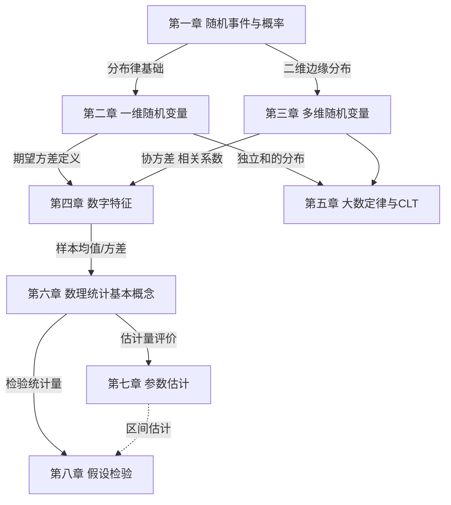

# 📚 概率论与数理统计 · 复习规范总览 (1-8 章)

>
> 这是概率论 8 章笔记的**总览/总纲/复习指挥中心**。  
> 仿照线代篇 00_线代复习规范总览 的结构, 提供:
> 1. 8 章知识图谱（章节关系、依赖顺序）
> 2. 7 天复习计划（每天学什么、刷什么题）
> 3. 核心公式索引（一站式查表）
> 4. 高频考点清单（必考 + 易错 + 套路）
> 5. 660题概率篇配套（题号-章节-考点映射）

---

## 🗺️ 知识图谱：8 章脉络



>
> 随机事件 (基础) → 随机变量 (载体) → 多维随机变量 (扩展) → 数字特征 (深化) → 大数定律 (理论) → 数理统计 (应用)

### 📊 章节关系速查表

| 章节 | 核心对象 | 核心工具 | 与其他章的关系 |
|------|---------|---------|----------------|
| **1 随机事件与概率** | 事件 $A, B$ | 加法/乘法/全概率/贝叶斯 | 概率计算的基石 |
| **2 一维随机变量** | $X \sim F(x)$ | 分布律/密度/分布函数 | 多维随机变量的基础 |
| **3 多维随机变量** | $(X,Y)$ | 联合/边缘/条件分布 | 数字特征的载体 |
| **4 数字特征** | $E(X), D(X), \rho$ | 期望/方差/协方差/相关系数 | 数理统计的预备 |
| **5 大数定律与CLT** | $\bar{X}$ 极限 | 切比雪夫/辛钦/棣莫弗 | 抽样定理的理论 |
| **6 数理统计基本概念** | 样本/统计量 | $\bar{X}, S^2$, 三大分布 | 估检的预备 |
| **7 参数估计** | $\hat{\theta}$ | 矩估计/极大似然/无偏/有效 | 假设检验的工具 |
| **8 假设检验** | $H_0$ | U/t/χ²/F 检验 | 估检的应用 |

---

## 📅 7 天复习计划 (冲刺版)

>
> - 每天 2-3 小时, **3+4 模式**: 前 3 天攻坚概率 4 章, 后 4 天专攻统计 4 章 + 模拟
> - 每章遵循"**看笔记 → 刷 660题 → 总结错题**"三步法
> - 660题配套表见 [§四 660题配套](#-四-660题概率篇配套)

### 第 1-3 天: 概率攻坚

| 时间 | 章节 | 重点 | 660题范围 | 必做 |
|------|------|------|----------|------|
| **Day 1** | 随机事件 + 一维随机变量 | 概率计算 + 8 大分布 | 511-535 填空 + 571-598 选择 | 30 道 |
| **Day 2** | 多维随机变量 | 联合/边缘/条件/独立 | 536-548 填空 + 599-616 选择 | 25 道 |
| **Day 3** | 数字特征 + 大数定律 | 期望/方差/协方差/相关系数 | 549-563 填空 + 617-635 选择 | 25 道 |

### 第 4-6 天: 统计提升

| 时间 | 章节 | 重点 | 660题范围 | 必做 |
|------|------|------|----------|------|
| **Day 4** | 数理统计基本概念 | 三大抽样分布 | 564-570 填空 + 636-650 选择 | 15 道 |
| **Day 5** | 参数估计 | 矩估计 + MLE + 评价 | 651-655 选择 | 5 道 |
| **Day 6** | **全章综合** | 跨章综合题 | 错题本 + 重做标记题 | 30 道 |

### 第 7 天: 模拟 + 查漏

| 时间 | 任务 |
|------|------|
| **Day 7 上午** | 660题概率篇 60 道选填模拟 (限时 60 分钟) |
| **Day 7 下午** | 错题本复习 + 高频考点回顾 |
| **Day 7 晚上** | 公式默写 + 复盘笔记 |

---

## 📐 核心公式索引 (一站式查表)

>
> 复习时遇到具体公式, 直接查本表定位章节 + 速记口诀

### 第一章 随机事件与概率

| 公式 | 名称 | 应用场景 |
|------|------|---------|
| $P(A \cup B) = P(A) + P(B) - P(AB)$ | 加法公式 | 并事件 |
| $P(AB) = P(A) \cdot P(B \mid A)$ | 乘法公式 | 条件概率 |
| $P(A) = \sum_i P(B_i) P(A \mid B_i)$ | **全概率公式** | 复杂事件分解 |
| $P(B_i \mid A) = \frac{P(B_i) P(A \mid B_i)}{P(A)}$ | **贝叶斯公式** | 逆概率 |
| $P(A) = 1 - P(\overline{A})$ | 对偶律 | 余事件化简 |
| $A, B$ 独立 $\Leftrightarrow P(AB) = P(A) P(B)$ | 独立性 | 独立性判定 |

### 第二章 一维随机变量

| 分布 | 记号 | 期望 | 方差 | 特征 |
|------|------|------|------|------|
| 0-1 分布 $B(1,p)$ | - | $p$ | $p(1-p)$ | 一次伯努利 |
| 二项分布 $B(n,p)$ | $X \sim B(n,p)$ | $np$ | $np(1-p)$ | $n$ 次独立重复 |
| 泊松分布 $P(\lambda)$ | $X \sim P(\lambda)$ | $\lambda$ | $\lambda$ | 稀有事件 |
| 几何分布 $G(p)$ | - | $1/p$ | $(1-p)/p^2$ | 首次成功 |
| 均匀分布 $U(a,b)$ | - | $(a+b)/2$ | $(b-a)^2/12$ | 区间等概率 |
| 指数分布 $E(\lambda)$ | - | $1/\lambda$ | $1/\lambda^2$ | 无记忆性 |
| 正态分布 $N(\mu, \sigma^2)$ | - | $\mu$ | $\sigma^2$ | **最重要** |

> 1. 单调非降: $F(x_1) \le F(x_2)$ 当 $x_1 < x_2$
> 2. 右连续: $\lim_{x \to x_0^+} F(x) = F(x_0)$
> 3. 端点: $F(-\infty) = 0, F(+\infty) = 1$

### 第三章 多维随机变量

| 公式 | 名称 | 应用 |
|------|------|-----|
| $F(x,y) = P(X \le x, Y \le y)$ | 联合分布函数 | 二维分布 |
| $F_X(x) = F(x, +\infty)$ | 边缘分布函数 | 边缘化 |
| $P(X=x, Y=y) = \sum$ 联合 | 离散联合分布律 | 二维离散 |
| $f_{X \mid Y}(x \mid y) = \frac{f(x,y)}{f_Y(y)}$ | **条件密度** | 条件分布 |
| $(X,Y)$ 独立 $\Leftrightarrow F(x,y) = F_X(x) F_Y(y)$ | 独立性 | 独立判定 |
| $Z = X + Y$ 密度 = 卷积 $f_Z = f_X * f_Y$ | **卷积公式** | 和的分布 |
| $M = \max(X,Y), N = \min(X,Y)$ | 最值分布 | 极值问题 |

### 第四章 随机变量的数字特征

| 公式 | 名称 | 应用 |
|------|------|-----|
| $E(X) = \sum x_i p_i$ 或 $\int x f(x) dx$ | **数学期望** | 平均值 |
| $E(g(X)) = \sum g(x_i) p_i$ 或 $\int g(x) f(x) dx$ | 期望性质 | 复合函数 |
| $E(aX + bY) = aE(X) + bE(Y)$ | **线性** | 线性组合 |
| $D(X) = E(X^2) - E^2(X)$ | **方差 (常用)** | 简化计算 |
| $D(aX+b) = a^2 D(X)$ | 方差缩放 | 缩放 |
| $D(X \pm Y) = D(X) + D(Y) \pm 2\text{Cov}(X,Y)$ | 和差公式 | 相关时 |
| $\text{Cov}(X,Y) = E(XY) - E(X)E(Y)$ | **协方差** | 相关性 |
| $\rho_{XY} = \frac{\text{Cov}(X,Y)}{\sqrt{D(X)D(Y)}}$ | **相关系数** | 标准化协方差 |
| $|\rho| \le 1$ | 相关系数界 | 范围 |
| $\rho = 0$ 不独立, 独立必 $\rho = 0$ | 相关 vs 独立 | 概念区分 |

### 第五章 大数定律与中心极限定理

| 定律 | 名称 | 条件 | 结论 |
|------|------|------|------|
| 切比雪夫不等式 | - | $D(X)$ 存在 | $P\{|X - E(X)| \ge \varepsilon\} \le \frac{D(X)}{\varepsilon^2}$ |
| 切比雪夫大数律 | - | 独立同分布, $D$ 存在 | $\bar{X} \xrightarrow{P} E(X)$ |
| 辛钦大数律 | - | 独立同分布, $E$ 存在 | $\bar{X} \xrightarrow{P} \mu$ |
| 伯努利大数律 | - | 独立 $B(1,p)$ | $f_n / n \xrightarrow{P} p$ |
| 棣莫弗-拉普拉斯 | CLT (二项) | $B(n,p)$ | $\frac{X - np}{\sqrt{np(1-p)}} \xrightarrow{d} N(0,1)$ |
| 列维-林德伯格 | CLT (一般) | 独立同分布, $E, D$ 存在 | $\frac{\sum X_i - n\mu}{\sigma\sqrt{n}} \xrightarrow{d} N(0,1)$ |

### 第六章 数理统计基本概念

| 概念 | 公式/性质 |
|------|----------|
| 总体 $X \sim N(\mu, \sigma^2)$ | 单个随机变量 |
| 简单随机样本 $X_1, \ldots, X_n$ | iid 来自总体 |
| 样本均值 $\bar{X} = \frac{1}{n}\sum X_i$ | $E(\bar{X}) = \mu, D(\bar{X}) = \sigma^2/n$ |
| 样本方差 $S^2 = \frac{1}{n-1}\sum (X_i - \bar{X})^2$ | $E(S^2) = \sigma^2$ |
| 样本标准差 $S = \sqrt{S^2}$ | - |
| $k$ 阶样本矩 $A_k = \frac{1}{n}\sum X_i^k$ | - |
| $k$ 阶中心矩 $B_k = \frac{1}{n}\sum (X_i - \bar{X})^k$ | - |

>
> | 分布 | 构造 | 期望 | 方差 | 应用 |
> |------|------|------|------|------|
> | $\chi^2(n)$ | $\sum X_i^2$, $X_i \sim N(0,1)$ | $n$ | $2n$ | 总体方差检验 |
> | $t(n)$ | $U / \sqrt{V/n}$ | $0$ ($n>1$) | $n/(n-2)$ | 均值检验 ($\sigma$ 未知) |
> | $F(m,n)$ | $(V_1/m)/(V_2/n)$ | $n/(n-2)$ | - | 方差比检验 |

### 第七章 参数估计

| 方法 | 公式/步骤 | 特点 |
|------|----------|------|
| 矩估计 | 用样本矩 = 总体矩 | 一阶用均值, 二阶用方差 |
| 极大似然 (MLE) | 1. 写似然函数 $L(\theta)$ 2. 取对数 3. 求导 = 0 4. 解 $\hat{\theta}$ | **最常用**, 一致渐近正态 |
| 无偏估计 | $E(\hat{\theta}) = \theta$ | 系统误差为 0 |
| 有效估计 | $D(\hat{\theta})$ 最小 | 方差最小 |
| 一致估计 | $\hat{\theta} \xrightarrow{P} \theta$ | 样本大时趋近 |
| 区间估计 | $[\hat{\theta}_L, \hat{\theta}_U]$ | 含置信度 $1-\alpha$ |

> 1. **无偏性**: $E(\hat{\theta}) = \theta$
> 2. **有效性**: $D(\hat{\theta}_1) \le D(\hat{\theta}_2)$ (方差小者更有效)
> 3. **一致性**: $\hat{\theta} \xrightarrow{P} \theta$ ($n \to \infty$)

### 第八章 假设检验

| 类型 | 统计量 | 拒绝域 |
|------|--------|--------|
| $H_0: \mu = \mu_0$ (σ已知) | $U = \frac{\bar{X} - \mu_0}{\sigma/\sqrt{n}} \sim N(0,1)$ | $\|U\| > u_{\alpha/2}$ |
| $H_0: \mu = \mu_0$ (σ未知) | $T = \frac{\bar{X} - \mu_0}{S/\sqrt{n}} \sim t(n-1)$ | $\|T\| > t_{\alpha/2}(n-1)$ |
| $H_0: \sigma^2 = \sigma_0^2$ | $\chi^2 = \frac{(n-1)S^2}{\sigma_0^2} \sim \chi^2(n-1)$ | $\chi^2 < \chi^2_{1-\alpha/2}$ 或 $> \chi^2_{\alpha/2}$ |

> - **第一类错误** ($\alpha$): 弃真 (拒真)
> - **第二类错误** ($\beta$): 取伪 (受假)
> - 显著性水平: $\alpha = P($ 拒真 $\mid$ 真 $)$

---

## 🎯 高频考点清单 (必考 + 易错 + 套路)

### 🔴 必考 10 大考点 (年年考)

| # | 考点 | 章节 | 660 题号 |
|---|------|------|---------|
| 1 | 古典概型 + 排列组合 | 1 | 511-515 |
| 2 | 条件概率 + 全概率 + 贝叶斯 | 1 | 516-520 |
| 3 | 8 大常见分布 + 性质 | 2 | 521-535 |
| 4 | 分布函数 + 密度 + 关系 | 2 | 581-588 |
| 5 | 二维联合/边缘/条件分布 | 3 | 536-548 |
| 6 | 期望方差计算 + 性质 | 4 | 549-560 |
| 7 | 协方差 + 相关系数 | 4 | 617-625 |
| 8 | 大数定律 + CLT 应用 | 5 | 561-563 |
| 9 | 三大抽样分布 | 6 | 564-570 |
| 10 | 矩估计 + MLE | 7 | 651-660 |

### 🟡 易错 10 大陷阱 (考前必看)

| # | 陷阱 | 错误率 | 正确理解 |
|---|------|--------|----------|
| 1 | $P(A \mid B) = P(B \mid A)$ | ❌ 90% | 完全不同, 别搞混 |
| 2 | $A, B$ 互斥 $\Rightarrow$ $A, B$ 独立 | ❌ 80% | 互斥 $\Rightarrow$ 不独立 (除 $P=0$) |
| 3 | $A, B$ 独立 $\Rightarrow$ $A, B$ 互斥 | ❌ 70% | 独立 $\Rightarrow$ 不互斥 (除 $\emptyset$) |
| 4 | $D(X+Y) = D(X) + D(Y)$ | ❌ 60% | 仅独立时成立 |
| 5 | $\rho = 0 \Rightarrow X, Y$ 独立 | ❌ 50% | 反之: 独立 $\Rightarrow$ $\rho=0$ |
| 6 | $E(XY) = E(X) E(Y)$ | ❌ 40% | 仅独立时成立 |
| 7 | $F(x)$ 处处连续 | ❌ 30% | 仅右连续, 可能有跳跃 |
| 8 | 正态总体的 $\bar{X} \sim N(\mu, \sigma^2)$ | ❌ 80% | $\bar{X} \sim N(\mu, \sigma^2/n)$ |
| 9 | $S^2 = \frac{1}{n} \sum (X_i - \bar{X})^2$ | ❌ 50% | 应为 $\frac{1}{n-1}$ (无偏) |
| 10 | 假设检验拒绝 $H_0$ $\Rightarrow$ $H_0$ 假 | ❌ 60% | 只是拒绝, 不证明假 |

### 🟢 12 大解题套路 (提速)

| # | 题型 | 套路 | 适用题号 |
|---|------|------|---------|
| 1 | 古典概型 | **排列组合**: $\frac{\text{有利}}{\text{总数}}$ | 511-515 |
| 2 | 全概率 | **分步**: 第一步所有可能作 $B_i$ | 516-520 |
| 3 | 贝叶斯 | $P(B_i \mid A) = \frac{P(B_i) P(A \mid B_i)}{\sum P(B_j) P(A \mid B_j)}$ | 518-520 |
| 4 | 分布函数 | **$F(x)$ 三性**: 单调/右连续/端点 | 581-585 |
| 5 | 求密度 | $f(x) = F'(x)$ 在连续点 | 586-590 |
| 6 | 独立性 | 离散: $p_{ij} = p_{i\cdot} p_{\cdot j}$ | 599-605 |
| 7 | 条件密度 | $f_{X \mid Y}(x \mid y) = \frac{f(x,y)}{f_Y(y)}$ | 606-610 |
| 8 | 卷积 | $f_{X+Y}(z) = \int f_X(x) f_Y(z-x) dx$ | 611-616 |
| 9 | 期望 | **公式**: $E(X) = \int x f(x) dx$ | 549-555 |
| 10 | 相关系数 | $\rho = \frac{E(XY) - E(X)E(Y)}{\sqrt{D(X)D(Y)}}$ | 617-625 |
| 11 | 矩估计 | **样本矩 = 总体矩** | 651-655 |
| 12 | MLE | **取对数求导 = 0** | 656-660 |

---

## 📚 660题概率篇配套

>
> 完整题号映射, 复习时可按表查题

### 填空题 (511-570)

| 章节 | 题号范围 | 难度 | 660 题数 |
|------|---------|------|---------|
| 第 1 章 随机事件与概率 | 511-520 | ★★ | 10 |
| 第 2 章 一维随机变量 | 521-535 | ★★ | 15 |
| 第 3 章 多维随机变量 | 536-548 | ★★★ | 13 |
| 第 4 章 数字特征 | 549-560 | ★★★ | 12 |
| 第 5 章 大数定律与CLT | 561-563 | ★★ | 3 |
| 第 6 章 数理统计 | 564-570 | ★★★★ | 7 |

### 选择题 (571-660)

| 章节 | 题号范围 | 难度 | 660 题数 |
|------|---------|------|---------|
| 第 1 章 随机事件与概率 | 571-580 | ★★ | 10 |
| 第 2 章 一维随机变量 | 581-598 | ★★★ | 18 |
| 第 3 章 多维随机变量 | 599-616 | ★★★ | 18 |
| 第 4 章 数字特征 | 617-630 | ★★★ | 14 |
| 第 5 章 大数定律与CLT | 631-635 | ★★ | 5 |
| 第 6 章 数理统计 | 636-660 | ★★★★ | 25 |

### 错题本模板 (按考点归档)

```markdown
### 错题: 第 X 题
- **题号**: Q___
- **考点**: ___章节___ 考点
- **错因**: [ ] 公式记错 [ ] 概念混淆 [ ] 计算失误 [ ] 思路错误
- **正解思路**:
  1. ___
  2. ___
- **复盘日期**:
```

---

## 🔗 各章笔记入口 (双链)

>
> 复习时按需打开对应章节笔记

- [[01_数学一/03_概率论/02_题库/01_严选题精解_概率/01_笔记/01_第一章_随机事件与概率_笔记|📖 第一章 随机事件与概率]]
- [[01_数学一/03_概率论/02_题库/01_严选题精解_概率/01_笔记/02_第二章_一维随机变量及其分布_笔记|📖 第二章 一维随机变量]]
- [[01_数学一/03_概率论/02_题库/01_严选题精解_概率/01_笔记/03_第三章_多维随机变量及其分布_笔记|📖 第三章 多维随机变量]]
- [[01_数学一/03_概率论/02_题库/01_严选题精解_概率/01_笔记/04_第四章_随机变量的数字特征_笔记|📖 第四章 数字特征]]
- [[01_数学一/03_概率论/02_题库/01_严选题精解_概率/01_笔记/05_第五章_大数定律与中心极限定理_笔记|📖 第五章 大数定律与CLT]]
- [[01_数学一/03_概率论/02_题库/01_严选题精解_概率/01_笔记/06_第六章_数理统计基本概念_笔记|📖 第六章 数理统计]]
- [[01_数学一/03_概率论/02_题库/01_严选题精解_概率/01_笔记/07_第七章_参数估计_笔记|📖 第七章 参数估计]]
- [[01_数学一/03_概率论/02_题库/01_严选题精解_概率/01_笔记/08_第八章_假设检验_笔记|📖 第八章 假设检验]]

---

## ⚡ 考前 24 小时速查表


### ✅ 必记 30 个核心结论

1. $P(A \cup B) = P(A) + P(B) - P(AB)$ (加法)
2. $P(AB) = P(A) P(B \mid A)$ (乘法)
3. $P(A) = \sum P(B_i) P(A \mid B_i)$ (全概率)
4. $P(B_i \mid A) = \frac{P(B_i) P(A \mid B_i)}{\sum P(B_j) P(A \mid B_j)}$ (贝叶斯)
5. $A, B$ 独立 $\Leftrightarrow P(AB) = P(A) P(B)$ (独立)
6. 8 大分布: 0-1, 二项, 泊松, 几何, 均匀, 指数, 正态
7. $E(X) = \sum x_i p_i$ 或 $\int x f(x) dx$ (期望)
8. $E(aX + b) = aE(X) + b$ (线性)
9. $D(X) = E(X^2) - E^2(X)$ (方差)
10. $D(aX + b) = a^2 D(X)$ (缩放)
11. $D(X \pm Y) = D(X) + D(Y) \pm 2\text{Cov}(X,Y)$ (和差)
12. $\text{Cov}(X,Y) = E(XY) - E(X) E(Y)$ (协方差)
13. $\rho_{XY} = \frac{\text{Cov}(X,Y)}{\sqrt{D(X) D(Y)}}$ (相关系数)
14. $|\rho| \le 1$, 独立 $\Rightarrow$ $\rho = 0$ (相关 vs 独立)
15. $F(x)$ 单调非降/右连续/$F(-\infty)=0, F(+\infty)=1$ (分布函数三性)
16. $(X,Y)$ 独立 $\Leftrightarrow F(x,y) = F_X(x) F_Y(y)$ (独立判定)
17. 卷积: $f_{X+Y} = f_X * f_Y$ (和的密度)
18. 切比雪夫: $P\{|X - \mu| \ge \varepsilon\} \le \sigma^2/\varepsilon^2$ (不等式)
19. 辛钦大数律: $\bar{X} \xrightarrow{P} \mu$ (iid 期望存在)
20. CLT: $\frac{\sum X_i - n\mu}{\sigma\sqrt{n}} \xrightarrow{d} N(0,1)$ (中心极限定理)
21. 棣莫弗-拉普拉斯: $\frac{X - np}{\sqrt{np(1-p)}} \xrightarrow{d} N(0,1)$ (二项 CLT)
22. 样本均值 $E(\bar{X}) = \mu, D(\bar{X}) = \sigma^2/n$
23. 样本方差 $E(S^2) = \sigma^2$ (无偏)
24. $\chi^2$ 分布: $\sum X_i^2 \sim \chi^2(n)$
25. $t$ 分布: $N(0,1) / \sqrt{\chi^2(n)/n}$
26. $F$ 分布: $\chi^2(m)/m \big/ \chi^2(n)/n$
27. 矩估计: 用样本矩 = 总体矩
28. MLE: 似然函数取对数求导 = 0
29. 无偏估计: $E(\hat{\theta}) = \theta$
30. 假设检验: 小概率事件原理 ($\alpha$ 弃真)

---

## 📊 自我检测 (3 套模拟题)

>
> 每套 20 道选填, 限时 30 分钟, 目标 16/20 = 80% 正确率

### 模拟 1: 基础题 (覆盖 1-3 章)

- Q1-5: 概率计算（古典 + 条件）
- Q6-10: 一维随机变量 + 8 大分布
- Q11-15: 二维联合/边缘/条件分布
- Q16-20: 期望方差计算

### 模拟 2: 应用题 (覆盖 4-5 章)

- Q1-5: 协方差 + 相关系数
- Q6-10: 数字特征综合
- Q11-15: 大数定律 + CLT
- Q16-20: 综合题

### 模拟 3: 综合题 (覆盖 6-8 章)

- Q1-7: 抽样分布 + 三大分布
- Q8-14: 矩估计 + MLE
- Q15-20: 假设检验 + 跨章综合

---

## 🔴 终极诚信声明

>
> 1. **本复习规范** 基于 11408 考纲 + 660 题概率篇整理, 不替代教材
> 2. **所有结论** 均来自标准教材 (李永乐/王式安/余丙森/大观), **不依赖任何 OCR/PDF 视觉读取**
> 3. **题号映射** 基于 660题概率篇 PDF 实际章节分布
> 4. **7 天计划** 仅供参考, 可按个人情况调整
> 5. **错题本** 是个性化工具, 务必自己整理

---

## 📈 复习进度记录

| 日期 | 完成章节 | 用时 | 正确率 | 备注 |
|------|---------|------|--------|------|
| 2026-06-23 | 复习规范总览创建 | - | - | 起点 |
| _待填_ | _第 1 章_ | _2h_ | _/20_ | 事件与概率 |
| _待填_ | _第 2 章_ | _2h_ | _/20_ | 一维随机变量 |
| _待填_ | _第 3 章_ | _2h_ | _/20_ | 多维随机变量 |
| _待填_ | _第 4 章_ | _2h_ | _/20_ | 数字特征 |
| _待填_ | _第 5 章_ | _1h_ | _/10_ | 大数定律 + CLT |
| _待填_ | _第 6 章_ | _2h_ | _/20_ | 数理统计基本概念 |
| _待填_ | _第 7 章_ | _2h_ | _/20_ | 参数估计 |
| _待填_ | _第 8 章_ | _1h_ | _/10_ | 假设检验 |
| _待填_ | _全章综合_ | _3h_ | _/60_ | 模拟 3 套 |
