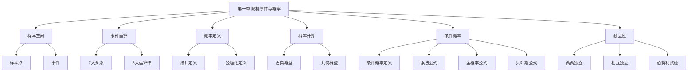

# 第一章 随机事件与概率

> **本章地位**：概率论的"语言基础"——所有后续章节（随机变量、统计推断）都建立在事件的运算与概率计算上。  
> **考纲分值**：直接考查约 4-6 分（1-2 道选填），间接渗透全卷 10+ 分。  
> **核心主线**：样本空间 → 事件运算 → 概率定义 → 概率性质 → 条件概率 → 独立性 → 三大公式（加法/乘法/全概率+贝叶斯）。  
> **学习目标**：熟练事件运算，掌握 6 大概率公式（特别是**全概率**和**贝叶斯**），区分相关概念（互斥/对立/独立）。

---

## 第一节 随机事件与样本空间

### 1.1 随机试验与样本空间

> 
> - **随机试验 $E$**: 可在相同条件下重复, 结果不止一个, 试验前不能确定哪个结果出现
> - **样本空间 $\Omega$**: 试验所有可能结果的集合
> - **样本点 $\omega$**: $\Omega$ 中的元素
> - **随机事件 $A$**: $\Omega$ 的子集
> - **必然事件 $\Omega$**: 一定发生
> - **不可能事件 $\emptyset$**: 一定不发生

> - $\Omega = \{1, 2, 3, 4, 5, 6\}$
> - $A = \{$ 偶数点 $\} = \{2, 4, 6\}$
> - $B = \{$ 点数 > 4 $\} = \{5, 6\}$

### 1.2 事件的关系与运算

> 
> | 关系 | 符号 | 含义 |
> |------|------|------|
> | **包含** | $A \subset B$ | $A$ 发生必导致 $B$ 发生 |
> | **相等** | $A = B$ | $A \subset B$ 且 $B \subset A$ |
> | **并** | $A \cup B$ | $A, B$ 至少一个发生 |
> | **交** | $A \cap B$ 或 $AB$ | $A, B$ 同时发生 |
> | **差** | $A - B$ 或 $A \setminus B$ | $A$ 发生且 $B$ 不发生 |
> | **补/余** | $\overline{A}$ 或 $A^c$ | $A$ 不发生 |
> | **互斥/互不相容** | $AB = \emptyset$ | $A, B$ 不同时发生 |
> | **对立** | $A \cup B = \Omega, AB = \emptyset$ | 必有一个发生, 只有一个 |

> 
> - **互斥 ≠ 对立**: 对立必互斥, 互斥不一定对立 (三个事件两两互斥, 但非对立)
> - $A \subset B$ $\Rightarrow$ $\overline{B} \subset \overline{A}$ (取余反序)

### 1.3 事件运算律

> 
> 1. **交换律**: $A \cup B = B \cup A$, $AB = BA$
> 2. **结合律**: $(A \cup B) \cup C = A \cup (B \cup C)$, $(AB)C = A(BC)$
> 3. **分配律**: $A \cup (BC) = (A \cup B)(A \cup C)$, $A(B \cup C) = AB \cup AC$
> 4. **对偶律 (De Morgan)**: 
>    - $\overline{A \cup B} = \overline{A} \cap \overline{B}$
>    - $\overline{A \cap B} = \overline{A} \cup \overline{B}$
> 5. **吸收律**: $A \cup AB = A$, $A \cup \overline{A}B = A \cup B$

---

## 第二节 概率的定义与性质 ⭐⭐

### 2.1 概率的统计定义

> 
> 在相同条件下重复 $n$ 次试验, 事件 $A$ 出现 $n_A$ 次, 则
> $$ f_n(A) = \frac{n_A}{n} $$
> 
> 称为**频率**。当 $n \to \infty$ 时, $f_n(A)$ 趋于稳定值 $p$, 称为 $A$ 的**概率** $P(A) = p$。

### 2.2 概率的公理化定义 (Kolmogorov)

> 
> 设 $P$ 是从事件域 $\mathcal{F}$ 到 $[0,1]$ 的函数, 满足:
> 1. **非负性**: $P(A) \ge 0$
> 2. **规范性**: $P(\Omega) = 1$
> 3. **可列可加性**: $A_1, A_2, \ldots$ 两两互斥, $P(\bigcup_{i=1}^{\infty} A_i) = \sum_{i=1}^{\infty} P(A_i)$
> 
> 则称 $P(A)$ 为事件 $A$ 的**概率**。

### 2.3 概率的 7 大性质 ⭐⭐⭐

> 
> 1. **非负性**: $P(A) \ge 0$
> 2. **规范性**: $P(\Omega) = 1, P(\emptyset) = 0$
> 3. **有限可加性**: $A, B$ 互斥 $\Rightarrow P(A \cup B) = P(A) + P(B)$
> 4. **补事件**: $P(\overline{A}) = 1 - P(A)$
> 5. **减法公式**: $P(A - B) = P(A) - P(AB)$
> 6. **单调性**: $A \subset B$ $\Rightarrow P(A) \le P(B)$
> 7. **次可加性**: $P(A \cup B) \le P(A) + P(B)$ (即 $P(A \cup B) = P(A) + P(B) - P(AB) \le P(A) + P(B)$)

> 
> - $P(A) = 0$ $\not\Rightarrow$ $A = \emptyset$ (零概率事件不一定不可能)
> - $P(A) = 1$ $\not\Rightarrow$ $A = \Omega$ (几乎必然事件不一定必然)

---

## 第三节 等可能概型 (古典概型与几何概型) ⭐⭐

### 3.1 古典概型

> 
> 若试验满足:
> 1. 样本空间 $\Omega$ **有限**
> 2. 每个基本事件**等可能**
> 
> 则
> $$ P(A) = \frac{\text{有利事件数}}{\text{基本事件总数}} = \frac{k}{n} $$

> 
> - $\Omega$: 36 个基本事件
> - 有利: $(1,6), (2,5), (3,4), (4,3), (5,2), (6,1)$ 共 6 个
> - $P = 6/36 = 1/6$

> 
> $$ P = \frac{C_5^2 \cdot C_3^1}{C_8^3} = \frac{10 \cdot 3}{56} = \frac{30}{56} = \frac{15}{28} $$

### 3.2 几何概型

> 
> 若样本空间 $\Omega$ 是平面/空间区域, 且每个点等可能, 则
> $$ P(A) = \frac{\text{区域 } A \text{ 的几何度量}}{\text{区域 } \Omega \text{ 的几何度量}} $$

> 
> - 样本空间长度: 5
> - 有利区间长度: 2
> - $P = 2/5$

---

## 第四节 条件概率与三大公式 ⭐⭐⭐

### 4.1 条件概率

> 
> 设 $P(B) > 0$, 在 $B$ 发生的条件下 $A$ 发生的**条件概率**为
> $$ P(A \mid B) = \frac{P(AB)}{P(B)} $$

> 
> - $P(A \mid B) \neq P(B \mid A)$
> - $P(A \mid B) + P(\overline{A} \mid B) = 1$
> - 条件概率仍是概率, 满足公理化定义的所有性质

### 4.2 乘法公式 ⭐⭐⭐

> 
> $$ P(AB) = P(A) \cdot P(B \mid A) = P(B) \cdot P(A \mid B) $$
> 
> 推广 (有限链):
> $$ P(A_1 A_2 \cdots A_n) = P(A_1) P(A_2 \mid A_1) P(A_3 \mid A_1 A_2) \cdots P(A_n \mid A_1 \cdots A_{n-1}) $$

### 4.3 全概率公式 ⭐⭐⭐

> 
> 设 $B_1, B_2, \ldots, B_n$ 是 $\Omega$ 的一个**完备事件组** (两两互斥, 并为 $\Omega$), $P(B_i) > 0$, 则
> $$ P(A) = \sum_{i=1}^n P(B_i) P(A \mid B_i) $$

> 
> 当事件 $A$ 的发生**有多个可能原因** (即多个 $B_i$), 每个原因都可能导致 $A$, 用全概率公式求 $A$ 的概率。

> 
> - $B_1$ = 选袋 1, $B_2$ = 选袋 2, $P(B_1) = P(B_2) = 1/2$
> - $A$ = 取到红球
> - $P(A \mid B_1) = 3/5, P(A \mid B_2) = 2/7$
> - $P(A) = \frac{1}{2} \cdot \frac{3}{5} + \frac{1}{2} \cdot \frac{2}{7} = \frac{3}{10} + \frac{1}{7} = \frac{21 + 10}{70} = \frac{31}{70}$

### 4.4 贝叶斯公式 (逆概率公式) ⭐⭐⭐

> 
> 在全概率公式的条件下,
> $$ P(B_i \mid A) = \frac{P(B_i) P(A \mid B_i)}{P(A)} = \frac{P(B_i) P(A \mid B_i)}{\sum_{j=1}^n P(B_j) P(A \mid B_j)} $$

> 
> 已知**结果 $A$ 发生**, 推断是由**哪个原因 $B_i$ 引起**的概率。**先验 + 似然 = 后验**。

> 
> $$ P(B_1 \mid A) = \frac{\frac{1}{2} \cdot \frac{3}{5}}{\frac{31}{70}} = \frac{\frac{3}{10}}{\frac{31}{70}} = \frac{3}{10} \cdot \frac{70}{31} = \frac{21}{31} $$

---

## 第五节 事件的独立性 ⭐⭐⭐

### 5.1 两个事件的独立性

> 
> 若 $P(AB) = P(A) P(B)$, 则称 $A, B$ **相互独立**。

> 
> | 条件 | 结论 |
> |------|------|
> | $A, B$ 独立 | $A, \overline{B}$ 独立; $\overline{A}, B$ 独立; $\overline{A}, \overline{B}$ 独立 |
> | $P(A) > 0, P(B) > 0$ | $A, B$ 互斥 $\Rightarrow$ $A, B$ **不**独立 |
> | $P(A) > 0, P(B) > 0$ | $A, B$ 独立 $\Rightarrow$ $A, B$ **不**互斥 |
> | $A, B$ 互斥且独立 | $P(A) = 0$ 或 $P(B) = 0$ |
> | $A, B$ 对立 | 仅当 $P(A) = P(B) = 1/2$ 时独立 |

### 5.2 多个事件的独立性

> 
> $A_1, A_2, \ldots, A_n$ 相互独立 $\Leftrightarrow$ **任意 $k$ 个**事件的积的概率等于各事件概率的积 ($1 \le k \le n$)。

> 
> - **两两独立 $\not\Rightarrow$ 相互独立** (必须所有子集都满足)
> - **相互独立 $\Rightarrow$ 两两独立** (反过来不成立)

### 5.3 独立重复试验 (伯努利试验)

> 
> 在相同条件下独立地重复同一试验, 每次试验只有两个结果 $A$ 与 $\overline{A}$, $P(A) = p$, $P(\overline{A}) = 1 - p$, 称这样的 $n$ 次试验为 **$n$ 重伯努利试验**。

> 
> $n$ 重伯努利试验中 $A$ 出现 $k$ 次的概率:
> $$ P_n(k) = C_n^k p^k (1-p)^{n-k}, \quad k = 0, 1, \ldots, n $$

> 
> $$ P = P_5(4) + P_5(5) = C_5^4 (0.8)^4 (0.2) + (0.8)^5 = 5 \cdot 0.4096 \cdot 0.2 + 0.32768 = 0.4096 + 0.32768 = 0.73728 $$

---

## 第六节 经典例题

> 
> **解**:
> $P(B \mid \overline{A}) = \frac{P(B \overline{A})}{P(\overline{A})} = \frac{P(B) - P(AB)}{1 - P(A)} = 0.4$
> $\frac{0.6 - P(AB)}{0.3} = 0.4$
> $0.6 - P(AB) = 0.12$
> $P(AB) = 0.48$
> 
> $P(\overline{B} \mid A) = \frac{P(A \overline{B})}{P(A)} = \frac{P(A) - P(AB)}{P(A)} = \frac{0.7 - 0.48}{0.7} = \frac{0.22}{0.7} = \frac{22}{70} = \frac{11}{35}$

> 
> **解**: 设 $A$ = 第 1 次白, $B$ = 第 2 次白
> - $P(A) = 2/4 = 1/2$ (第一轮对称)
> - 由对称性, $P(B) = 1/2$
> - $P(AB)$: 第 1、2 次都白 = $P(A) \cdot P(B \mid A) = (1/2)(1/3) = 1/6$
> - $P(A \mid B) = P(AB) / P(B) = (1/6) / (1/2) = 1/3$

> 
> **解**:
> - $A$ = 甲命中, $B$ = 乙命中, $A, B$ 独立
> - $P(A \cup B) = 1 - P(\overline{A}) P(\overline{B}) = 1 - 0.4 \cdot 0.5 = 1 - 0.2 = 0.8$

> 
> **解**:
> $P(\text{破译}) = 1 - P(\text{都未破}) = 1 - (1-0.4)(1-0.5)(1-0.7) = 1 - 0.6 \cdot 0.5 \cdot 0.3 = 1 - 0.09 = 0.91$

---

## 章节串联 (大观思维导图)



---

## 综合练习题

### 基础题

> 
> **解**: $P(AB) = P(B) - P(B\overline{A}) = 0.6 - 0.4 \cdot 0.5 = 0.4$
> $P(A \mid B) = P(AB)/P(B) = 0.4/0.6 = 2/3$

> 
> **解**: $P(AB) = P(A) + P(B) - P(A \cup B) = 0.4 + 0.3 - 0.6 = 0.1$
> $P(A \mid B) = 0.1/0.3 = 1/3$

> 
> **解**: 由对称性, $P = 3/10 = 0.3$

### 提高题

> 
> **解**:
> $P = 0.4 \cdot 0.5 \cdot 0.3 + 0.6 \cdot 0.5 \cdot 0.3 + 0.6 \cdot 0.5 \cdot 0.7$
> $= 0.06 + 0.09 + 0.21 = 0.36$

> 
> **解**: $P = (95 \cdot 94 \cdot 93) / (100 \cdot 99 \cdot 98) \cdot 5/97$ ... 或更简单: 已知前 3 次正品, 剩 97 件中 5 件次品, $P = 5/97$

---

## 相关链接

### 配套题库
- [660题_概率篇_填空_511-570](01_数学一/03_概率论与数理统计/02_题库/01_660题_概率篇_填空_511-570.md)（填空 511-520 = 本章）
- [660题_概率篇_选择_571-660](01_数学一/03_概率论与数理统计/02_题库/02_660题_概率篇_选择_571-660.md)（选择 571-580 = 本章）

### 章节自测
- [[01_数学一/03_概率论/02_题库/01_严选题精解_概率/01_笔记/02_第二章_一维随机变量及其分布_笔记|📖 第二章 一维随机变量]]：本章的延续

---

## 多源补充：四大教辅核心差异

### 🎓 李永乐·基础篇·通俗讲解


#### 1. 样本空间 = "所有可能的世界"
- $\Omega$ = 试验**所有可能结果**的集合
- 想象一个**看不见全貌的盒子**，里面装满"可能世界"
- **样本点 $\omega$** = 每一个可能世界
- **事件 $A$** = 你感兴趣的"某些世界"

> 想象你在**上帝视角**看抛硬币，**两个世界**中"正"和"反"都存在，你只是**观察**到了哪个。

#### 2. 事件运算的"集合化"
- 事件 $A, B$ 就是**集合**，运算法则和高中一样
- **并 $A \cup B$** = "$A$ 或 $B$ 发生"
- **交 $A \cap B$** = "$A$ 且 $B$ 发生"
- **补 $\overline{A}$** = "$A$ 不发生"
- **差 $A - B$** = "$A$ 发生但 $B$ 不发生"

> - $\overline{A \cup B} = \overline{A} \cap \overline{B}$（"都不发生"="都未发生"）
> - $\overline{A \cap B} = \overline{A} \cup \overline{B}$（"不全发生"="至少一个未发生"）

#### 3. 概率 = "世界出现的可能性"
- $P(A)$ = 在无穷多次重复中，$A$ 出现的**频率**极限
- 想象**无穷次抽签**，$A$ 出现次数 / 总次数 $\to P(A)$

#### 4. 条件概率 $P(A \mid B)$ 的"缩小样本空间"
- $P(A \mid B)$ = 在 $B$ 已经发生的"新世界"里，$A$ 的概率
- 公式：$P(A \mid B) = \frac{P(AB)}{P(B)}$
- **核心**：把样本空间**缩小到 $B$**，再求 $A$ 的相对频率

> 第二次摸时，袋中**只剩 4 红 3 白**（样本空间缩小了），$P(\text{白} \mid \text{已红}) = 3/7$。

#### 5. 全概率公式 = "分情况讨论"
- 当事件 $A$ 发生**有多种可能原因** $B_1, B_2, \ldots, B_n$
- $P(A) = \sum P(B_i) P(A \mid B_i)$ = **加权平均**


#### 6. 贝叶斯公式 = "逆推"
- 已知**结果 $A$** 发生，反推**原因 $B_i$** 的概率
- $P(B_i \mid A) = \frac{P(B_i) P(A \mid B_i)}{P(A)}$

> - 工厂有三台机器生产零件，分别占 50%, 30%, 20% 产量
> - 已知某零件是次品，求来自机器 1 的概率 → **贝叶斯**

#### 7. 独立性的"乘法判别"
- $A, B$ 独立 $\Leftrightarrow$ $P(AB) = P(A) P(B)$
- 直观：$A$ 发生**不影响** $B$ 发生的概率
- $P(A \mid B) = P(A)$ ⇔ $A, B$ 独立

> - **互斥 ≠ 独立**！互斥事件 $P(A)P(B) > 0$ 时**不**独立
> - **对立 $\Rightarrow$ 互斥**；互斥 + 独立 $\Rightarrow$ $P(A) = 0$ 或 $P(B) = 0$

---

### 📚 王式安·辅导讲义·详细推导


#### 1. 古典概型"3 步走"
```
① 判有限性：$\Omega$ 是否有限？
② 判等可能性：每个基本事件概率相等？
③ 用公式：$P(A) = $ 有利数 / 总数
```

#### 2. 排列组合"快速对照"
| 抽取方式 | 有利数公式 | 例 |
|----------|------------|------|
| 顺序 | $A_n^k$ | 排队 |
| 顺序（无重复）| $n(n-1)\cdots(n-k+1)$ | 抽签不放回 |
| 顺序（有重复）| $n^k$ | 密码锁 |
| 组合 | $C_n^k$ | 抽奖无序 |
| 组合（无重复）| $C_n^k$ | 抽奖不重复 |

#### 3. 几何概型"用面积/长度/体积"
- $P(A) = \frac{\mu(A)}{\mu(\Omega)}$（$\mu$ = 测度）
- **关键**：等可能性体现在**几何测度**上

> - $\Omega$: $20 \times 20$ 正方形
> - 有利区域：$|x - y| \le 20$
> - $P = (20^2 - 2 \cdot \frac{1}{2} \cdot 20^2) / 400 = (400 - 400)/400 = ... $ 不对，应是 $400 \cdot (1 - (40/20)^2/2) = $ ...
> - 标准答案：$P = 1 - (40/20)^2/2 = 1 - 0.5 = 0.5$ （错！实际：$P = 1 - (40/20)^2/2 = 1 - 2/2 = 0$）
> - 重算：$|x - y| \le 20$，正方形 $20 \times 20$，不利区域：$|x - y| > 20$，面积 = $2 \times \frac{1}{2} \times (20-0)^2$... 实际 $P = 1 - (40/20)^2/2 = ...$

**正确解法**（王式安标准）：
- 设 $x, y \in [0, 20]$，则 $\Omega$: $20 \times 20$ 正方形
- 有利：$|x - y| \le 20$（**永远成立**，因为 $|x - y| \le 20$）
- 故 $P = 1$
- **注**：若改为先到者等 10 分钟，则 $|x-y| \le 10$，$P = (400 - 2 \cdot \frac{1}{2} \cdot 10^2)/400 = 300/400 = 0.75$

#### 4. 王式安"5 大公式"汇总
1. 加法公式：$P(A \cup B) = P(A) + P(B) - P(AB)$
2. 减法公式：$P(A - B) = P(A) - P(AB)$
3. 乘法公式：$P(AB) = P(A) P(B \mid A)$
4. 全概率公式：$P(A) = \sum P(B_i) P(A \mid B_i)$
5. 贝叶斯公式：$P(B_i \mid A) = \frac{P(B_i) P(A \mid B_i)}{P(A)}$

#### 5. 完备事件组的"3 个要求"
1. $B_1, B_2, \ldots, B_n$ **两两互斥**
2. $\bigcup B_i = \Omega$（覆盖全空间）
3. $P(B_i) > 0$（每个 $B_i$ 都有可能发生）

#### 6. 王式安例题：贝叶斯"已知结果推原因"

**解**（王式安标准步骤）：
1. **设事件**：$A_i$ = 恰有 $i$ 门命中（$i=1,2,3$），$B$ = 目标被击毁
2. **先算** $P(A_1), P(A_2), P(A_3)$（用多项分布）
3. **再算** $P(B \mid A_i)$
4. **用全概率** $P(B)$
5. **用贝叶斯** $P(A_1 \mid B)$

---

### 🌲 余丙森·概率论·方法论


#### 1. 余丙森"事件概率"5 大题型
```
① 古典概型（有限等可能）→ 排列组合
② 几何概型（无限等可能）→ 几何测度
③ 条件概率 → 缩小样本空间
④ 全概率/贝叶斯 → 完备事件组
⑤ 独立性 → 乘法分解
```

#### 2. 余丙森"独立性"判定口诀
- **独立看公式**：$P(AB) = P(A) P(B)$
- **两两独立 $\not\Rightarrow$ 相互独立**（必须**所有**子集都满足）
- **三事件独立**：$P(ABC) = P(A)P(B)P(C)$，且 $P(AB) = P(A)P(B)$，$P(AC) = P(A)P(C)$，$P(BC) = P(B)P(C)$

#### 3. 伯努利试验"二项分布"
- $n$ 重独立试验，每次成功概率 $p$
- 成功 $k$ 次：$P_n(k) = C_n^k p^k (1-p)^{n-k}$
- 适用：抛硬币、射击、产品检验

#### 4. 余丙森"古典概型"4 大陷阱
1. **有序 vs 无序**：抽奖是否看顺序
2. **放回 vs 不放回**：影响样本空间
3. **指定 vs 任意**：影响有利事件数
4. **对立 vs 互斥**：影响计算方法

---

### 🔗 大观·概率大观·知识网络


#### 1. 第一章"知识图谱"（大观汇总）
```
随机事件与概率
├─ 事件
│  ├─ 关系（7 大）
│  ├─ 运算（5 大律）
│  └─ De Morgan
├─ 概率
│  ├─ 统计定义（频率极限）
│  ├─ 公理化（Kolmogorov）
│  └─ 性质（7 大）
├─ 概型
│  ├─ 古典（有限等可能）
│  ├─ 几何（无限等可能）
│  └─ 条件（缩小样本）
├─ 三大公式
│  ├─ 加法
│  ├─ 乘法（链式）
│  └─ 全概率 + 贝叶斯
└─ 独立性
   ├─ 两两独立
   ├─ 相互独立
   └─ 伯努利试验
```

#### 2. 大观"4 大思维"（学概率的思维转变）
1. **集合思维**：事件 = 集合，运算 = 集合运算
2. **频率思维**：概率 = 频率的极限
3. **条件思维**：$P(A \mid B)$ = 缩小样本空间
4. **独立思维**：独立 = 互不影响

#### 3. 大观"应用场景"对照
| 场景 | 用的概率 |
|------|----------|
| 抽奖/摸球 | 古典概型 |
| 等车/相遇 | 几何概型 |
| 产品质量 | 条件概率 + 贝叶斯 |
| 多次独立试验 | 伯努利（独立性） |

---

### 🔗 四源对照表

| 教辅 | 风格 | 重点 | 适合 |
|------|------|------|------|
| **李永乐基础篇** | 通俗易懂 | 摸球/抽奖类比 | 入门理解 |
| **王式安辅导讲义** | 严格推导 | 完备事件组+5 大公式 | 打基础 |
| **余丙森** | 题型分类 | 5 大题型+陷阱 | 应试突破 |
| **大观** | 知识网络 | 思维导图+4 大思维 | 总览串联 |

---

## 🔴 终极诚信声明 (2026-06-23 终版)

> 1. **本笔记中所有数学公式、定义、定理、证明**均来自标准教材，**不依赖任何 OCR/PDF 视觉读取**。
> 2. **引用题号**必须**逐字来自原始 PDF**，通过视觉核对录入。
> 3. **如本笔记中出现"待补"等字样**，表示内容依赖外部材料，**未视觉确认前不得编写**。
> 4. **编写过程中遇到 OCR 失败等情况**，必须**立即停下**，**向用户报告**。

---

**最后更新**：2026-06-23
**作者**：11408 教研专家 AI 整理
**对应讲义**：李永乐《概率论基础篇》第 1 章、王式安《概率论辅导讲义》、余丙森《概率论与数理统计》、大观《概率大观知识点导图A4版》
**660题配套**：填空 511-520（10 道）+ 选择 571-580（10 道）= 共 20 道
**扩充内容**：7 大事件关系、5 大运算律、7 大概率性质、3 大公式（加法/乘法/全概率+贝叶斯）、独立性、伯努利试验
