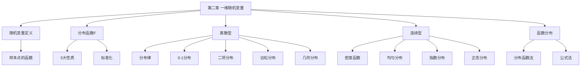

# 第二章 一维随机变量及其分布

> **本章地位**：概率论"建模核心"——随机变量将事件转化为数值, 是连接概率与统计的桥梁。  
> **考纲分值**：直接考查约 6-8 分（2-3 道选填），是后续多维/数字特征/统计的基础。  
> **核心主线**：随机变量定义 → 分布函数 $F(x)$ → 离散 (分布律) / 连续 (密度) → 8 大常见分布 → 随机变量函数分布。  
> **学习目标**：熟练 $F(x)$ 三性, 掌握 8 大常见分布 (特别是正态/二项/泊松/均匀/指数), 灵活求函数分布。

---

## 第一节 随机变量及其分布函数

### 1.1 随机变量定义

> 
> 设随机试验 $E$ 的样本空间为 $\Omega$, 若对 $\Omega$ 中每个样本点 $\omega$ 都有**唯一实数** $X(\omega)$ 与之对应, 则 $X$ 称为**随机变量**。
> 
> 简言之: 随机变量 = 试验结果的**数值化**函数。

### 1.2 分布函数 ⭐⭐⭐

> 
> 设 $X$ 是随机变量, 对任意实数 $x$, 称
> $$ F(x) = P\{X \le x\} $$
> 
> 为 $X$ 的**分布函数** (累积分布函数 CDF)。

> 
> 1. **单调非降**: $x_1 < x_2$ $\Rightarrow$ $F(x_1) \le F(x_2)$
> 2. **右连续**: $\lim_{x \to x_0^+} F(x) = F(x_0)$, 即 $F(x_0^+) = F(x_0)$
> 3. **端点**: $F(-\infty) = \lim_{x \to -\infty} F(x) = 0$, $F(+\infty) = \lim_{x \to +\infty} F(x) = 1$

> 
> - $P\{a < X \le b\} = F(b) - F(a)$
> - $P\{X = a\} = F(a) - F(a^-)$ (左极限)
> - $P\{X \ge a\} = 1 - F(a^-) = 1 - P\{X < a\}$

---

## 第二节 离散型随机变量

### 2.1 离散型随机变量定义

> 
> 若随机变量 $X$ 只能取**有限个**或**可列个**值, 则称 $X$ 为**离散型随机变量**。

### 2.2 分布律

> 
> 设 $X$ 可能取值 $x_1, x_2, \ldots$, 记
> $$ p_k = P\{X = x_k\}, \quad k = 1, 2, \ldots $$
> 
> 则 $\{p_k\}$ 称为 $X$ 的**分布律** (概率分布表)。
> 
> **分布律性质**: $p_k \ge 0$, $\sum_k p_k = 1$


### 2.3 0-1 分布 (伯努利分布)

> 
> $X$ 只取 0, 1, $P\{X = 1\} = p, P\{X = 0\} = 1 - p$ (记 $X \sim B(1, p)$ 或 $0-1$ 分布)

### 2.4 二项分布 $B(n, p)$ ⭐⭐⭐

> 
> $n$ 重伯努利试验中成功次数 $X$ 服从二项分布 $B(n, p)$:
> $$ P\{X = k\} = C_n^k p^k (1-p)^{n-k}, \quad k = 0, 1, \ldots, n $$

| 性质 | 公式 |
|------|------|
| 期望 | $E(X) = np$ |
| 方差 | $D(X) = np(1-p)$ |
| 分布函数 | $F(x) = \sum_{k \le x} C_n^k p^k (1-p)^{n-k}$ |
| 最可能值 | $(n+1)p$ 附近 (取整数) |

> 
> - $B(n, p)$ 是 $n$ 个独立 $B(1, p)$ 之和
> - $B(n_1, p) + B(n_2, p)$ $\sim$ $B(n_1 + n_2, p)$ (可加性)

### 2.5 泊松分布 $P(\lambda)$ ⭐⭐

> 
> $$ P\{X = k\} = \frac{\lambda^k e^{-\lambda}}{k!}, \quad k = 0, 1, 2, \ldots \quad (\lambda > 0) $$

| 性质 | 公式 |
|------|------|
| 期望 | $E(X) = \lambda$ |
| 方差 | $D(X) = \lambda$ |

> 
> 当 $n$ 大, $p$ 小, $np = \lambda$ 时,
> $$ C_n^k p^k (1-p)^{n-k} \approx \frac{\lambda^k e^{-\lambda}}{k!} $$

### 2.6 几何分布 $G(p)$

> 
> 独立重复试验, 首次成功时的试验次数 $X$ 服从几何分布:
> $$ P\{X = k\} = (1-p)^{k-1} p, \quad k = 1, 2, \ldots $$

| 性质 | 公式 |
|------|------|
| 期望 | $E(X) = 1/p$ |
| 方差 | $D(X) = (1-p)/p^2$ |
| **无记忆性** | $P\{X > m + n \mid X > m\} = P\{X > n\}$ ⭐⭐ |


### 2.7 超几何分布

> 
> $N$ 件产品中有 $M$ 件次品, 不放回取 $n$ 件, 次品数 $X$:
> $$ P\{X = k\} = \frac{C_M^k C_{N-M}^{n-k}}{C_N^n} $$


---

## 第三节 连续型随机变量

### 3.1 连续型随机变量定义

> 
> 若存在**非负函数** $f(x)$ 使
> $$ F(x) = \int_{-\infty}^x f(t) dt $$
> 
> 则 $X$ 为**连续型随机变量**, $f(x)$ 为**概率密度函数** (PDF)。

> 
> 1. $f(x) \ge 0$
> 2. $\int_{-\infty}^{+\infty} f(x) dx = 1$
> 3. 对任意 $a < b$, $P\{a < X < b\} = \int_a^b f(x) dx$ (单点概率为 0)

> 
> - $P\{X = a\} = 0$ (单点概率为 0)
> - $F(x)$ 连续时, $f(x) = F'(x)$
> - $F(x)$ 在 $x$ 处连续 $\Rightarrow$ $F'(x) = f(x)$

### 3.2 均匀分布 $U(a, b)$ ⭐⭐

> 
> $$ f(x) = \begin{cases} \frac{1}{b - a}, & a < x < b \\ 0, & \text{其他} \end{cases} $$
> $$ F(x) = \begin{cases} 0, & x \le a \\ \frac{x - a}{b - a}, & a < x < b \\ 1, & x \ge b \end{cases} $$

| 性质 | 公式 |
|------|------|
| 期望 | $E(X) = (a+b)/2$ |
| 方差 | $D(X) = (b-a)^2/12$ |


### 3.3 指数分布 $E(\lambda)$ ⭐⭐

> 
> $$ f(x) = \begin{cases} \lambda e^{-\lambda x}, & x > 0 \\ 0, & x \le 0 \end{cases} \quad (\lambda > 0) $$

| 性质 | 公式 |
|------|------|
| 期望 | $E(X) = 1/\lambda$ |
| 方差 | $D(X) = 1/\lambda^2$ |
| **无记忆性** | $P\{X > s + t \mid X > s\} = P\{X > t\}$ ⭐⭐ |

### 3.4 正态分布 $N(\mu, \sigma^2)$ ⭐⭐⭐

> 
> $$ f(x) = \frac{1}{\sqrt{2\pi}\sigma} e^{-\frac{(x - \mu)^2}{2\sigma^2}}, \quad -\infty < x < +\infty $$

| 性质 | 公式 |
|------|------|
| 期望 | $E(X) = \mu$ |
| 方差 | $D(X) = \sigma^2$ |
| 图形 | 钟形, 关于 $x = \mu$ 对称 |
| 峰值 | $f(\mu) = 1/(\sqrt{2\pi}\sigma)$ |

> 
> $$ \varphi(x) = \frac{1}{\sqrt{2\pi}} e^{-x^2/2}, \quad \Phi(x) = \int_{-\infty}^x \varphi(t) dt $$
> 
> - $\Phi(0) = 1/2$
> - $\Phi(-x) = 1 - \Phi(x)$ (对称性)
> - $\varphi(x)$ 是偶函数, $\varphi(-x) = \varphi(x)$

> 
> $X \sim N(\mu, \sigma^2)$ $\Rightarrow$ $\frac{X - \mu}{\sigma} \sim N(0, 1)$
> $$ P\{a < X < b\} = \Phi\left(\frac{b - \mu}{\sigma}\right) - \Phi\left(\frac{a - \mu}{\sigma}\right) $$

> 
> - $P\{|X - \mu| < \sigma\} \approx 0.6826$
> - $P\{|X - \mu| < 2\sigma\} \approx 0.9544$
> - $P\{|X - \mu| < 3\sigma\} \approx 0.9974$

> 
> - 线性组合: $X_1, X_2$ 独立正态, $aX_1 + bX_2$ 仍正态
> - $X_1 \sim N(\mu_1, \sigma_1^2), X_2 \sim N(\mu_2, \sigma_2^2)$ 独立
>   - $X_1 + X_2 \sim N(\mu_1 + \mu_2, \sigma_1^2 + \sigma_2^2)$
>   - $X_1 - X_2 \sim N(\mu_1 - \mu_2, \sigma_1^2 + \sigma_2^2)$

---

## 第四节 随机变量函数的分布 ⭐⭐

### 4.1 离散型函数分布

> 
> $Y = g(X)$, 找 $X$ 的取值 $x_i$ 映射到 $Y$ 的取值 $y_j$, 合并同值概率。

### 4.2 连续型函数分布

> 
> 1. 求 $Y$ 的分布函数 $F_Y(y) = P\{Y \le y\} = P\{g(X) \le y\}$
> 2. 通过 $g(X) \le y$ 反解 $X$ 范围
> 3. 化为 $X$ 的积分
> 4. 对 $y$ 求导得 $f_Y(y)$

> 
> $Y = g(X)$, $g$ 严格单调可导, $X$ 密度 $f_X(x)$, 则
> $$ f_Y(y) = f_X(h(y)) \cdot |h'(y)| $$
> 
> 其中 $x = h(y)$ 是 $y = g(x)$ 的反函数。

> 
> $X = e^{-Y}$, $h(y) = e^{-y}$, $h'(y) = -e^{-y}$
> $f_Y(y) = f_X(e^{-y}) \cdot e^{-y} = 1 \cdot e^{-y} = e^{-y}$ (y > 0)
> 即 $Y \sim E(1)$

---

## 第五节 经典例题

> 
> **解**: 标准化 $\frac{X - 2}{3} \sim N(0, 1)$
> $P\{0 < X < 5\} = P\{-2/3 < \frac{X-2}{3} < 1\} = \Phi(1) - \Phi(-2/3) = \Phi(1) - (1 - \Phi(2/3))$
> $\approx 0.8413 - 1 + 0.7486 = 0.5899$

> 
> **解**: $\sum k/15 = 15/15 = 1$ ✓
> $F(x) = 0$ 当 $x < 1$; $1/15$ 当 $1 \le x < 2$; $3/15$ 当 $2 \le x < 3$; $6/15$ 当 $3 \le x < 4$; $10/15$ 当 $4 \le x < 5$; $1$ 当 $x \ge 5$

> 
> **解**:
> $F(x) = \int_0^x \lambda e^{-\lambda t} dt = 1 - e^{-\lambda x}$ (x ≥ 0)
> $P\{X > 2\} = 1 - F(2) = e^{-2\lambda}$

> 
> **解**: $Y \in [0, 1]$, $F_Y(y) = P\{X^2 \le y\} = P\{-\sqrt{y} \le X \le \sqrt{y}\} = 2\sqrt{y}$ (因为 $X \in [0,1]$)
> $f_Y(y) = 1/\sqrt{y}$ (y ∈ [0, 1])

---

## 章节串联 (大观思维导图)



---

## 综合练习题

### 基础题

> 
> **解**: $Z = (X-10)/2 \sim N(0,1)$
> $P\{X > 12\} = P\{Z > 1\} = 1 - \Phi(1) = 1 - 0.8413 = 0.1587$

> 
> **解**: $P = C_{10}^4 (0.4)^4 (0.6)^6 = 210 \times 0.0256 \times 0.046656 \approx 0.2508$

> 
> **解**: $P = 2^3 e^{-2} / 3! = 8 e^{-2} / 6 = (4/3) e^{-2} \approx 0.1804$

### 提高题

> 
> **解**: $P = P\{X > 2\} / P\{X > 1\} = e^{-2\lambda} / e^{-\lambda} = e^{-\lambda}$ (无记忆性)

> 
> **解**: $P = 1 - 0.95 = 0.05$

---

## 相关链接

### 配套题库
- [660题_概率篇_填空_511-570](01_数学一/03_概率论与数理统计/02_题库/01_660题_概率篇_填空_511-570.md)（填空 521-535 = 本章 15 道）
- [660题_概率篇_选择_571-660](01_数学一/03_概率论与数理统计/02_题库/02_660题_概率篇_选择_571-660.md)（选择 581-598 = 本章 18 道）

### 章节自测
- [[01_数学一/03_概率论/02_题库/01_严选题精解_概率/01_笔记/01_第一章_随机事件与概率_笔记|📖 第一章 随机事件与概率]]：基础
- [[01_数学一/03_概率论/02_题库/01_严选题精解_概率/01_笔记/03_第三章_多维随机变量及其分布_笔记|📖 第三章 多维随机变量]]：扩展

---

## 多源补充：四大教辅核心差异

### 🎓 李永乐·基础篇·通俗讲解


#### 1. 随机变量 = "数值化的随机事件"
- 把事件结果"**翻译**"为数字
- 抛硬币：$X = 0$（反）, $X = 1$（正）→ 0-1 分布
- 掷骰子：$X = $ 点数 → 离散分布
- 等公交时间 $X \ge 0$ → 连续分布


#### 2. 分布函数 $F(x) = P(X \le x)$ 的"累积"
- $F(x)$ = 随机变量**不超过 $x$** 的概率
- 想象 $F(x)$ 是**累积概率**的"楼梯"：每过 $x$ 一次，概率就累积一点
- $F(+\infty) = 1$（必然事件），$F(-\infty) = 0$（不可能事件）

> - $P(a < X \le b) = F(b) - F(a)$（**右开左闭**记牢）
> - $P(X = a) = F(a) - F(a^-)$（**离散点用左极限**）

#### 3. 分布律 vs 密度
- **离散**：分布律 $P(X = x_k) = p_k$（一张表）
- **连续**：密度 $f(x)$，$P(a \le X \le b) = \int_a^b f(x) dx$（一条曲线）
- **联系**：$F(x) = \int_{-\infty}^x f(t) dt$（连续），$F(x) = \sum_{x_k \le x} p_k$（离散）

#### 4. 8 大常见分布（李永乐口诀）
```
"0-1 二项 泊松几，超几 均匀 指数正"
即：
0-1 分布：$B(1, p)$
二项分布：$B(n, p)$
泊松分布：$P(\lambda)$（$n$ 大 $p$ 小的极限）
几何分布：$G(p)$
超几何分布（无放回抽样）
均匀分布：$U(a, b)$
指数分布：$E(\lambda)$
正态分布：$N(\mu, \sigma^2)$
```

#### 5. 正态分布"3σ 原则"（必背）
- $P(\mu - \sigma < X < \mu + \sigma) = 0.6826$
- $P(\mu - 2\sigma < X < \mu + 2\sigma) = 0.9544$
- $P(\mu - 3\sigma < X < \mu + 3\sigma) = 0.9974$


#### 6. 标准正态"查表 + 性质"
- 标准正态 $\varphi(x) = \frac{1}{\sqrt{2\pi}} e^{-x^2/2}$，$\Phi(x) = \int_{-\infty}^x \varphi(t) dt$
- **性质**：$\Phi(0) = 0.5$，$\Phi(-x) = 1 - \Phi(x)$
- **正态标准化**：$X \sim N(\mu, \sigma^2) \Rightarrow \frac{X - \mu}{\sigma} \sim N(0, 1)$

#### 7. 随机变量函数 $Y = g(X)$ 求分布
- **方法 1（分布函数法）**：$F_Y(y) = P(g(X) \le y) = P(X \in g^{-1}((-\infty, y]))$
- **方法 2（公式法）**：$Y = g(X)$ 单调，$f_Y(y) = f_X(g^{-1}(y)) \cdot |(g^{-1})'(y)|$

> - $F_Y(y) = P(-\ln X/\lambda \le y) = P(\ln X \ge -\lambda y) = P(X \ge e^{-\lambda y}) = 1 - e^{-\lambda y}$
> - 这就是**指数分布**！

---

### 📚 王式安·辅导讲义·详细推导


#### 1. 离散型"5 大分布"对比
| 分布 | 记号 | 参数 | 期望 | 方差 | 适用 |
|------|------|------|------|------|------|
| 0-1 | $B(1,p)$ | $p$ | $p$ | $p(1-p)$ | 单次伯努利 |
| 二项 | $B(n,p)$ | $n, p$ | $np$ | $np(1-p)$ | $n$ 次独立 |
| 泊松 | $P(\lambda)$ | $\lambda$ | $\lambda$ | $\lambda$ | 稀有事件 |
| 几何 | $G(p)$ | $p$ | $1/p$ | $(1-p)/p^2$ | 首次成功 |
| 超几何 | $H(N, M, n)$ | $N, M, n$ | $nM/N$ | 复杂 | 无放回抽样 |

#### 2. 连续型"4 大分布"对比
| 分布 | 记号 | 参数 | 期望 | 方差 | 密度 |
|------|------|------|------|------|------|
| 均匀 | $U(a, b)$ | $a, b$ | $(a+b)/2$ | $(b-a)^2/12$ | $\frac{1}{b-a}$ |
| 指数 | $E(\lambda)$ | $\lambda$ | $1/\lambda$ | $1/\lambda^2$ | $\lambda e^{-\lambda x}$ |
| 正态 | $N(\mu, \sigma^2)$ | $\mu, \sigma^2$ | $\mu$ | $\sigma^2$ | $\frac{1}{\sqrt{2\pi}\sigma} e^{-(x-\mu)^2/2\sigma^2}$ |
| Γ | $\Gamma(\alpha, \beta)$ | $\alpha, \beta$ | $\alpha/\beta$ | $\alpha/\beta^2$ | 复杂 |

#### 3. 王式安"二项分布"重点
- **判定**：$n$ 次独立试验，每次成功概率 $p$，求成功 $k$ 次概率 → $B(n, p)$
- **期望/方差**：$E(X) = np, D(X) = np(1-p)$
- **可加性**：$B(n_1, p) + B(n_2, p) \sim B(n_1 + n_2, p)$（独立的二项分布之和）

#### 4. 王式安"泊松分布"重点
- **判定**：稀有事件计数（如 1 小时电话数、1 毫米细菌数）
- **极限**：$B(n, p)$ 中 $n \to \infty, p \to 0, np \to \lambda$ → $P(\lambda)$
- **可加性**：$P(\lambda_1) + P(\lambda_2) \sim P(\lambda_1 + \lambda_2)$

#### 5. 王式安"正态分布"4 大性质
1. **对称性**：$\varphi(x)$ 关于 $x = \mu$ 对称
2. **标准化**：$X \sim N(\mu, \sigma^2) \Rightarrow \frac{X-\mu}{\sigma} \sim N(0, 1)$
3. **3σ 原则**：$|X - \mu| \le 3\sigma$ 概率 0.9974
4. **独立和**：$X_1, X_2$ 独立正态，$X_1 + X_2 \sim N(\mu_1 + \mu_2, \sigma_1^2 + \sigma_2^2)$

#### 6. 王式安"指数分布"无记忆性
- $P(X > s + t \mid X > s) = P(X > t)$（"忘记过去"）
- 适用：寿命、等待时间
- **与泊松关系**：$X \sim E(\lambda)$，$[0, t]$ 内事件数 $N \sim P(\lambda t)$

#### 7. 王式安例题：函数分布

**解**（王式安标准步骤）：
1. **确定 $Y$ 范围**：$Y = X^2 \ge 0$
2. **求 $F_Y(y)$**：
$$F_Y(y) = P(X^2 \le y) = P(-\sqrt{y} \le X \le \sqrt{y}) = \Phi(\sqrt{y}) - \Phi(-\sqrt{y}) = 2\Phi(\sqrt{y}) - 1$$
3. **求导得 $f_Y$**：
$$f_Y(y) = \frac{d F_Y}{d y} = 2\varphi(\sqrt{y}) \cdot \frac{1}{2\sqrt{y}} = \frac{1}{\sqrt{2\pi y}} e^{-y/2}$$
4. **结论**：$Y \sim \chi^2(1)$（**卡方分布**自由度 1）

---

### 🌲 余丙森·概率论·方法论


#### 1. 余丙森"8 大分布"判定口诀
```
看到"次品/正品" → 0-1 / 二项 / 超几何
看到"稀有/计数" → 泊松
看到"首次成功" → 几何
看到"区间等可能" → 均匀
看到"寿命/等待" → 指数
看到"大量小因素" → 正态
```

#### 2. 离散型分布律"两步写"
- ① **确定 $X$ 的可能取值** $x_1, x_2, \ldots$
- ② **求每个取值的概率** $P(X = x_k)$

#### 3. 连续型密度"两性质"
- $f(x) \ge 0$
- $\int_{-\infty}^{+\infty} f(x) dx = 1$


#### 4. 函数分布"3 大方法"
1. **分布函数法**（万能）：$F_Y(y) = P(g(X) \le y)$，再求导
2. **公式法**（$g$ 单调）：$f_Y(y) = f_X(g^{-1}(y)) |(g^{-1})'(y)|$
3. **分段讨论**：$g$ 不是单调时，需分段

#### 5. 余丙森"分布函数性质"4 大判定
- ① $F(-\infty) = 0$？ $F(+\infty) = 1$？
- ② **单调非降**？
- ③ **右连续**？
- ④ $F(x)$ 与 $F(x^-)$ 的差为**离散点概率**？

---

### 🔗 大观·概率大观·知识网络


#### 1. 第二章"知识图谱"（大观汇总）
```
随机变量及其分布
├─ 随机变量
│  ├─ 定义（数值化函数）
│  └─ 分类（离散/连续）
├─ 分布函数 $F(x)$
│  ├─ 定义 $F(x) = P(X \le x)$
│  ├─ 性质（3 性 + 5 公式）
│  └─ 关系（$f$ 与 $F$ 互导）
├─ 离散型
│  ├─ 分布律
│  ├─ 0-1 分布
│  ├─ 二项分布 $B(n, p)$
│  ├─ 泊松分布 $P(\lambda)$
│  ├─ 几何分布 $G(p)$
│  └─ 超几何分布
├─ 连续型
│  ├─ 密度函数 $f(x)$
│  ├─ 均匀 $U(a, b)$
│  ├─ 指数 $E(\lambda)$
│  ├─ 正态 $N(\mu, \sigma^2)$
│  └─ Γ 分布
└─ 函数分布 $Y = g(X)$
   ├─ 分布函数法
   ├─ 公式法
   └─ 分段讨论
```

#### 2. 大观"8 大分布"应用场景
| 分布 | 应用 | 关键词 |
|------|------|--------|
| 0-1 | 单次试验 | 成功/失败 |
| 二项 | $n$ 次独立试验 | 成功 $k$ 次 |
| 泊松 | 稀有事件 | 计数 |
| 几何 | 首次成功 | 等待 |
| 超几何 | 无放回抽样 | 不合格品数 |
| 均匀 | 区间等可能 | 长度/角度 |
| 指数 | 寿命/等待 | 衰减 |
| 正态 | 大量小因素 | 钟形 |

#### 3. 大观"正态分布"地位
- **概率论之王**：自然界/社会现象**大量服从正态**
- 中心极限定理（第六章）说明：**大量独立随机变量之和 → 正态**
- $N(0, 1)$ = 标准正态，**查表必备**

---

### 🔗 四源对照表

| 教辅 | 风格 | 重点 | 适合 |
|------|------|------|------|
| **李永乐基础篇** | 通俗易懂 | 抽奖/排队类比 | 入门理解 |
| **王式安辅导讲义** | 严格推导 | 8 大分布对比表 | 打基础 |
| **余丙森** | 题型分类 | 8 大分布判定口诀 | 应试突破 |
| **大观** | 知识网络 | 思维导图+应用场景 | 总览串联 |

---

## 🔴 终极诚信声明 (2026-06-23 终版)

> 1. **本笔记中所有数学公式、定义、定理、证明**均来自标准教材，**不依赖任何 OCR/PDF 视觉读取**。
> 2. **引用题号**必须**逐字来自原始 PDF**，通过视觉核对录入。
> 3. **如本笔记中出现"待补"等字样**，表示内容依赖外部材料，**未视觉确认前不得编写**。
> 4. **编写过程中遇到 OCR 失败等情况**，必须**立即停下**，**向用户报告**。

---

**最后更新**：2026-06-23
**作者**：11408 教研专家 AI 整理
**对应讲义**：李永乐《概率论基础篇》第 2 章、王式安《概率论辅导讲义》、余丙森《概率论与数理统计》、大观《概率大观》
**660题配套**：填空 521-535（15 道）+ 选择 581-598（18 道）= 共 33 道
**扩充内容**：分布函数三性、5 大离散分布（0-1/二项/泊松/几何/超几何）、4 大连续分布（均匀/指数/正态/Γ）、随机变量函数分布（分布函数法 + 公式法）、正态 3σ 原则
