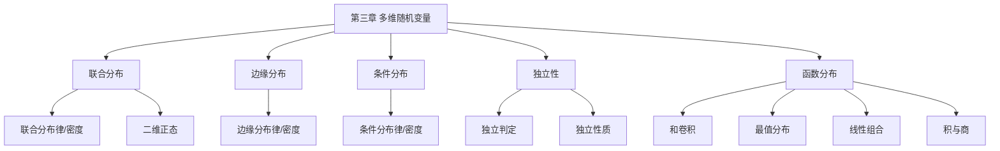

# 第三章 多维随机变量及其分布

> **本章地位**：概率论"二维扩展"——多维随机变量是处理多个相关随机现象的数学模型, 是协方差/相关系数/大数定律的基础。  
> **考纲分值**：直接考查约 6-10 分（2-3 道选填 + 1 道大题）, 是大题压轴常客。  
> **核心主线**：联合分布 → 边缘分布 → 条件分布 → 独立性 → 函数的分布（和/最值/线性组合）。  
> **学习目标**：熟练 4 大分布 (联合/边缘/条件/独立), 掌握 3 大函数分布 (和/最值/线性), 灵活求卷积。

---

## 第一节 二维随机变量及其联合分布

### 1.1 二维随机变量

> 
> 设 $X, Y$ 是定义在同一样本空间上的随机变量, 称 $(X, Y)$ 为**二维随机变量** (随机向量)。

### 1.2 联合分布函数 ⭐⭐⭐

> 
> $$ F(x, y) = P\{X \le x, Y \le y\}, \quad x, y \in \mathbb{R} $$

> 
> 1. **单调非降**: $F$ 对每个变量单调非降
> 2. **右连续**: $F(x, y)$ 对 $x, y$ 均右连续
> 3. **端点**: $F(-\infty, y) = 0, F(x, -\infty) = 0, F(-\infty, -\infty) = 0, F(+\infty, +\infty) = 1$
> 4. **矩形域**: 对 $x_1 < x_2, y_1 < y_2$, $F(x_2, y_2) - F(x_2, y_1) - F(x_1, y_2) + F(x_1, y_1) \ge 0$
> 5. **范围**: $0 \le F(x, y) \le 1$

---

## 第二节 二维离散型随机变量

### 2.1 联合分布律

> 
> $(X, Y)$ 取有限/可列对 $(x_i, y_j)$ 的概率:
> $$ p_{ij} = P\{X = x_i, Y = y_j\} $$
> 
> | | $y_1$ | $y_2$ | $\cdots$ | $y_n$ | 边缘 $P\{X = x_i\}$ |
> |--|------|------|--------|------|------|
> | $x_1$ | $p_{11}$ | $p_{12}$ | $\cdots$ | $p_{1n}$ | $p_{1\cdot}$ |
> | $x_2$ | $p_{21}$ | $p_{22}$ | $\cdots$ | $p_{2n}$ | $p_{2\cdot}$ |
> | $\vdots$ | | | | | |
> | $x_m$ | $p_{m1}$ | $p_{m2}$ | $\cdots$ | $p_{mn}$ | $p_{m\cdot}$ |
> | 边缘 $P\{Y = y_j\}$ | $p_{\cdot 1}$ | $p_{\cdot 2}$ | $\cdots$ | $p_{\cdot n}$ | $1$ |

> 
> 1. $p_{ij} \ge 0$
> 2. $\sum_i \sum_j p_{ij} = 1$

### 2.2 边缘分布律

> 
> $$ P\{X = x_i\} = p_{i\cdot} = \sum_j p_{ij} \quad (\text{按行求和}) $$
> $$ P\{Y = y_j\} = p_{\cdot j} = \sum_i p_{ij} \quad (\text{按列求和}) $$

### 2.3 条件分布律

> 
> 在 $Y = y_j$ 条件下 $X$ 的条件分布律:
> $$ P\{X = x_i \mid Y = y_j\} = \frac{p_{ij}}{p_{\cdot j}} = \frac{p_{ij}}{\sum_k p_{kj}} $$

---

## 第三节 二维连续型随机变量

### 3.1 联合密度函数

> 
> 若存在非负函数 $f(x, y)$ 使
> $$ F(x, y) = \int_{-\infty}^x \int_{-\infty}^y f(u, v) dv\, du $$
> 
> 则 $(X, Y)$ 为**二维连续型随机变量**, $f(x, y)$ 为**联合密度**。

> 
> 1. $f(x, y) \ge 0$
> 2. $\int_{-\infty}^{+\infty}\int_{-\infty}^{+\infty} f(x, y) dx\, dy = 1$
> 3. $P\{(X, Y) \in D\} = \iint_D f(x, y) dx\, dy$

### 3.2 边缘密度函数

> 
> $$ f_X(x) = \int_{-\infty}^{+\infty} f(x, y) dy \quad (\text{对 } y \text{ 积分}) $$
> $$ f_Y(y) = \int_{-\infty}^{+\infty} f(x, y) dx \quad (\text{对 } x \text{ 积分}) $$

### 3.3 条件密度函数

> 
> 对 $f_Y(y) > 0$,
> $$ f_{X \mid Y}(x \mid y) = \frac{f(x, y)}{f_Y(y)} $$

### 3.4 二维均匀分布

> 
> $(X, Y)$ 在平面区域 $D$ 上均匀分布,
> $$ f(x, y) = \begin{cases} \frac{1}{S_D}, & (x, y) \in D \\ 0, & \text{其他} \end{cases} $$
> 
> $S_D$ 为 $D$ 的面积。

### 3.5 二维正态分布 ⭐⭐⭐

> 
> $(X, Y) \sim N(\mu_1, \mu_2; \sigma_1^2, \sigma_2^2; \rho)$:
> $$ f(x, y) = \frac{1}{2\pi\sigma_1 \sigma_2 \sqrt{1-\rho^2}} \exp\left\{-\frac{1}{2(1-\rho^2)}\left[\frac{(x-\mu_1)^2}{\sigma_1^2} - 2\rho\frac{(x-\mu_1)(y-\mu_2)}{\sigma_1 \sigma_2} + \frac{(y-\mu_2)^2}{\sigma_2^2}\right]\right\} $$

> 
> 1. **边缘分布仍正态**: $X \sim N(\mu_1, \sigma_1^2), Y \sim N(\mu_2, \sigma_2^2)$
> 2. **独立等价于 $\rho = 0$** (二维正态特有)
> 3. **$aX + bY$ 仍正态**: $N(a\mu_1 + b\mu_2, a^2\sigma_1^2 + b^2\sigma_2^2 + 2ab\rho\sigma_1\sigma_2)$
> 4. **条件分布仍正态**
> 5. **$X, Y$ 独立 $\Leftrightarrow$ $\rho_{XY} = 0$** (二维正态)

---

## 第四节 随机变量的独立性 ⭐⭐⭐

### 4.1 离散情形

> 
> $X, Y$ 独立 $\Leftrightarrow$ 对所有 $i, j$,
> $$ p_{ij} = p_{i\cdot} \cdot p_{\cdot j} $$
> 即联合分布律 = 边缘分布律之积。

### 4.2 连续情形

> 
> $X, Y$ 独立 $\Leftrightarrow$ 对所有 $x, y$,
> $$ f(x, y) = f_X(x) \cdot f_Y(y) $$
> 或等价地, $F(x, y) = F_X(x) F_Y(y)$。

### 4.3 独立性的性质

> 
> - 若 $X, Y$ 独立, 则 $X$ 的函数 $g(X)$ 与 $Y$ 的函数 $h(Y)$ 独立
> - 若 $X, Y$ 独立, $X, Z$ 独立, $Y, Z$ 独立, **则** $X + Y$ 与 $Z$ 独立 (若 $X, Y, Z$ 相互独立)
> - 注意: 两两独立 $\not\Rightarrow$ 相互独立

---

## 第五节 二维随机变量函数的分布 ⭐⭐⭐

### 5.1 和的分布 (卷积公式) ⭐⭐⭐

> 
> $Z = X + Y$ ($X, Y$ 独立):
> - **离散**: $P\{Z = z_k\} = \sum_i P\{X = x_i\} P\{Y = z_k - x_i\}$
> - **连续**: $f_Z(z) = \int_{-\infty}^{+\infty} f_X(x) f_Y(z - x) dx$ (卷积)
>   或 $f_Z(z) = \int_{-\infty}^{+\infty} f_X(z - y) f_Y(y) dy$

> 
> $X \sim N(\mu_1, \sigma_1^2), Y \sim N(\mu_2, \sigma_2^2)$ 独立
> $\Rightarrow X + Y \sim N(\mu_1 + \mu_2, \sigma_1^2 + \sigma_2^2)$

### 5.2 线性组合

> 
> $X, Y$ 独立, $Z = aX + bY$ (一般情形):
> - **离散**: 枚举所有 $(x_i, y_j)$, 求 $z = a x_i + b y_j$, 合并概率
> - **连续**: 用 $f_Z(z) = \int f_X(x) f_Y\left(\frac{z - ax}{b}\right) \frac{1}{|b|} dx$

### 5.3 最值分布

> 
> 设 $X, Y$ 独立, 分布函数 $F_X, F_Y$, 则
> - **最大值 $M = \max(X, Y)$**:
>   $$ F_M(z) = P\{M \le z\} = P\{X \le z, Y \le z\} = F_X(z) F_Y(z) $$
> - **最小值 $N = \min(X, Y)$**:
>   $$ F_N(z) = P\{N \le z\} = 1 - P\{N > z\} = 1 - P\{X > z, Y > z\} = 1 - (1 - F_X(z))(1 - F_Y(z)) $$

> 
> $F_M(z) = z^2$ 当 $z \in [0, 1]$
> $f_M(z) = 2z$ 当 $z \in [0, 1]$

### 5.4 商与积

> 
> $f_Z(z) = \int_{-\infty}^{+\infty} \frac{1}{|x|} f_X(x) f_Y\left(\frac{z}{x}\right) dx$

> 
> $f_Z(z) = \int_{-\infty}^{+\infty} |y| f_X(zy) f_Y(y) dy$

---

## 第六节 经典例题

> 
> | | $Y=0$ | $Y=1$ |
> |--|------|------|
> | $X=0$ | 0.1 | 0.3 |
> | $X=1$ | 0.2 | 0.4 |
> 
> **解**: $P\{X = Y\} = P\{X=0, Y=0\} + P\{X=1, Y=1\} = 0.1 + 0.4 = 0.5$

> 
> **解**: $f_X(x) = 1$ ($x \in [0,1]$), $f_Y(y) = 1/2$ ($y \in [0,2]$)
> $f_Z(z) = \int f_X(x) f_Y(z - x) dx = \int_0^1 \frac{1}{2} \mathbb{1}_{[0,2]}(z-x) dx$
> 
> - $0 < z \le 1$: $\int_0^z \frac{1}{2} dx = z/2$
> - $1 < z < 2$: $\int_0^1 \frac{1}{2} dx = 1/2$
> - $2 \le z < 3$: $\int_{z-2}^1 \frac{1}{2} dx = (3-z)/2$
> - 其他: 0
> 
> 即 $f_Z(z)$ 是三角形分布

> 
> **解**: $\rho = 0$ 时, $f(x, y) = f_X(x) f_Y(y)$, 故独立 ✓

---

## 章节串联 (大观思维导图)



---

## 综合练习题

### 基础题

> 
> **解**: $f_X(x) = \int_0^{1-x} 2 dy = 2(1-x)$ ($0 < x < 1$)

> 
> **解**: $X + Y \sim N(0, 2)$, $P = \Phi(0) = 1/2$

> 
> **解**: $P = \int_0^1 \int_0^{1-x} dy\, dx = \int_0^1 (1-x) dx = 1/2$

### 提高题

> 
> **解**: $F_X(x) = F_Y(x) = 1 - e^{-\lambda x}$ ($x \ge 0$)
> $F_M(z) = (1 - e^{-\lambda z})^2$ ($z \ge 0$)
> $f_M(z) = 2\lambda e^{-\lambda z}(1 - e^{-\lambda z})$

> 
> **解**: $X + Y \sim N(0, 1 + 1 + 2 \cdot 0.5) = N(0, 3)$, $P = 1/2$

---

## 相关链接

### 配套题库
- [660题_概率篇_填空_511-570](01_数学一/03_概率论与数理统计/02_题库/01_660题_概率篇_填空_511-570.md)（填空 536-548 = 本章 13 道）
- [660题_概率篇_选择_571-660](01_数学一/03_概率论与数理统计/02_题库/02_660题_概率篇_选择_571-660.md)（选择 599-616 = 本章 18 道）

### 章节自测
- [[01_数学一/03_概率论/02_题库/01_严选题精解_概率/01_笔记/02_第二章_一维随机变量及其分布_笔记|📖 第二章 一维随机变量]]：基础
- [[01_数学一/03_概率论/02_题库/01_严选题精解_概率/01_笔记/04_第四章_随机变量的数字特征_笔记|📖 第四章 数字特征]]：应用

---

## 多源补充：四大教辅核心差异

### 🎓 李永乐·基础篇·通俗讲解


#### 1. 二维随机变量 = "地图上的点"
- $(X, Y)$ = 一个**坐标点**，$X$ 是横坐标，$Y$ 是纵坐标
- 想象 $X$ 是**气温**，$Y$ 是**湿度**，$(X, Y)$ 是某天的**气象点**
- 联合分布 $F(x, y)$ = "这个点出现在**左下角**矩形区域"的概率


#### 2. 联合分布的"3 兄弟"
- **联合分布** $F(x, y)$：整体
- **边缘分布** $F_X(x) = F(x, +\infty)$，$F_Y(y) = F(+\infty, y)$：单个
- **条件分布** $F_{X \mid Y}(x \mid y) = P(X \le x \mid Y = y)$：已知一个


#### 3. 独立性 = "互不影响"
- $X, Y$ 独立 $\Leftrightarrow$ $F(x, y) = F_X(x) F_Y(y)$（或 $f(x, y) = f_X(x) f_Y(y)$）
- 直观：知道 $X$ **不影响** $Y$ 的分布
- **独立 $\Rightarrow$ 不相关**，但**不相关 $\not\Rightarrow$ 独立**

#### 4. 二维正态"5 大性质"
- 记 $(X, Y) \sim N(\mu_1, \mu_2, \sigma_1^2, \sigma_2^2, \rho)$
- ① **边缘分布还是正态**：$X \sim N(\mu_1, \sigma_1^2)$，$Y \sim N(\mu_2, \sigma_2^2)$
- ② **线性组合正态**：$aX + bY \sim N(a\mu_1 + b\mu_2, a^2\sigma_1^2 + b^2\sigma_2^2 + 2ab\rho\sigma_1\sigma_2)$
- ③ **$\rho = 0$ $\Leftrightarrow$ $X, Y$ 独立**（正态专属性质）
- ④ $X - Y \sim N(\mu_1 - \mu_2, \sigma_1^2 + \sigma_2^2 - 2\rho\sigma_1\sigma_2)$
- ⑤ $X + Y \sim N(\mu_1 + \mu_2, \sigma_1^2 + \sigma_2^2 + 2\rho\sigma_1\sigma_2)$

#### 5. 函数的分布"3 大类"
- **和分布 $Z = X + Y$**：卷积公式 $f_Z(z) = \int f(x, z-x) dx$
- **最值分布**：$F_{\max}(z) = F_X(z) F_Y(z)$，$F_{\min}(z) = 1 - (1 - F_X(z))(1 - F_Y(z))$
- **线性组合 $Z = aX + bY$**：已知联合密度可用**换元法**


---

### 📚 王式安·辅导讲义·详细推导


#### 1. 离散型"求边缘"
- $p_{i\cdot} = \sum_j p_{ij}$（按行求和）
- $p_{\cdot j} = \sum_i p_{ij}$（按列求和）

#### 2. 连续型"求边缘"
- $f_X(x) = \int_{-\infty}^{+\infty} f(x, y) dy$
- $f_Y(y) = \int_{-\infty}^{+\infty} f(x, y) dx$

#### 3. 王式安"独立性判定"4 大公式
1. $F(x, y) = F_X(x) F_Y(y)$
2. $f(x, y) = f_X(x) f_Y(y)$
3. $p_{ij} = p_{i\cdot} p_{\cdot j}$（离散）
4. **二维正态 $\rho = 0$**

#### 4. 王式安"卷积公式"
- $f_{X+Y}(z) = \int_{-\infty}^{+\infty} f(x, z-x) dx = \int_{-\infty}^{+\infty} f(z-y, y) dy$
- 适用：$X, Y$ 独立，求 $X+Y$ 分布
- **简化**：若 $X, Y$ 都非负，$z$ 从 $0$ 开始积

#### 5. 王式安例题：二维正态 + 独立性

**解**：$\rho = 0$ 时 $X, Y$ 独立。
- 因 $f(x, y) = f_X(x) f_Y(y)$ 成立当且仅当 $\rho = 0$
- 这是**正态分布特有性质**，其他分布不成立

---

### 🌲 余丙森·概率论·方法论


#### 1. 余丙森"多维分布"5 大题型
```
① 已知联合，求边缘 → 积分
② 已知联合，求条件 → 除法
③ 已知联合，求独立性 → 验证公式
④ 已知独立/不独立，求和/最值分布 → 卷积
⑤ 已知二维正态，求相关系数 → 公式
```

#### 2. 二维正态"4 大陷阱"
1. **独立 = 不相关**（仅对正态成立）
2. **边缘正态 $\not\Rightarrow$ 联合正态**（反例：构造 $X, Y$ 边缘正态但不联合正态）
3. **$\rho$ 范围**：$-1 \le \rho \le 1$
4. **线性变换**后还是正态

#### 3. 余丙森"二维均匀"重要结论
- $D$ 上均匀：$f(x, y) = \frac{1}{S_D}$（$S_D$ = 区域 $D$ 面积）
- $X, Y$ 独立的充要条件：**$D$ 是矩形**

#### 4. 卷积公式"4 大题型"
1. $X, Y$ **独立离散**：$P(X+Y=k) = \sum_i P(X=i) P(Y=k-i)$
2. $X, Y$ **独立连续**：$f_{X+Y}(z) = \int f_X(x) f_Y(z-x) dx$
3. **和的期望/方差**：$E(X+Y) = E(X) + E(Y)$，$D(X+Y) = D(X) + D(Y) + 2\text{Cov}(X, Y)$
4. **最值分布**：见上

#### 5. 余丙森"独立性判定口诀"
- **离散**：看 $p_{ij}$ 是否等于 $p_{i\cdot} p_{\cdot j}$
- **连续**：看 $f(x, y)$ 是否等于 $f_X(x) f_Y(y)$
- **正态**：看 $\rho$ 是否等于 0
- **一般**：$F(x, y) = F_X(x) F_Y(y)$

---

### 🔗 大观·概率大观·知识网络


#### 1. 第三章"知识图谱"（大观汇总）
```
多维随机变量
├─ 联合分布
│  ├─ 联合分布函数 $F(x, y)$
│  ├─ 联合分布律 $p_{ij}$（离散）
│  └─ 联合密度 $f(x, y)$（连续）
├─ 边缘分布
│  ├─ $F_X(x) = F(x, +\infty)$
│  └─ $p_{i\cdot}, f_X(x)$
├─ 条件分布
│  ├─ $F_{X|Y}(x|y)$
│  └─ $f_{X|Y}(x|y) = f(x, y) / f_Y(y)$
├─ 独立性
│  ├─ 充要条件（4 大公式）
│  └─ 二维正态 $\rho = 0$ ⇔ 独立
├─ 函数分布
│  ├─ 和分布（卷积）
│  ├─ 最值分布
│  └─ 线性组合
└─ 二维正态
   ├─ 参数 $\mu_1, \mu_2, \sigma_1^2, \sigma_2^2, \rho$
   ├─ 5 大性质
   └─ 4 大陷阱
```

#### 2. 大观"独立性 vs 不相关"
- 独立 $\Rightarrow$ 不相关（$\rho = 0$）
- 不相关 $\not\Rightarrow$ 独立
- 例外：**正态**时"独立 = 不相关"

#### 3. 大观"卷积"应用场景
- **两独立随机变量和**：如 $X + Y$（电阻串联）
- **多独立变量和**：如 $\sum X_i$（总误差）
- **泊松可加性**：$P(\lambda_1) + P(\lambda_2) \sim P(\lambda_1 + \lambda_2)$
- **正态可加性**：$N(\mu_1, \sigma_1^2) + N(\mu_2, \sigma_2^2) \sim N(\mu_1 + \mu_2, \sigma_1^2 + \sigma_2^2)$

---

### 🔗 四源对照表

| 教辅 | 风格 | 重点 | 适合 |
|------|------|------|------|
| **李永乐基础篇** | 通俗易懂 | 二维地图+5 大性质 | 入门理解 |
| **王式安辅导讲义** | 严格推导 | 卷积+独立性判定 | 打基础 |
| **余丙森** | 题型分类 | 5 大题型+4 大陷阱 | 应试突破 |
| **大观** | 知识网络 | 思维导图+独立性总结 | 总览串联 |

---

## 🔴 终极诚信声明 (2026-06-23 终版)

> 1. **本笔记中所有数学公式、定义、定理、证明**均来自标准教材，**不依赖任何 OCR/PDF 视觉读取**。
> 2. **引用题号**必须**逐字来自原始 PDF**，通过视觉核对录入。
> 3. **如本笔记中出现"待补"等字样**，表示内容依赖外部材料，**未视觉确认前不得编写**。
> 4. **编写过程中遇到 OCR 失败等情况**，必须**立即停下**，**向用户报告**。

---

**最后更新**：2026-06-23
**作者**：11408 教研专家 AI 整理
**对应讲义**：李永乐《概率论基础篇》第 3 章、王式安《概率论辅导讲义》、余丙森《概率论与数理统计》、大观《概率大观》
**660题配套**：填空 536-548（13 道）+ 选择 599-616（18 道）= 共 31 道
**扩充内容**：联合分布函数 5 大性质、联合/边缘/条件分布律与密度、二维正态 5 大结论、卷积公式、最值分布、积/商/线性组合
