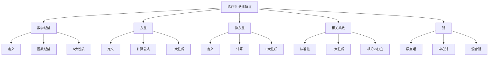

# 第四章 随机变量的数字特征

> **本章地位**：概率论"数字抽象"——数字特征用数字描述随机变量, 是协方差/相关系数/统计量的基础。  
> **考纲分值**：直接考查约 6-8 分（2-3 道选填 + 1 道大题）。  
> **核心主线**：数学期望 → 方差 → 协方差 → 相关系数 → 矩。  
> **学习目标**：熟练期望/方差计算, 掌握 7 大性质, 区分相关与独立, 灵活处理多维数字特征。

---

## 第一节 数学期望 ⭐⭐⭐

### 1.1 期望定义

> 
> $$ E(X) = \sum_i x_i p_i \quad (\text{要求级数绝对收敛}) $$

> 
> $$ E(X) = \int_{-\infty}^{+\infty} x f(x) dx \quad (\text{要求积分绝对收敛}) $$

### 1.2 随机变量函数的期望

> 
> - **离散**: $E[g(X)] = \sum_i g(x_i) p_i$
> - **连续**: $E[g(X)] = \int_{-\infty}^{+\infty} g(x) f(x) dx$

> 
> - **离散**: $E[g(X, Y)] = \sum_i \sum_j g(x_i, y_j) p_{ij}$
> - **连续**: $E[g(X, Y)] = \int_{-\infty}^{+\infty}\int_{-\infty}^{+\infty} g(x, y) f(x, y) dx\, dy$

### 1.3 期望的 6 大性质 ⭐⭐⭐

> 
> 1. **常数**: $E(C) = C$
> 2. **线性**: $E(aX + b) = aE(X) + b$ (对 $a, b$ 任意)
> 3. **线性 (多变量)**: $E(aX + bY + c) = aE(X) + bE(Y) + c$
> 4. **乘积独立**: $X, Y$ 独立 $\Rightarrow$ $E(XY) = E(X) E(Y)$
> 5. **指示函数**: $E(\mathbb{1}_A) = P(A)$
> 6. **范围**: 若 $X \ge 0$, $E(X) \ge 0$ (非负性)

> 
> - $E(X+Y) = E(X) + E(Y)$ **恒成立** (无独立性要求)
> - $E(XY) = E(X) E(Y)$ **仅独立时成立**

---

## 第二节 方差 ⭐⭐⭐

### 2.1 方差定义

> 
> $$ D(X) = \text{Var}(X) = E[(X - E(X))^2] $$
> 
> 标准差 $\sigma(X) = \sqrt{D(X)}$

### 2.2 两种计算公式

> 
> - **定义式**: $D(X) = E(X^2) - E^2(X)$ (常用!)
> - **展开式**: $D(X) = E(X^2) - [E(X)]^2$

> 
> 1. 求 $E(X)$
> 2. 求 $E(X^2)$
> 3. $D(X) = E(X^2) - [E(X)]^2$

### 2.3 常见分布的期望与方差

| 分布 | 期望 | 方差 |
|------|------|------|
| 0-1 分布 $B(1, p)$ | $p$ | $p(1-p)$ |
| 二项分布 $B(n, p)$ | $np$ | $np(1-p)$ |
| 泊松分布 $P(\lambda)$ | $\lambda$ | $\lambda$ |
| 几何分布 $G(p)$ | $1/p$ | $(1-p)/p^2$ |
| 均匀分布 $U(a, b)$ | $(a+b)/2$ | $(b-a)^2/12$ |
| 指数分布 $E(\lambda)$ | $1/\lambda$ | $1/\lambda^2$ |
| 正态分布 $N(\mu, \sigma^2)$ | $\mu$ | $\sigma^2$ |

### 2.4 方差的 6 大性质 ⭐⭐⭐

> 
> 1. **非负**: $D(X) \ge 0$
> 2. **常数**: $D(C) = 0$
> 3. **缩放**: $D(aX + b) = a^2 D(X)$
> 4. **独立可加**: $X, Y$ 独立 $\Rightarrow$ $D(X \pm Y) = D(X) + D(Y)$
> 5. **一般和差**: $D(X \pm Y) = D(X) + D(Y) \pm 2\text{Cov}(X, Y)$
> 6. **不等式**: $D(X) = 0$ $\Leftrightarrow$ $P\{X = E(X)\} = 1$

> 
> - $D(X + Y) = D(X) + D(Y)$ **仅独立时成立**
> - $D(X - Y) = D(X) + D(Y)$ 也仅独立时成立
> - $D(aX + b) = a^2 D(X)$ (注意 $b$ 没有平方)

---

## 第三节 协方差与相关系数 ⭐⭐⭐

### 3.1 协方差

> 
> $$ \text{Cov}(X, Y) = E[(X - E(X))(Y - E(Y))] $$

> 
> 1. $\text{Cov}(X, Y) = E(XY) - E(X) E(Y)$ (最常用!)
> 2. $\text{Cov}(X, Y) = E(XY) - E(X)E(Y)$
> 3. $\text{Cov}(X, X) = D(X)$
> 4. $\text{Cov}(aX, bY) = ab\, \text{Cov}(X, Y)$
> 5. $\text{Cov}(X_1 + X_2, Y) = \text{Cov}(X_1, Y) + \text{Cov}(X_2, Y)$

### 3.2 相关系数

> 
> $$ \rho_{XY} = \frac{\text{Cov}(X, Y)}{\sqrt{D(X)} \sqrt{D(Y)}} \quad (D(X) > 0, D(Y) > 0) $$

> 
> 1. **有界**: $|\rho_{XY}| \le 1$
> 2. **极值**: $|\rho_{XY}| = 1$ $\Leftrightarrow$ $X, Y$ 概率为 1 线性相关
> 3. **独立**: $X, Y$ 独立 $\Rightarrow$ $\rho_{XY} = 0$ (必要, 不充分)
> 4. **不相关**: $\rho_{XY} = 0$ $\Leftrightarrow$ $\text{Cov}(X, Y) = 0$ $\Leftrightarrow$ $E(XY) = E(X) E(Y)$
> 5. **二维正态**: $X, Y$ 独立 $\Leftrightarrow$ $\rho_{XY} = 0$ (充要)
> 6. **一般情形**: $\rho = 0$ **不**蕴含独立

### 3.3 协方差性质

> 
> 1. $\text{Cov}(X, Y) = \text{Cov}(Y, X)$ (对称)
> 2. $\text{Cov}(aX, bY) = ab\, \text{Cov}(X, Y)$
> 3. $\text{Cov}(X_1 + X_2, Y) = \text{Cov}(X_1, Y) + \text{Cov}(X_2, Y)$
> 4. $\text{Cov}(X, C) = 0$
> 5. $D(aX + bY) = a^2 D(X) + b^2 D(Y) + 2ab\, \text{Cov}(X, Y)$
> 6. **不相关**: $\text{Cov}(X, Y) = 0$ $\Leftrightarrow$ $X, Y$ 不相关

---

## 第四节 相关 vs 独立 ⭐⭐⭐

> 
> | 关系 | 含义 | 反向是否成立 |
> |------|------|------------|
> | 独立 $\Rightarrow$ 不相关 | $P(AB)=P(A)P(B) \Rightarrow \rho=0$ | ✗ (反之不成立) |
> | 不相关 $\not\Rightarrow$ 独立 | 一般情形, 反例: $(X, Y)$ 联合分布不规则 | - |
> | 二维正态独立 $\Leftrightarrow$ 不相关 | $\rho=0 \Leftrightarrow$ 独立 | ✓ 充要 |

> 
> $E(X) = 0$, $E(Y) = E(X^2) = 1/3$, $E(XY) = E(X^3) = 0$
> $\text{Cov}(X, Y) = 0 - 0 = 0$, $\rho = 0$
> 但 $Y$ 完全由 $X$ 决定 ($Y = X^2$), 不独立!

---

## 第五节 矩

> 
> - **原点矩**: $\alpha_k = E(X^k)$ ($k = 1, 2, \ldots$)
> - **中心矩**: $\mu_k = E[(X - E(X))^k]$ ($k = 1, 2, \ldots$)
> - **混合矩**: $E(X^k Y^l)$
> - **混合中心矩**: $E[(X - E(X))^k (Y - E(Y))^l]$

> 
> - $E(X) = \alpha_1$
> - $D(X) = \mu_2 = \alpha_2 - \alpha_1^2$
> - $\text{Cov}(X, Y) = E[(X - E(X))(Y - E(Y))]$ (混合中心二阶矩)

---

## 第六节 经典例题

> 
> **解**:
> $E(X) = (1+2+3+4+5)/5 = 3$
> $E(X^2) = (1+4+9+16+25)/5 = 55/5 = 11$
> $D(X) = 11 - 9 = 2$

> 
> **解**:
> $E(X) = \int_0^{+\infty} x \lambda e^{-\lambda x} dx = 1/\lambda$ (分部积分)
> $E(X^2) = \int_0^{+\infty} x^2 \lambda e^{-\lambda x} dx = 2/\lambda^2$
> $D(X) = 2/\lambda^2 - 1/\lambda^2 = 1/\lambda^2$

> 
> **解**: $D(X + Y) = D(X) + D(Y) = np(1-p) + mp(1-p) = (n+m)p(1-p)$

> 
> **解**:
> $E(X + Y) = \mu_1 + \mu_2$
> $D(X + Y) = \sigma_1^2 + \sigma_2^2 + 2\rho \sigma_1 \sigma_2$ (协方差项不为 0!)

> 
> **解**: $D(2X - 3Y + 5) = 4 D(X) + 9 D(Y) = 4 \cdot 2 + 9 \cdot 3 = 8 + 27 = 35$

---

## 章节串联 (大观思维导图)



---

## 综合练习题

### 基础题

> 
> **解**: $E(X) = 5, D(X) = 2.5$

> 
> **解**: $E = 6 - 2 = 4$, $D = 9 \cdot 9 + 4 \cdot 4 = 81 + 16 = 97$

> 
> **解**: $D(X - Y) = D(X) + D(Y) - 2\text{Cov}(X,Y) = 2 + 1 - 2 \cdot 0.5 \cdot \sqrt{2} \cdot \sqrt{1} = 3 - \sqrt{2}$

### 提高题

> 
> **解**: $E(X^3) = \int_0^{+\infty} x^3 \lambda e^{-\lambda x} dx = 3!/\lambda^3 = 6/\lambda^3$ (Gamma 函数)

> 
> **解**: $\max(X, Y) = (X + Y + |X - Y|)/2$
> $E[\max] = (0 + 0 + E|X - Y|)/2 = E|X - Y|/2$
> $X - Y \sim N(0, 2)$, $E|X - Y| = \sqrt{2 D(X-Y)} = \sqrt{2 \cdot 2} = 2$
> $E[\max] = 1$

---

## 相关链接

### 配套题库
- [660题_概率篇_填空_511-570](01_数学一/03_概率论与数理统计/02_题库/01_660题_概率篇_填空_511-570.md)（填空 549-560 = 本章 12 道）
- [660题_概率篇_选择_571-660](01_数学一/03_概率论与数理统计/02_题库/02_660题_概率篇_选择_571-660.md)（选择 617-630 = 本章 14 道）

### 章节自测
- [[01_数学一/03_概率论/02_题库/01_严选题精解_概率/01_笔记/03_第三章_多维随机变量及其分布_笔记|📖 第三章 多维随机变量]]：基础
- [[01_数学一/03_概率论/02_题库/01_严选题精解_概率/01_笔记/05_第五章_大数定律与中心极限定理_笔记|📖 第五章 大数定律与CLT]]：理论

---

## 多源补充：四大教辅核心差异

### 🎓 李永乐·基础篇·通俗讲解


#### 1. 期望 = "长期平均"
- $E(X)$ = 重复试验无穷多次后，$X$ 的**平均值**
- 想象你**抛硬币无穷次**，平均每次"正"出现的次数 = 0.5
- $E(X)$ 就是"长期的稳定值"


#### 2. 方差 = "波动大小"
- $D(X) = E[(X - E(X))^2]$ = 偏离期望的**平方的平均**
- 反映 $X$ 的**不稳定程度**
- 标准差 $\sigma = \sqrt{D(X)}$：与 $X$ 同量纲

> - 甲每月 10000 元（方差 0）
> - 乙每月 5000-15000 波动（方差大）
> 期望相同，但**乙的"波动"更大**。

#### 3. 期望的"5 大公式"
- $E(C) = C$（常数的期望 = 自身）
- $E(aX + b) = aE(X) + b$（线性）
- $E(g(X)) = \sum g(x_i) p_i$（函数）
- $E(X + Y) = E(X) + E(Y)$（和，与独立无关）
- **$E(XY) = E(X) E(Y)$** 当且仅当 $X, Y$ 独立

#### 4. 方差的"5 大公式"
- $D(C) = 0$
- $D(aX + b) = a^2 D(X)$
- $D(X + Y) = D(X) + D(Y) + 2\text{Cov}(X, Y)$
- **独立** $\Rightarrow$ $D(X + Y) = D(X) + D(Y)$
- $D(X) = E(X^2) - [E(X)]^2$（**重要！计算题必用**）

#### 5. 协方差和相关系数
- $\text{Cov}(X, Y) = E[(X - E(X))(Y - E(Y))] = E(XY) - E(X)E(Y)$
- $\rho_{XY} = \frac{\text{Cov}(X, Y)}{\sqrt{D(X)} \sqrt{D(Y)}}$
- $|\rho| \le 1$，$\rho = \pm 1$ $\Leftrightarrow$ $X, Y$ 线性相关
- $\rho = 0$ 称 $X, Y$ **不相关**

> - 独立 $\Rightarrow$ 不相关
> - 不相关 $\not\Rightarrow$ 独立（**正态除外**）
> - 相关 = **线性**相关，不是任何关系

#### 6. 4 大数字特征"对应分布"对照
| 分布 | $E$ | $D$ |
|------|-----|-----|
| 0-1 | $p$ | $p(1-p)$ |
| 二项 $B(n, p)$ | $np$ | $np(1-p)$ |
| 泊松 $P(\lambda)$ | $\lambda$ | $\lambda$ |
| 几何 $G(p)$ | $1/p$ | $(1-p)/p^2$ |
| 均匀 $U(a, b)$ | $(a+b)/2$ | $(b-a)^2/12$ |
| 指数 $E(\lambda)$ | $1/\lambda$ | $1/\lambda^2$ |
| 正态 $N(\mu, \sigma^2)$ | $\mu$ | $\sigma^2$ |

---

### 📚 王式安·辅导讲义·详细推导


#### 1. 王式安"期望"5 大题型
```
① 离散型求期望
② 连续型求期望
③ 随机变量函数求期望（不求分布！）
④ 多维联合求期望
⑤ 未知分布但知其他信息 → 列方程
```

#### 2. 王式安"方差"3 大计算法
- **定义法**：$D(X) = E[(X - E(X))^2]$
- **简化公式**：$D(X) = E(X^2) - [E(X)]^2$（**最常用**）
- **切比雪夫**：$D(X)$ 与 $P(|X - \mu| \ge \varepsilon)$ 关系

#### 3. 王式安"协方差"3 大公式
- $\text{Cov}(X, Y) = E(XY) - E(X) E(Y)$
- $\text{Cov}(aX, bY) = ab \text{Cov}(X, Y)$
- $\text{Cov}(X_1 + X_2, Y) = \text{Cov}(X_1, Y) + \text{Cov}(X_2, Y)$

#### 4. 王式安例题：协方差与独立性

**解**：$X$ 与 $Y = X^2$ **不独立**（$Y$ 完全由 $X$ 决定）。
- $E(X) = 1/2$，$E(Y) = E(X^2) = 1/3$
- $E(XY) = E(X^3) = 1/4$
- $\text{Cov}(X, Y) = 1/4 - 1/2 \cdot 1/3 = 1/4 - 1/6 = 1/12 \neq 0$
- 故 $X, Y$ **相关**
- 又因 $X, Y$ **不独立**（$Y$ 是 $X$ 的函数），所以"不相关 $\not\Rightarrow$ 独立"

---

### 🌲 余丙森·概率论·方法论


#### 1. 余丙森"数字特征"4 大题型
```
① 求期望/方差 → 直接公式
② 求多维联合数字特征 → 边缘+协方差
③ 独立性判定 → $\text{Cov} = 0$（不充分）
④ 中心化/标准化 → $\frac{X - E(X)}{\sqrt{D(X)}}$
```

#### 2. 余丙森"5 大常见陷阱"
1. **$E(XY) = E(X) E(Y)$ 需要独立**
2. **$D(X+Y) = D(X) + D(Y)$ 需要独立**
3. **$D(X) = 0$ $\Rightarrow$ $X$ 是常数**（几乎处处）
4. **$\text{Cov}(X, X) = D(X)$**
5. **$|\rho| = 1$ $\Leftrightarrow$ $X, Y$ 线性相关**（带概率 1）

#### 3. 相关系数"5 大性质"
1. $|\rho_{XY}| \le 1$
2. $\rho_{XY} = \rho_{YX}$
3. $\rho_{aX+b, cY+d} = \text{sign}(ac) \rho_{XY}$
4. $\rho = 0$ 不相关
5. $\rho = \pm 1$ 线性相关

#### 4. 余丙森"中心化"技巧
- 令 $X^* = X - E(X)$，则 $E(X^*) = 0$，$D(X^*) = D(X)$
- 令 $X^{**} = \frac{X - E(X)}{\sqrt{D(X)}}$，则 $E(X^{**}) = 0$，$D(X^{**}) = 1$

---

### 🔗 大观·概率大观·知识网络


#### 1. 第四章"知识图谱"（大观汇总）
```
数字特征
├─ 数学期望
│  ├─ 定义
│  ├─ 5 大公式
│  └─ 函数期望
├─ 方差
│  ├─ 定义
│  ├─ 5 大公式
│  └─ 简化公式 $E(X^2) - [E(X)]^2$
├─ 协方差
│  ├─ 定义
│  ├─ 3 大公式
│  └─ $\text{Cov}(X, Y) = 0$ ⇔ 不相关
├─ 相关系数
│  ├─ 定义
│  ├─ 5 大性质
│  └─ $|\rho| = 1$ ⇔ 线性相关
└─ 矩
   ├─ 矩定义
   ├─ 中心矩
   └─ 偏度/峰度
```

#### 2. 大观"独立 vs 不相关 vs 相关"
```
相关（线性）= |ρ| = 1
不相关 = ρ = 0
独立 = ρ = 0 + 其他（分布信息）
```

- **独立** $\Rightarrow$ **不相关**
- **不相关** $\not\Rightarrow$ **独立**
- 例外：**正态**时"独立 = 不相关"

#### 3. 大观"期望方差速算"对照
| 已知 | 求 $E$ | 求 $D$ |
|------|--------|--------|
| 分布律 | $\sum x p$ | $E(X^2) - (E X)^2$ |
| 密度 | $\int x f dx$ | $E(X^2) - (E X)^2$ |
| 联合 | $\iint x f(x,y)dxdy$ | 复杂 |

---

### 🔗 四源对照表

| 教辅 | 风格 | 重点 | 适合 |
|------|------|------|------|
| **李永乐基础篇** | 通俗易懂 | 平均/波动+独立性质 | 入门理解 |
| **王式安辅导讲义** | 严格推导 | 3 层结构+例题 | 打基础 |
| **余丙森** | 题型分类 | 4 大题型+5 大陷阱 | 应试突破 |
| **大观** | 知识网络 | 独立 vs 不相关总结 | 总览串联 |

---

## 🔴 终极诚信声明 (2026-06-23 终版)

> 1. **本笔记中所有数学公式、定义、定理、证明**均来自标准教材，**不依赖任何 OCR/PDF 视觉读取**。
> 2. **引用题号**必须**逐字来自原始 PDF**，通过视觉核对录入。
> 3. **如本笔记中出现"待补"等字样**，表示内容依赖外部材料，**未视觉确认前不得编写**。
> 4. **编写过程中遇到 OCR 失败等情况**，必须**立即停下**，**向用户报告**。

---

**最后更新**：2026-06-23
**作者**：11408 教研专家 AI 整理
**对应讲义**：李永乐《概率论基础篇》第 4 章、王式安《概率论辅导讲义》、余丙森《概率论与数理统计》、大观《概率大观》
**660题配套**：填空 549-560（12 道）+ 选择 617-630（14 道）= 共 26 道
**扩充内容**：期望 6 大性质、方差 6 大性质、协方差 6 大性质、相关系数 6 大性质、相关 vs 独立、常见分布数字特征表
