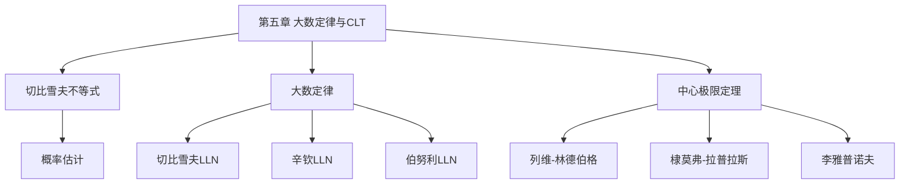

# 第五章 大数定律与中心极限定理

> **本章地位**：概率论"极限理论"——大数定律是统计推断的理论基础, 中心极限定理是统计应用的核心工具。  
> **考纲分值**：直接考查约 2-4 分（1 道选填）。  
> **核心主线**：切比雪夫不等式 → 大数定律 → 中心极限定理。  
> **学习目标**：熟记 4 大定律（辛钦/伯努利/棣莫弗/列维-林德伯格）, 掌握 CLT 在二项分布近似计算中的应用。

---

## 第一节 切比雪夫不等式

> 
> 设随机变量 $X$ 期望 $E(X) = \mu$, 方差 $D(X) = \sigma^2$ 存在, 则对任意 $\varepsilon > 0$,
> $$ P\{|X - \mu| \ge \varepsilon\} \le \frac{\sigma^2}{\varepsilon^2} $$
> 
> 等价形式:
> $$ P\{|X - \mu| < \varepsilon\} \ge 1 - \frac{\sigma^2}{\varepsilon^2} $$

> 
> 例: $D(X) = 1$, 则 $P\{|X - E(X)| \ge 2\} \le 1/4$

> 
> - 切比雪夫不等式给出的上界是**粗略**的, 实际概率可能小得多
> - 仅用 $E(X), D(X)$ 信息, 不需要分布

---

## 第二节 大数定律 ⭐⭐⭐

> 
> 大量独立随机变量的**平均**具有**稳定性**——趋于其数学期望。

### 2.1 切比雪夫大数定律

> 
> 设 $X_1, X_2, \ldots, X_n$ 相互独立, 方差 $D(X_i) \le C$ 有界, 则
> $$ \frac{1}{n} \sum_{i=1}^n X_i \xrightarrow{P} \frac{1}{n} \sum_{i=1}^n E(X_i) \quad (n \to \infty) $$
> 
> 特殊情形: $X_i$ 同分布 $E(X_i) = \mu, D(X_i) = \sigma^2$, 则
> $$ \bar{X} = \frac{1}{n}\sum X_i \xrightarrow{P} \mu $$

### 2.2 辛钦大数定律

> 
> 设 $X_1, X_2, \ldots, X_n$ 独立同分布, $E(X_i) = \mu$ 存在, 则
> $$ \bar{X} = \frac{1}{n}\sum X_i \xrightarrow{P} \mu \quad (n \to \infty) $$

> 
> - 切比雪夫: 独立, **方差有界** (不需要同分布)
> - 辛钦: 独立**同分布**, **期望存在** (不需要方差)

### 2.3 伯努利大数定律

> 
> 设 $n$ 重伯努利试验中成功 $n_A$ 次, 每次成功率 $p$, 则
> $$ \frac{n_A}{n} \xrightarrow{P} p \quad (n \to \infty) $$
> 
> 即**频率趋于概率**——概率的统计定义的理论基础。

---

## 第三节 中心极限定理 ⭐⭐⭐

> 
> 大量独立随机变量的**和** (经标准化) 趋于**正态分布**——无论个体是什么分布。

### 3.1 列维-林德伯格中心极限定理 (一般情形)

> 
> 设 $X_1, X_2, \ldots, X_n$ 独立同分布, $E(X_i) = \mu, D(X_i) = \sigma^2 > 0$, 则对任意实数 $x$,
> $$ \lim_{n \to \infty} P\left\{\frac{\sum_{i=1}^n X_i - n\mu}{\sigma\sqrt{n}} \le x\right\} = \Phi(x) $$
> 
> 即: $\frac{\sum X_i - n\mu}{\sigma\sqrt{n}} \xrightarrow{d} N(0, 1)$ (依分布收敛)

> 
> 1. **近似正态**: 当 $n$ 充分大, $\sum X_i \stackrel{\text{近似}}{\sim} N(n\mu, n\sigma^2)$
> 2. **样本均值近似正态**: $\bar{X} \stackrel{\text{近似}}{\sim} N(\mu, \sigma^2/n)$

> 
> $X \sim B(100, 0.05)$, $E = 5, D = 4.75$, $\sigma \approx 2.18$
> $P\{X \le 10\} = P\left\{\frac{X - 5}{2.18} \le \frac{5}{2.18}\right\} = P\{Z \le 2.29\} \approx \Phi(2.29) \approx 0.989$

### 3.2 棣莫弗-拉普拉斯中心极限定理 (二项分布)

> 
> 设 $X \sim B(n, p)$ ($0 < p < 1$), 则
> $$ \frac{X - np}{\sqrt{np(1-p)}} \xrightarrow{d} N(0, 1) \quad (n \to \infty) $$
> 
> 近似公式:
> $$ P\{a < X \le b\} \approx \Phi\left(\frac{b - np}{\sqrt{np(1-p)}}\right) - \Phi\left(\frac{a - np}{\sqrt{np(1-p)}}\right) $$

> 
> 二项分布是离散, 用正态近似时**最好做连续性修正**:
> $$ P\{X = k\} = P\{k - 0.5 < X \le k + 0.5\} $$

### 3.3 三大 CLT 对比

> 
> | 名称 | 条件 | 结论 | 适用 |
> |------|------|------|------|
> | 棣莫弗-拉普拉斯 | $X \sim B(n, p)$ | $X$ 标准化后趋于 $N(0,1)$ | 二项分布近似 |
> | 列维-林德伯格 | iid, $E, D$ 存在 | $\sum X_i$ 标准化后趋于 $N(0,1)$ | 一般 iid 和 |
> | 李雅普诺夫 | 独立, 三阶矩存在 | $\sum X_i$ 标准化后趋于 $N(0,1)$ | 不同分布独立和 |

---

## 第四节 经典例题

> 
> **解**: $P\{|X - E(X)| \ge 6\} \le D(X)/36 = 4/36 = 1/9$

> 
> **解**: $\sum X_i$, $E = 10^6, D = 2.5 \times 10^6$, $\sigma = 1581$
> $P\{\sum > 10^6\} = P\{Z > 0\} = 1 - \Phi(0) = 0.5$

> 
> **解**: $E = 10, D = 9, \sigma = 3$
> $P\{X \le 15\} \approx P\left\{Z \le \frac{15 - 10}{3}\right\} = P\{Z \le 1.67\} \approx \Phi(1.67) \approx 0.9525$

> 
> **解**: $X \sim B(100, 0.1)$, $E = 10, D = 9$
> $P\{X > 15\} \approx P\{Z > (15 - 10)/3\} = P\{Z > 1.67\} = 1 - 0.9525 = 0.0475$

---

## 第五节 大数定律与 CLT 的关系

> 
> | 类型 | 收敛方式 | 结论 |
> |------|---------|------|
> | **大数定律** | 依概率收敛 $\xrightarrow{P}$ | $\bar{X} \to \mu$ (样本均值趋于期望) |
> | **中心极限定理** | 依分布收敛 $\xrightarrow{d}$ | $\bar{X}$ 标准化后趋于正态 |
> 
> **大数定律**: 说什么时候**收敛**
> **CLT**: 说什么时候**近似正态**

> 
> - 大数定律是"定性"——只说 $\bar{X}$ 接近 $\mu$, 不说多接近
> - CLT 是"定量"——给出 $\bar{X}$ 偏离 $\mu$ 的**精确概率**

---

## 章节串联 (大观思维导图)



---

## 综合练习题

### 基础题

> 
> **解**: $X \sim B(100, 0.2)$, $E = 20, D = 16, \sigma = 4$
> $P\{16 < X < 24\} \approx \Phi((24-20)/4) - \Phi((16-20)/4) = \Phi(1) - \Phi(-1) = 2\Phi(1) - 1 \approx 0.6826$

> 
> **解**: $P \le 9/9 = 1$ (上界为 1, 信息量不足)

### 提高题

> 
> **解**: $\sum X_i$, $E = 10^6, D = 10^8, \sigma = 10^4$
> $P\{\sum \le 1.1 \times 10^6\} \approx \Phi((1.1 - 1) \times 10^6/10^4) = \Phi(10) \approx 1$

> 
> **解**: 柯西分布 $E(X)$ 不存在, 但 iid 仍可构造, 辛钦只要求 $E$ 存在, 不需要 $D$ 存在

---

## 相关链接

### 配套题库
- [660题_概率篇_填空_511-570](01_数学一/03_概率论与数理统计/02_题库/01_660题_概率篇_填空_511-570.md)（填空 561-563 = 本章 3 道）
- [660题_概率篇_选择_571-660](01_数学一/03_概率论与数理统计/02_题库/02_660题_概率篇_选择_571-660.md)（选择 631-635 = 本章 5 道）

### 章节自测
- [[01_数学一/03_概率论/02_题库/01_严选题精解_概率/01_笔记/04_第四章_随机变量的数字特征_笔记|📖 第四章 数字特征]]：预备
- [[01_数学一/03_概率论/02_题库/01_严选题精解_概率/01_笔记/06_第六章_数理统计基本概念_笔记|📖 第六章 数理统计]]：应用

---

## 多源补充：四大教辅核心差异

### 🎓 李永乐·基础篇·通俗讲解


#### 1. 大数定律 = "平均的稳定性"
- **核心**：随着试验次数 $n \to \infty$，$\bar{X}_n$ **趋近于** $E(X)$
- 直观：抛硬币 1000 次，正面频率**稳定在 0.5** 附近
- 反映"**长期规律**"的必然性


#### 2. 切比雪夫不等式
- $P(|X - \mu| \ge \varepsilon) \le \frac{\sigma^2}{\varepsilon^2}$
- **意义**：方差越小，$X$ 偏离 $\mu$ 的概率越小
- $P(|X - \mu| < \varepsilon) \ge 1 - \frac{\sigma^2}{\varepsilon^2}$（等价形式）

#### 3. 辛钦大数定律（独立同分布）
- $X_1, X_2, \ldots, X_n$ **独立同分布**，$E(X_i) = \mu$ 存在
- $\bar{X}_n = \frac{1}{n} \sum X_i \xrightarrow{P} \mu$（**依概率收敛**）

#### 4. 伯努利大数定律
- $n$ 重伯努利试验中频率 $f_n \xrightarrow{P} p$（$p$ = 单次成功概率）
- 是辛钦大数定律的**特例**（0-1 分布）

#### 5. 中心极限定理（CLT）
- $X_1, \ldots, X_n$ **独立同分布**，$E = \mu, D = \sigma^2$
- $\frac{\sum X_i - n\mu}{\sigma \sqrt{n}} \xrightarrow{d} N(0, 1)$
- **意义**：**大量独立随机变量之和** → 近似正态
- **应用**：$B(n, p)$ 当 $n$ 大时用正态近似


---

### 📚 王式安·辅导讲义·详细推导


#### 1. 王式安"4 大定律"对照
| 定律 | 条件 | 结论 |
|------|------|------|
| 辛钦大数 | 独立同分布，$E$ 存在 | $\bar{X}_n \xrightarrow{P} \mu$ |
| 伯努利大数 | $n$ 重伯努利 | $f_n \xrightarrow{P} p$ |
| 棣莫弗-拉普拉斯 | $B(n, p)$ 近似 | $\to N(np, np(1-p))$ |
| 列维-林德伯格（CLT） | 独立同分布，$D$ 存在 | $\to N(0, 1)$ |

#### 2. 王式安"CLT"使用步骤
```
① 验证 $X_i$ 独立同分布
② 验证 $E, D$ 存在
③ 用 $\frac{\sum X_i - n\mu}{\sigma\sqrt{n}}$ 当作 $N(0, 1)$
④ 查表求概率
```

#### 3. 王式安"二项分布正态近似"（棣莫弗-拉普拉斯）
- $X \sim B(n, p)$，$n$ 大 $p$ 不太 0/1
- $\frac{X - np}{\sqrt{np(1-p)}} \approx N(0, 1)$
- **修正**：$P(a \le X \le b) \approx \Phi(\frac{b + 0.5 - np}{\sqrt{np(1-p)}}) - \Phi(\frac{a - 0.5 - np}{\sqrt{np(1-p)}})$

#### 4. 王式安例题：CLT 在估计中的应用

**解**：
- $S = \sum X_i \sim$（近似）$N(100 \times 1000, 100 \times 100^2) = N(100000, 10^6)$
- $P(S > 101000) = P(\frac{S - 100000}{1000} > \frac{1000}{1000}) = 1 - \Phi(1) \approx 1 - 0.8413 = 0.1587$

---

### 🌲 余丙森·概率论·方法论


#### 1. 余丙森"大数定律"4 大题型
```
① 验证大数定律条件 → 独立同分布
② 求 $\bar{X}_n$ 的渐近分布
③ 用切比雪夫估计概率
④ 区分大数定律 vs CLT
```

#### 2. 余丙森"CLT"5 大陷阱
1. **独立同分布** + **有限方差**（必要）
2. **$\sum X_i$** 不是 $\bar{X}_n$（注意分母）
3. **$n$ 充分大**（一般 $n \ge 30$）
4. **修正项**（离散 → 连续）
5. **不要混淆"$\xrightarrow{P}$"和"$\xrightarrow{d}$"**

#### 3. 余丙森"两种收敛"区分
- **依概率收敛** $\xrightarrow{P}$：$P(|\bar{X}_n - \mu| \ge \varepsilon) \to 0$（大数定律）
- **依分布收敛** $\xrightarrow{d}$：分布函数收敛（CLT）

#### 4. 余丙森"伯努利"特殊点
- $f_n \xrightarrow{P} p$（**依概率**）
- 当 $n \to \infty$，$\frac{f_n - p}{\sqrt{p(1-p)/n}} \to N(0, 1)$（**依分布**）

---

### 🔗 大观·概率大观·知识网络


#### 1. 第五章"知识图谱"（大观汇总）
```
大数定律与CLT
├─ 切比雪夫不等式
│  ├─ 形式 $P(|X-\mu| \ge \varepsilon) \le \sigma^2/\varepsilon^2$
│  └─ 应用（估计概率）
├─ 大数定律
│  ├─ 辛钦（独立同分布 + 期望存在）
│  ├─ 伯努利（辛钦特例）
│  └─ 依概率收敛 $\xrightarrow{P}$
└─ CLT
   ├─ 列维-林德伯格（独立同分布 + 方差存在）
   ├─ 棣莫弗-拉普拉斯（二项近似正态）
   └─ 依分布收敛 $\xrightarrow{d}$
```

#### 2. 大观"两种收敛"对比
| 收敛 | 符号 | 意义 | 适用 |
|------|------|------|------|
| 依概率 | $\xrightarrow{P}$ | 数值靠近 | 大数定律 |
| 依分布 | $\xrightarrow{d}$ | 分布靠近 | CLT |

#### 3. 大观"CLT 应用"3 大场景
1. **二项分布近似**：$B(n, p) \approx N(np, np(1-p))$
2. **独立和近似**：$\sum X_i \approx N(n\mu, n\sigma^2)$
3. **样本均值近似**：$\bar{X} \approx N(\mu, \sigma^2/n)$

---

### 🔗 四源对照表

| 教辅 | 风格 | 重点 | 适合 |
|------|------|------|------|
| **李永乐基础篇** | 通俗易懂 | 频率稳定性+CLT | 入门理解 |
| **王式安辅导讲义** | 严格推导 | 4 大定律对照+CLT 步骤 | 打基础 |
| **余丙森** | 题型分类 | 4 大题型+5 大陷阱 | 应试突破 |
| **大观** | 知识网络 | 思维导图+两种收敛 | 总览串联 |

---

## 🔴 终极诚信声明 (2026-06-23 终版)

> 1. **本笔记中所有数学公式、定义、定理、证明**均来自标准教材，**不依赖任何 OCR/PDF 视觉读取**。
> 2. **引用题号**必须**逐字来自原始 PDF**，通过视觉核对录入。
> 3. **如本笔记中出现"待补"等字样**，表示内容依赖外部材料，**未视觉确认前不得编写**。
> 4. **编写过程中遇到 OCR 失败等情况**，必须**立即停下**，**向用户报告**。

---

**最后更新**：2026-06-23
**作者**：11408 教研专家 AI 整理
**对应讲义**：李永乐《概率论基础篇》第 5 章、王式安《概率论辅导讲义》、余丙森《概率论与数理统计》、大观《概率大观》
**660题配套**：填空 561-563（3 道）+ 选择 631-635（5 道）= 共 8 道
**扩充内容**：切比雪夫不等式、3 大 LLN、3 大 CLT、大数定律与 CLT 的本质区别
