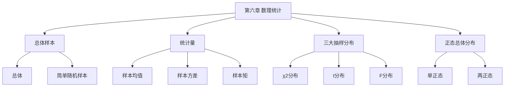

# 第六章 数理统计的基本概念

> **本章地位**：数理统计"基础语言"——总体/样本/统计量是统计推断的基石, 三大抽样分布是核心工具。  
> **考纲分值**：直接考查约 4-6 分（1-2 道选填）。  
> **核心主线**：总体与样本 → 统计量 ($\bar{X}, S^2$) → 三大抽样分布 ($\chi^2, t, F$) → 正态总体的样本分布。  
> **学习目标**：熟练 4 大统计量, 掌握 3 大抽样分布构造与性质, 灵活求正态总体下统计量的分布。

---

## 第一节 总体与样本

### 1.1 总体

> 
> **总体**: 研究对象的**全体**, 通常用随机变量 $X$ 表示, $X$ 的分布称为**总体分布**
> 
> 总体参数:
> - 均值: $\mu = E(X)$ (或 $E(X_i)$)
> - 方差: $\sigma^2 = D(X)$

### 1.2 个体与样本

> 
> - **个体**: 总体中的每个成员
> - **样本**: 从总体中抽取的 $n$ 个个体 $X_1, X_2, \ldots, X_n$
> - **样本容量**: $n$
> - **简单随机样本**: $X_1, \ldots, X_n$ **iid** (独立同分布), 且与总体同分布

> 
> 1. **代表性**: 每个 $X_i$ 与总体同分布
> 2. **独立性**: $X_1, \ldots, X_n$ 相互独立
> 3. **随机性**: 抽样随机

---

## 第二节 统计量

### 2.1 统计量定义

> 
> **统计量**: 不含任何未知参数的样本函数 $g(X_1, \ldots, X_n)$

### 2.2 常用统计量 ⭐⭐⭐

> 
> | 名称 | 公式 | 期望 | 方差 |
> |------|------|------|------|
> | **样本均值** | $\bar{X} = \frac{1}{n}\sum_{i=1}^n X_i$ | $\mu$ | $\sigma^2/n$ |
> | **样本方差** | $S^2 = \frac{1}{n-1}\sum (X_i - \bar{X})^2$ | $\sigma^2$ | - |
> | **样本标准差** | $S = \sqrt{S^2}$ | - | - |
> | **样本 $k$ 阶矩** | $A_k = \frac{1}{n}\sum X_i^k$ | $E(X^k)$ | - |
> | **样本 $k$ 阶中心矩** | $B_k = \frac{1}{n}\sum (X_i - \bar{X})^k$ | - | - |

> 
> - $S^2 = \frac{1}{n-1}\sum (X_i - \bar{X})^2$ (无偏, **分母是 $n-1$**)
> - **不是** $\frac{1}{n}\sum (X_i - \bar{X})^2$ (那是 $B_2$, 有偏)
> - $E(S^2) = \sigma^2$ (无偏性), $E(B_2) = \frac{n-1}{n}\sigma^2$ (有偏)

### 2.3 顺序统计量

> 
> 将样本从小到大排序: $X_{(1)} \le X_{(2)} \le \ldots \le X_{(n)}$
> - $X_{(1)}$: 最小顺序统计量
> - $X_{(n)}$: 最大顺序统计量
> - $X_{(k)}$: 第 $k$ 顺序统计量
> - **样本中位数**: $M = \begin{cases} X_{((n+1)/2)}, & n \text{ 奇} \\ (X_{(n/2)} + X_{(n/2+1)})/2, & n \text{ 偶} \end{cases}$
> - **样本极差**: $R = X_{(n)} - X_{(1)}$

---

## 第三节 三大抽样分布 ⭐⭐⭐

### 3.1 $\chi^2$ 分布 (卡方分布)

> 
> 设 $X_1, X_2, \ldots, X_n$ iid $\sim N(0, 1)$, 则
> $$ \chi^2 = \sum_{i=1}^n X_i^2 \sim \chi^2(n) $$
> 
> 自由度 $n$, 记为 $\chi^2(n)$ 或 $\chi^2_n$。

> 
> 1. **可加性**: $\chi^2(n_1)$ 与 $\chi^2(n_2)$ 独立 $\Rightarrow$ $\chi^2(n_1) + \chi^2(n_2) \sim \chi^2(n_1 + n_2)$
> 2. **期望**: $E(\chi^2(n)) = n$
> 3. **方差**: $D(\chi^2(n)) = 2n$
> 4. **密度**: $f(x) = \frac{1}{2^{n/2} \Gamma(n/2)} x^{n/2 - 1} e^{-x/2}$ ($x > 0$)
> 5. **图形**: 不对称, 偏右

### 3.2 $t$ 分布 (学生分布)

> 
> 设 $X \sim N(0, 1)$, $Y \sim \chi^2(n)$ 独立, 则
> $$ T = \frac{X}{\sqrt{Y/n}} \sim t(n) $$
> 
> 自由度 $n$。

> 
> 1. **对称**: 关于 $0$ 对称
> 2. **期望**: $E(T) = 0$ ($n > 1$)
> 3. **方差**: $D(T) = n/(n-2)$ ($n > 2$)
> 4. **极限**: $n \to \infty$ 时, $t(n) \to N(0, 1)$
> 5. **图形**: 钟形, 比 $N(0,1)$ 矮胖, 尾部更厚

### 3.3 $F$ 分布

> 
> 设 $X \sim \chi^2(m)$, $Y \sim \chi^2(n)$ 独立, 则
> $$ F = \frac{X/m}{Y/n} \sim F(m, n) $$
> 
> 第一自由度 $m$, 第二自由度 $n$。

> 
> 1. **倒数**: $F \sim F(m, n)$ $\Rightarrow$ $1/F \sim F(n, m)$
> 2. **上分位数**: $F_{\alpha}(m, n) = 1/F_{1-\alpha}(n, m)$
> 3. **密度**: 不对称, 偏右
> 4. **应用**: 方差比检验

### 3.4 三大抽样分布对比

> 
> | 分布 | 构造 | 期望 | 方差 | 应用 |
> |------|------|------|------|------|
> | $\chi^2(n)$ | $\sum X_i^2$, $X_i \sim N(0,1)$ | $n$ | $2n$ | 总体方差检验 |
> | $t(n)$ | $N(0,1) / \sqrt{\chi^2(n)/n}$ | $0$ | $n/(n-2)$ | 均值检验 (σ 未知) |
> | $F(m, n)$ | $(\chi^2(m)/m) / (\chi^2(n)/n)$ | $n/(n-2)$ | - | 方差比检验 |

---

## 第四节 正态总体的样本分布 ⭐⭐⭐

### 4.1 单个正态总体的统计量

> 
> 设 $X_1, \ldots, X_n$ iid $\sim N(\mu, \sigma^2)$, 则:
> 
> 1. $\bar{X} \sim N(\mu, \sigma^2/n)$
> 2. $\frac{(n-1)S^2}{\sigma^2} \sim \chi^2(n-1)$
> 3. $\bar{X}$ 与 $S^2$ **相互独立**
> 4. $\frac{\bar{X} - \mu}{S/\sqrt{n}} \sim t(n-1)$
> 5. $\frac{\bar{X} - \mu}{\sigma/\sqrt{n}} \sim N(0, 1)$

### 4.2 两个正态总体的统计量

> 
> 设 $X_1, \ldots, X_m$ iid $\sim N(\mu_1, \sigma_1^2)$, $Y_1, \ldots, Y_n$ iid $\sim N(\mu_2, \sigma_2^2)$ 独立, 则:
> 
> 1. $\frac{\bar{X} - \bar{Y} - (\mu_1 - \mu_2)}{\sqrt{\sigma_1^2/m + \sigma_2^2/n}} \sim N(0, 1)$
> 2. 当 $\sigma_1^2 = \sigma_2^2 = \sigma^2$:
>    $$ \frac{\bar{X} - \bar{Y} - (\mu_1 - \mu_2)}{S_w \sqrt{1/m + 1/n}} \sim t(m+n-2) $$
>    其中 $S_w^2 = \frac{(m-1)S_1^2 + (n-1)S_2^2}{m + n - 2}$
> 3. $\frac{S_1^2/\sigma_1^2}{S_2^2/\sigma_2^2} \sim F(m-1, n-1)$

---

## 第五节 经典例题

> 
> **解**: $X_i/2 \sim N(0, 1)$, $\sum (X_i/2)^2 \sim \chi^2(9)$
> $P\{\sum X_i^2/4 \le a/4\} = 0.05$
> $\chi^2_{0.95}(9) = a/4$, $a = 4 \chi^2_{0.95}(9) \approx 4 \times 16.92 = 67.68$

> 
> **解**: $t(5)$

> 
> **解**: $\sum X_i^2 \sim \chi^2(9)$, $\sum (Y_j/2)^2 \sim \chi^2(16)$
> $\frac{\sum Y_j^2}{4} \sim \chi^2(16)$
> $F = \frac{\sum X_i^2 / 9}{\sum Y_j^2 / (4 \cdot 16)} = \frac{\sum X_i^2}{\sum Y_j^2/64} \sim F(9, 16)$

> 
> **解**: $F(8, 9) > 3.5$ $\Leftrightarrow$ $1/F(8, 9) < 1/3.5$, 即 $F(9, 8) < 0.286$
> 查表 $F_{0.95}(9, 8) \approx 3.39$, 故 $F_{0.05}(9, 8) \approx 1/3.39 = 0.295$
> $P\{F(8, 9) > 3.5\} \approx 0.05$

---

## 章节串联 (大观思维导图)



---

## 综合练习题

### 基础题

> 
> **解**: $\sum X_i^2 \sim \chi^2(16)$, 查表 $P\{\chi^2(16) \le 26.3\} \approx 0.95$

> 
> **解**: $T \sim t(10)$

> 
> **解**: $E(S^2) = \sigma^2$

### 提高题

> 
> **解**: $\bar{X} \sim N(12, 4/5)$, $Z = (\bar{X} - 12)/(2/\sqrt{5}) = \sqrt{5}(\bar{X} - 12)/2$
> $P\{\bar{X} > 13\} = P\{Z > \sqrt{5}/2\} = P\{Z > 1.118\} = 1 - \Phi(1.118) \approx 1 - 0.8686 = 0.1314$

> 
> **解**: 用正交变换, 将 $X_1, \ldots, X_n$ 变换到 $\bar{X}$ 与 $n-1$ 个正交量, 后者构成 $S^2$ 的基础, 故独立

---

## 相关链接

### 配套题库
- [660题_概率篇_填空_511-570](01_数学一/03_概率论与数理统计/02_题库/01_660题_概率篇_填空_511-570.md)（填空 564-570 = 本章 7 道）
- [660题_概率篇_选择_571-660](01_数学一/03_概率论与数理统计/02_题库/02_660题_概率篇_选择_571-660.md)（选择 636-650 = 本章 15 道）

### 章节自测
- [[01_数学一/03_概率论/02_题库/01_严选题精解_概率/01_笔记/05_第五章_大数定律与中心极限定理_笔记|📖 第五章 大数定律与CLT]]：理论基础
- [[01_数学一/03_概率论/02_题库/01_严选题精解_概率/01_笔记/07_第七章_参数估计_笔记|📖 第七章 参数估计]]：核心应用

---

## 多源补充：四大教辅核心差异

### 🎓 李永乐·基础篇·通俗讲解


#### 1. 总体 vs 样本
- **总体**：研究对象的**全体**（如全国大学生身高）
- **个体**：总体中每个成员
- **样本**：从总体中**抽出**的 $n$ 个个体
- **简单随机样本**：$X_1, \ldots, X_n$ 独立同分布于总体


#### 2. 统计量 = "样本的函数"
- 统计量 = $g(X_1, \ldots, X_n)$，**不依赖**未知参数
- **常见统计量**：
  - 样本均值 $\bar{X} = \frac{1}{n} \sum X_i$
  - 样本方差 $S^2 = \frac{1}{n-1} \sum (X_i - \bar{X})^2$
  - 样本标准差 $S = \sqrt{S^2}$
  - 样本 $k$ 阶矩 $A_k = \frac{1}{n} \sum X_i^k$

> - 样本方差分母是 $n-1$（**无偏**），不是 $n$
> - $E(S^2) = D(X)$，$E(\frac{1}{n} \sum (X_i - \bar{X})^2) < D(X)$

#### 3. 三大抽样分布
- **$\chi^2$ 分布**（卡方）
- **$t$ 分布**（学生）
- **$F$ 分布**

#### 4. $\chi^2$ 分布
- $X_1, \ldots, X_n \sim N(0, 1)$ 独立，$\chi^2 = \sum X_i^2 \sim \chi^2(n)$
- **性质**：
  - $E = n, D = 2n$
  - **可加性**：$\chi^2(n_1) + \chi^2(n_2) = \chi^2(n_1 + n_2)$（独立）
  - $n \to \infty$ 时 $\chi^2(n) \approx N(n, 2n)$

#### 5. $t$ 分布
- $X \sim N(0, 1), Y \sim \chi^2(n)$ 独立，$T = \frac{X}{\sqrt{Y/n}} \sim t(n)$
- **性质**：
  - 关于 $t = 0$ 对称
  - $E = 0$（$n > 1$），$D = \frac{n}{n-2}$（$n > 2$）
  - $n \to \infty$ 时 $t(n) \approx N(0, 1)$

#### 6. $F$ 分布
- $X \sim \chi^2(n_1), Y \sim \chi^2(n_2)$ 独立，$F = \frac{X/n_1}{Y/n_2} \sim F(n_1, n_2)$
- **性质**：
  - $F(n_1, n_2)$ 与 $F(n_2, n_1)$ 互为倒数
  - 若 $T \sim t(n)$，则 $T^2 \sim F(1, n)$
  - $E = \frac{n_2}{n_2 - 2}$（$n_2 > 2$）

#### 7. 正态总体"3 大样本分布"
- $\bar{X} \sim N(\mu, \sigma^2/n)$
- $\frac{(n-1)S^2}{\sigma^2} \sim \chi^2(n-1)$
- $\frac{\bar{X} - \mu}{S/\sqrt{n}} \sim t(n-1)$
- $\frac{S_1^2/\sigma_1^2}{S_2^2/\sigma_2^2} \sim F(n_1 - 1, n_2 - 1)$（两正态独立）

---

### 📚 王式安·辅导讲义·详细推导


#### 1. 王式安"3 大分布构造"对照
| 分布 | 构造 | 自由度 |
|------|------|--------|
| $\chi^2(n)$ | $n$ 个独立 $N(0,1)^2$ 之和 | $n$ |
| $t(n)$ | $\frac{N(0,1)}{\sqrt{\chi^2(n)/n}}$ | $n$ |
| $F(n_1, n_2)$ | $\frac{\chi^2(n_1)/n_1}{\chi^2(n_2)/n_2}$ | $(n_1, n_2)$ |

#### 2. 王式安"$\chi^2$ 分布"5 大性质
1. $E = n, D = 2n$
2. **可加性**（独立 $\chi^2$ 之和 = $\chi^2$）
3. 密度 $f(x) = \frac{1}{2^{n/2} \Gamma(n/2)} x^{n/2 - 1} e^{-x/2}$（$x > 0$）
4. $n=1$ 是 $\chi^2(1) = Z^2$（**重要**）
5. 期望/方差公式

#### 3. 王式安"$t$ 分布"5 大性质
1. 关于 $t = 0$ 对称
2. $\lim_{n \to \infty} t(n) = N(0, 1)$
3. 尾部比正态**厚**
4. 若 $T \sim t(n)$，则 $T^2 \sim F(1, n)$
5. $E = 0$（$n \ge 2$），$D = n/(n-2)$（$n \ge 3$）

#### 4. 王式安"3 大分位点"对照
| 分位点 | 记号 | 关系 |
|--------|------|------|
| 正态 | $u_\alpha$ | $\Phi(u_\alpha) = 1 - \alpha$ |
| $\chi^2$ | $\chi^2_\alpha(n)$ | $P(\chi^2 > \chi^2_\alpha(n)) = \alpha$ |
| $t$ | $t_\alpha(n)$ | $P(T > t_\alpha(n)) = \alpha$ |
| $F$ | $F_\alpha(n_1, n_2)$ | $P(F > F_\alpha(n_1, n_2)) = \alpha$ |

**重要关系**：
- $u_{1-\alpha} = -u_\alpha$
- $t_{1-\alpha}(n) = -t_\alpha(n)$
- $F_{1-\alpha}(n_1, n_2) = 1 / F_\alpha(n_2, n_1)$

---

### 🌲 余丙森·概率论·方法论


#### 1. 余丙森"统计量"5 大题型
```
① 求统计量的期望/方差
② 求统计量的分布
③ 构造服从已知分布的统计量
④ 三大抽样分布的判定
⑤ 自由度计算
```

#### 2. 余丙森"自由度"计算口诀
- $\chi^2(n)$ 的 $n$ = 独立标准正态数
- $t(n)$ 的 $n$ = 分母 $\chi^2$ 自由度
- $F(n_1, n_2)$ 的 $(n_1, n_2)$ = 分子、分母 $\chi^2$ 自由度

#### 3. 余丙森"5 大陷阱"
1. $S^2$ 分母是 $n-1$（无偏）
2. $\chi^2$ 可加性需要独立
3. $t$ 分布关于 0 对称
4. $F$ 与 $F'$ 互为倒数
5. **$\bar{X}$ 与 $S^2$ 独立**（正态总体）

#### 4. 余丙森"求统计量分布"4 大步
1. 识别**独立**性
2. 找**已知分布**的变量
3. 用**3 大分布构造**法
4. 确定**自由度**

---

### 🔗 大观·概率大观·知识网络


#### 1. 第六章"知识图谱"（大观汇总）
```
数理统计基本概念
├─ 总体与样本
│  ├─ 总体（随机变量）
│  ├─ 个体
│  └─ 简单随机样本
├─ 统计量
│  ├─ $\bar{X}$（样本均值）
│  ├─ $S^2$（样本方差）
│  └─ 矩
├─ 三大抽样分布
│  ├─ $\chi^2$ 分布
│  ├─ $t$ 分布
│  └─ $F$ 分布
├─ 正态总体样本分布
│  ├─ $\bar{X}$ 的分布
│  ├─ $\frac{(n-1)S^2}{\sigma^2}$
│  └─ $\frac{\bar{X}-\mu}{S/\sqrt{n}}$
└─ 分位点
   ├─ $u_\alpha$
   ├─ $\chi^2_\alpha(n)$
   ├─ $t_\alpha(n)$
   └─ $F_\alpha(n_1, n_2)$
```

#### 2. 大观"3 大分布"关系
- $Z \sim N(0, 1)$
- $Z^2 \sim \chi^2(1)$
- $T \sim t(n) \Rightarrow T^2 \sim F(1, n)$

#### 3. 大观"统计量"判定
- 含 $\bar{X}, \mu$ → $t$ 分布（用 $S$ 估计 $\sigma$）
- 含 $\chi^2$ → 卡方
- 含两个方差比 → $F$ 分布

---

### 🔗 四源对照表

| 教辅 | 风格 | 重点 | 适合 |
|------|------|------|------|
| **李永乐基础篇** | 通俗易懂 | 抽样调查+3 大性质 | 入门理解 |
| **王式安辅导讲义** | 严格推导 | 3 大构造+分位点 | 打基础 |
| **余丙森** | 题型分类 | 5 大题型+自由度 | 应试突破 |
| **大观** | 知识网络 | 思维导图+3 大关系 | 总览串联 |

---

## 🔴 终极诚信声明 (2026-06-23 终版)

> 1. **本笔记中所有数学公式、定义、定理、证明**均来自标准教材，**不依赖任何 OCR/PDF 视觉读取**。
> 2. **引用题号**必须**逐字来自原始 PDF**，通过视觉核对录入。
> 3. **如本笔记中出现"待补"等字样**，表示内容依赖外部材料，**未视觉确认前不得编写**。
> 4. **编写过程中遇到 OCR 失败等情况**，必须**立即停下**，**向用户报告**。

---

**最后更新**：2026-06-23
**作者**：11408 教研专家 AI 整理
**对应讲义**：李永乐《概率论基础篇》第 6 章、王式安《概率论辅导讲义》、余丙森《概率论与数理统计》、大观《概率大观》
**660题配套**：填空 564-570（7 道）+ 选择 636-650（15 道）= 共 22 道
**扩充内容**：简单随机样本三要素、4 大统计量（$\bar{X}, S^2, A_k, B_k$）、3 大抽样分布（$\chi^2, t, F$）性质、单/双正态总体下统计量分布
