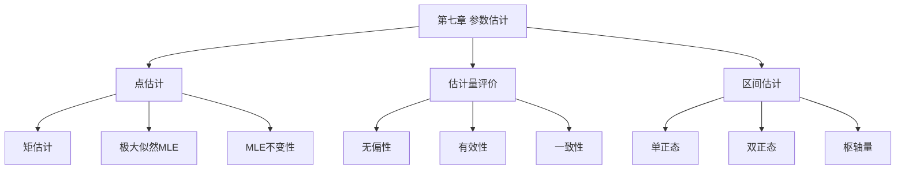

# 第七章 参数估计

> **本章地位**：数理统计"核心应用"——参数估计是统计推断的核心, 矩估计和 MLE 是两大基础方法, 评价估计的三性是重要考点。  
> **考纲分值**：直接考查约 6-10 分（1 道大题必考 + 1-2 道选填）。  
> **核心主线**：点估计 (矩估计/MLE) → 估计量评价 (无偏/有效/一致) → 区间估计 (置信区间)。  
> **学习目标**：熟练 2 大点估计法 (尤其 MLE), 掌握 3 大评价标准, 灵活求正态总体的置信区间。

---

## 第一节 点估计

### 1.1 点估计定义

> 
> 设总体 $X$ 分布含未知参数 $\theta$, 用样本 $X_1, \ldots, X_n$ 构造统计量 $\hat{\theta} = g(X_1, \ldots, X_n)$ 来**估计** $\theta$, 称 $\hat{\theta}$ 为 $\theta$ 的**点估计量** (估计值)。

### 1.2 矩估计法 ⭐⭐⭐

> 
> 用**样本矩** = **总体矩**, 解方程得 $\hat{\theta}$。

> 
> 1. 求总体 $k$ 阶原点矩 $\alpha_k(\theta) = E(X^k)$, $k = 1, 2, \ldots$
> 2. 求样本 $k$ 阶原点矩 $A_k = \frac{1}{n}\sum X_i^k$
> 3. 列方程: $\alpha_k(\theta) = A_k$
> 4. 解出 $\hat{\theta}$

> 
> $E(X) = \lambda$, 令 $E(X) = \bar{X}$, $\hat{\lambda} = \bar{X}$

> 
> $E(X) = \theta/2$, 令 $E(X) = \bar{X}$, $\hat{\theta} = 2\bar{X}$

> 
> $E(X) = \mu, E(X^2) = \mu^2 + \sigma^2$
> $\hat{\mu} = \bar{X}$
> $\hat{\mu}^2 + \hat{\sigma}^2 = A_2 = \frac{1}{n}\sum X_i^2$
> $\hat{\sigma}^2 = A_2 - \bar{X}^2 = \frac{1}{n}\sum (X_i - \bar{X})^2 = B_2$ (注意不是 $S^2$!)

> 
> - 矩估计: $\hat{\sigma}^2 = B_2 = \frac{1}{n}\sum (X_i - \bar{X})^2$ (有偏)
> - 无偏估计: $S^2 = \frac{1}{n-1}\sum (X_i - \bar{X})^2$ (无偏)

### 1.3 极大似然估计 (MLE) ⭐⭐⭐

> 
> 找出使**样本出现概率最大**的参数值, 即
> $$ \hat{\theta} = \arg\max_{\theta} L(\theta) $$
> 
> 其中 $L(\theta)$ 为**似然函数**。

> 
> - **离散型**: $L(\theta) = \prod_{i=1}^n P\{X = x_i; \theta\}$
> - **连续型**: $L(\theta) = \prod_{i=1}^n f(x_i; \theta)$

> 
> 1. 写似然函数 $L(\theta)$
> 2. 取对数: $\ln L(\theta) = \sum \ln f(x_i; \theta)$
> 3. 求导: $\frac{d \ln L}{d \theta} = 0$
> 4. 解出 $\hat{\theta}$ (驻点)
> 5. 验证是极大值点 (二阶导 < 0)

> 
> $L = \prod \frac{\lambda^{x_i} e^{-\lambda}}{x_i!} = e^{-n\lambda} \lambda^{\sum x_i} / \prod x_i!$
> $\ln L = -n\lambda + (\sum x_i) \ln \lambda - \sum \ln x_i!$
> $\frac{d \ln L}{d \lambda} = -n + \frac{\sum x_i}{\lambda} = 0$
> $\hat{\lambda} = \bar{X}$

> 
> $L = \prod \frac{1}{\sqrt{2\pi}\sigma} e^{-(x_i - \mu)^2/(2\sigma^2)}$
> $\ln L = -\frac{n}{2}\ln(2\pi) - n \ln \sigma - \frac{\sum (x_i - \mu)^2}{2\sigma^2}$
> 
> - $\frac{\partial \ln L}{\partial \mu} = \frac{\sum (x_i - \mu)}{\sigma^2} = 0$ $\Rightarrow$ $\hat{\mu} = \bar{X}$
> - $\frac{\partial \ln L}{\partial \sigma} = -\frac{n}{\sigma} + \frac{\sum (x_i - \mu)^2}{\sigma^3} = 0$ $\Rightarrow$ $\hat{\sigma}^2 = \frac{1}{n}\sum (X_i - \bar{X})^2$

> 
> $f(x; \theta) = 1/\theta$ ($0 < x < \theta$)
> $L = \theta^{-n}$ (当 $\theta \ge \max x_i$)
> 
> 要最大化 $L$, 即最小化 $\theta$, 但 $\theta \ge \max x_i$, 故 $\hat{\theta} = \max X_i = X_{(n)}$

> 
> 若 $\hat{\theta}$ 是 $\theta$ 的 MLE, $g(\theta)$ 连续, 则 $g(\hat{\theta})$ 是 $g(\theta)$ 的 MLE。
> 
> 例: $\hat{\sigma}^2$ 是 $\sigma^2$ 的 MLE, 则 $\hat{\sigma} = \sqrt{\hat{\sigma}^2}$ 是 $\sigma$ 的 MLE

---

## 第二节 估计量评价 ⭐⭐⭐

### 2.1 无偏性

> 
> 若 $E(\hat{\theta}) = \theta$ 对所有 $\theta$ 成立, 则 $\hat{\theta}$ 是 $\theta$ 的**无偏估计**。

> 
> $E(S^2) = E\left(\frac{1}{n-1}\sum (X_i - \bar{X})^2\right) = \sigma^2$ ✓
> $E(B_2) = E\left(\frac{1}{n}\sum (X_i - \bar{X})^2\right) = \frac{n-1}{n}\sigma^2$ ✗

### 2.2 有效性

> 
> 若 $\hat{\theta}_1, \hat{\theta}_2$ 都是 $\theta$ 的无偏估计, $D(\hat{\theta}_1) \le D(\hat{\theta}_2)$, 则 $\hat{\theta}_1$ 比 $\hat{\theta}_2$ **更有效**。

> 
> - $D(\hat{\mu}_1) = \sigma^2/n$
> - $D(\hat{\mu}_2) = \sigma^2 \sum c_i^2$
> - 当 $\sum c_i^2 \ge 1/n$ (Cauchy-Schwarz), $\bar{X}$ 最有效

### 2.3 一致性 (相合性)

> 
> 若 $\hat{\theta} \xrightarrow{P} \theta$ ($n \to \infty$), 则 $\hat{\theta}$ 是 $\theta$ 的**一致估计**。

> 
> | 性质 | 含义 | 评价 |
> |------|------|------|
> | 无偏性 | $E(\hat{\theta}) = \theta$ | **小样本性质** (任意 $n$) |
> | 有效性 | $D(\hat{\theta})$ 最小 | **小样本性质** (任意 $n$) |
> | 一致性 | $\hat{\theta} \xrightarrow{P} \theta$ | **大样本性质** ($n \to \infty$) |

> 
> 例: $X \sim U(0, \theta)$, 矩估计 $\hat{\theta} = 2\bar{X}$:
> - $E(\hat{\theta}) = 2 E(\bar{X}) = 2 \theta/2 = \theta$ (无偏 ✓)
> - $\hat{\theta} \xrightarrow{P} \theta$ (一致 ✓)

---

## 第三节 区间估计 ⭐⭐

### 3.1 置信区间定义

> 
> 设 $\theta$ 为总体未知参数, $[\hat{\theta}_L, \hat{\theta}_U]$ 为随机区间, 若
> $$ P\{\hat{\theta}_L \le \theta \le \hat{\theta}_U\} = 1 - \alpha $$
> 
> 则称该区间为 $\theta$ 的**置信度 $1 - \alpha$ 的置信区间**, $1 - \alpha$ 为**置信水平**。

> 
> - 置信区间是**随机**的 (因样本随机)
> - 参数 $\theta$ 是**确定的**
> - "置信度 $1 - \alpha$" 不是说该区间包含 $\theta$ 的概率为 $1 - \alpha$
> - 而是说: 重复抽样, 约 $100(1-\alpha)\%$ 的区间会包含 $\theta$

### 3.2 单正态总体的置信区间

> 
> 设 $X_1, \ldots, X_n$ iid $\sim N(\mu, \sigma^2)$:
> 
> | 参数 | 条件 | 枢轴量 | 置信区间 |
> |------|------|--------|---------|
> | $\mu$ | $\sigma^2$ 已知 | $\frac{\bar{X} - \mu}{\sigma/\sqrt{n}} \sim N(0,1)$ | $\bar{X} \pm z_{\alpha/2} \cdot \sigma/\sqrt{n}$ |
> | $\mu$ | $\sigma^2$ 未知 | $\frac{\bar{X} - \mu}{S/\sqrt{n}} \sim t(n-1)$ | $\bar{X} \pm t_{\alpha/2}(n-1) \cdot S/\sqrt{n}$ |
> | $\sigma^2$ | $\mu$ 已知 | $\sum (X_i - \mu)^2 / \sigma^2 \sim \chi^2(n)$ | $\left[\frac{\sum (X_i - \mu)^2}{\chi^2_{\alpha/2}(n)}, \frac{\sum (X_i - \mu)^2}{\chi^2_{1-\alpha/2}(n)}\right]$ |
> | $\sigma^2$ | $\mu$ 未知 | $(n-1)S^2/\sigma^2 \sim \chi^2(n-1)$ | $\left[\frac{(n-1)S^2}{\chi^2_{\alpha/2}(n-1)}, \frac{(n-1)S^2}{\chi^2_{1-\alpha/2}(n-1)}\right]$ |

> 
> 1. 找**枢轴量** $W(X_1, \ldots, X_n; \theta)$, 分布已知, 不含其他未知参数
> 2. 令 $P\{a \le W \le b\} = 1 - \alpha$
> 3. 从 $a \le W \le b$ 解出 $\hat{\theta}_L \le \theta \le \hat{\theta}_U$

### 3.3 双正态总体的置信区间

> 
> 设两组样本 iid, 独立:
> 
> | 参数 | 条件 | 置信区间 |
> |------|------|---------|
> | $\mu_1 - \mu_2$ | $\sigma_1^2, \sigma_2^2$ 已知 | $(\bar{X} - \bar{Y}) \pm z_{\alpha/2} \sqrt{\sigma_1^2/m + \sigma_2^2/n}$ |
> | $\mu_1 - \mu_2$ | $\sigma_1^2 = \sigma_2^2$ 未知 | $(\bar{X} - \bar{Y}) \pm t_{\alpha/2}(m+n-2) S_w \sqrt{1/m + 1/n}$ |
> | $\sigma_1^2/\sigma_2^2$ | - | $\left[\frac{S_1^2}{S_2^2} \cdot \frac{1}{F_{\alpha/2}(m-1, n-1)}, \frac{S_1^2}{S_2^2} \cdot \frac{1}{F_{1-\alpha/2}(m-1, n-1)}\right]$ |

---

## 第四节 经典例题

> 
> $L = p^{\sum x_i} (1-p)^{n - \sum x_i}$
> $\ln L = (\sum x_i) \ln p + (n - \sum x_i) \ln(1-p)$
> $\frac{d \ln L}{dp} = \frac{\sum x_i}{p} - \frac{n - \sum x_i}{1-p} = 0$
> $\hat{p} = \bar{X}$

> 
> $E(\bar{X}) = E(X) = \mu$ ✓
> $E(S^2) = \sigma^2$ ✓

> 
> $\bar{X} \pm z_{0.025} \sigma / \sqrt{n} = \bar{X} \pm 1.96 \sigma / \sqrt{n}$

> 
> $\ln L = -\frac{n}{2}\ln(2\pi) - n\ln\sigma - \frac{\sum x_i^2}{2\sigma^2}$
> $\frac{d \ln L}{d\sigma} = -\frac{n}{\sigma} + \frac{\sum x_i^2}{\sigma^3} = 0$
> $\hat{\sigma}^2 = \frac{1}{n}\sum X_i^2$

> 
> $E(X) = 1/\lambda$, 矩估计 $\hat{\lambda} = 1/\bar{X}$
> $L = \prod \lambda e^{-\lambda x_i} = \lambda^n e^{-\lambda \sum x_i}$
> $\ln L = n \ln \lambda - \lambda \sum x_i$, 求导 = 0: $\hat{\lambda} = 1/\bar{X}$

---

## 章节串联 (大观思维导图)



---

## 综合练习题

### 基础题

> 
> **解**: $E(X) = \theta/2 = \bar{X}$, $\hat{\theta} = 2\bar{X}$

> 
> **解**: $L = \prod C_n^{x_i} p^{x_i} (1-p)^{n-x_i}$
> $\ln L = \sum \ln C_n^{x_i} + (\sum x_i) \ln p + (n - \sum x_i / n) \ln(1-p)$
> $\frac{d}{dp} = 0$ $\Rightarrow$ $\hat{p} = \bar{X}/n$

> 
> **解**: 由辛钦大数定律, $\bar{X} \xrightarrow{P} \mu$ ✓

### 提高题

> 
> **解**:
> MLE: $\hat{\sigma}^2 = \frac{1}{n}\sum (X_i - \mu)^2$
> 置信区间: $\left[\frac{\sum (X_i - \mu)^2}{\chi^2_{\alpha/2}(n)}, \frac{\sum (X_i - \mu)^2}{\chi^2_{1-\alpha/2}(n)}\right]$

> 
> **解**: $L = \prod 1/(\theta_2 - \theta_1) = (\theta_2 - \theta_1)^{-n}$
> 似然最大化 $\Leftrightarrow$ 区间最小化
> $\hat{\theta}_1 = X_{(1)} = \min X_i, \hat{\theta}_2 = X_{(n)} = \max X_i$

---

## 相关链接

### 配套题库
- [660题_概率篇_选择_571-660](01_数学一/03_概率论与数理统计/02_题库/02_660题_概率篇_选择_571-660.md)（选择 651-655 = 本章 5 道）

### 章节自测
- [[01_数学一/03_概率论/02_题库/01_严选题精解_概率/01_笔记/06_第六章_数理统计基本概念_笔记|📖 第六章 数理统计]]：基础
- [[01_数学一/03_概率论/02_题库/01_严选题精解_概率/01_笔记/08_第八章_假设检验_笔记|📖 第八章 假设检验]]：应用

---

## 多源补充：四大教辅核心差异

### 🎓 李永乐·基础篇·通俗讲解


#### 1. 参数估计 = "用样本猜总体"
- 总体含未知参数 $\theta$（如均值 $\mu$, 方差 $\sigma^2$）
- 用样本 $X_1, \ldots, X_n$ 构造统计量 $\hat{\theta} = g(X_1, \ldots, X_n)$ 来**估计** $\theta$


#### 2. 矩估计法 ⭐⭐
- **核心思想**：用**样本矩**估计**总体矩**
- 总体 $k$ 阶矩 $\mu_k = E(X^k)$，样本 $k$ 阶矩 $A_k = \frac{1}{n} \sum X_i^k$
- 令 $A_k = \mu_k$ 解出 $\theta$

> - $E(X) = \theta / 2$
> - 令 $\bar{X} = \theta / 2$，$\hat{\theta} = 2\bar{X}$

#### 3. 最大似然估计（MLE）⭐⭐⭐
- **核心思想**：寻找 $\theta$ 使**样本出现的可能性最大**
- 似然函数 $L(\theta) = \prod_{i=1}^n f(x_i; \theta)$
- 取 $\ln L$ 求导 $= 0$

> - $L = \prod e^{-\lambda} \lambda^{x_i} / x_i! = e^{-n\lambda} \lambda^{\sum x_i} / \prod x_i!$
> - $\ln L = -n\lambda + (\sum x_i) \ln \lambda - \sum \ln x_i!$
> - $\frac{d \ln L}{d\lambda} = -n + \frac{\sum x_i}{\lambda} = 0$
> - $\hat{\lambda} = \bar{X}$

> - **矩估计** = "**用样本矩代总体矩**"
> - **MLE** = "**让样本最可能**"

#### 4. 估计量评价"3 大标准"
- **无偏性**：$E(\hat{\theta}) = \theta$
- **有效性**：$D(\hat{\theta})$ 越小越好
- **一致性**：$\hat{\theta} \xrightarrow{P} \theta$

> - 无偏 = 平均值等于真值（不依赖样本）
> - 有效 = 方差小（更稳定）
> - 一致 = $n \to \infty$ 时趋近真值

#### 5. 区间估计
- 置信区间 $(\underline{\theta}, \overline{\theta})$ 满足 $P(\underline{\theta} < \theta < \overline{\theta}) = 1 - \alpha$
- $1 - \alpha$ 称**置信度**（常取 0.95）
- $\alpha$ 称**显著性水平**

#### 6. 正态总体"3 大置信区间"
- $\mu$（$\sigma$ 已知）：$\bar{X} \pm u_{\alpha/2} \cdot \frac{\sigma}{\sqrt{n}}$
- $\mu$（$\sigma$ 未知）：$\bar{X} \pm t_{\alpha/2}(n-1) \cdot \frac{S}{\sqrt{n}}$
- $\sigma^2$：$\left(\frac{(n-1)S^2}{\chi^2_{\alpha/2}(n-1)}, \frac{(n-1)S^2}{\chi^2_{1-\alpha/2}(n-1)}\right)$

---

### 📚 王式安·辅导讲义·详细推导


#### 1. 王式安"矩估计"3 大步
```
① 写出总体的 k 阶矩 $\mu_k(\theta)$
② 用样本矩 $A_k$ 替换 $\mu_k(\theta)$
③ 解出 $\theta$ 的估计量
```

#### 2. 王式安"MLE"5 大步
```
① 写出似然函数 $L(\theta) = \prod f(x_i, \theta)$
② 取对数 $\ln L$
③ 对 $\theta$ 求导 $= 0$
④ 解出 $\hat{\theta}$
⑤ 验证（一般不需要）
```

#### 3. 王式安"无偏估计"判定
- $E(\hat{\theta}) = \theta$ ？（是 → 无偏）
- 常见无偏估计：
  - $\bar{X}$ 是 $\mu$ 的无偏估计
  - $S^2$ 是 $\sigma^2$ 的无偏估计
  - $\frac{1}{n} \sum (X_i - \bar{X})^2$ **不是** $\sigma^2$ 的无偏估计

#### 4. 王式安"有效性"判定
- 比较两个无偏估计的方差
- **C-R 不等式**：$D(\hat{\theta}) \ge \frac{1}{nI(\theta)}$（$I$ = Fisher 信息）
- **有效估计** = 达到 C-R 下界

#### 5. 王式安例题：MLE

**解**：
- 似然函数 $L(\theta) = \prod \frac{1}{\theta} I(0 < x_i < \theta) = \theta^{-n}$（当 $\theta > \max x_i$）
- $L = \theta^{-n}$ **单调递减**
- 故 $\theta$ 越小 $L$ 越大，但要 $\theta > \max x_i$
- 取 $\hat{\theta} = \max X_i$

**注意**：矩估计 $\hat{\theta} = 2\bar{X}$，MLE $\hat{\theta} = X_{(n)}$（**不同！**）

---

### 🌲 余丙森·概率论·方法论


#### 1. 余丙森"参数估计"5 大题型
```
① 矩估计 → 解方程
② MLE → 求导
③ 验证无偏性
④ 验证有效性（比较方差）
⑤ 求置信区间
```

#### 2. 余丙森"MLE 速算"口诀
- 似然函数 → 取对数 → 求导 = 0
- 离散型：$L = \prod P(X = x_i)$
- 连续型：$L = \prod f(x_i)$

#### 3. 余丙森"5 大陷阱"
1. **MLE 不一定无偏**
2. **MLE 不唯一**（如 U(0,θ)）
3. **置信区间的双侧/单侧**
4. **方差已知/未知**决定用 $u$ 或 $t$ 分位点
5. **置信度 $1 - \alpha$** 对应**双侧 $\alpha/2$**

#### 4. 余丙森"MLE 不变原理"
- 若 $\hat{\theta}$ 是 $\theta$ 的 MLE，则 $g(\hat{\theta})$ 是 $g(\theta)$ 的 MLE
- 适用：单调变换

#### 5. 余丙森"区间估计"4 大步
1. 找**枢轴量**（含 $\theta$ 且分布已知）
2. 由 $P(|T| < c) = 1 - \alpha$ 求 $c$
3. 反解出 $\theta$ 的范围
4. 代入样本值

---

### 🔗 大观·概率大观·知识网络


#### 1. 第七章"知识图谱"（大观汇总）
```
参数估计
├─ 点估计
│  ├─ 矩估计
│  │  ├─ 一阶矩 $\bar{X} = \mu$
│  │  ├─ 二阶矩 $A_2 = \mu_2$
│  │  └─ 解方程
│  └─ MLE
│     ├─ 似然函数
│     ├─ 取对数
│     └─ 求导 = 0
├─ 评价标准
│  ├─ 无偏性
│  ├─ 有效性
│  └─ 一致性
└─ 区间估计
   ├─ 置信区间
   ├─ 单/双侧
   └─ 正态总体
      ├─ $\mu$（$\sigma$ 已知）
      ├─ $\mu$（$\sigma$ 未知）
      └─ $\sigma^2$
```

#### 2. 大观"矩估计 vs MLE"
| 方法 | 思想 | 优点 | 缺点 |
|------|------|------|------|
| 矩估计 | 样本矩代总体矩 | 简单 | 不一定最优 |
| MLE | 让样本最可能 | 一致有效 | 计算复杂 |

#### 3. 大观"正态总体置信区间"汇总
- $\mu$ 已知方差：用 $u_{\alpha/2}$
- $\mu$ 未知方差：用 $t_{\alpha/2}(n-1)$
- $\sigma^2$：用 $\chi^2(n-1)$ 上下分位点

---

### 🔗 四源对照表

| 教辅 | 风格 | 重点 | 适合 |
|------|------|------|------|
| **李永乐基础篇** | 通俗易懂 | 猜年龄+3 大标准 | 入门理解 |
| **王式安辅导讲义** | 严格推导 | 3 大步+5 大步 | 打基础 |
| **余丙森** | 题型分类 | 5 大题型+陷阱 | 应试突破 |
| **大观** | 知识网络 | 思维导图+对比 | 总览串联 |

---

## 🔴 终极诚信声明 (2026-06-23 终版)

> 1. **本笔记中所有数学公式、定义、定理、证明**均来自标准教材，**不依赖任何 OCR/PDF 视觉读取**。
> 2. **引用题号**必须**逐字来自原始 PDF**，通过视觉核对录入。
> 3. **如本笔记中出现"待补"等字样**，表示内容依赖外部材料，**未视觉确认前不得编写**。
> 4. **编写过程中遇到 OCR 失败等情况**，必须**立即停下**，**向用户报告**。

---

**最后更新**：2026-06-23
**作者**：11408 教研专家 AI 整理
**对应讲义**：李永乐《概率论基础篇》第 7 章、王式安《概率论辅导讲义》、余丙森《概率论与数理统计》、大观《概率大观》
**660题配套**：选择 651-655（5 道）
**扩充内容**：矩估计 4 步骤、MLE 5 步骤、MLE 不变性、3 大评价标准 (无偏/有效/一致)、单/双正态总体置信区间
