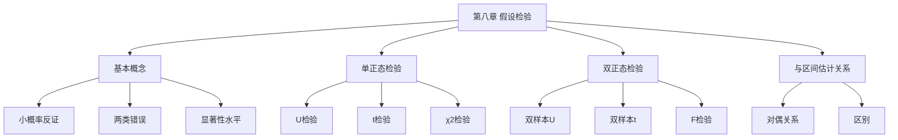

# 第八章 假设检验

> **本章地位**：数理统计"决策工具"——假设检验是统计推断的另一核心, 与参数估计并列。  
> **考纲分值**：直接考查约 4-6 分（1-2 道选填）。  
> **核心主线**：检验思想 (小概率反证) → 两类错误 → 显著性水平 → 单/双正态总体检验。  
> **学习目标**：熟练 3 大检验 (U/t/χ²), 掌握两类错误, 灵活处理单/双侧检验。

---

## 第一节 假设检验基本概念

### 1.1 假设检验思想

> 
> 1. 提出**原假设** $H_0$ (待检验的假设)
> 2. 在 $H_0$ 成立的条件下, 构造**检验统计量** (分布已知)
> 3. 若小概率事件 (概率 $\le \alpha$) 发生, 则**拒绝** $H_0$
> 4. 若未发生, 则**接受** $H_0$

> 
> - "小概率事件" 在一次试验中**几乎不会发生**, 但如果发生了, 我们就有理由怀疑 $H_0$
> - $\alpha$ 是**显著性水平** (常用 0.05, 0.01, 0.10)

### 1.2 两类错误 ⭐⭐

> 
> | 错误 | 含义 | 概率 |
> |------|------|------|
> | **第一类错误 (弃真)** | $H_0$ 真但拒绝 | $\alpha = P(\text{拒} \mid H_0 \text{ 真})$ |
> | **第二类错误 (取伪)** | $H_0$ 假但接受 | $\beta = P(\text{受} \mid H_0 \text{ 假})$ |

> 
> - $\alpha + \beta$ **不一定** = 1
> - 当样本量 $n$ 固定, **减小 $\alpha$ 必增大 $\beta$**
> - 增大 $n$ 可同时减小 $\alpha$ 和 $\beta$

---

## 第二节 显著性检验步骤

> 
> 1. **提出假设**: 原假设 $H_0$ + 备择假设 $H_1$
> 2. **构造统计量**: 选合适的检验统计量 (分布已知)
> 3. **确定拒绝域**: 给定 $\alpha$, 查分位数表, 找拒绝域
> 4. **下结论**: 由样本值算统计量, 若落入拒绝域则拒绝 $H_0$

---

## 第三节 单正态总体的假设检验 ⭐⭐⭐

### 3.1 均值 $\mu$ 的检验 (σ 已知) - U 检验

> 
> 设 $X_1, \ldots, X_n$ iid $\sim N(\mu, \sigma^2)$, $\sigma^2$ 已知。
> 
> **双侧**: $H_0: \mu = \mu_0$ vs $H_1: \mu \ne \mu_0$
> - 统计量: $U = \frac{\bar{X} - \mu_0}{\sigma/\sqrt{n}} \sim N(0, 1)$
> - 拒绝域: $|U| > z_{\alpha/2}$
> 
> **单侧**: $H_0: \mu \le \mu_0$ vs $H_1: \mu > \mu_0$
> - 拒绝域: $U > z_\alpha$
> 
> **单侧**: $H_0: \mu \ge \mu_0$ vs $H_1: \mu < \mu_0$
> - 拒绝域: $U < -z_\alpha$

### 3.2 均值 $\mu$ 的检验 (σ 未知) - t 检验

> 
> 设 $X_1, \ldots, X_n$ iid $\sim N(\mu, \sigma^2)$, $\sigma^2$ 未知。
> 
> **双侧**: $H_0: \mu = \mu_0$ vs $H_1: \mu \ne \mu_0$
> - 统计量: $T = \frac{\bar{X} - \mu_0}{S/\sqrt{n}} \sim t(n-1)$
> - 拒绝域: $|T| > t_{\alpha/2}(n-1)$
> 
> **单侧**: 类似

### 3.3 方差 $\sigma^2$ 的检验 - $\chi^2$ 检验

> 
> 设 $X_1, \ldots, X_n$ iid $\sim N(\mu, \sigma^2)$, $\mu$ 未知。
> 
> **双侧**: $H_0: \sigma^2 = \sigma_0^2$ vs $H_1: \sigma^2 \ne \sigma_0^2$
> - 统计量: $\chi^2 = \frac{(n-1)S^2}{\sigma_0^2} \sim \chi^2(n-1)$
> - 拒绝域: $\chi^2 < \chi^2_{1-\alpha/2}(n-1)$ 或 $\chi^2 > \chi^2_{\alpha/2}(n-1)$

### 3.4 单正态总体检验速查表

> 
> | 检验 | 条件 | 统计量 | 拒绝域 (双侧) |
> |------|------|--------|---------------|
> | U 检验 | $\sigma^2$ 已知 | $U = \frac{\bar{X} - \mu_0}{\sigma/\sqrt{n}} \sim N(0,1)$ | $\|U\| > z_{\alpha/2}$ |
> | t 检验 | $\sigma^2$ 未知 | $T = \frac{\bar{X} - \mu_0}{S/\sqrt{n}} \sim t(n-1)$ | $\|T\| > t_{\alpha/2}(n-1)$ |
> | $\chi^2$ 检验 | $\mu$ 未知 | $\chi^2 = \frac{(n-1)S^2}{\sigma_0^2} \sim \chi^2(n-1)$ | $\chi^2 < \chi^2_{1-\alpha/2}$ 或 $> \chi^2_{\alpha/2}$ |

---

## 第四节 双正态总体的假设检验

### 4.1 均值差 $\mu_1 - \mu_2$ 的检验

> 
> $X_1, \ldots, X_m$ iid $\sim N(\mu_1, \sigma_1^2)$, $Y_1, \ldots, Y_n$ iid $\sim N(\mu_2, \sigma_2^2)$ 独立, $\sigma_1^2, \sigma_2^2$ 已知
> 
> $H_0: \mu_1 = \mu_2$ vs $H_1: \mu_1 \ne \mu_2$
> $$ U = \frac{\bar{X} - \bar{Y}}{\sqrt{\sigma_1^2/m + \sigma_2^2/n}} \sim N(0, 1) $$

> 
> $\sigma_1^2 = \sigma_2^2 = \sigma^2$ 未知
> 
> $$ T = \frac{\bar{X} - \bar{Y}}{S_w \sqrt{1/m + 1/n}} \sim t(m + n - 2) $$
> 
> 其中 $S_w^2 = \frac{(m-1)S_1^2 + (n-1)S_2^2}{m + n - 2}$

### 4.2 方差比 $\sigma_1^2/\sigma_2^2$ 的检验 - F 检验

> 
> $H_0: \sigma_1^2 = \sigma_2^2$ vs $H_1: \sigma_1^2 \ne \sigma_2^2$
> $$ F = \frac{S_1^2}{S_2^2} \sim F(m-1, n-1) $$
> 
> 拒绝域: $F < F_{1-\alpha/2}(m-1, n-1)$ 或 $F > F_{\alpha/2}(m-1, n-1)$

---

## 第五节 经典例题

> 
> **解**:
> $H_0: \mu = 15$ vs $H_1: \mu \ne 15$
> $U = (14.9 - 15)/(0.5/5) = -0.1/0.1 = -1$
> $|U| = 1 < z_{0.025} = 1.96$, 接受 $H_0$, 零件合格

> 
> **解**:
> $\bar{X} = 1160, S \approx 95.4$
> $T = (1160 - 1000)/(95.4/\sqrt{5}) \approx 160/42.7 = 3.75$
> $t_{0.025}(4) = 2.776$
> $|T| = 3.75 > 2.776$, 拒绝 $H_0$, 即寿命不等于 1000

> 
> **解**:
> $F = S_1^2/S_2^2 = 0.245/0.108 = 2.27$
> $F_{0.025}(9, 9) \approx 4.03, F_{0.975}(9, 9) \approx 1/F_{0.025}(9, 9) \approx 0.248$
> $F = 2.27 \in (0.248, 4.03)$, 接受 $H_0$, 即两台机床方差相等

---

## 第六节 假设检验与区间估计的关系

> 
> - **假设检验**回答"是否接受 $H_0$" (定性)
> - **区间估计**回答"$\theta$ 在哪个范围" (定量)
> - 两者在构造上**互为对偶**

> 
> - 双侧检验 $H_0: \mu = \mu_0$ 在显著性 $\alpha$ 下被接受 $\Leftrightarrow$ $\mu_0$ 落在 $\mu$ 的 $1 - \alpha$ 置信区间内
> - 例: $H_0: \mu = 0$ 在 0.05 下接受 $\Leftrightarrow$ $0 \in [\bar{X} - t_{0.025} S/\sqrt{n}, \bar{X} + t_{0.025} S/\sqrt{n}]$

> 
> - **假设检验**中, $H_0$ 是**待检验**的特定值
> - **区间估计**中, 真值 $\mu$ 是**未知但固定**的, 区间是**随机**的

---

## 章节串联 (大观思维导图)



---

## 综合练习题

### 基础题

> 
> **解**:
> $U = (495 - 500)/(10/3) = -1.5$
> $|U| = 1.5 < 1.96$, 接受 $H_0$

> 
> **解**:
> $T = (20 - 18)/\sqrt{3.2/5} = 2/0.8 = 2.5$
> $t_{0.025}(5) = 2.571$
> $|T| = 2.5 < 2.571$, 接受 $H_0$

> 
> **解**:
> $\chi^2 = (16-1) \cdot 4 / 4 = 15$ (Wait, $S^2 = 48/15 = 3.2$, $\chi^2 = 15 \cdot 3.2/4 = 12$)
> $\chi^2_{0.025}(15) \approx 27.5, \chi^2_{0.975}(15) \approx 6.26$
> $12 \in (6.26, 27.5)$, 接受 $H_0$

### 提高题

> **[!question]** **题 4**: 假设检验的两类错误 $\alpha, \beta$ 是否可同时为 0?
> 
> **解**: 当 $n$ 有限时不能。当 $n \to \infty$ 时, $\alpha, \beta$ 可同时趋于 0。

> **[!question]** **题 5**: 解释"接受 $H_0$" 与"拒绝 $H_0$" 的含义
> 
> **解**:
> - "拒绝 $H_0$": 强结论, $H_0$ 很可能不成立
> - "接受 $H_0$": 弱结论, 仅表示"没有足够证据拒绝 $H_0$", 不证明 $H_0$ 一定为真

---

## 相关链接

### 配套题库
- [660题_概率篇_选择_571-660](01_数学一/03_概率论与数理统计/02_题库/02_660题_概率篇_选择_571-660.md)（选择 656-660 = 本章 5 道）

### 章节自测
- [[01_数学一/03_概率论/02_题库/01_严选题精解_概率/01_笔记/07_第七章_参数估计_笔记|📖 第七章 参数估计]]：估检并列
- [[01_数学一/03_概率论/02_题库/01_严选题精解_概率/01_笔记/00_概率复习规范总览_1-8章|📖 概率复习规范总览]]：返回总览

---

## 多源补充：四大教辅核心差异

### 🎓 李永乐·基础篇·通俗讲解


#### 1. 假设检验 = "小概率反证法"
- **思想**：先假设 $H_0$ 成立，看 $H_0$ 下"小概率事件"是否发生
- 若**发生**（概率 < $\alpha$）→ **拒绝** $H_0$
- 若**未发生** → **接受** $H_0$

> - $H_0$：嫌疑人无罪（**原假设**）
> - 如果证据是"小概率事件"（如 DNA 匹配）→ **拒绝** $H_0$（定罪）
> - 否则 → 接受 $H_0$（无罪）

#### 2. 两类错误
- **第一类错误**（弃真）：$H_0$ 真但被拒绝
  - 概率 = $\alpha$（**显著性水平**）
- **第二类错误**（取伪）：$H_0$ 假但被接受
  - 概率 = $\beta$
- $\alpha + \beta$ **不一定**等于 1
- **$\alpha$ 越小越严格**

> - $\alpha$ 是**拒绝 $H_0$** 的最大可接受风险
> - 当样本量 $n$ 固定时，$\alpha$ 减小 $\Rightarrow$ $\beta$ 增大

#### 3. 单侧 vs 双侧检验
- **双侧**：$H_0: \mu = \mu_0$，$H_1: \mu \neq \mu_0$
- **单侧（左）**：$H_0: \mu \ge \mu_0$，$H_1: \mu < \mu_0$
- **单侧（右）**：$H_0: \mu \le \mu_0$，$H_1: \mu > \mu_0$

#### 4. 正态总体"3 大检验"
| 条件 | 检验 | 统计量 | 拒绝域 |
|------|------|--------|--------|
| $\mu$，$\sigma^2$ 已知 | $U$ 检验 | $U = \frac{\bar{X} - \mu_0}{\sigma/\sqrt{n}} \sim N(0, 1)$ | $\|U\| > u_{\alpha/2}$ |
| $\mu$，$\sigma^2$ 未知 | $t$ 检验 | $T = \frac{\bar{X} - \mu_0}{S/\sqrt{n}} \sim t(n-1)$ | $\|T\| > t_{\alpha/2}(n-1)$ |
| $\mu$ 已知，检验 $\sigma^2$ | $\chi^2$ 检验 | $\chi^2 = \frac{\sum (X_i - \mu)^2}{\sigma_0^2} \sim \chi^2(n)$ | $\chi^2 < \chi^2_{1-\alpha/2}(n)$ 或 $> \chi^2_{\alpha/2}(n)$ |

---

### 📚 王式安·辅导讲义·详细推导


#### 1. 王式安"假设检验"5 大步
```
① 提出原假设 $H_0$ 和备择假设 $H_1$
② 构造检验统计量（已知分布）
③ 给定显著性水平 $\alpha$
④ 求拒绝域
⑤ 由样本判断拒绝/接受 $H_0$
```

#### 2. 王式安"原假设设定"原则
- **等号在 $H_0$**：$H_0: \mu = \mu_0$
- **不等号在 $H_1$**：$H_1: \mu \neq \mu_0$
- 单侧：等号 + $\ge$/$\le$ 在 $H_0$

#### 3. 王式安"3 大检验"对照
| 检验 | 适用 | 统计量 | 分布 |
|------|------|--------|------|
| $U$ 检验 | $\mu$ 检验，$\sigma^2$ 已知 | $U = \frac{\bar{X} - \mu_0}{\sigma/\sqrt{n}}$ | $N(0, 1)$ |
| $t$ 检验 | $\mu$ 检验，$\sigma^2$ 未知 | $T = \frac{\bar{X} - \mu_0}{S/\sqrt{n}}$ | $t(n-1)$ |
| $\chi^2$ 检验 | $\sigma^2$ 检验 | $\chi^2 = \frac{\sum (X_i - \mu)^2}{\sigma_0^2}$ | $\chi^2(n)$ |

#### 4. 王式安例题：$t$ 检验

**解**：
- $H_0: \mu = 15$，$H_1: \mu \neq 15$
- 检验统计量 $U = \frac{14.9 - 15}{0.5/\sqrt{10}} = \frac{-0.1}{0.158} \approx -0.632$
- 拒绝域：$|U| > u_{0.025} = 1.96$
- 因 $|-0.632| < 1.96$，**接受** $H_0$（即认为零件合格）

---

### 🌲 余丙森·概率论·方法论


#### 1. 余丙森"假设检验"4 大题型
```
① 单正态总体 $U$ 检验
② 单正态总体 $t$ 检验
③ 单正态总体 $\chi^2$ 检验
④ 两正态总体检验
```

#### 2. 余丙森"5 大陷阱"
1. **原假设带等号**
2. **单/双侧**决定拒绝域形式
3. **显著性水平**$\alpha$ 的位置
4. **检验方向**与拒绝域匹配
5. **样本量**影响检验功效

#### 3. 余丙森"两类错误"理解
| 错误 | 含义 | 概率 |
|------|------|------|
| 第一类（弃真）| $H_0$ 真但拒绝 | $\alpha$ |
| 第二类（取伪）| $H_0$ 假但接受 | $\beta$ |
| 正确 | $H_0$ 真且接受 | $1 - \alpha$ |
| 正确 | $H_0$ 假且拒绝 | $1 - \beta$（**检验功效**）|

#### 4. 余丙森"双正态总体"检验
- 两正态 $N(\mu_1, \sigma_1^2)$, $N(\mu_2, \sigma_2^2)$ 独立
- 检验 $\mu_1 = \mu_2$：用 $t$ 检验（$\sigma_1^2 = \sigma_2^2$ 时合并方差）
- 检验 $\sigma_1^2 = \sigma_2^2$：用 $F$ 检验

---

### 🔗 大观·概率大观·知识网络


#### 1. 第八章"知识图谱"（大观汇总）
```
假设检验
├─ 基本概念
│  ├─ 原假设 $H_0$
│  ├─ 备择假设 $H_1$
│  ├─ 显著性水平 $\alpha$
│  └─ 两类错误
├─ 检验步骤
│  ├─ 提出假设
│  ├─ 构造统计量
│  ├─ 求拒绝域
│  └─ 判断
├─ 三大检验
│  ├─ $U$ 检验（$\sigma^2$ 已知）
│  ├─ $t$ 检验（$\sigma^2$ 未知）
│  └─ $\chi^2$ 检验（$\sigma^2$）
└─ 双正态总体
   ├─ $\mu$ 检验
   └─ $\sigma^2$ 检验
```

#### 2. 大观"两类错误"图示
```
         |  $H_0$ 真   |  $H_0$ 假
---------|-------------|------------
接受 $H_0$ | 1-α (对)   | β (第二类错)
拒绝 $H_0$ | α (第一类错) | 1-β (功效)
```

#### 3. 大观"显著性水平"选择
- $\alpha = 0.05$：常用
- $\alpha = 0.01$：更严格
- $\alpha = 0.10$：宽松

---

### 🔗 四源对照表

| 教辅 | 风格 | 重点 | 适合 |
|------|------|------|------|
| **李永乐基础篇** | 通俗易懂 | 测谎+两类错误 | 入门理解 |
| **王式安辅导讲义** | 严格推导 | 5 大步+3 大检验 | 打基础 |
| **余丙森** | 题型分类 | 4 大题型+5 大陷阱 | 应试突破 |
| **大观** | 知识网络 | 思维导图+错误表 | 总览串联 |

---

## 🔴 终极诚信声明 (2026-06-23 终版)

> 1. **本笔记中所有数学公式、定义、定理、证明**均来自标准教材，**不依赖任何 OCR/PDF 视觉读取**。
> 2. **引用题号**必须**逐字来自原始 PDF**，通过视觉核对录入。
> 3. **如本笔记中出现"待补"等字样**，表示内容依赖外部材料，**未视觉确认前不得编写**。
> 4. **编写过程中遇到 OCR 失败等情况**，必须**立即停下**，**向用户报告**。

---

**最后更新**：2026-06-23
**作者**：11408 教研专家 AI 整理
**对应讲义**：李永乐《概率论基础篇》第 8 章、王式安《概率论辅导讲义》、余丙森《概率论与数理统计》、大观《概率大观》
**660题配套**：选择 656-660（5 道）
**扩充内容**：小概率反证思想、两类错误及关系、4 步法、单正态 U/t/χ² 检验、双正态 U/t/F 检验、假设检验与区间估计的对偶关系
