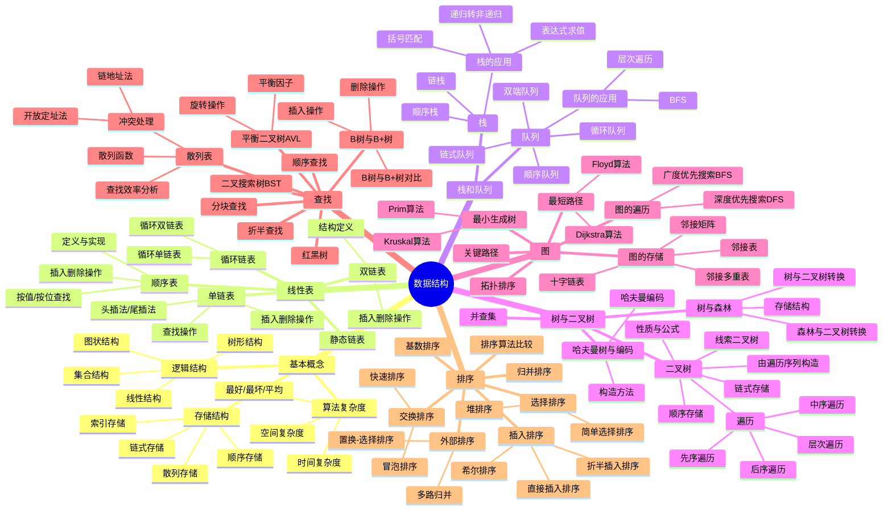
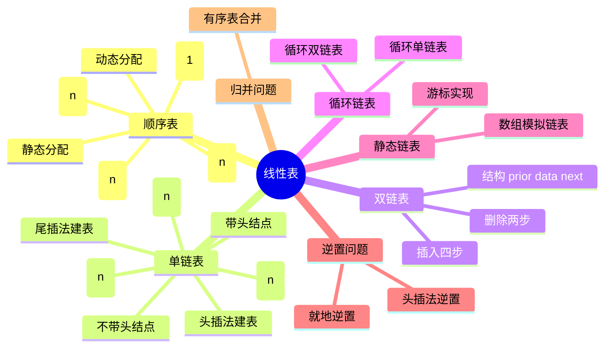
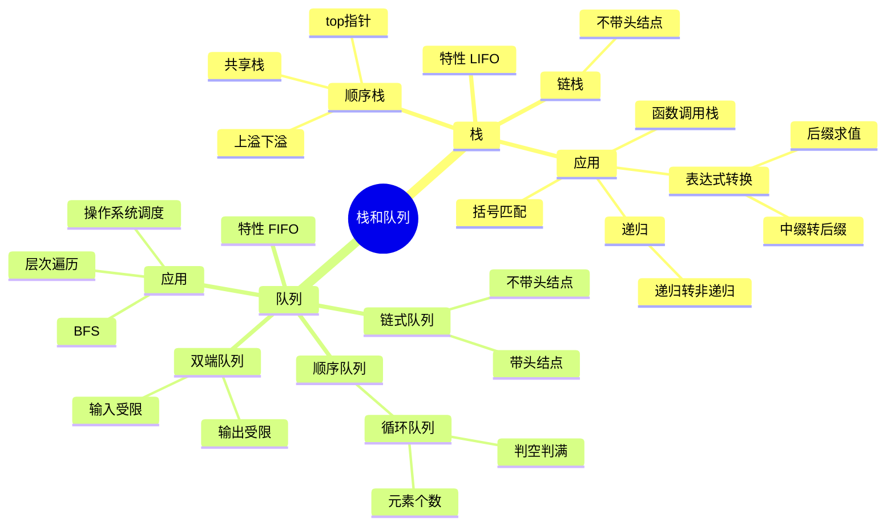
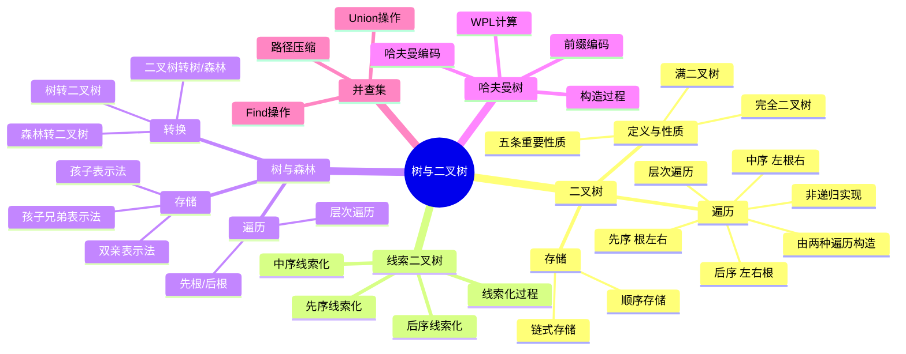
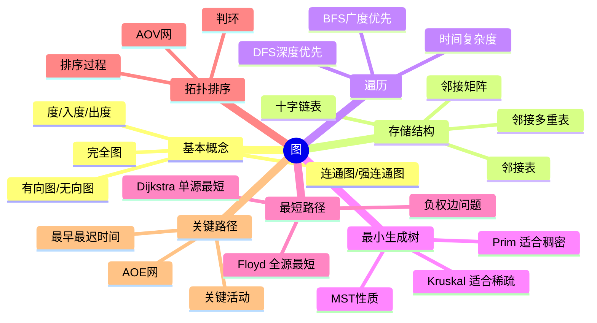
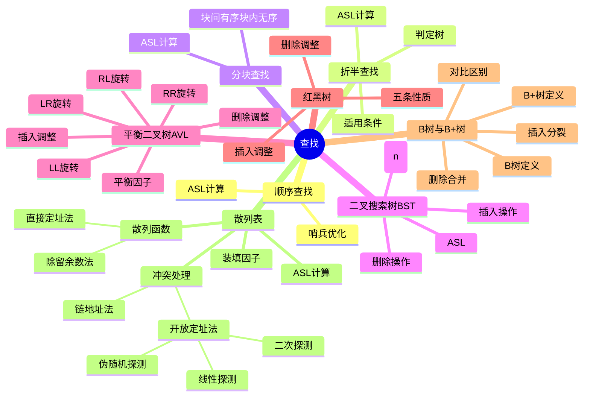

# 思维导图

> 本导图展示知识结构，配合 [[01_数学一/01_高等数学/01_笔记/09_数一笔记_高数/索引]] 使用

# 数据结构 知识体系思维导图

## 总览



## 各章节详解

### 1. 基本概念

```mermaid
mindmap
  root((基本概念))
    数据
      数据元素
      数据项
      数据对象
    逻辑结构
      集合
      线性
      树形
      图状
    存储结构
      顺序
      链式
      索引
      散列
    算法特性
      有穷性
      确定性
      可行性
      输入
      输出
    复杂度分析
      时间复杂度
        O(1) 常数
        O(logn) 对数
        O(n) 线性
        O(nlogn) 线性对数
        O(n²) 平方
        O(2^n) 指数
      空间复杂度
      最好/最坏/平均
```

### 2. 线性表



### 3. 栈和队列



### 4. 树与二叉树



### 5. 图



### 6. 查找



### 7. 排序

```mermaid
mindmap
  root((排序))
    插入排序
      直接插入排序
        稳定 O(n²)
      折半插入排序
        稳定 O(n²)
      希尔排序
        不稳定 O(n^1.3)
    交换排序
      冒泡排序
        稳定 O(n²)
      快速排序
        不稳定 O(nlogn)
        分治思想
        枢轴选取
    选择排序
      简单选择排序
        不稳定 O(n²)
      堆排序
        不稳定 O(nlogn)
        大根堆/小根堆
        建堆过程
        调整过程
    归并排序
      稳定 O(nlogn)
      二路归并
    基数排序
      稳定 O(d(n+r))
      最高位/最低位优先
    外部排序
      多路归并
      败者树
      置换-选择排序
      最佳归并树
    排序比较
      时间/空间/稳定性
      适用场景
