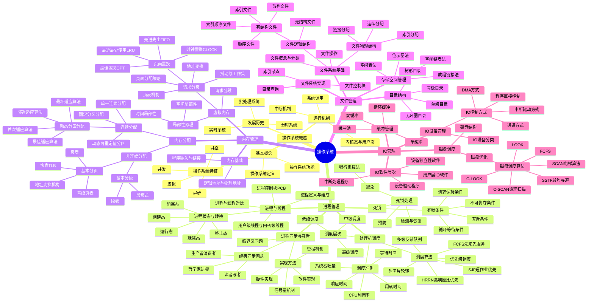

# 思维导图

> 本导图展示知识结构，配合 [[01_数学一/01_高等数学/01_笔记/09_数一笔记_高数/索引]] 使用

# 操作系统知识体系思维导图

```mermaid
mindmap
  root((操作系统))
    操作系统概述
      基本概念
        操作系统定义
        操作系统功能
        操作系统特征
          并发
          共享
          虚拟
          异步
      发展历史
        批处理系统
        分时系统
        实时系统
      运行机制
        中断机制
        系统调用
        内核态与用户态
    进程管理
      进程与线程
        进程定义与组成
        进程状态与转换
          就绪态
          运行态
          阻塞态
          创建态
          终止态
        进程控制块PCB
        进程与线程对比
        用户级线程与内核级线程
      处理机调度
        调度层次
          高级调度
          中级调度
          低级调度
        调度算法
          FCFS先来先服务
          SJF短作业优先
          优先级调度
          时间片轮转
          多级反馈队列
          HRRN高响应比优先
        调度准则
          CPU利用率
          系统吞吐量
          周转时间
          等待时间
          响应时间
      进程同步与互斥
        临界区问题
        实现方法
          软件实现
          硬件实现
          信号量机制
          管程机制
        经典同步问题
          生产者消费者
          读者写者
          哲学家进餐
      死锁
        死锁条件
          互斥条件
          请求保持条件
          不可剥夺条件
          循环等待条件
        死锁处理
          预防
          避免
            银行家算法
          检测与恢复
    内存管理
      内存基础
        程序装入与链接
        逻辑地址与物理地址
      内存分配
        连续分配
          单一连续分配
          固定分区分配
          动态分区分配
            首次适应算法
            最佳适应算法
            最坏适应算法
            邻近适应算法
          动态可重定位分区
        非连续分配
          基本分页
            页表
            地址变换机构
            快表TLB
            两级页表
          基本分段
            段表
            段页式
      虚拟内存
        局部性原理
          时间局部性
          空间局部性
        请求分页
          页表机制
          地址变换
          页面置换
            最佳置换OPT
            先进先出FIFO
            最近最少使用LRU
            时钟置换CLOCK
          页面分配策略
          抖动与工作集
        请求分段
    文件管理
      文件系统基础
        文件概念与分类
        文件操作
        文件逻辑结构
          无结构文件
          有结构文件
            顺序文件
            索引文件
            索引顺序文件
            散列文件
        文件物理结构
          连续分配
          链接分配
          索引分配
      目录结构
        单级目录
        两级目录
        树形目录
        无环图目录
      存储空间管理
        空闲表法
        空闲链表法
        位示图法
        成组链接法
      文件系统实现
        文件控制块
        索引节点
        目录查询
    IO管理
      IO设备管理
        IO设备分类
        IO控制方式
          程序直接控制
          中断驱动方式
          DMA方式
          通道方式
      IO软件层次
        用户层IO软件
        设备独立性软件
        设备驱动程序
        中断处理程序
      磁盘调度
        磁盘结构
        磁盘调度算法
          FCFS
          SSTF最短寻道
          SCAN电梯算法
          C-SCAN循环扫描
          LOOK
          C-LOOK
        磁盘优化
      缓冲管理
        单缓冲
        双缓冲
        循环缓冲
        缓冲池
```
